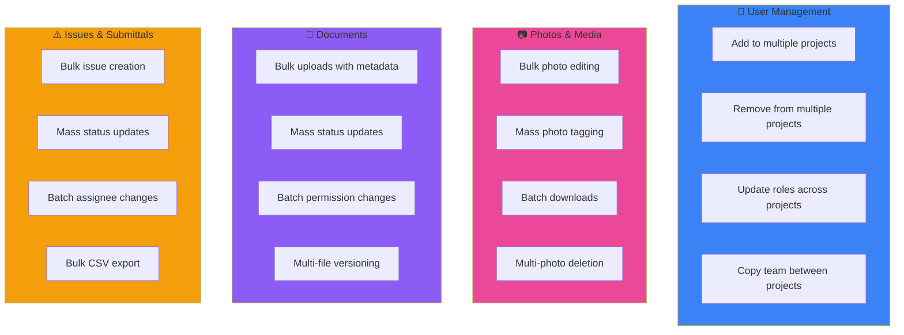
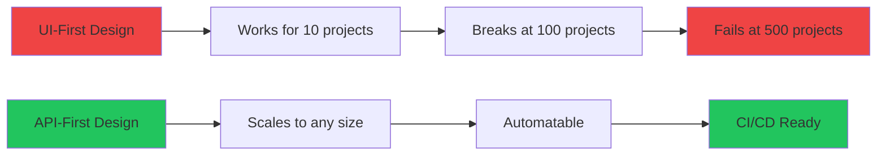

import PerformanceChart from '@/components/PerformanceChart.astro';

*This is Part 2 of our [ACC Pain Points series](/blog/acc-forum-analysis). We analyzed 4,295 feature requests from the ACC Ideas forum.*

---

## The Numbers At a Glance

<div class="not-prose my-8 grid grid-cols-2 md:grid-cols-4 gap-4">
  <div class="bg-gradient-to-br from-amber-600 to-amber-800 rounded-xl p-6 text-center transform hover:scale-105 transition-transform">
    <div class="text-4xl font-black text-white">490</div>
    <div class="text-amber-200 text-sm mt-1">Bulk Operation Ideas</div>
  </div>
  <div class="bg-gradient-to-br from-orange-600 to-orange-800 rounded-xl p-6 text-center transform hover:scale-105 transition-transform">
    <div class="text-4xl font-black text-white">3,860</div>
    <div class="text-orange-200 text-sm mt-1">Community Votes</div>
  </div>
  <div class="bg-gradient-to-br from-red-600 to-red-800 rounded-xl p-6 text-center transform hover:scale-105 transition-transform">
    <div class="text-4xl font-black text-white">344</div>
    <div class="text-red-200 text-sm mt-1">#1 Idea Kudos</div>
  </div>
  <div class="bg-gradient-to-br from-slate-600 to-slate-800 rounded-xl p-6 text-center transform hover:scale-105 transition-transform">
    <div class="text-4xl font-black text-white">6+</div>
    <div class="text-slate-200 text-sm mt-1">Years Waiting</div>
  </div>
</div>

Across every category — users, photos, documents, issues, submittals — the same request appears: **"Let us do this in bulk."**

---

## The #1 Most-Voted Request

<div class="not-prose my-8 bg-gradient-to-r from-red-900/50 to-slate-900/50 rounded-2xl p-8 border border-red-700/50">
  <div class="flex items-center gap-2 mb-4">
    <div class="px-3 py-1 bg-red-500 text-white text-xs font-bold rounded-full">#1 MOST VOTED</div>
    <div class="px-3 py-1 bg-amber-500/20 text-amber-400 text-xs font-bold rounded-full">344 KUDOS</div>
  </div>
  <blockquote class="text-xl text-white italic border-l-4 border-red-500 pl-4 mb-4">
    "There is a major need to be able to add a new hire to many projects in ACC. Instead of wasting my time opening each project and manually adding a new user to 20 projects, we need a tool that will automate this process!"
  </blockquote>
  <div class="flex items-center gap-4 text-sm text-slate-400">
    <a href="https://forums.autodesk.com/t5/acc-ideas/allow-adding-a-user-s-to-multiple-projects/idi-p/12714729" class="text-blue-400 hover:underline">View on Forum</a>
    <span>•</span>
    <span>Originally submitted to BIM360 <strong class="text-red-400">6+ years ago</strong></span>
  </div>
</div>

---

## The Math of Manual Work

<div class="not-prose my-8">
  <div class="bg-slate-900/80 rounded-2xl p-6 border border-slate-700">
    <h3 class="text-lg font-bold text-white mb-4">Adding 1 User to 50 Projects (Manual)</h3>
    <div class="grid grid-cols-5 gap-2 mb-6">
      <div class="bg-slate-800 rounded-lg p-3 text-center">
        <div class="text-2xl mb-1">🖱️</div>
        <div class="text-white font-bold">15s</div>
        <div class="text-xs text-slate-400">Navigate</div>
      </div>
      <div class="bg-slate-800 rounded-lg p-3 text-center">
        <div class="text-2xl mb-1">📂</div>
        <div class="text-white font-bold">5s</div>
        <div class="text-xs text-slate-400">Open Panel</div>
      </div>
      <div class="bg-slate-800 rounded-lg p-3 text-center">
        <div class="text-2xl mb-1">🔍</div>
        <div class="text-white font-bold">10s</div>
        <div class="text-xs text-slate-400">Search User</div>
      </div>
      <div class="bg-slate-800 rounded-lg p-3 text-center">
        <div class="text-2xl mb-1">👤</div>
        <div class="text-white font-bold">5s</div>
        <div class="text-xs text-slate-400">Select Role</div>
      </div>
      <div class="bg-slate-800 rounded-lg p-3 text-center">
        <div class="text-2xl mb-1">✓</div>
        <div class="text-white font-bold">5s</div>
        <div class="text-xs text-slate-400">Confirm</div>
      </div>
    </div>
    <div class="flex items-center justify-between p-4 bg-red-900/30 rounded-xl border border-red-700/50">
      <div>
        <div class="text-slate-400 text-sm">Per project</div>
        <div class="text-white font-bold">40 seconds</div>
      </div>
      <div class="text-4xl">×</div>
      <div>
        <div class="text-slate-400 text-sm">Projects</div>
        <div class="text-white font-bold">50</div>
      </div>
      <div class="text-4xl">=</div>
      <div>
        <div class="text-slate-400 text-sm">Total time</div>
        <div class="text-3xl font-black text-red-400">33 min</div>
      </div>
    </div>
  </div>
</div>

For a large enterprise with 200+ projects? **Over 2 hours of clicking.** Now multiply by every new hire, every departing employee, every role change.

---

## Where Bulk Operations Are Missing



<PerformanceChart
  title="Bulk Operation Requests by Category"
  subtitle="Number of ideas requesting batch/bulk functionality"
  data={[
    { label: "User Management", value: 175, color: "bg-gradient-to-r from-blue-500 to-blue-600", suffix: " ideas" },
    { label: "Photos & Media", value: 163, color: "bg-gradient-to-r from-pink-500 to-pink-600", suffix: " ideas" },
    { label: "Documents & Files", value: 207, color: "bg-gradient-to-r from-purple-500 to-purple-600", suffix: " ideas" },
    { label: "Issues & Submittals", value: 296, color: "bg-gradient-to-r from-amber-500 to-amber-600", suffix: " ideas" },
  ]}
  maxValue={350}
/>

---

## Why This Matters for AEC

<div class="not-prose my-8">
  <div class="bg-slate-900/80 rounded-2xl p-6 border border-slate-700">
    <h3 class="text-lg font-bold text-white mb-4">Typical Large Construction Project</h3>
    <div class="grid grid-cols-2 md:grid-cols-5 gap-4">
      <div class="bg-gradient-to-br from-blue-900/50 to-slate-900/50 rounded-xl p-4 text-center border border-blue-700/30">
        <div class="text-3xl font-black text-blue-400">200+</div>
        <div class="text-xs text-slate-400 mt-1">Team Members</div>
      </div>
      <div class="bg-gradient-to-br from-purple-900/50 to-slate-900/50 rounded-xl p-4 text-center border border-purple-700/30">
        <div class="text-3xl font-black text-purple-400">50+</div>
        <div class="text-xs text-slate-400 mt-1">Subcontractors</div>
      </div>
      <div class="bg-gradient-to-br from-amber-900/50 to-slate-900/50 rounded-xl p-4 text-center border border-amber-700/30">
        <div class="text-3xl font-black text-amber-400">100+</div>
        <div class="text-xs text-slate-400 mt-1">Folders</div>
      </div>
      <div class="bg-gradient-to-br from-emerald-900/50 to-slate-900/50 rounded-xl p-4 text-center border border-emerald-700/30">
        <div class="text-3xl font-black text-emerald-400">10K+</div>
        <div class="text-xs text-slate-400 mt-1">Documents</div>
      </div>
      <div class="bg-gradient-to-br from-red-900/50 to-slate-900/50 rounded-xl p-4 text-center border border-red-700/30">
        <div class="text-3xl font-black text-red-400">1K+</div>
        <div class="text-xs text-slate-400 mt-1">Issues</div>
      </div>
    </div>
    <p class="text-slate-400 text-sm mt-4 text-center">When every operation is click-by-click, BIM managers become full-time data entry clerks.</p>
  </div>
</div>

---

## The Workarounds Comparison

<div class="not-prose my-8">
  <div class="grid md:grid-cols-2 gap-4">
    <div class="bg-red-900/20 rounded-xl p-6 border border-red-700/30">
      <div class="flex items-center gap-2 mb-4">
        <div class="text-2xl">❌</div>
        <h4 class="text-lg font-bold text-white">Manual Labor</h4>
      </div>
      <ul class="space-y-2 text-sm text-slate-300">
        <li class="flex items-center gap-2"><span class="text-red-400">•</span> Assign intern to click through</li>
        <li class="flex items-center gap-2"><span class="text-red-400">•</span> Expensive labor cost</li>
        <li class="flex items-center gap-2"><span class="text-red-400">•</span> Error-prone</li>
        <li class="flex items-center gap-2"><span class="text-red-400">•</span> Soul-crushing work</li>
      </ul>
    </div>
    <div class="bg-amber-900/20 rounded-xl p-6 border border-amber-700/30">
      <div class="flex items-center gap-2 mb-4">
        <div class="text-2xl">⚠️</div>
        <h4 class="text-lg font-bold text-white">Desktop Tools (Naviate)</h4>
      </div>
      <ul class="space-y-2 text-sm text-slate-300">
        <li class="flex items-center gap-2"><span class="text-amber-400">•</span> Enterprise pricing (not published)</li>
        <li class="flex items-center gap-2"><span class="text-amber-400">•</span> Windows-only (300MB+)</li>
        <li class="flex items-center gap-2"><span class="text-amber-400">•</span> Can't automate in CI/CD</li>
        <li class="flex items-center gap-2"><span class="text-amber-400">•</span> Limited feature coverage</li>
      </ul>
    </div>
    <div class="bg-blue-900/20 rounded-xl p-6 border border-blue-700/30">
      <div class="flex items-center gap-2 mb-4">
        <div class="text-2xl">🔧</div>
        <h4 class="text-lg font-bold text-white">Custom Scripts</h4>
      </div>
      <ul class="space-y-2 text-sm text-slate-300">
        <li class="flex items-center gap-2"><span class="text-blue-400">•</span> Requires developer resources</li>
        <li class="flex items-center gap-2"><span class="text-blue-400">•</span> No standard patterns</li>
        <li class="flex items-center gap-2"><span class="text-blue-400">•</span> Every team reinvents wheel</li>
        <li class="flex items-center gap-2"><span class="text-blue-400">•</span> Maintenance burden</li>
      </ul>
    </div>
    <div class="bg-emerald-900/20 rounded-xl p-6 border border-emerald-700/30">
      <div class="flex items-center gap-2 mb-4">
        <div class="text-2xl">✅</div>
        <h4 class="text-lg font-bold text-white">RAPS CLI</h4>
      </div>
      <ul class="space-y-2 text-sm text-slate-300">
        <li class="flex items-center gap-2"><span class="text-emerald-400">•</span> Free & open source</li>
        <li class="flex items-center gap-2"><span class="text-emerald-400">•</span> Cross-platform (single binary)</li>
        <li class="flex items-center gap-2"><span class="text-emerald-400">•</span> CI/CD ready</li>
        <li class="flex items-center gap-2"><span class="text-emerald-400">•</span> 50 parallel operations</li>
      </ul>
    </div>
  </div>
</div>

---

## Performance Comparison

<PerformanceChart
  title="Time to Add User to 200 Projects"
  subtitle="Comparison of different approaches"
  data={[
    { label: "Manual UI", value: 133, color: "bg-gradient-to-r from-red-500 to-red-600", suffix: " min" },
    { label: "Naviate Desktop", value: 30, color: "bg-gradient-to-r from-amber-500 to-amber-600", suffix: " min" },
    { label: "RAPS CLI", value: 0.75, color: "bg-gradient-to-r from-emerald-500 to-emerald-600", suffix: " min" },
  ]}
  maxValue={140}
/>

<div class="not-prose my-6 p-6 bg-gradient-to-r from-emerald-900/40 to-slate-900/40 rounded-xl border border-emerald-700/50">
  <div class="flex items-center justify-between">
    <div>
      <div class="text-slate-400 text-sm">Manual UI</div>
      <div class="text-3xl font-black text-red-400">2+ hours</div>
    </div>
    <div class="text-4xl text-slate-600">→</div>
    <div>
      <div class="text-slate-400 text-sm">RAPS CLI</div>
      <div class="text-3xl font-black text-emerald-400">45 seconds</div>
    </div>
    <div class="text-right">
      <div class="text-slate-400 text-sm">Speedup</div>
      <div class="text-3xl font-black text-white">177x faster</div>
    </div>
  </div>
</div>

---

## The RAPS Solution

### Add User to All Projects

```bash
# Add new hire to all 200 projects
raps admin user add "$ACCOUNT_ID" "newhire@company.com" --role project_admin
```

<div class="not-prose my-4 bg-slate-800 rounded-lg p-4 font-mono text-sm">
  <div class="text-slate-400 mb-2">Output:</div>
  <div class="text-emerald-400">Adding user to projects...</div>
  <div class="flex items-center gap-2 my-2">
    <div class="flex-1 bg-slate-700 rounded-full h-3 overflow-hidden">
      <div class="bg-emerald-500 h-full rounded-full" style="width: 100%"></div>
    </div>
    <span class="text-white">200/200</span>
  </div>
  <div class="text-white">✓ Completed in 45 seconds</div>
</div>

### Filter by Project Pattern

```bash
# Only add to 2024 projects
raps admin user add "$ACCOUNT_ID" "contractor@partner.com" \
  --role viewer --filter "^2024-"
```

### Dry-Run Preview

```bash
# See what would happen without executing
raps admin user add "$ACCOUNT_ID" "user@company.com" --dry-run
```

<div class="not-prose my-4 bg-slate-800 rounded-lg p-4 font-mono text-sm">
  <div class="text-slate-400 mb-2">Dry run results:</div>
  <table class="w-full text-left">
    <thead class="text-slate-500 border-b border-slate-700">
      <tr><th class="py-2">Project</th><th>Action</th></tr>
    </thead>
    <tbody class="text-slate-300">
      <tr><td class="py-1">Downtown Tower</td><td class="text-emerald-400">Would add</td></tr>
      <tr><td class="py-1">Hospital Wing</td><td class="text-emerald-400">Would add</td></tr>
      <tr><td class="py-1">University Library</td><td class="text-amber-400">Would skip (exists)</td></tr>
    </tbody>
  </table>
</div>

### CI/CD Integration

```yaml
name: User Onboarding
on:
  workflow_dispatch:
    inputs:
      email:
        required: true
        description: 'New user email'

jobs:
  onboard:
    runs-on: ubuntu-latest
    steps:
      - name: Add to all projects
        run: |
          raps admin user add "$ACCOUNT_ID" "${{ github.event.inputs.email }}" \
            --role project_admin
```

---

## What's Available Now

<div class="not-prose my-8 grid md:grid-cols-2 gap-4">
  <div class="bg-slate-900/80 rounded-xl p-6 border border-slate-700">
    <h4 class="text-emerald-400 font-bold mb-4 flex items-center gap-2">
      <span>✓</span> Available in RAPS 4.0
    </h4>
    <ul class="space-y-2 text-slate-300 text-sm">
      <li><code class="bg-slate-800 px-2 py-0.5 rounded">raps admin user add</code></li>
      <li><code class="bg-slate-800 px-2 py-0.5 rounded">raps admin user remove</code></li>
      <li><code class="bg-slate-800 px-2 py-0.5 rounded">raps admin user update-role</code></li>
      <li><code class="bg-slate-800 px-2 py-0.5 rounded">raps admin folder rights</code></li>
      <li><code class="bg-slate-800 px-2 py-0.5 rounded">raps admin project list</code></li>
      <li><code class="bg-slate-800 px-2 py-0.5 rounded">raps admin operation resume</code></li>
    </ul>
  </div>
  <div class="bg-slate-900/80 rounded-xl p-6 border border-slate-700">
    <h4 class="text-amber-400 font-bold mb-4 flex items-center gap-2">
      <span>🚧</span> Coming Soon
    </h4>
    <ul class="space-y-2 text-slate-300 text-sm">
      <li><code class="bg-slate-800 px-2 py-0.5 rounded">raps admin issue bulk-create</code></li>
      <li><code class="bg-slate-800 px-2 py-0.5 rounded">raps admin photo bulk-tag</code></li>
      <li><code class="bg-slate-800 px-2 py-0.5 rounded">raps admin submittal bulk-update</code></li>
      <li><code class="bg-slate-800 px-2 py-0.5 rounded">raps admin document bulk-upload</code></li>
    </ul>
  </div>
</div>

---

## The Broader Pattern



**UI-first design doesn't scale.** ACC was designed for small-to-medium projects. Enterprise contexts require API automation.

---

## Next in Series

- [Part 1: The 96.6% Problem](/blog/acc-forum-analysis) — Overview of ACC forum analysis
- [Part 3: The Permission Problem](/blog/acc-permission-nightmare) — When basic access controls are missing

---

**Related:**
- [Admin Commands Reference](/docs/admin)
- [Account Admin Cookbook](/docs/cookbook-acc-admin)
- [RAPS 4.0 Release Notes](/blog/raps-4-account-admin)
