import PerformanceChart from '@/components/PerformanceChart.astro';

**TL;DR:** We scraped and analyzed 4,295 ideas from Autodesk Construction Cloud's official feedback forum. Only 1.4% have been implemented. The #1 most-voted request has been ignored for 6+ years. Here's the full breakdown.

---

## The Data At a Glance

<div class="not-prose my-8 grid grid-cols-2 md:grid-cols-4 gap-4">
  <div class="bg-gradient-to-br from-blue-600 to-blue-800 rounded-xl p-6 text-center transform hover:scale-105 transition-transform">
    <div class="text-4xl font-black text-white">4,295</div>
    <div class="text-blue-200 text-sm mt-1">Ideas Submitted</div>
  </div>
  <div class="bg-gradient-to-br from-purple-600 to-purple-800 rounded-xl p-6 text-center transform hover:scale-105 transition-transform">
    <div class="text-4xl font-black text-white">24,615</div>
    <div class="text-purple-200 text-sm mt-1">Community Votes</div>
  </div>
  <div class="bg-gradient-to-br from-amber-600 to-amber-800 rounded-xl p-6 text-center transform hover:scale-105 transition-transform">
    <div class="text-4xl font-black text-white">1.09M</div>
    <div class="text-amber-200 text-sm mt-1">Total Views</div>
  </div>
  <div class="bg-gradient-to-br from-red-600 to-red-800 rounded-xl p-6 text-center transform hover:scale-105 transition-transform">
    <div class="text-4xl font-black text-white">1.4%</div>
    <div class="text-red-200 text-sm mt-1">Implemented</div>
  </div>
</div>

Between December 2021 and January 2026, ACC users submitted **4,295 feature requests** to the official Ideas forum. We collected every single one.

The question we wanted to answer: **What happens to user feedback?**

---

## The 96.6% Problem

<div class="not-prose my-8">
  <div class="bg-slate-900/80 rounded-2xl p-6 border border-slate-700">
    <h3 class="text-lg font-bold text-white mb-4">Status Distribution</h3>
    <div class="relative pt-2">
      <div class="flex h-8 overflow-hidden rounded-full bg-slate-800">
        <div class="bg-slate-500 flex items-center justify-center text-xs font-bold text-white" style="width: 96.6%">
          96.6% Gathering Support
        </div>
        <div class="bg-emerald-500" style="width: 1.4%"></div>
        <div class="bg-blue-500" style="width: 0.9%"></div>
        <div class="bg-amber-500" style="width: 0.7%"></div>
        <div class="bg-purple-500" style="width: 0.4%"></div>
      </div>
      <div class="flex justify-between mt-3 text-xs">
        <div class="flex items-center gap-1.5">
          <div class="w-3 h-3 rounded bg-slate-500"></div>
          <span class="text-slate-400">Gathering Support (4,149)</span>
        </div>
        <div class="flex items-center gap-1.5">
          <div class="w-3 h-3 rounded bg-emerald-500"></div>
          <span class="text-slate-400">Implemented (60)</span>
        </div>
        <div class="flex items-center gap-1.5">
          <div class="w-3 h-3 rounded bg-blue-500"></div>
          <span class="text-slate-400">Accepted (37)</span>
        </div>
        <div class="flex items-center gap-1.5">
          <div class="w-3 h-3 rounded bg-amber-500"></div>
          <span class="text-slate-400">Under Review (30)</span>
        </div>
      </div>
    </div>
  </div>
</div>

**96.6% of all feature requests sit in "Gathering Support" indefinitely.** This status means: acknowledged, but not being worked on, with no timeline or commitment.

Only 60 ideas — **1.4%** — have actually shipped.

---

## The Oldest Wounds

<div class="not-prose my-8 space-y-4">
  <div class="bg-gradient-to-r from-red-900/40 to-slate-900/40 rounded-xl p-6 border-l-4 border-red-500">
    <div class="flex items-start justify-between">
      <div>
        <div class="text-red-400 text-sm font-semibold mb-1">#1 MOST VOTED — 344 KUDOS</div>
        <h4 class="text-xl font-bold text-white">"Allow adding users to MULTIPLE PROJECTS"</h4>
        <p class="text-slate-400 mt-2 text-sm italic">"Instead of wasting my time opening each project and manually adding a new user to 20 projects, we need a tool that will automate this process!"</p>
      </div>
      <div class="text-right">
        <div class="text-slate-500 text-xs">Originally requested</div>
        <div class="text-red-400 font-bold">6+ YEARS AGO</div>
      </div>
    </div>
    <div class="mt-3 inline-block px-3 py-1 bg-amber-900/50 text-amber-300 text-xs rounded-full">Status: Future Consideration</div>
  </div>

  <div class="bg-gradient-to-r from-orange-900/40 to-slate-900/40 rounded-xl p-6 border-l-4 border-orange-500">
    <div class="flex items-start justify-between">
      <div>
        <div class="text-orange-400 text-sm font-semibold mb-1">#4 MOST VOTED — 246 KUDOS</div>
        <h4 class="text-xl font-bold text-white">"ACC Markups need improving"</h4>
        <p class="text-slate-400 mt-2 text-sm italic">"The markups in Autodesk Docs are terrible. BIM 360 Docs Markups are far superior."</p>
      </div>
      <div class="text-right">
        <div class="text-slate-500 text-xs">Posted</div>
        <div class="text-orange-400 font-bold">Dec 2021</div>
      </div>
    </div>
    <div class="mt-3 inline-block px-3 py-1 bg-amber-900/50 text-amber-300 text-xs rounded-full">Status: Future Consideration</div>
  </div>

  <div class="bg-gradient-to-r from-yellow-900/40 to-slate-900/40 rounded-xl p-6 border-l-4 border-yellow-500">
    <div class="flex items-start justify-between">
      <div>
        <div class="text-yellow-400 text-sm font-semibold mb-1">#5 MOST VOTED — 175 KUDOS</div>
        <h4 class="text-xl font-bold text-white">"Remove Inherited Permissions"</h4>
        <p class="text-slate-400 mt-2 text-sm italic">"I give everyone EDIT access at the Project Files level, but we have folders we want VIEW only. Currently we cannot do this."</p>
      </div>
      <div class="text-right">
        <div class="text-slate-500 text-xs">Posted</div>
        <div class="text-yellow-400 font-bold">Dec 2023</div>
      </div>
    </div>
    <div class="mt-3 inline-block px-3 py-1 bg-amber-900/50 text-amber-300 text-xs rounded-full">Status: Future Consideration</div>
  </div>
</div>

---

## What Users Actually Want

<PerformanceChart
  title="Pain Points by Category"
  subtitle="Total community votes (kudos) per category"
  data={[
    { label: "Documents & Files", value: 10960, color: "bg-gradient-to-r from-blue-500 to-blue-600", suffix: " votes" },
    { label: "User Management & Permissions", value: 10368, color: "bg-gradient-to-r from-purple-500 to-purple-600", suffix: " votes" },
    { label: "Viewer & 3D", value: 10222, color: "bg-gradient-to-r from-cyan-500 to-cyan-600", suffix: " votes" },
    { label: "Submittals & RFIs", value: 5900, color: "bg-gradient-to-r from-amber-500 to-amber-600", suffix: " votes" },
    { label: "Photos & Media", value: 2844, color: "bg-gradient-to-r from-pink-500 to-pink-600", suffix: " votes" },
  ]}
  maxValue={12000}
/>

**Photos & Media** has the highest average engagement per idea (9.1 kudos) despite fewer total submissions — indicating intense, focused frustration.

---

## The Bulk Operations Gap

```mermaid
flowchart LR
    subgraph problem["❌ Current State"]
        direction TB
        A[New Hire] --> B[Project 1]
        A --> C[Project 2]
        A --> D[Project 3]
        A --> E[...]
        A --> F[Project 50]
        style A fill:#ef4444
    end

    subgraph solution["✅ What Users Need"]
        direction TB
        G[New Hire] --> H[Bulk Add Tool]
        H --> I[All 50 Projects]
        style I fill:#22c55e
    end
```



<PerformanceChart
  title="Pain Patterns Identified"
  subtitle="Number of ideas mentioning each pattern"
  data={[
    { label: "Missing Features", value: 1068, color: "bg-gradient-to-r from-red-500 to-red-600", suffix: " ideas" },
    { label: "UX/Workflow Friction", value: 634, color: "bg-gradient-to-r from-orange-500 to-orange-600", suffix: " ideas" },
    { label: "Bulk/Batch Operations", value: 490, color: "bg-gradient-to-r from-yellow-500 to-yellow-600", suffix: " ideas" },
    { label: "Permissions Complexity", value: 504, color: "bg-gradient-to-r from-purple-500 to-purple-600", suffix: " ideas" },
    { label: "Export Limitations", value: 420, color: "bg-gradient-to-r from-blue-500 to-blue-600", suffix: " ideas" },
  ]}
  maxValue={1200}
/>

---

## The 2025 Explosion

<div class="not-prose my-8">
  <div class="bg-slate-900/80 rounded-2xl p-6 border border-slate-700">
    <h3 class="text-lg font-bold text-white mb-6">Submission Growth Over Time</h3>
    <div class="flex items-end justify-between h-48 gap-4">
      <div class="flex flex-col items-center flex-1">
        <div class="bg-gradient-to-t from-slate-600 to-slate-500 w-full rounded-t-lg" style="height: 2%"></div>
        <div class="mt-2 text-center">
          <div class="text-2xl font-bold text-white">35</div>
          <div class="text-xs text-slate-400">2023</div>
        </div>
      </div>
      <div class="flex flex-col items-center flex-1">
        <div class="bg-gradient-to-t from-blue-600 to-blue-500 w-full rounded-t-lg" style="height: 22%"></div>
        <div class="mt-2 text-center">
          <div class="text-2xl font-bold text-white">733</div>
          <div class="text-xs text-slate-400">2024</div>
          <div class="text-xs text-emerald-400">+20x</div>
        </div>
      </div>
      <div class="flex flex-col items-center flex-1">
        <div class="bg-gradient-to-t from-emerald-600 to-emerald-400 w-full rounded-t-lg animate-pulse" style="height: 100%"></div>
        <div class="mt-2 text-center">
          <div class="text-2xl font-bold text-white">3,400</div>
          <div class="text-xs text-slate-400">2025</div>
          <div class="text-xs text-emerald-400">+4.6x</div>
        </div>
      </div>
    </div>
  </div>
</div>

3,400 ideas in 2025 alone. Either ACC adoption is exploding, user frustration is peaking, or both.

---

## International Signal: Japan

<div class="not-prose my-8 bg-gradient-to-br from-red-900/30 to-slate-900/50 rounded-xl p-6 border border-red-800/50">
  <div class="flex items-center gap-4 mb-4">
    <div class="text-4xl">🇯🇵</div>
    <div>
      <h3 class="text-xl font-bold text-white">Japanese Market Entry Detected</h3>
      <p class="text-slate-400 text-sm">59 Japanese-language submissions identified</p>
    </div>
  </div>
  <div class="bg-slate-900/50 rounded-lg p-4">
    <div class="text-red-400 text-sm font-semibold mb-2">September 30, 2025</div>
    <div class="text-3xl font-black text-white">23 submissions</div>
    <div class="text-slate-400 text-sm">in a single day — suggests organized enterprise feedback campaigns</div>
  </div>
</div>

---

## What Actually Gets Implemented?

<div class="not-prose my-8">
  <div class="bg-slate-900/80 rounded-2xl p-6 border border-slate-700">
    <h3 class="text-lg font-bold text-white mb-2">Implementation Success Stories</h3>
    <p class="text-slate-400 text-sm mb-6">Of 4,295 requests, only 60 shipped. Here are the top ones:</p>
    <div class="space-y-3">
      <div class="flex items-center justify-between p-3 bg-emerald-900/30 rounded-lg border border-emerald-700/50">
        <div class="flex items-center gap-3">
          <div class="w-8 h-8 bg-emerald-500 rounded-full flex items-center justify-center text-white font-bold">✓</div>
          <span class="text-white">Measure coordinate XYZ in 3D view</span>
        </div>
        <span class="text-emerald-400 font-bold">276 kudos</span>
      </div>
      <div class="flex items-center justify-between p-3 bg-emerald-900/30 rounded-lg border border-emerald-700/50">
        <div class="flex items-center gap-3">
          <div class="w-8 h-8 bg-emerald-500 rounded-full flex items-center justify-center text-white font-bold">✓</div>
          <span class="text-white">View all projects a user is assigned to</span>
        </div>
        <span class="text-emerald-400 font-bold">91 kudos</span>
      </div>
      <div class="flex items-center justify-between p-3 bg-emerald-900/30 rounded-lg border border-emerald-700/50">
        <div class="flex items-center gap-3">
          <div class="w-8 h-8 bg-emerald-500 rounded-full flex items-center justify-center text-white font-bold">✓</div>
          <span class="text-white">Export permissions overview</span>
        </div>
        <span class="text-emerald-400 font-bold">68 kudos</span>
      </div>
    </div>
    <p class="text-slate-500 text-xs mt-4">Notice: These are quality-of-life improvements, not the structural changes users request most.</p>
  </div>
</div>

---

## The RAPS Solution

We built [RAPS CLI](/docs/introduction) to solve the #1 most-voted request programmatically:

```bash
# The #1 request solved: Add user to ALL projects in seconds
raps admin user add "$ACCOUNT_ID" "newuser@company.com" --role project_admin

# Preview first with dry-run
raps admin user add "$ACCOUNT_ID" "newuser@company.com" --dry-run

# Filter to specific projects
raps admin user add "$ACCOUNT_ID" "newuser@company.com" \
  --role project_admin --filter "^2024-Active"
```

<div class="not-prose my-6 p-4 bg-emerald-900/30 rounded-xl border border-emerald-700/50">
  <div class="flex items-center gap-3">
    <div class="text-3xl">⚡</div>
    <div>
      <div class="text-emerald-400 font-bold">What takes 2+ hours manually...</div>
      <div class="text-white text-xl font-black">RAPS completes in 45 seconds</div>
    </div>
  </div>
</div>

---

## Methodology

**Data collection:** Scraped ACC Ideas forum via Khoros API (January 2026)

**Analysis:** Python + pandas for categorization. 18 topic categories, 9 pain patterns.

**Limitations:** Public forum data only. "Gathering Support" may include internally-tracked items.

---

## Next in Series

- [Part 2: The Bulk Operations Crisis](/blog/acc-bulk-operations-crisis) — Deep dive on repetitive click waste
- [Part 3: The Permission Problem](/blog/acc-permission-nightmare) — When basic access controls are missing

---

**Related:**
- [Admin Commands Reference](/docs/admin)
- [Account Admin Cookbook](/docs/cookbook-acc-admin)
- [RAPS 4.0 Release Notes](/blog/raps-4-account-admin)
