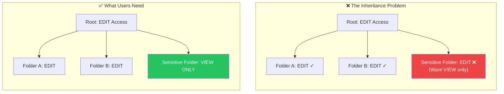
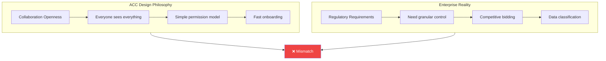

import PerformanceChart from '@/components/PerformanceChart.astro';

*This is Part 3 of our [ACC Pain Points series](/blog/acc-forum-analysis). We analyzed 4,295 feature requests from the ACC Ideas forum.*

---

## The Permission Paradox

<div class="not-prose my-8 bg-gradient-to-r from-purple-900/30 to-slate-900/50 rounded-2xl p-8 border border-purple-700/50">
  <div class="flex items-start gap-6">
    <div class="text-6xl">🔐</div>
    <div>
      <h3 class="text-2xl font-bold text-white mb-2">Enterprise Software. Consumer-Grade Controls.</h3>
      <p class="text-slate-300">ACC is used by multi-billion dollar construction projects with hundreds of subcontractors, sensitive bid documents, and strict compliance requirements.</p>
      <p class="text-xl text-purple-400 font-bold mt-4">Yet users can't remove inherited folder permissions.</p>
    </div>
  </div>
</div>

---

## The Numbers

<div class="not-prose my-8 grid grid-cols-2 md:grid-cols-4 gap-4">
  <div class="bg-gradient-to-br from-purple-600 to-purple-800 rounded-xl p-6 text-center transform hover:scale-105 transition-transform">
    <div class="text-4xl font-black text-white">504</div>
    <div class="text-purple-200 text-sm mt-1">Permission Ideas</div>
  </div>
  <div class="bg-gradient-to-br from-indigo-600 to-indigo-800 rounded-xl p-6 text-center transform hover:scale-105 transition-transform">
    <div class="text-4xl font-black text-white">3,251</div>
    <div class="text-indigo-200 text-sm mt-1">Community Votes</div>
  </div>
  <div class="bg-gradient-to-br from-blue-600 to-blue-800 rounded-xl p-6 text-center transform hover:scale-105 transition-transform">
    <div class="text-4xl font-black text-white">#5</div>
    <div class="text-blue-200 text-sm mt-1">Most-Voted Overall</div>
  </div>
  <div class="bg-gradient-to-br from-slate-600 to-slate-800 rounded-xl p-6 text-center transform hover:scale-105 transition-transform">
    <div class="text-4xl font-black text-white">2+</div>
    <div class="text-slate-200 text-sm mt-1">Years Waiting</div>
  </div>
</div>

---

## The #5 Most-Voted Request

<div class="not-prose my-8 bg-gradient-to-r from-purple-900/50 to-slate-900/50 rounded-2xl p-8 border border-purple-700/50">
  <div class="flex items-center gap-2 mb-4">
    <div class="px-3 py-1 bg-purple-500 text-white text-xs font-bold rounded-full">#5 MOST VOTED</div>
    <div class="px-3 py-1 bg-amber-500/20 text-amber-400 text-xs font-bold rounded-full">175 KUDOS</div>
  </div>
  <blockquote class="text-xl text-white italic border-l-4 border-purple-500 pl-4 mb-4">
    "I would like the ability to control permissions on sub folders outside of what is inherited. For example, I give everyone EDIT access at the Project Files level, but we have some folders deep inside the project we want to remove full access and only VIEW access. Currently we cannot do this."
  </blockquote>
  <div class="flex items-center gap-4 text-sm text-slate-400">
    <a href="https://forums.autodesk.com/t5/acc-ideas/folder-permissions-option-to-remove-inherited-permissions/idi-p/12421150" class="text-blue-400 hover:underline">View on Forum</a>
    <span>•</span>
    <span>Posted: <strong class="text-purple-400">December 2023</strong></span>
    <span>•</span>
    <span class="text-amber-400">Status: Future Consideration</span>
  </div>
</div>

This is **permission management 101**. Every file system since the 1990s has supported it. Yet ACC doesn't.

---

## What Users Can't Do



<div class="not-prose my-8 grid md:grid-cols-2 gap-4">
  <div class="bg-red-900/20 rounded-xl p-6 border border-red-700/30">
    <div class="flex items-center gap-2 mb-4">
      <div class="w-10 h-10 bg-red-500/20 rounded-full flex items-center justify-center text-red-400 text-xl">❌</div>
      <h4 class="text-lg font-bold text-white">Can't Remove Inherited Permissions</h4>
    </div>
    <p class="text-slate-300 text-sm">If you give "Edit" at root, everyone has "Edit" everywhere. No way to restrict subfolders.</p>
  </div>

  <div class="bg-red-900/20 rounded-xl p-6 border border-red-700/30">
    <div class="flex items-center gap-2 mb-4">
      <div class="w-10 h-10 bg-red-500/20 rounded-full flex items-center justify-center text-red-400 text-xl">❌</div>
      <h4 class="text-lg font-bold text-white">Can't Audit Who Has Access</h4>
    </div>
    <p class="text-slate-300 text-sm">No comprehensive view of all users and their access levels across folders. (Finally implemented after years of requests.)</p>
  </div>

  <div class="bg-red-900/20 rounded-xl p-6 border border-red-700/30">
    <div class="flex items-center gap-2 mb-4">
      <div class="w-10 h-10 bg-red-500/20 rounded-full flex items-center justify-center text-red-400 text-xl">❌</div>
      <h4 class="text-lg font-bold text-white">Can't Control Photo Permissions</h4>
    </div>
    <p class="text-slate-300 text-sm">Photos exist in a separate permission silo. Can't grant document access without photo access.</p>
  </div>

  <div class="bg-red-900/20 rounded-xl p-6 border border-red-700/30">
    <div class="flex items-center gap-2 mb-4">
      <div class="w-10 h-10 bg-red-500/20 rounded-full flex items-center justify-center text-red-400 text-xl">❌</div>
      <h4 class="text-lg font-bold text-white">Can't Set Folder-Level Defaults</h4>
    </div>
    <p class="text-slate-300 text-sm">Every new project starts from scratch. No templates, no standards, no automation.</p>
  </div>
</div>

---

## Real-World Consequences

<div class="not-prose my-8 space-y-6">
  <div class="bg-slate-900/80 rounded-2xl p-6 border border-slate-700">
    <div class="flex items-center gap-3 mb-4">
      <div class="w-12 h-12 bg-red-500/20 rounded-xl flex items-center justify-center text-2xl">💰</div>
      <div>
        <h4 class="text-lg font-bold text-white">Scenario 1: The Leaked Bid</h4>
        <p class="text-slate-400 text-sm">Competitive pricing exposed to rival subcontractors</p>
      </div>
    </div>
    <div class="bg-slate-800/50 rounded-lg p-4 font-mono text-sm">
      <div class="text-slate-400 mb-2">What the GC wants:</div>
      <div class="pl-4 border-l-2 border-slate-600">
        <div class="text-white">/Project Files/</div>
        <div class="text-white pl-4">/Bids/</div>
        <div class="text-emerald-400 pl-8">/Electrical/ → Only ElectroCorp sees</div>
        <div class="text-emerald-400 pl-8">/Plumbing/ → Only PlumbWorks sees</div>
        <div class="text-emerald-400 pl-8">/HVAC/ → Only AirFlow Inc sees</div>
      </div>
      <div class="text-red-400 mt-4">What ACC allows: Everyone sees all bid folders</div>
    </div>
    <div class="mt-4 p-3 bg-red-900/30 rounded-lg border border-red-700/50 text-red-300 text-sm">
      <strong>Result:</strong> Competitors see each other's pricing. Bids become meaningless.
    </div>
  </div>

  <div class="bg-slate-900/80 rounded-2xl p-6 border border-slate-700">
    <div class="flex items-center gap-3 mb-4">
      <div class="w-12 h-12 bg-amber-500/20 rounded-xl flex items-center justify-center text-2xl">📋</div>
      <div>
        <h4 class="text-lg font-bold text-white">Scenario 2: The Compliance Audit</h4>
        <p class="text-slate-400 text-sm">Owner asks: "Who has access to our financial documents?"</p>
      </div>
    </div>
    <div class="grid md:grid-cols-2 gap-4">
      <div class="bg-emerald-900/20 rounded-lg p-4 border border-emerald-700/30">
        <div class="text-emerald-400 text-sm font-bold mb-2">What they need:</div>
        <p class="text-slate-300 text-sm">A report showing every user with access to /Finance/ and their permission level.</p>
      </div>
      <div class="bg-red-900/20 rounded-lg p-4 border border-red-700/30">
        <div class="text-red-400 text-sm font-bold mb-2">What ACC provides:</div>
        <p class="text-slate-300 text-sm">Click into each of 500 folders manually and check. One. By. One.</p>
      </div>
    </div>
  </div>

  <div class="bg-slate-900/80 rounded-2xl p-6 border border-slate-700">
    <div class="flex items-center gap-3 mb-4">
      <div class="w-12 h-12 bg-purple-500/20 rounded-xl flex items-center justify-center text-2xl">👋</div>
      <div>
        <h4 class="text-lg font-bold text-white">Scenario 3: The Departed Employee</h4>
        <p class="text-slate-400 text-sm">Someone leaves. Remove their access from 200 projects.</p>
      </div>
    </div>
    <div class="flex items-center justify-between p-4 bg-slate-800/50 rounded-lg">
      <div>
        <div class="text-slate-400 text-xs">What should happen:</div>
        <div class="text-emerald-400 font-bold">One command, instant removal</div>
      </div>
      <div class="text-3xl text-slate-600">vs</div>
      <div class="text-right">
        <div class="text-slate-400 text-xs">What ACC requires:</div>
        <div class="text-red-400 font-bold">200 project visits, manual each time</div>
      </div>
    </div>
  </div>
</div>

---

## Why This Is a Security Issue

<div class="not-prose my-8">
  <div class="bg-gradient-to-br from-red-900/30 to-slate-900/50 rounded-2xl p-6 border border-red-700/50">
    <h3 class="text-xl font-bold text-white mb-6">Construction Projects Handle Sensitive Data</h3>
    <div class="grid grid-cols-2 md:grid-cols-4 gap-4">
      <div class="bg-slate-900/50 rounded-xl p-4 text-center">
        <div class="text-3xl mb-2">💵</div>
        <div class="text-white font-bold">Financial</div>
        <div class="text-slate-400 text-xs">Budgets, bids, change orders</div>
      </div>
      <div class="bg-slate-900/50 rounded-xl p-4 text-center">
        <div class="text-3xl mb-2">⚖️</div>
        <div class="text-white font-bold">Legal</div>
        <div class="text-slate-400 text-xs">Contracts, insurance, liens</div>
      </div>
      <div class="bg-slate-900/50 rounded-xl p-4 text-center">
        <div class="text-3xl mb-2">👤</div>
        <div class="text-white font-bold">Personnel</div>
        <div class="text-slate-400 text-xs">Certifications, background checks</div>
      </div>
      <div class="bg-slate-900/50 rounded-xl p-4 text-center">
        <div class="text-3xl mb-2">📐</div>
        <div class="text-white font-bold">IP</div>
        <div class="text-slate-400 text-xs">Designs, specifications</div>
      </div>
    </div>
    <div class="mt-6 p-4 bg-red-900/30 rounded-lg border border-red-700/50">
      <p class="text-red-300 text-center"><strong>When permission controls are inadequate, data exposure isn't a bug — it's a feature of the system.</strong></p>
    </div>
  </div>
</div>

---

## Permission-Related Requests

<PerformanceChart
  title="What Users Are Asking For"
  subtitle="Permission-related feature requests by category"
  data={[
    { label: "Inheritance Override", value: 175, color: "bg-gradient-to-r from-purple-500 to-purple-600", suffix: " kudos" },
    { label: "Permission Auditing", value: 68, color: "bg-gradient-to-r from-blue-500 to-blue-600", suffix: " kudos" },
    { label: "Photo Permissions", value: 100, color: "bg-gradient-to-r from-pink-500 to-pink-600", suffix: " kudos" },
    { label: "Folder Defaults", value: 72, color: "bg-gradient-to-r from-amber-500 to-amber-600", suffix: " kudos" },
    { label: "Bulk Permission Changes", value: 89, color: "bg-gradient-to-r from-emerald-500 to-emerald-600", suffix: " kudos" },
  ]}
  maxValue={200}
/>

---

## The RAPS Solution

RAPS v4.0 includes bulk folder permission management:

### Grant Permissions Across Projects

```bash
# Give a user edit access to Project Files across all projects
raps admin folder rights "$ACCOUNT_ID" "contractor@partner.com" \
  --permission edit --folder project_files
```

### Different Levels for Different Folders

```bash
# View-only for Plans folder
raps admin folder rights "$ACCOUNT_ID" "reviewer@client.com" \
  --permission view --folder plans

# Edit for Project Files
raps admin folder rights "$ACCOUNT_ID" "reviewer@client.com" \
  --permission edit --folder project_files
```

### Filter by Project

```bash
# Only apply to specific projects
raps admin folder rights "$ACCOUNT_ID" "user@company.com" \
  --permission control --folder project_files \
  --filter "^2024-Confidential"
```

---

## Permission Levels

<div class="not-prose my-8">
  <div class="bg-slate-900/80 rounded-2xl p-6 border border-slate-700">
    <h3 class="text-lg font-bold text-white mb-6">Available Permission Levels in RAPS</h3>
    <div class="space-y-3">
      <div class="flex items-center justify-between p-3 bg-slate-800/50 rounded-lg">
        <div class="flex items-center gap-3">
          <code class="bg-slate-700 px-3 py-1 rounded text-emerald-400">view</code>
          <span class="text-slate-300">View files only</span>
        </div>
        <span class="text-slate-500 text-sm">Least access</span>
      </div>
      <div class="flex items-center justify-between p-3 bg-slate-800/50 rounded-lg">
        <div class="flex items-center gap-3">
          <code class="bg-slate-700 px-3 py-1 rounded text-emerald-400">view_download</code>
          <span class="text-slate-300">View and download</span>
        </div>
        <span class="text-slate-500 text-sm">Reviewers</span>
      </div>
      <div class="flex items-center justify-between p-3 bg-slate-800/50 rounded-lg">
        <div class="flex items-center gap-3">
          <code class="bg-slate-700 px-3 py-1 rounded text-blue-400">upload</code>
          <span class="text-slate-300">Add new files</span>
        </div>
        <span class="text-slate-500 text-sm">Contributors</span>
      </div>
      <div class="flex items-center justify-between p-3 bg-slate-800/50 rounded-lg">
        <div class="flex items-center gap-3">
          <code class="bg-slate-700 px-3 py-1 rounded text-amber-400">edit</code>
          <span class="text-slate-300">Modify existing files</span>
        </div>
        <span class="text-slate-500 text-sm">Team members</span>
      </div>
      <div class="flex items-center justify-between p-3 bg-slate-800/50 rounded-lg">
        <div class="flex items-center gap-3">
          <code class="bg-slate-700 px-3 py-1 rounded text-red-400">control</code>
          <span class="text-slate-300">Full control + permissions</span>
        </div>
        <span class="text-slate-500 text-sm">Administrators</span>
      </div>
    </div>
  </div>
</div>

---

## What's Still Missing

<div class="not-prose my-8 grid md:grid-cols-2 gap-4">
  <div class="bg-amber-900/20 rounded-xl p-6 border border-amber-700/30">
    <h4 class="text-amber-400 font-bold mb-4">Requires Autodesk to Fix</h4>
    <ul class="space-y-2 text-slate-300 text-sm">
      <li class="flex items-center gap-2"><span class="text-amber-400">⚠️</span> Inheritance override at folder level</li>
      <li class="flex items-center gap-2"><span class="text-amber-400">⚠️</span> Photo permission separation</li>
      <li class="flex items-center gap-2"><span class="text-amber-400">⚠️</span> Real-time audit logs</li>
      <li class="flex items-center gap-2"><span class="text-amber-400">⚠️</span> Cross-project permission views</li>
    </ul>
    <p class="text-slate-500 text-xs mt-4">API doesn't expose what doesn't exist in the product.</p>
  </div>
  <div class="bg-emerald-900/20 rounded-xl p-6 border border-emerald-700/30">
    <h4 class="text-emerald-400 font-bold mb-4">RAPS Can Help With</h4>
    <ul class="space-y-2 text-slate-300 text-sm">
      <li class="flex items-center gap-2"><span class="text-emerald-400">✓</span> Bulk permission provisioning</li>
      <li class="flex items-center gap-2"><span class="text-emerald-400">✓</span> Automated onboarding/offboarding</li>
      <li class="flex items-center gap-2"><span class="text-emerald-400">✓</span> Permission extraction to reports</li>
      <li class="flex items-center gap-2"><span class="text-emerald-400">✓</span> CI/CD permission automation</li>
    </ul>
    <p class="text-slate-500 text-xs mt-4">Automating what the API allows.</p>
  </div>
</div>

---

## The Architectural Issue



ACC was designed for **collaboration openness**, not **enterprise security controls**. This works for small teams. It fails for:

- Large enterprises with regulatory requirements
- Projects with competitive bidding
- Organizations with strict data classification
- Any context where "least privilege" matters

---

## Recommendations

<div class="not-prose my-8 space-y-4">
  <div class="bg-blue-900/20 rounded-xl p-6 border border-blue-700/30">
    <h4 class="text-blue-400 font-bold mb-3">For AEC Professionals</h4>
    <ul class="space-y-2 text-slate-300 text-sm">
      <li>• Document permission requirements before adopting ACC</li>
      <li>• Plan folder structures with limitations in mind</li>
      <li>• Use project segmentation when necessary</li>
      <li>• Implement automated permission management</li>
    </ul>
  </div>

  <div class="bg-purple-900/20 rounded-xl p-6 border border-purple-700/30">
    <h4 class="text-purple-400 font-bold mb-3">For Autodesk</h4>
    <ul class="space-y-2 text-slate-300 text-sm">
      <li>• Implement inheritance override (the #5 request)</li>
      <li>• Add comprehensive permission auditing</li>
      <li>• Create project templates with permission defaults</li>
      <li>• Separate photo permissions from documents</li>
    </ul>
  </div>

  <div class="bg-emerald-900/20 rounded-xl p-6 border border-emerald-700/30">
    <h4 class="text-emerald-400 font-bold mb-3">For Developers</h4>
    <ul class="space-y-2 text-slate-300 text-sm">
      <li>• Build tooling that fills permission gaps</li>
      <li>• Create audit reports ACC doesn't provide</li>
      <li>• Automate permission provisioning/deprovisioning</li>
      <li>• Consider permission management in workflow design</li>
    </ul>
  </div>
</div>

---

## Series Conclusion

<div class="not-prose my-8 bg-gradient-to-br from-slate-800 to-slate-900 rounded-2xl p-8 border border-slate-700">
  <h3 class="text-2xl font-bold text-white mb-6 text-center">What We Learned from 4,295 Feature Requests</h3>

  <div class="grid md:grid-cols-3 gap-6 mb-8">
    <a href="/blog/acc-forum-analysis" class="block p-4 bg-slate-800/50 rounded-xl border border-slate-700 hover:border-blue-500 transition-colors">
      <div class="text-blue-400 font-bold mb-2">Part 1</div>
      <div class="text-white font-bold">The 96.6% Problem</div>
      <div class="text-slate-400 text-sm">Why requests go unanswered</div>
    </a>
    <a href="/blog/acc-bulk-operations-crisis" class="block p-4 bg-slate-800/50 rounded-xl border border-slate-700 hover:border-amber-500 transition-colors">
      <div class="text-amber-400 font-bold mb-2">Part 2</div>
      <div class="text-white font-bold">Bulk Operations Crisis</div>
      <div class="text-slate-400 text-sm">The click-by-click productivity drain</div>
    </a>
    <a href="/blog/acc-permission-nightmare" class="block p-4 bg-purple-800/50 rounded-xl border border-purple-500">
      <div class="text-purple-400 font-bold mb-2">Part 3</div>
      <div class="text-white font-bold">The Permission Problem</div>
      <div class="text-slate-400 text-sm">When basic controls are missing</div>
    </a>
  </div>

  <div class="text-center">
    <p class="text-slate-300 mb-4">The data reveals a systematic gap between enterprise needs and product capabilities.</p>
    <p class="text-white text-xl font-bold">For developers and power users: build tooling that fills the vacuum.</p>
    <p class="text-emerald-400 mt-4">RAPS is our contribution. What will you build?</p>
  </div>
</div>

---

**Related:**
- [Admin Commands Reference](/docs/admin)
- [Account Admin Cookbook](/docs/cookbook-acc-admin)
- [RAPS 4.0 Release Notes](/blog/raps-4-account-admin)
