<div className="not-prose mb-6 p-4 bg-green-50 dark:bg-green-900/20 rounded-lg border border-green-200 dark:border-green-800">
  <p className="text-sm text-green-800 dark:text-green-200">
    <strong>Validated:</strong> Pipeline timing claims are continuously tested via automated benchmarks.
    <a href="https://github.com/dmytro-yemelianov/raps-examples/actions/workflows/run-benchmarks.yml" className="ml-2 underline">View latest results</a>
  </p>
</div>

## What Is CI/CD and Why Should AEC Care?

If you've heard developers talk about "pipelines" and "automated deployments" and felt like they were speaking another language, you're not alone. CI/CD sounds technical, but the concept is surprisingly simple—and incredibly relevant to AEC workflows.

```mermaid
flowchart LR
    subgraph old["❌ Traditional"]
        direction TB
        A[Design] --> B[Save]
        B --> C[Email]
        C --> D[Upload]
        D --> E[Wait...]
        E --> F[Check]
        F --> G[Email again]
    end
    
    subgraph new["✅ CI/CD"]
        direction TB
        H[Design] --> I[Save to Git]
        I --> J[✨ Auto-magic]
        J --> K[Team notified]
    end
    
    style G fill:#ffcccc
    style K fill:#ccffcc
```



**CI/CD stands for:**
- **Continuous Integration (CI):** Automatically testing and validating changes as they're made
- **Continuous Deployment (CD):** Automatically moving validated work to where it needs to go

In software, this means code goes from a developer's laptop to production servers automatically. In AEC, this means models go from a designer's machine to BIM 360/ACC, get translated, and notify the team—automatically.

## The Software Industry's Secret Weapon

Software companies figured out decades ago that manual processes create bottlenecks. Every time a human has to:

- Remember to do something
- Click through a web interface
- Send an email notification
- Check on a status

...there's an opportunity for:
- Forgetting
- Mistakes
- Delays
- Context switching

The solution? **Automate everything that can be automated.**

Here's what a typical software CI/CD pipeline looks like:


Every step after the initial commit happens automatically. The developer pushes code and walks away. If something fails, they get notified. If everything succeeds, the code is live.

## Translating CI/CD to AEC

Now let's translate this to AEC workflows. Here's what an automated BIM pipeline could look like:


**The designer's experience:**
1. Save the model
2. That's it

Everything else happens in the background. The team gets notified when the model is ready. If something fails, the designer finds out immediately instead of discovering it hours later.

## Key CI/CD Concepts for AEC

### 1. Triggers

A trigger is what starts the automation. In software, it's usually a code commit. In AEC, it could be:

- Saving a file to a watched folder
- Pushing to a Git repository
- A scheduled time (nightly processing)
- A manual button click (for important releases)

```yaml
# Example: Trigger on file changes
on:
  push:
    paths:
      - 'models/**/*.rvt'
      - 'models/**/*.dwg'
```

### 2. Jobs and Steps

A pipeline is made of **jobs**, and each job contains **steps**:

```yaml
jobs:
  process-model:
    steps:
      - name: Upload to APS
        run: raps object upload my-bucket model.rvt
      
      - name: Start Translation
        run: raps translate start $URN --wait
      
      - name: Notify Team
        run: slack-notify "Model ready for review"
```

### 3. Environment Variables and Secrets

Sensitive information (API keys, passwords) are stored as **secrets**, not in the pipeline code:

```yaml
env:
  APS_CLIENT_ID: ${{ secrets.APS_CLIENT_ID }}
  APS_CLIENT_SECRET: ${{ secrets.APS_CLIENT_SECRET }}
```

This means you can share your pipeline configuration without exposing credentials.

### 4. Artifacts

Artifacts are the outputs of your pipeline—things you want to keep:

- Translated model files
- Generated thumbnails
- Property extraction reports
- QA/QC results

```yaml
- name: Save Artifacts
  uses: actions/upload-artifact@v4
  with:
    name: model-outputs
    path: |
      outputs/thumbnail.png
      outputs/properties.json
```

## Your First AEC Pipeline

Let's build a simple pipeline that:
1. Detects when a Revit model changes
2. Uploads it to APS
3. Translates it to SVF2
4. Notifies your team

### Prerequisites

- A GitHub repository for your models
- An Autodesk Platform Services account
- RAPS CLI installed

### The Pipeline

Create `.github/workflows/model-pipeline.yml`:

```yaml
name: Model Processing Pipeline

on:
  push:
    paths:
      - 'models/**/*.rvt'

jobs:
  process:
    runs-on: ubuntu-latest
    
    steps:
      # 1. Get the code
      - name: Checkout
        uses: actions/checkout@v4
      
      # 2. Install RAPS
      - name: Install RAPS CLI
        run: |
          curl -fsSL https://rapscli.xyz/install.sh | sh
          echo "$HOME/.cargo/bin" >> $GITHUB_PATH
      
      # 3. Authenticate
      - name: Login to APS
        env:
          APS_CLIENT_ID: ${{ secrets.APS_CLIENT_ID }}
          APS_CLIENT_SECRET: ${{ secrets.APS_CLIENT_SECRET }}
        run: raps auth login
      
      # 4. Process changed models
      - name: Process Models
        run: |
          # Find changed .rvt files
          for model in $(git diff --name-only HEAD~1 HEAD | grep '\.rvt$'); do
            echo "📦 Processing $model..."
            
            # Upload
            raps object upload project-bucket "$model"
            
            # Get URN
            URN=$(raps object urn project-bucket "$model")
            
            # Translate and wait
            raps translate start $URN --format svf2 --wait
            
            echo "✅ $model processed successfully"
          done
      
      # 5. Notify team
      - name: Notify Slack
        if: success()
        run: |
          curl -X POST ${{ secrets.SLACK_WEBHOOK }} \
            -H 'Content-Type: application/json' \
            -d '{"text": "🏗️ Model pipeline completed successfully!"}'
```

### Setting Up Secrets

In your GitHub repository:
1. Go to Settings → Secrets and variables → Actions
2. Add these secrets:
   - `APS_CLIENT_ID` - Your Autodesk app client ID
   - `APS_CLIENT_SECRET` - Your Autodesk app client secret
   - `SLACK_WEBHOOK` - Your Slack webhook URL (optional)

## Common Pipeline Patterns for AEC

### Pattern 1: Nightly Processing

Process all models every night:

```yaml
on:
  schedule:
    - cron: '0 2 * * *'  # 2 AM every day
```

### Pattern 2: Manual Approval

Require approval before processing:

```yaml
jobs:
  approve:
    runs-on: ubuntu-latest
    environment: production  # Requires approval in GitHub settings
    steps:
      - run: echo "Approved for processing"
  
  process:
    needs: approve
    # ... processing steps
```

### Pattern 3: Multi-Environment

Different pipelines for different purposes:

```yaml
jobs:
  process:
    runs-on: ubuntu-latest
    steps:
      - name: Set Environment
        run: |
          if [[ "${{ github.ref }}" == "refs/heads/main" ]]; then
            echo "ENV=production" >> $GITHUB_ENV
            echo "BUCKET=prod-models" >> $GITHUB_ENV
          else
            echo "ENV=staging" >> $GITHUB_ENV
            echo "BUCKET=staging-models" >> $GITHUB_ENV
          fi
```

### Pattern 4: Quality Gates

Stop processing if validation fails:

```yaml
- name: Validate Model
  run: |
    # Check file size
    SIZE=$(stat -f%z "$MODEL_PATH")
    if [ $SIZE -gt 500000000 ]; then
      echo "❌ Model exceeds 500MB limit"
      exit 1
    fi
    
    # Check for required parameters
    raps model metadata extract $URN --check-required
```

## Monitoring and Debugging

### Viewing Pipeline Runs

In GitHub:
1. Go to your repository
2. Click "Actions" tab
3. See all pipeline runs with status

### Debugging Failures

When something fails:
1. Click on the failed run
2. Expand the failed step
3. Read the error message
4. Fix and push again

### Adding Notifications

Get notified on failures:

```yaml
- name: Notify on Failure
  if: failure()
  run: |
    curl -X POST ${{ secrets.SLACK_WEBHOOK }} \
      -H 'Content-Type: application/json' \
      -d '{"text": "❌ Pipeline failed! Check GitHub Actions for details."}'
```

## The ROI of CI/CD for AEC

Let's do some math:

| Activity | Manual Time | Automated Time | Weekly Savings |
|----------|-------------|----------------|----------------|
| Upload models | 10 min × 5/day | 0 min | 4.2 hours |
| Check translation status | 15 min × 5/day | 0 min | 6.25 hours |
| Notify team | 5 min × 5/day | 0 min | 2 hours |
| Fix forgotten uploads | 30 min × 2/week | 0 min | 1 hour |
| **Total** | | | **13.45 hours/week** |

At $75/hour, that's **$52,000/year** per team member in recovered productivity.

## Next Steps

1. **Start small:** Automate one painful workflow
2. **Measure:** Track time saved
3. **Iterate:** Add more automation as you gain confidence
4. **Share:** Teach your team

The tools exist. The patterns are proven. The question is: when will you start?

---

*This is the second article in the "DevOps for Design" series. [← Previous: The Manual Tax](/blog/manual-tax) | [Next: Zero-Click Releases →](/blog/zero-click-releases-github-actions)*

*Ready to automate your APS workflows? [Get started with RAPS](/docs/quickstart) or [connect with me on LinkedIn](https://www.linkedin.com/in/dmytro-yemelianov/).*
