  

    <strong>Validated:</strong> Authentication flow claims are tested via automated benchmarks.
    <a href="https://github.com/dmytro-yemelianov/raps-examples/actions/workflows/run-benchmarks.yml" className="ml-2 underline">View latest results</a>
  

## The OAuth Implementation Nightmare That Spans Every Major CAD Platform

If you've ever thrown your keyboard after encountering yet another OAuth 401 error, you're not alone. Our research across Autodesk APS, PTC Onshape, Dassault 3DEXPERIENCE, and Siemens Teamcenter reveals that authentication complexity is the #1 developer complaint universally.

```mermaid
flowchart TB
    subgraph "OAuth Authentication Chaos"
        A[Developer] --> B{Which Platform?}
        B --> C[Autodesk APS]
        B --> D[PTC Onshape]
        B --> E[Dassault 3DEXP]
        B --> F[Siemens TC]
        
        C --> C1[2-leg vs 3-leg confusion]
        D --> D1[URL encoding traps]
        E --> E1[5 separate logins]
        F --> F1[SSO complexity]
        
        C1 --> G[😤 401 Errors]
        D1 --> G
        E1 --> G
        F1 --> G
    end
    
    subgraph "RAPS Solution"
        H[raps auth login] --> I[✅ Auto token management]
        I --> J[✅ Refresh handling]
        J --> K[✅ Secure storage]
    end
    
    G -.->|Solved by| H
    
    style G fill:#ffcccc
    style I fill:#ccffcc
    style J fill:#ccffcc
    style K fill:#ccffcc
```

### The Authentication Hall of Shame

**PTC Onshape: The URL Encoding Trap**
Developers waste hours debugging OAuth failures caused by trailing `=` characters in client secrets. The solution? URL encode everything—but good luck finding that in the documentation.

*Real developer quote:* "The body of the form needs to contain the client ID, client secret, authorization_code... Each parameter needs to be URL encoded - especially important for the Client ID and secret since either or both may contain multiple trailing '=' characters."

**Dassault 3DEXPERIENCE: Login Inception**
Imagine having to authenticate separately for:
- The partner platform
- The commercial platform  
- The support system
- Your actual application

One frustrated developer reported logging in **five times in one hour** just to write a forum post. Session management failures regularly lock up SOLIDWORKS mid-work, with 3DPassport authentication errors cascading into application crashes.

**Siemens Teamcenter: Enterprise Complexity**
SSO configuration requires understanding:
- `tcsso.login_service.proxyURL` parameters
- External identity providers
- Credential managers
- Discriminators
- Endpoint configuration
- Protocol settings (HTTP/IIOP/REST)

The result? `SoaRuntimeException` login failures are so common they have their own troubleshooting guide.

### Why This Matters for RAPS Users

While Autodesk APS has its own authentication challenges (2-legged vs 3-legged confusion, anyone?), the pattern is clear: **every major CAD platform suffers from authentication complexity**.

This validates RAPS's approach of providing:
- Automated token management
- Built-in refresh logic
- Race condition handling
- Secure credential storage
- Multiple auth flow support

### The Market Opportunity

With authentication pain points affecting **~70% of the enterprise CAD/PLM market**, tools that simplify authentication across platforms have massive potential. RAPS currently handles APS authentication elegantly—extending to support Onshape OAuth, 3DEXPERIENCE 3DPassport, and Teamcenter SSO would capture significant additional value.

### Key Takeaways

1. **Authentication is broken everywhere**—not just in APS
2. **Documentation rarely helps**—critical details are buried in forums
3. **Enterprise SSO adds complexity**—not simplicity
4. **Session management is universally poor**—crashes and lockouts are common
5. **CLI tools can abstract this pain**—RAPS proves the model works

### Manual OAuth vs RAPS

| Step | Manual Approach | With RAPS |
|------|----------------|----------|
| Get token | Base64 encode credentials, POST to /authentication/v2/token | `raps auth login` |
| Refresh token | Implement refresh logic, handle race conditions | Automatic |
| Store credentials | Build secure storage, handle encryption | Built-in keychain |
| Check status | Decode JWT, parse expiry | `raps auth status` |
| Multiple environments | Manage separate credential files | `raps auth login --profile prod` |

### What's Next?

In our next article, we'll dive into file translation failures—another universal disaster where 31MB files take 30+ minutes with no progress indication, and some users wait **seven years** for bug fixes.

---

*This article is part of our "Cross-Platform Developer Pain Points" series, validating that the problems RAPS solves for Autodesk APS exist across the entire CAD/PLM ecosystem.*