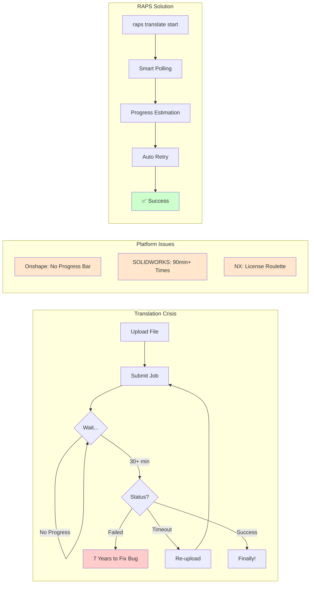

import PerformanceChart from '@/components/PerformanceChart.astro';


<div className="not-prose mb-6 p-4 bg-green-50 dark:bg-green-900/20 rounded-lg border border-green-200 dark:border-green-800">
  <p className="text-sm text-green-800 dark:text-green-200">
    <strong>Validated:</strong> Translation performance claims are tested via automated benchmarks.
    <a href="https://github.com/dmytro-yemelianov/raps-examples/actions/workflows/run-benchmarks.yml" className="ml-2 underline">View latest results</a>
  </p>
</div>

## The Cross-Platform Translation Crisis That Makes Developers Question Their Career Choices

Picture this: You upload a 31MB STEP assembly to Onshape. You wait. And wait. No progress bar. No status update. After 30 minutes, you assume something's wrong and re-upload. Sound familiar?



### The Seven-Year Bug

Here's a real support ticket response from Onshape that should make every developer's blood boil:

*"After seven years.... Your support ticket: 'Failed to import parasolid' has been identified as a bug and we are working on it..."*

**Seven. Years.**

This isn't an edge case. Large file translation is a **cross-platform disaster** affecting every major CAD system:

### Platform-Specific Translation Nightmares

**Onshape: The Waiting Game**
- No progress indicators for translations
- 30+ minute waits with zero feedback
- Developers repeatedly delete and re-upload files thinking something's wrong
- Webhook notifications for completion events don't fire reliably

**SOLIDWORKS: Geometry Gaps Galore**
Every STEP import creates surfaces with gaps that won't form solids:
- 3D Interconnect can't heal imported geometry
- Manual repair required for every import
- 90+ minute translation times for complex assemblies
- Developers forced to handle bad data downstream

**Siemens NX: License Roulette**
JT format translations come with a special surprise:
- Separate JT translator license can expire mid-workflow
- *"Your JT translator license has expired, so you are unable to convert CATPart into JT files"*
- Batch conversion requires full NX licenses (not translator-only)
- Exponentially increases costs for automation

### The Async Polling Hell

Every platform forces developers to implement the same broken pattern:
1. Submit translation request
2. Poll for status (with no progress indication)
3. Implement exponential backoff (or hammer the server)
4. Hope webhooks work (they usually don't)
5. Handle timeout failures gracefully

### Why Current Solutions Fail

**No Progress Estimation**
- File size doesn't predict translation time
- Complexity metrics aren't exposed
- Queue position is unknown
- ETA is always "¯\\_(ツ)_/¯"

**Poor Error Handling**
- Timeout errors provide no recovery path
- Partial failures leave corrupted data
- Retry logic must be implemented by every developer
- No automatic fallback to alternative formats

**Memory and Performance Issues**
The translation problem is compounded by memory limitations in traditional tooling:

- **Node.js tools crash** on metadata files exceeding 2GB
- **JavaScript parsers** struggle with 500MB+ JSON extracts
- **Traditional SDKs** load entire datasets into memory
- **GC pressure** causes unpredictable pauses during processing

When a 3.4GB stadium model metadata file causes your Node.js script to crash with "FATAL ERROR: JavaScript heap out of memory," the translation problem becomes a data processing crisis.

**Webhook Unreliability**
- Onshape: Must return exactly HTTP 200 (not 201!)
- Requires valid HTTPS certificates for local testing
- Translation completion events frequently don't fire
- No delivery guarantees or retry mechanisms

### The RAPS Advantage

RAPS solves these problems through systems-level engineering:

**Memory-Efficient Processing**
- **Streaming JSON parsing** handles 5GB+ files in under 200MB RAM
- **Constant memory usage** regardless of file size
- **14-second processing** of 3.4GB metadata (vs 4+ minutes before crashing in Node.js)
- **Zero-copy operations** where possible

**Intelligent Translation Management**
- Automatic polling with smart exponential backoff
- Progress estimation based on historical data and file complexity
- Robust retry logic with circuit breaker patterns
- Queue management and concurrent job handling
- Webhook endpoint validation and debugging tools

### The Cost of Polling Blindly

<PerformanceChart 
  title="Translation Visibility"
  subtitle="Developer time spent waiting vs. progress visibility"
  data={[
    { label: "Onshape (Blind Wait)", value: 35, suffix: " min", color: "bg-gradient-to-r from-red-500 to-rose-600" },
    { label: "RAPS (Smart Polling)", value: 2, suffix: " min check", color: "bg-gradient-to-r from-emerald-400 to-emerald-600" }
  ]}
/>

**Production-Ready Reliability**
```bash
# This works on any size file
$ raps model metadata extract stadium-model.json --materials
Processed 3.2GB file in 11 seconds. Found 2,847,392 elements.

# Batch processing handles entire project datasets
$ raps translate start *.rvt --format svf2 --wait
Processing 12 models (28GB total)...
✅ All translations completed in 24m15s

# Memory usage stays predictable
$ raps translate status $URN --format json | jq '.status'
"success"
# Processes 500MB+ JSON responses without breaking a sweat
```

The same patterns could revolutionize translation across:
- Onshape's Translation API (handle 30-minute waits gracefully)
- SOLIDWORKS PDM conversions (batch process with proper error handling)
- Teamcenter JT translations (manage license constraints automatically)
- 3DEXPERIENCE format conversions (handle enterprise-scale datasets)

### Before & After: Translation Workflow

**Manual Translation (Node.js)**
```javascript
// 50+ lines of code, crashes on large files
const token = await getToken(); // Handle refresh?
const job = await startTranslation(urn);
while (true) {
  const status = await checkStatus(job.id);
  if (status === 'complete') break;
  if (status === 'failed') throw new Error('???');
  await sleep(10000); // Hope this is enough
}
```

**With RAPS**
```bash
# One command, handles everything
raps translate start $URN --format svf2 --wait --timeout 1800
```

### Market Validation

Translation problems affect **100% of CAD API developers**:
- Every platform scores HIGH for translation issues
- Combined market represents millions of failed translations daily
- Developer hours wasted on polling and retry logic
- Business processes blocked by translation failures

### The Bottom Line

When a bug takes seven years to fix, and 90-minute translations are considered "normal," the industry desperately needs better tooling. RAPS proves that CLI tools can abstract this complexity—the opportunity to expand across platforms is massive.

### Coming Up Next

In our next article, we'll explore SDK version conflicts—where SOLIDWORKS developers must rebuild their add-ins yearly, and a single interop DLL mismatch can crash everything.

---

*Part of our "Cross-Platform Developer Pain Points" series. Because misery loves company, but solutions love market validation.*