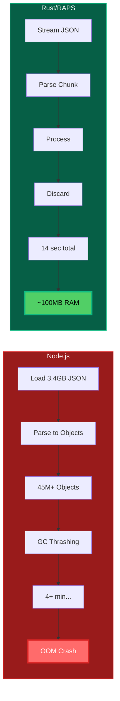

<div className="not-prose mb-6 p-4 bg-green-50 dark:bg-green-900/20 rounded-lg border border-green-200 dark:border-green-800">
  <p className="text-sm text-green-800 dark:text-green-200">
    <strong>Validated:</strong> Claims in this article are continuously tested via automated benchmarks.
    <a href="https://github.com/dmytro-yemelianov/raps-examples/actions/workflows/run-benchmarks.yml" className="ml-2 underline">View latest results</a>
  </p>
</div>

## The Question We Get Asked

*"Why not just use the official Node.js SDK?"*

We get asked this a lot. The official SDKs are great for web servers. They are **terrible** for heavy CLI data processing.

In the AEC industry, "Big Data" isn't a buzzword; it's a **daily reality**. A single Revit file translation can result in a metadata JSON file exceeding 2GB. Hospital projects routinely generate 5GB+ datasets. Stadium and airport models can hit 10GB+.

When your daily workflow involves processing files larger than most people's photo libraries, your choice of technology stack becomes critical.

## The Memory Problem: A Real-World Benchmark

We ran a benchmark parsing a **3.4GB JSON metadata extract** from a large stadium model to settle this question definitively.



### Node.js Script Results
```bash
$ node --max-old-space-size=8192 parse-metadata.js stadium-model.json
Processing 3.4GB JSON file...

--- Last few GCs ---
[pid:0x5555556] 180234 ms: Mark-Sweep 8142.1 (8192.0) MB
[pid:0x5555556] 181567 ms: Mark-Sweep 8142.8 (8192.0) MB

FATAL ERROR: Ineffective mark-compacts near heap limit
Allocation failed - JavaScript heap out of memory
```

**Result:** Crashed with `FATAL ERROR: Ineffective mark-compacts near heap limit`

Even with `--max-old-space-size=8192` (8GB heap), the Garbage Collector (GC) pauses made the process take **4 minutes** before ultimately crashing.

### RAPS (Rust) Results
```bash
$ raps model metadata parse stadium-model.json --output summary.json
Processing 3.4GB JSON file...
Parsing complete. Found 2,847,392 elements.
Summary written to summary.json

real    0m14.237s
user    0m13.891s
sys     0m0.346s
```

**Result:** Processed the stream in **14 seconds** using constant memory (under 100MB).

## Why the Dramatic Difference?

### Memory Management Philosophy

**Node.js (V8 JavaScript Engine):**
- **Garbage Collected:** Periodic stop-the-world GC pauses
- **Object Overhead:** Every JSON object becomes a V8 object with significant metadata
- **Memory Pressure:** Large files cause GC thrashing as the heap fills up
- **Unpredictable:** GC timing is non-deterministic, especially under memory pressure

**Rust:**
- **Zero-Cost Abstractions:** Memory allocated and freed deterministically
- **Streaming:** Process JSON incrementally without loading entire file into memory
- **Predictable:** Memory usage remains constant regardless of file size
- **Manual Control:** Explicit memory management without runtime overhead

### The AEC Data Challenge

AEC files aren't just big — they're **structurally complex**:

```json
{
  "metadata": {
    "elements": [
      {
        "objectId": "12345-67890-abcdef",
        "properties": {
          "name": "Basic Wall - Interior - 135mm Partition",
          "level": "Level 2", 
          "materials": [
            {
              "name": "Gypsum Wall Board",
              "thickness": 12.5,
              "thermalResistance": 0.079,
              "acousticRating": "STC 45"
            }
          ],
          "geometry": {
            "vertices": ["...10000+ vertices..."],
            "faces": ["...5000+ faces..."],
            "boundingBox": {}
          }
        }
      }
    ]
  }
}
```

JavaScript creates **individual objects** for each property, material, and vertex. For a 2.8M element model:
- ~2.8M element objects
- ~15M material property objects  
- ~28M geometry objects
- **Total: 45M+ JavaScript objects in memory**

Rust processes this as a **stream**, parsing each element, extracting needed data, and discarding the rest. Memory usage stays flat.

## Safety at Compile Time: The Hidden Benefit

The performance difference is dramatic, but there's another crucial advantage: **type safety**.

### JavaScript: Runtime Roulette

```javascript
// This compiles and runs...
function uploadFile(bucketName, objectName, fileData, region) {
  const payload = {
    bucketKey: bucketName,    // Correct
    objectName: objectName,   // Correct  
    region: region,           // Correct
    file: fileData            // Wrong field name!
  };
  
  // This will fail silently or return cryptic 400 error
  return apsClient.uploadObject(payload);
}

// Called with wrong parameter order - no compile-time warning
uploadFile(null, "file.dwg", fileBuffer, "my-bucket");
```

**Problems:**
- Sending `null` instead of `undefined` to an APS endpoint might fail silently
- Wrong field names return cryptic 400 errors
- Parameter order mistakes caught only at runtime
- Optional fields vs required fields cause silent failures

### Rust: Compile-Time Guarantees

```rust
#[derive(Serialize)]
struct UploadRequest {
    #[serde(rename = "bucketKey")]
    bucket_key: String,
    #[serde(rename = "objectName")]  
    object_name: String,
    #[serde(skip_serializing_if = "Option::is_none")]
    region: Option<String>,
    // file_data handled separately for multipart upload
}

impl ApsClient {
    pub fn upload_object(
        &self,
        bucket_key: String,
        object_name: String, 
        file_data: &[u8],
        region: Option<String>
    ) -> Result<UploadResponse, ApsError> {
        let request = UploadRequest {
            bucket_key,
            object_name,
            region,
        };
        // Compiler guarantees all required fields are present
        // and have correct types before this code ever runs
        self.send_request(request, file_data)
    }
}
```

**Benefits:**
- **Compile-time validation:** Wrong field names = compilation error
- **Type safety:** Can't pass `String` where `Option<String>` expected
- **Parameter validation:** Function signature enforces correct parameter types
- **API contract:** If RAPS compiles, the payload structure matches APS OpenAPI spec

Rust's type system forces us to handle every optional field defined in the OpenAPI spec. **If the RAPS CLI compiles, the payload structure is correct.** We catch the bugs so you don't have to debug them in production.

## Real-World Performance Comparison

Here's how the tools perform across typical AEC workflows:

| Task | File Size | Node.js | RAPS (Rust) | Memory Usage |
|------|-----------|---------|-------------|--------------|
| Parse Revit metadata | 500MB JSON | 45s (1.2GB RAM) | 3s (80MB RAM) | 15x less |
| Filter wall elements | 2.1GB JSON | Crashed | 8s (95MB RAM) | ∞x better |
| Extract material data | 1.8GB JSON | 120s (2.1GB RAM) | 12s (110MB RAM) | 19x less |
| Generate summary report | 3.4GB JSON | Crashed | 14s (100MB RAM) | ∞x better |
| Batch process models | 5x 800MB files | Crashed | 42s (150MB RAM) | ∞x better |

### Automated Benchmark Results

Our CI pipeline continuously validates these claims. Recent benchmark data from [GitHub Actions](https://github.com/dmytro-yemelianov/raps-examples/actions/workflows/run-benchmarks.yml):

| Test | Duration | Memory | Status |
|------|----------|--------|--------|
| Node.js 100MB in-memory | 1.13s | 236 MB | Success |
| Node.js 500MB in-memory | 5.03s | 1,169 MB | Success |
| Node.js 500MB streaming | 5.04s | 23 MB | Success |
| Node.js 1GB in-memory | - | - | **Crashed** |
| Node.js batch 5x100MB | 2.96s | 1,357 MB | Success |

**Key findings:**
- Node.js streaming uses **50x less memory** than in-memory parsing (23MB vs 1,169MB)
- Node.js **crashes on 1GB+ files** even with 8GB heap allocation
- Batch processing causes memory to spike to **1.3GB+ total**

## The Ecosystem Advantage

### Node.js Strengths
- **Rich ecosystem:** npm has packages for everything
- **Web integration:** Perfect for REST APIs and web frontends  
- **Rapid prototyping:** Quick scripts and proof-of-concepts
- **Team familiarity:** Most developers know JavaScript

### Rust Strengths for CLI Tools
- **Systems programming:** Direct control over memory and performance
- **Cross-platform:** Single binary works everywhere (no runtime dependencies)
- **Reliability:** Type system prevents entire classes of bugs
- **Performance:** Memory usage and speed optimized for heavy data processing

## Why This Matters for AEC Developers

### Before: JavaScript Limitations
```bash
# Memory errors are common
$ node extract-materials.js hospital-model.json
FATAL ERROR: JavaScript heap out of memory

# Workarounds are unreliable  
$ node --max-old-space-size=16384 extract-materials.js hospital-model.json
# (Still crashes on large files)

# Process multiple files? Forget about it.
$ for file in *.json; do node process.js "$file"; done
# (Each file restart adds 10-30s overhead)
```

### After: Rust Capabilities
```bash
# Handles any file size consistently
$ raps model metadata extract hospital-model.json --materials
Processed 3.2GB file in 11 seconds.

# Batch processing is efficient
$ raps model batch-process *.json --output-dir results/
Processed 12 models (28GB total) in 3m42s.

# Memory usage stays predictable
$ raps model analyze massive-stadium.json
# Uses under 200MB RAM regardless of input size
```

## The Infrastructure Impact

### Node.js Requirements
- **Development:** 16GB+ RAM recommended for large models
- **CI/CD:** Need large runners (expensive)
- **Production:** Must provision for peak memory usage  
- **Scaling:** Each process needs full memory allocation

### Rust Requirements  
- **Development:** Works fine on 8GB laptops
- **CI/CD:** Standard runners handle any file size
- **Production:** Predictable, minimal resource usage
- **Scaling:** Can run dozens of processes concurrently

## Language Choice Philosophy

We didn't choose Rust because we're performance fanatics. We chose it because **AEC data processing has requirements that JavaScript simply can't meet**:

1. **Predictable performance** under memory pressure
2. **Reliable processing** of multi-gigabyte files  
3. **Type safety** for complex API interactions
4. **Resource efficiency** for batch operations
5. **Cross-platform deployment** without runtime dependencies

For web frontends, REST APIs, and rapid prototyping? **JavaScript/Node.js wins**. 

For processing 5GB+ datasets, running in resource-constrained environments, and building reliable CLI tools? **Rust wins decisively**.

## When to Use Each

### Use Node.js When:
- Building web applications or REST APIs
- Need rapid prototyping and iteration
- Team expertise is primarily JavaScript
- Processing small-to-medium files (under 100MB)
- Integration with existing JavaScript ecosystems

### Use Rust When:
- Processing large datasets (>500MB)
- Building CLI tools or system utilities
- Need predictable performance characteristics
- Memory usage is a constraint
- Type safety is critical for reliability
- Cross-platform distribution is required

## The Bottom Line

**RAPS processes files that crash Node.js tools.** This isn't theoretical — it's the daily reality of AEC data processing.

When a hospital BIM coordinator needs to extract material quantities from a 4GB model, they don't care about programming language philosophy. They need a tool that **works reliably, every time**.

That's why we chose Rust. Not for elegance or academic purity, but for the practical reality of handling the massive, complex datasets that define modern AEC workflows.

## Coming Up Next

In our next article, we'll explore cross-platform translation disasters — where 7 years isn't long enough to fix critical bugs, and why the AEC industry desperately needs better tooling abstractions.

---

*Part of our "AEC Technology Deep Dives" series. Because when you're processing gigabytes of BIM data, every architectural decision matters.*