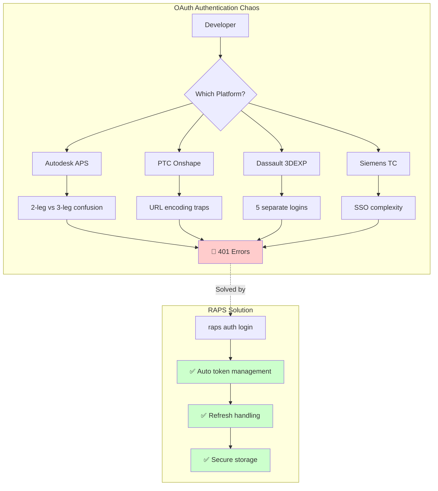

  

    <strong>Перевірено:</strong> Заяви щодо потоків автентифікації протестовані автоматизованими бенчмарками.
    <a href="https://github.com/dmytro-yemelianov/raps-examples/actions/workflows/run-benchmarks.yml" className="ml-2 underline">Переглянути останні результати</a>
  

## Кошмар реалізації OAuth, що охоплює кожну велику CAD-платформу

Якщо ви коли-небудь кидали клавіатуру після чергової помилки OAuth 401, ви не самотні. Наше дослідження Autodesk APS, PTC Onshape, Dassault 3DEXPERIENCE та Siemens Teamcenter показує, що складність автентифікації -- це скарга №1 серед розробників на всіх платформах.

### Зал ганьби автентифікації

**PTC Onshape: Пастка URL-кодування**
Розробники витрачають години на налагодження збоїв OAuth, спричинених символами `=` в кінці клієнтських секретів. Рішення? URL-кодувати все -- але спробуйте знайти це в документації.

*Реальна цитата розробника:* "The body of the form needs to contain the client ID, client secret, authorization_code... Each parameter needs to be URL encoded - especially important for the Client ID and secret since either or both may contain multiple trailing '=' characters."

**Dassault 3DEXPERIENCE: Інцепція логінів**
Уявіть, що потрібно автентифікуватися окремо для:
- Партнерської платформи
- Комерційної платформи
- Системи підтримки
- Вашого застосунку

Один розчарований розробник повідомив, що логінився **п'ять разів за одну годину** тільки щоб написати пост на форумі. Збої управління сесіями регулярно блокують SOLIDWORKS прямо під час роботи, а помилки автентифікації 3DPassport каскадом призводять до збоїв застосунку.

**Siemens Teamcenter: Корпоративна складність**
Налаштування SSO вимагає розуміння:
- Параметрів `tcsso.login_service.proxyURL`
- Зовнішніх провайдерів ідентифікації
- Менеджерів облікових даних
- Дискримінаторів
- Налаштування ендпоінтів
- Параметрів протоколу (HTTP/IIOP/REST)

Результат? Збої логіну `SoaRuntimeException` настільки поширені, що для них є окремий посібник з усунення неполадок.

### Чому це важливо для користувачів RAPS

Хоча Autodesk APS має власні проблеми автентифікації (плутанина 2-legged vs 3-legged, знайомо?), патерн очевидний: **кожна велика CAD-платформа страждає від складності автентифікації**.

Це підтверджує підхід RAPS, який забезпечує:
- Автоматичне управління токенами
- Вбудовану логіку оновлення
- Обробку конкурентних запитів
- Безпечне зберігання облікових даних
- Підтримку кількох потоків автентифікації

### Ринкова можливість

З больовими точками автентифікації, що впливають на **~70% ринку корпоративних CAD/PLM**, інструменти, які спрощують автентифікацію на різних платформах, мають величезний потенціал. RAPS наразі елегантно обробляє автентифікацію APS -- розширення підтримки Onshape OAuth, 3DEXPERIENCE 3DPassport та Teamcenter SSO захопить значну додаткову цінність.

### Ключові висновки

1. **Автентифікація зламана скрізь** -- не тільки в APS
2. **Документація рідко допомагає** -- критичні деталі закопані на форумах
3. **Корпоративний SSO додає складності** -- а не простоти
4. **Управління сесіями універсально погане** -- збої та блокування повсюдні
5. **CLI-інструменти можуть абстрагувати цей біль** -- RAPS доводить, що модель працює

### Ручний OAuth vs RAPS

| Крок | Ручний підхід | З RAPS |
|------|----------------|----------|
| Отримати токен | Base64-кодувати облікові дані, POST на /authentication/v2/token | `raps auth login` |
| Оновити токен | Реалізувати логіку оновлення, обробити конкурентні запити | Автоматично |
| Зберегти облікові дані | Створити безпечне сховище, обробити шифрування | Вбудований keychain |
| Перевірити статус | Декодувати JWT, розібрати термін дії | `raps auth status` |
| Кілька середовищ | Керувати окремими файлами облікових даних | `raps auth login --profile prod` |

### Що далі?

У нашій наступній статті ми зануримося в збої трансляції файлів -- ще одну універсальну катастрофу, де файли на 31 МБ перетворюються понад 30 хвилин без індикації прогресу, а деякі користувачі чекають **сім років** на виправлення помилок.

---

*Ця стаття є частиною нашої серії "Кросплатформні больові точки розробників", що підтверджує існування проблем, які RAPS вирішує для Autodesk APS, на всій екосистемі CAD/PLM.*
