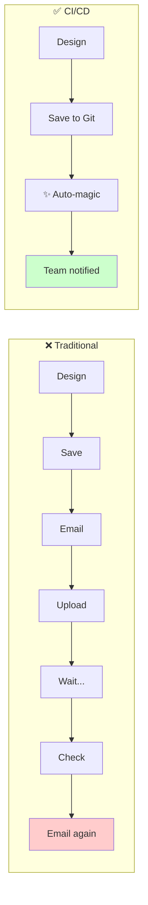
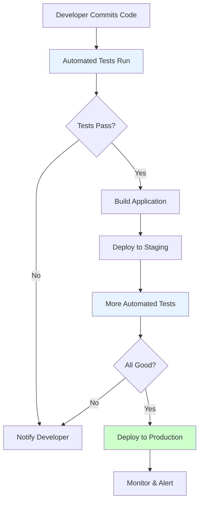
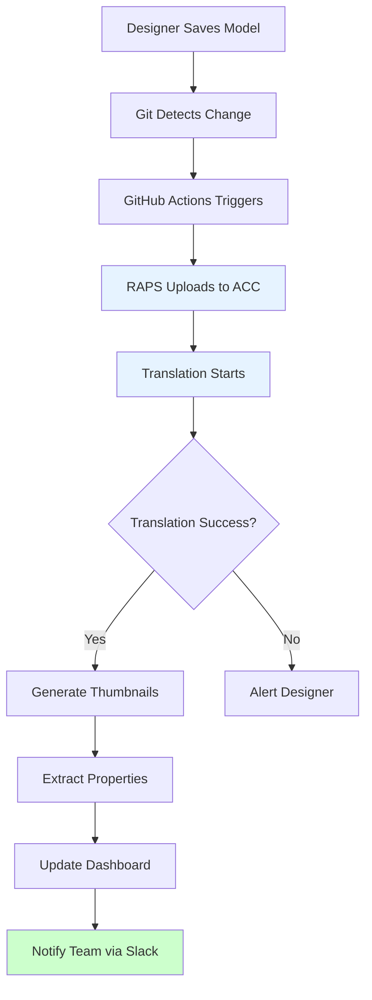

<div className="not-prose mb-6 p-4 bg-green-50 dark:bg-green-900/20 rounded-lg border border-green-200 dark:border-green-800">
  <p className="text-sm text-green-800 dark:text-green-200">
    <strong>Перевірено:</strong> Заяви щодо часу виконання пайплайнів безперервно тестуються автоматизованими бенчмарками.
    <a href="https://github.com/dmytro-yemelianov/raps-examples/actions/workflows/run-benchmarks.yml" className="ml-2 underline">Переглянути останні результати</a>
  </p>
</div>

## Що таке CI/CD і чому це важливо для AEC?

Якщо ви чули, як розробники говорять про "пайплайни" та "автоматизовані деплойменти" і відчували, що вони говорять іншою мовою, ви не самотні. CI/CD звучить технічно, але концепція напрочуд проста -- і неймовірно актуальна для AEC-процесів.



**CI/CD означає:**
- **Continuous Integration (CI):** Автоматичне тестування та валідація змін по мірі їх внесення
- **Continuous Deployment (CD):** Автоматичне переміщення перевіреної роботи туди, де вона потрібна

У програмному забезпеченні це означає, що код потрапляє з ноутбука розробника на продакшн-сервери автоматично. В AEC це означає, що моделі потрапляють з комп'ютера проєктувальника до BIM 360/ACC, транслюються та оповіщують команду -- автоматично.

## Таємна зброя софтверної індустрії

Софтверні компанії десятиліття тому зрозуміли, що ручні процеси створюють вузькі місця. Щоразу, коли людині потрібно:

- Пам'ятати щось зробити
- Клікати через вебінтерфейс
- Надіслати email-оповіщення
- Перевірити статус

...з'являється можливість для:
- Забування
- Помилок
- Затримок
- Перемикання контексту

Рішення? **Автоматизувати все, що можна автоматизувати.**

Ось як виглядає типовий CI/CD-пайплайн у розробці:



Кожен крок після початкового коміту відбувається автоматично. Розробник пушить код і йде. Якщо щось не вдається, він отримує оповіщення. Якщо все вдалося, код вже у продакшні.

## Переклад CI/CD на мову AEC

Тепер перенесемо це на AEC-процеси. Ось як може виглядати автоматизований BIM-пайплайн:



**Досвід проєктувальника:**
1. Зберегти модель
2. Все

Все інше відбувається у фоновому режимі. Команда отримує оповіщення, коли модель готова. Якщо щось не вдається, проєктувальник дізнається одразу, а не через кілька годин.

## Ключові концепції CI/CD для AEC

### 1. Тригери

Тригер -- це те, що запускає автоматизацію. У розробці це зазвичай коміт коду. В AEC це може бути:

- Збереження файлу у відстежувану папку
- Пуш до Git-репозиторію
- Запланований час (нічна обробка)
- Натискання кнопки вручну (для важливих релізів)

```yaml
# Example: Trigger on file changes
on:
  push:
    paths:
      - 'models/**/*.rvt'
      - 'models/**/*.dwg'
```

### 2. Джоби та кроки

Пайплайн складається з **джобів**, і кожен джоб містить **кроки**:

```yaml
jobs:
  process-model:
    steps:
      - name: Upload to APS
        run: raps object upload my-bucket model.rvt

      - name: Start Translation
        run: raps translate start $URN --wait

      - name: Notify Team
        run: slack-notify "Model ready for review"
```

### 3. Змінні середовища та секрети

Конфіденційна інформація (API-ключі, паролі) зберігається як **секрети**, а не в коді пайплайну:

```yaml
env:
  APS_CLIENT_ID: ${{ secrets.APS_CLIENT_ID }}
  APS_CLIENT_SECRET: ${{ secrets.APS_CLIENT_SECRET }}
```

Це означає, що ви можете поділитися конфігурацією пайплайну, не розкриваючи облікові дані.

### 4. Артефакти

Артефакти -- це результати вашого пайплайну, те, що ви хочете зберегти:

- Трансльовані файли моделей
- Згенеровані мініатюри
- Звіти з вилученими властивостями
- Результати QA/QC

```yaml
- name: Save Artifacts
  uses: actions/upload-artifact@v4
  with:
    name: model-outputs
    path: |
      outputs/thumbnail.png
      outputs/properties.json
```

## Ваш перший AEC-пайплайн

Створимо простий пайплайн, який:
1. Визначає зміни моделі Revit
2. Завантажує її до APS
3. Транслює у SVF2
4. Оповіщує команду

### Передумови

- GitHub-репозиторій для моделей
- Обліковий запис Autodesk Platform Services
- Встановлений RAPS CLI

### Пайплайн

Створіть `.github/workflows/model-pipeline.yml`:

```yaml
name: Model Processing Pipeline

on:
  push:
    paths:
      - 'models/**/*.rvt'

jobs:
  process:
    runs-on: ubuntu-latest

    steps:
      # 1. Get the code
      - name: Checkout
        uses: actions/checkout@v4

      # 2. Install RAPS
      - name: Install RAPS CLI
        run: |
          curl -fsSL https://rapscli.xyz/install.sh | sh
          echo "$HOME/.cargo/bin" >> $GITHUB_PATH

      # 3. Authenticate
      - name: Login to APS
        env:
          APS_CLIENT_ID: ${{ secrets.APS_CLIENT_ID }}
          APS_CLIENT_SECRET: ${{ secrets.APS_CLIENT_SECRET }}
        run: raps auth login

      # 4. Process changed models
      - name: Process Models
        run: |
          # Find changed .rvt files
          for model in $(git diff --name-only HEAD~1 HEAD | grep '\.rvt$'); do
            echo "📦 Processing $model..."

            # Upload
            raps object upload project-bucket "$model"

            # Get URN
            URN=$(raps object urn project-bucket "$model")

            # Translate and wait
            raps translate start $URN --format svf2 --wait

            echo "✅ $model processed successfully"
          done

      # 5. Notify team
      - name: Notify Slack
        if: success()
        run: |
          curl -X POST ${{ secrets.SLACK_WEBHOOK }} \
            -H 'Content-Type: application/json' \
            -d '{"text": "🏗️ Model pipeline completed successfully!"}'
```

### Налаштування секретів

У вашому GitHub-репозиторії:
1. Перейдіть до Settings → Secrets and variables → Actions
2. Додайте ці секрети:
   - `APS_CLIENT_ID` -- Ваш Autodesk app client ID
   - `APS_CLIENT_SECRET` -- Ваш Autodesk app client secret
   - `SLACK_WEBHOOK` -- Ваш Slack webhook URL (необов'язково)

## Типові патерни пайплайнів для AEC

### Патерн 1: Нічна обробка

Обробка всіх моделей щоночі:

```yaml
on:
  schedule:
    - cron: '0 2 * * *'  # 2 AM every day
```

### Патерн 2: Ручне затвердження

Вимога затвердження перед обробкою:

```yaml
jobs:
  approve:
    runs-on: ubuntu-latest
    environment: production  # Requires approval in GitHub settings
    steps:
      - run: echo "Approved for processing"

  process:
    needs: approve
    # ... processing steps
```

### Патерн 3: Кілька середовищ

Різні пайплайни для різних цілей:

```yaml
jobs:
  process:
    runs-on: ubuntu-latest
    steps:
      - name: Set Environment
        run: |
          if [[ "${{ github.ref }}" == "refs/heads/main" ]]; then
            echo "ENV=production" >> $GITHUB_ENV
            echo "BUCKET=prod-models" >> $GITHUB_ENV
          else
            echo "ENV=staging" >> $GITHUB_ENV
            echo "BUCKET=staging-models" >> $GITHUB_ENV
          fi
```

### Патерн 4: Якісні ворота

Зупинка обробки при невдалій валідації:

```yaml
- name: Validate Model
  run: |
    # Check file size
    SIZE=$(stat -f%z "$MODEL_PATH")
    if [ $SIZE -gt 500000000 ]; then
      echo "❌ Model exceeds 500MB limit"
      exit 1
    fi

    # Check for required parameters
    raps model metadata extract $URN --check-required
```

## Моніторинг та налагодження

### Перегляд запусків пайплайну

У GitHub:
1. Перейдіть до вашого репозиторію
2. Натисніть на вкладку "Actions"
3. Побачите всі запуски пайплайну зі статусом

### Налагодження збоїв

Коли щось не вдається:
1. Натисніть на невдалий запуск
2. Розгорніть невдалий крок
3. Прочитайте повідомлення про помилку
4. Виправте та запушьте знову

### Додавання оповіщень

Отримуйте оповіщення при збоях:

```yaml
- name: Notify on Failure
  if: failure()
  run: |
    curl -X POST ${{ secrets.SLACK_WEBHOOK }} \
      -H 'Content-Type: application/json' \
      -d '{"text": "❌ Pipeline failed! Check GitHub Actions for details."}'
```

## ROI від CI/CD для AEC

Порахуємо:

| Активність | Ручний час | Автоматизований час | Тижнева економія |
|----------|-------------|----------------|----------------|
| Завантаження моделей | 10 хв × 5/день | 0 хв | 4,2 години |
| Перевірка статусу трансляції | 15 хв × 5/день | 0 хв | 6,25 годин |
| Оповіщення команди | 5 хв × 5/день | 0 хв | 2 години |
| Виправлення забутих завантажень | 30 хв × 2/тиждень | 0 хв | 1 година |
| **Загалом** | | | **13,45 годин/тиждень** |

При ставці $75/годину це **$52 000/рік** на одного члена команди у відновленій продуктивності.

## Наступні кроки

1. **Почніть з малого:** Автоматизуйте один болючий процес
2. **Вимірюйте:** Відстежуйте зекономлений час
3. **Ітеруйте:** Додавайте більше автоматизації по мірі набуття впевненості
4. **Діліться:** Навчайте свою команду

Інструменти існують. Патерни перевірені. Питання в тому: коли ви почнете?

---

*Це друга стаття серії "DevOps for Design". [← Попередня: The Manual Tax](/blog/manual-tax) | [Наступна: Zero-Click Releases →](/blog/zero-click-releases-github-actions)*

*Готові автоматизувати свої APS-процеси? [Почніть з RAPS](/docs/quickstart) або [зв'яжіться зі мною в LinkedIn](https://www.linkedin.com/in/dmytro-yemelianov/).*
