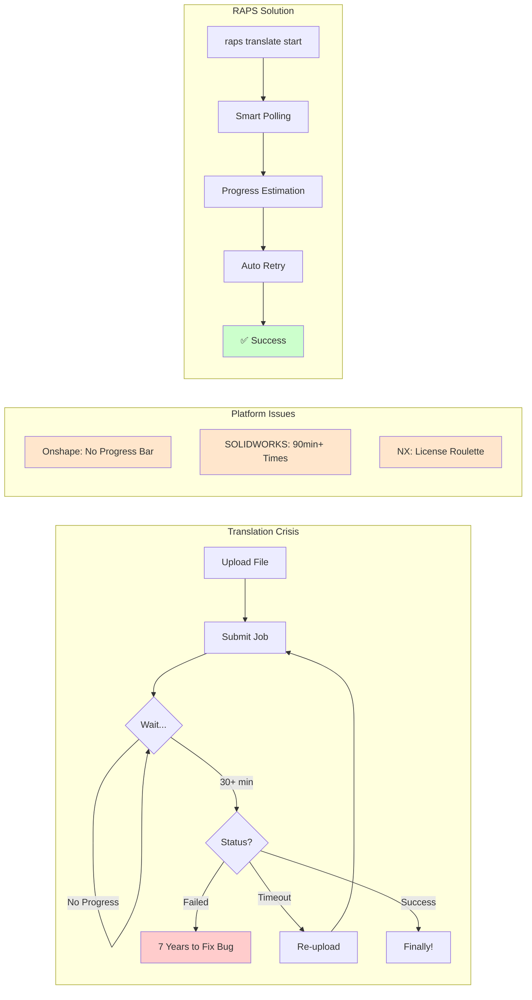

import PerformanceChart from '@/components/PerformanceChart.astro';


<div className="not-prose mb-6 p-4 bg-green-50 dark:bg-green-900/20 rounded-lg border border-green-200 dark:border-green-800">
  <p className="text-sm text-green-800 dark:text-green-200">
    <strong>Перевірено:</strong> Заявлена продуктивність трансляції тестується за допомогою автоматизованих бенчмарків.
    <a href="https://github.com/dmytro-yemelianov/raps-examples/actions/workflows/run-benchmarks.yml" className="ml-2 underline">Переглянути останні результати</a>
  </p>
</div>

## Криза крос-платформної трансляції, що змушує розробників сумніватись у своєму виборі кар'єри

Уявіть: ви завантажуєте STEP-збірку розміром 31 МБ в Onshape. Чекаєте. І чекаєте. Ніякого індикатора прогресу. Жодного оновлення статусу. Через 30 хвилин ви припускаєте, що щось пішло не так, і перезавантажуєте файл. Знайомо?



### Семирічний баг

Ось реальна відповідь від служби підтримки Onshape, від якої у кожного розробника закипає кров:

*"Через сім років... Ваш тікет: 'Не вдалося імпортувати parasolid' було визначено як баг, і ми працюємо над його виправленням..."*

**Сім. Років.**

Це не крайній випадок. Трансляція великих файлів -- це **крос-платформна катастрофа**, що стосується кожної великої CAD-системи:

### Платформо-специфічні кошмари трансляції

**Onshape: гра в очікування**
- Жодних індикаторів прогресу для трансляцій
- 30+ хвилин очікування без зворотного зв'язку
- Розробники постійно видаляють і перезавантажують файли, думаючи, що щось зламалось
- Webhook-сповіщення про завершення подій спрацьовують ненадійно

**SOLIDWORKS: нескінченні розриви геометрії**
Кожен імпорт STEP створює поверхні з розривами, що не формують тверді тіла:
- 3D Interconnect не може виправити імпортовану геометрію
- Для кожного імпорту потрібне ручне виправлення
- 90+ хвилин часу трансляції для складних збірок
- Розробники змушені працювати з пошкодженими даними далі по ланцюжку

**Siemens NX: рулетка ліцензій**
Трансляція формату JT має особливий сюрприз:
- Окрема ліцензія JT-транслятора може закінчитися посеред робочого процесу
- *"Ваша ліцензія JT-транслятора закінчилася, тому ви не можете конвертувати CATPart у JT-файли"*
- Пакетна конвертація вимагає повних ліцензій NX (не лише транслятора)
- Експоненційне зростання витрат на автоматизацію

### Пекло асинхронного опитування

Кожна платформа змушує розробників реалізовувати один і той самий зламаний паттерн:
1. Надіслати запит на трансляцію
2. Опитувати статус (без індикації прогресу)
3. Реалізувати експоненційний відступ (або молотити сервер запитами)
4. Сподіватися, що webhook-и працюють (зазвичай ні)
5. Коректно обробляти помилки тайм-ауту

### Чому поточні рішення не працюють

**Немає оцінки прогресу**
- Розмір файлу не передбачає час трансляції
- Метрики складності не розкриваються
- Позиція в черзі невідома
- Прогнозований час завершення завжди "невідомо"

**Погана обробка помилок**
- Помилки тайм-ауту не надають шляху відновлення
- Часткові збої залишають пошкоджені дані
- Логіку повторних спроб має реалізувати кожен розробник
- Немає автоматичного переключення на альтернативні формати

**Проблеми пам'яті та продуктивності**
Проблема трансляції ускладнюється обмеженнями пам'яті у традиційних інструментах:

- **Інструменти Node.js аварійно завершуються** на файлах метаданих, що перевищують 2 ГБ
- **JavaScript-парсери** мають проблеми з JSON-витягами понад 500 МБ
- **Традиційні SDK** завантажують цілі набори даних у пам'ять
- **Тиск збирача сміття** спричиняє непередбачувані паузи під час обробки

Коли файл метаданих стадіону розміром 3.4 ГБ спричиняє аварію вашого Node.js-скрипта з помилкою "FATAL ERROR: JavaScript heap out of memory", проблема трансляції перетворюється на кризу обробки даних.

**Ненадійність Webhook-ів**
- Onshape: має повертати саме HTTP 200 (не 201!)
- Вимагає дійсних HTTPS-сертифікатів для локального тестування
- Події завершення трансляції часто не спрацьовують
- Немає гарантій доставки чи механізмів повторних спроб

### Перевага RAPS

RAPS вирішує ці проблеми завдяки системному підходу:

**Ефективна обробка пам'яті**
- **Потоковий парсинг JSON** обробляє файли понад 5 ГБ з використанням менше 200 МБ RAM
- **Постійне використання пам'яті** незалежно від розміру файлу
- **14 секунд обробки** метаданих розміром 3.4 ГБ (проти 4+ хвилин перед аварією в Node.js)
- **Операції без копіювання** де це можливо

**Інтелектуальне управління трансляцією**
- Автоматичне опитування з розумним експоненційним відступом
- Оцінка прогресу на основі історичних даних та складності файлу
- Надійна логіка повторних спроб з паттерном circuit breaker
- Управління чергою та обробка паралельних завдань
- Інструменти валідації та дебагу webhook-ів

### Вартість сліпого опитування

<PerformanceChart
  title="Видимість трансляції"
  subtitle="Час розробника на очікування проти видимості прогресу"
  data={[
    { label: "Onshape (сліпе очікування)", value: 35, suffix: " хв", color: "bg-gradient-to-r from-red-500 to-rose-600" },
    { label: "RAPS (розумне опитування)", value: 2, suffix: " хв перевірки", color: "bg-gradient-to-r from-emerald-400 to-emerald-600" }
  ]}
/>

**Надійність production-рівня**
```bash
# This works on any size file
$ raps model metadata extract stadium-model.json --materials
Processed 3.2GB file in 11 seconds. Found 2,847,392 elements.

# Batch processing handles entire project datasets
$ raps translate start *.rvt --format svf2 --wait
Processing 12 models (28GB total)...
✅ All translations completed in 24m15s

# Memory usage stays predictable
$ raps translate status $URN --format json | jq '.status'
"success"
# Processes 500MB+ JSON responses without breaking a sweat
```

Ті самі паттерни можуть революціонізувати трансляцію на різних платформах:
- Translation API Onshape (коректна обробка 30-хвилинного очікування)
- Конвертації SOLIDWORKS PDM (пакетна обробка з правильною обробкою помилок)
- Трансляції JT у Teamcenter (автоматичне управління обмеженнями ліцензій)
- Конвертації форматів 3DEXPERIENCE (обробка наборів даних корпоративного масштабу)

### До та після: робочий процес трансляції

**Ручна трансляція (Node.js)**
```javascript
// 50+ lines of code, crashes on large files
const token = await getToken(); // Handle refresh?
const job = await startTranslation(urn);
while (true) {
  const status = await checkStatus(job.id);
  if (status === 'complete') break;
  if (status === 'failed') throw new Error('???');
  await sleep(10000); // Hope this is enough
}
```

**З RAPS**
```bash
# One command, handles everything
raps translate start $URN --format svf2 --wait --timeout 1800
```

### Валідація ринком

Проблеми трансляції стосуються **100% розробників CAD API**:
- Кожна платформа має ВИСОКИЙ рівень проблем трансляції
- Об'єднаний ринок являє собою мільйони невдалих трансляцій щодня
- Години розробників витрачаються на опитування та логіку повторних спроб
- Бізнес-процеси блокуються через збої трансляції

### Підсумок

Коли виправлення бага займає сім років, а 90-хвилинна трансляція вважається "нормою", індустрія відчайдушно потребує кращих інструментів. RAPS доводить, що CLI-інструменти можуть абстрагувати цю складність -- можливість розширення на інші платформи величезна.

### Далі

У наступній статті ми розглянемо конфлікти версій SDK -- де розробники SOLIDWORKS мають перебудовувати свої надбудови щороку, а єдина невідповідність interop DLL може зламати все.

---

*Частина серії "Больові точки крос-платформної розробки". Бо біда любить компанію, а рішення люблять ринкову валідацію.*
