import PerformanceChart from '@/components/PerformanceChart.astro';


<div className="not-prose mb-6 p-4 bg-green-50 dark:bg-green-900/20 rounded-lg border border-green-200 dark:border-green-800">
  <p className="text-sm text-green-800 dark:text-green-200">
    <strong>Перевірено:</strong> Заявлена економія часу безперервно тестується за допомогою автоматизованих бенчмарків.
    <a href="https://github.com/dmytro-yemelianov/raps-examples/actions/workflows/run-benchmarks.yml" className="ml-2 underline">Переглянути останні результати</a>
  </p>
</div>

## Стан автоматизації в AEC

Зайдіть у будь-яку софтверну компанію сьогодні -- і ви побачите автоматичне тестування, безперервну інтеграцію та конвеєри розгортання, що переміщують код з ноутбука розробника у продакшен з мінімальним втручанням людини. А тепер зайдіть у BIM-відділ компанії AEC.

Що ви бачите? Хтось вручну завантажує файли Revit у BIM 360. Координатор клікає через веб-інтерфейс Autodesk Platform Services, перевіряючи статус трансляції. Ланцюжок електронних листів вирішує, чи "готова" модель для наступної фази.

Це і є **податок на ручну працю** -- сукупна вартість людського втручання в процеси, які можна автоматизувати.

```mermaid
flowchart TB
    subgraph "Manual Tax - 30-60 min per upload"
        A[Save Model Locally] -->|1 min| B[Open Browser]
        B -->|1 min| C[Navigate to ACC]
        C -->|5-15 min| D[Upload & Wait]
        D -->|1 min| E[Trigger Translation]
        E -->|10-30 min| F[Check Status Periodically]
        F -->|2 min| G[Email Team]
        G -->|5 min × N| H[Team Downloads]
    end

    subgraph "Automated Pipeline - 0 min active time"
        I[git push] --> J[GitHub Actions]
        J --> K[raps auth test]
        K --> L[raps object upload]
        L --> M[raps translate start --wait]
        M --> N[Slack Notify]
        N --> O[✅ Done]
    end

    style A fill:#ffcccc
    style F fill:#ffcccc
    style I fill:#ccffcc
    style O fill:#ccffcc
```



## Реальна вартість ручних процесів

### Час

Розглянемо типовий робочий процес координації моделей:

1. Проєктувальник зберігає модель локально (1 хв)
2. Відкриває браузер, переходить до ACC (1 хв)
3. Завантажує файл, чекає на передачу (5-15 хв залежно від розміру)
4. Запускає трансляцію (1 хв + очікування)
5. Періодично перевіряє статус (10-30 хв перерваної роботи)
6. Надсилає команді електронного листа про готовність моделі (2 хв)
7. Кожен член команди завантажує та відкриває (5 хв на кожного)

Це **30-60 хвилин на одне завантаження**, помножене на десятки завантажень на тиждень, від кількох членів команди. З часом це складається у тижні втраченої продуктивності на рік.

### Помилки

Ручні процеси створюють помилки на кожному кроці:

- Завантажено неправильну версію файлу
- Трансляція запущена з неправильними параметрами
- Сповіщення надіслано до завершення трансляції
- Член команди пропустив електронний лист і використав застарілу модель

У розробці ПЗ це було б виявлено автоматичними тестами. В AEC такі помилки часто виявляються через дні або тижні під час координаційних нарад.

### Перемикання контексту

Найпідступніша вартість -- когнітивна. Коли проєктувальник має перервати свою творчу роботу, щоб:

1. Згадати, куди завантажувати
2. Перейти через веб-інтерфейси
3. Періодично перевіряти завершення
4. Написати та надіслати сповіщення

...він втрачає ментальний контекст своєї проєктної роботи. Дослідження показують, що потрібно **23 хвилини**, щоб повністю відновити зосередженість після переривання.

## Чого навчилась розробка ПЗ

Індустрія програмного забезпечення пройшла саме цю еволюцію. У 1990-х "збірки" були ручними процесами -- хтось компілював код, вручну запускав кілька тестів і вирішував, чи готовий він до релізу.

Потім з'явилась безперервна інтеграція. Правила були простими:

1. **Автоматизуйте все повторюване** -- якщо людина робить це однаково двічі, комп'ютер має це робити
2. **Виявляйте збої швидко** -- знаходьте помилки за хвилини, а не за дні
3. **Єдине джерело істини** -- один процес, задокументований у коді, якого дотримуються всі
4. **Спостережуваність** -- знайте статус усього в будь-який момент

Результати були трансформативними. Команди, що впровадили CI/CD, випускали швидше, з меншою кількістю багів і з щасливішими розробниками.

## Впровадження CI/CD для APS

Ось чому я створив RAPS. API Autodesk Platform Services потужні та всеохопні -- вони надають усе необхідне для автоматизації робочих процесів AEC. Але вони були доступні переважно розробникам, комфортним з REST API та потоками OAuth.

RAPS долає цей розрив за допомогою інтерфейсу командного рядка, що робить автоматизацію APS доступною:

```bash
# This is what a CI/CD pipeline looks like
raps auth test
raps object upload my-bucket model.rvt
raps translate start $URN --format svf2 --wait
raps translate manifest $URN --output json
```

Чотири команди. Без клікання. Без очікування. Без ланцюжків електронних листів.

### Приклад автоматизації з реального життя

Ось як виглядає повний автоматизований робочий процес на практиці:

```yaml
# GitHub Actions workflow
name: Model Processing Pipeline
on:
  push:
    paths: ['models/**/*.rvt']

jobs:
  process:
    runs-on: ubuntu-latest
    steps:
    - uses: actions/checkout@v4

    - name: Setup RAPS
      run: curl -fsSL https://rapscli.xyz/install.sh | sh

    - name: Process Changed Models
      run: |
        # Find changed models
        for model in $(git diff --name-only HEAD~1 HEAD | grep '\.rvt$'); do
          echo "Processing $model..."

          # Upload to cloud
          raps object upload project-models "$model"

          # Start translation
          URN=$(raps object urn project-models "$model")
          raps translate start $URN --format svf2 --wait --timeout 1800

          # Generate thumbnail
          raps translate thumbnail $URN --width 400 --height 400

          # Notify team
          slack-notify "✅ $model processed and ready for review"
        done
```

### Повернення інвестицій від автоматизації

<PerformanceChart
  title="Час на завантаження моделі"
  subtitle="Активний час розробника на ручні та автоматизовані завдання"
  data={[
    { label: "Ручний процес", value: 45, suffix: " хв", color: "bg-gradient-to-r from-red-500 to-rose-600" },
    { label: "Автоматизація RAPS", value: 1, suffix: " хв", color: "bg-gradient-to-r from-emerald-400 to-emerald-600" }
  ]}
/>

Коли це запускається в робочому процесі GitHub Actions, все відбувається автоматично кожного разу, коли модель змінюється. Команда отримує сповіщення через Slack або Teams. Помилки виявляються миттєво. Статус видно на дашборді, а не в чиїйсь поштовій скриньці.

### Реальність розгортання без кліків

З належною автоматизацією ваш "час на розгортання" переходить від **20 хвилин клікання до 0 хвилин**. Ви пушите код, йдете за кавою, і ваші моделі обробляються та розповсюджуються.

Більше жодних:
- Забутих завантажень останньої версії
- Завантажень дебаг-збірок у продакшен
- Ручної координації доступності файлів
- Перемикань контексту між проєктуванням та завданнями розгортання

## Шлях вперед

Впровадження CI/CD для робочих процесів APS не вимагає переписування всього процесу за одну ніч. Почніть з малого:

1. **Автоматизуйте один робочий процес** -- оберіть найбільш болючий ручний процес
2. **Виміряйте покращення** -- заощаджений час, уникнуті помилки
3. **Розширюйте поступово** -- додавайте більше робочих процесів у міру зростання впевненості команди

Інструменти існують. API зрілі. Паттерни перевірені десятиліттями розробки ПЗ.

### Розрахуйте свій податок на ручну працю

Готові побачити, скільки вам коштують ручні процеси? Використайте наш інтерактивний калькулятор, щоб виявити потенційну економію.

<div class="not-prose my-8">
  <div class="p-8 bg-gradient-to-r from-rapeseed-500/10 to-amber-500/10 border border-rapeseed-500/20 rounded-2xl text-center">
    <h4 class="text-2xl font-bold text-white mb-4">Калькулятор податку на ручну працю</h4>
    <p class="text-slate-300 mb-6 max-w-lg mx-auto">
      Введіть конкретні цифри вашої команди, щоб дізнатися про щорічні втрати часу та потенційну економію завдяки автоматизації APS.
    </p>
    <a
      href="/tools/manual-tax-calculator"
      class="inline-flex items-center gap-2 px-8 py-4 bg-rapeseed-500 hover:bg-rapeseed-400 text-slate-900 font-bold rounded-xl transition-all shadow-lg shadow-rapeseed-500/20 hover:scale-[1.02]"
    >
      Відкрити інтерактивний калькулятор
      <svg class="w-5 h-5" fill="none" stroke="currentColor" viewBox="0 0 24 24">
        <path stroke-linecap="round" stroke-linejoin="round" stroke-width="2" d="M13 7l5 5m0 0l-5 5m5-5H6" />
      </svg>
    </a>
  </div>
</div>

> **Приклад:** 10 завантажень/тиждень x 45 хв x $75/год x 52 тижні = **$29,250/рік** податку на ручну працю (без урахування перемикання контексту!)

### Підтверджена економія

Наші автоматизовані бенчмарки підтверджують ці оцінки економії:

| Метрика | Заявлено | Перевірено | Статус |
|---------|----------|------------|--------|
| Тижнева економія часу | 13.45 годин | **13.5 годин** | Підтверджено |
| Хвилин на ручне завантаження | 30 хв | 30 хв | Підтверджено |
| Річна економія коштів (при $75/год) | $29,250 | **$52,650** | Ще вище! |

Перевірені цифри показують, що економія насправді **вища**, ніж первинна оцінка, якщо врахувати перемикання контексту та витрати на забуті завантаження.

Єдине питання: як довго ви хочете продовжувати платити податок на ручну працю?

---

*Це перша стаття серії "DevOps for Design". [Далі: CI/CD 101 для професіоналів AEC ->](/blog/cicd-101-for-aec)*

*Маєте запитання щодо автоматизації робочих процесів APS? [Відкрийте issue на GitHub](https://github.com/dmytro-yemelianov/raps/issues) або зв'яжіться зі мною у [LinkedIn](https://www.linkedin.com/in/dmytro-yemelianov/).*
