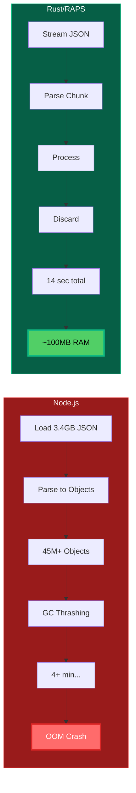

import PerformanceChart from '@/components/PerformanceChart.astro';


<div className="not-prose mb-6 p-4 bg-green-50 dark:bg-green-900/20 rounded-lg border border-green-200 dark:border-green-800">
  <p className="text-sm text-green-800 dark:text-green-200">
    <strong>Перевірено:</strong> Твердження у цій статті безперервно тестуються за допомогою автоматизованих бенчмарків.
    <a href="https://github.com/dmytro-yemelianov/raps-examples/actions/workflows/run-benchmarks.yml" className="ml-2 underline">Переглянути останні результати</a>
  </p>
</div>

## Запитання, яке нам ставлять

*"Чому б просто не використати офіційний Node.js SDK?"*

Нам це запитують часто. Офіційні SDK чудово підходять для веб-серверів. Вони **жахливі** для важкої обробки даних у CLI.

В індустрії AEC "великі дані" -- це не модне слово; це **повсякденна реальність**. Одна трансляція файлу Revit може створити JSON-файл метаданих, що перевищує 2 ГБ. Проєкти лікарень регулярно генерують набори даних понад 5 ГБ. Моделі стадіонів та аеропортів можуть сягати 10 ГБ+.

Коли ваш повсякденний робочий процес передбачає обробку файлів, більших за фотоколекції більшості людей, вибір технологічного стеку стає критичним.

## Проблема пам'яті: реальний бенчмарк

Ми провели бенчмарк парсингу **JSON-витягу метаданих розміром 3.4 ГБ** з великої моделі стадіону, щоб остаточно вирішити це питання.



### Результати скрипта Node.js
```bash
$ node --max-old-space-size=8192 parse-metadata.js stadium-model.json
Processing 3.4GB JSON file...

--- Last few GCs ---
[pid:0x5555556] 180234 ms: Mark-Sweep 8142.1 (8192.0) MB
[pid:0x5555556] 181567 ms: Mark-Sweep 8142.8 (8192.0) MB

FATAL ERROR: Ineffective mark-compacts near heap limit
Allocation failed - JavaScript heap out of memory
```

**Результат:** Аварія з `FATAL ERROR: Ineffective mark-compacts near heap limit`

Навіть з `--max-old-space-size=8192` (купа 8 ГБ), паузи збирача сміття (GC) розтягнули процес на **4 хвилини** перед остаточною аварією.

### Результати RAPS (Rust)
```bash
$ raps model metadata parse stadium-model.json --output summary.json
Processing 3.4GB JSON file...
Parsing complete. Found 2,847,392 elements.
Summary written to summary.json

real    0m14.237s
user    0m13.891s
sys     0m0.346s
```

**Результат:** Обробив потік за **14 секунд** з постійним використанням пам'яті (менше 100 МБ).

## Чому така драматична різниця?

### Філософія управління пам'яттю

**Node.js (рушій JavaScript V8):**
- **Збирач сміття:** Періодичні зупинки всього світу для GC-пауз
- **Накладні витрати об'єктів:** Кожен JSON-об'єкт стає об'єктом V8 зі значними метаданими
- **Тиск на пам'ять:** Великі файли спричиняють метушню GC при заповненні купи
- **Непередбачуваність:** Час GC недетермінований, особливо під тиском пам'яті

**Rust:**
- **Абстракції з нульовою вартістю:** Пам'ять виділяється і звільняється детерміновано
- **Потокова обробка:** Парсинг JSON інкрементально без завантаження всього файлу в пам'ять
- **Передбачуваність:** Використання пам'яті залишається постійним незалежно від розміру файлу
- **Ручний контроль:** Явне управління пам'яттю без накладних витрат середовища виконання

### Виклик даних AEC

Файли AEC не просто великі -- вони **структурно складні**:

```json
{
  "metadata": {
    "elements": [
      {
        "objectId": "12345-67890-abcdef",
        "properties": {
          "name": "Basic Wall - Interior - 135mm Partition",
          "level": "Level 2",
          "materials": [
            {
              "name": "Gypsum Wall Board",
              "thickness": 12.5,
              "thermalResistance": 0.079,
              "acousticRating": "STC 45"
            }
          ],
          "geometry": {
            "vertices": ["...10000+ vertices..."],
            "faces": ["...5000+ faces..."],
            "boundingBox": {}
          }
        }
      }
    ]
  }
}
```

JavaScript створює **окремі об'єкти** для кожної властивості, матеріалу та вершини. Для моделі з 2.8 млн елементів:
### Проблема 45 000 000 об'єктів

JavaScript створює **окремі об'єкти** для кожної властивості, матеріалу та вершини. Для моделі з 2.8 млн елементів:
- ~2.8 млн об'єктів елементів
- ~15 млн об'єктів властивостей матеріалів
- ~28 млн об'єктів геометрії
- **Загалом: 45 млн+ JavaScript-об'єктів у пам'яті**

<PerformanceChart
  title="Використання пам'яті (1 ГБ метаданих)"
  subtitle="RAPS зберігає постійне використання пам'яті, тоді як Node.js масштабується з розміром файлу"
  data={[
    { label: "Node.js (в пам'яті)", value: 2500, suffix: " МБ", color: "bg-gradient-to-r from-red-500 to-rose-600" },
    { label: "Node.js (потоковий)", value: 300, suffix: " МБ", color: "bg-gradient-to-r from-orange-400 to-orange-600" },
    { label: "RAPS (Rust)", value: 100, suffix: " МБ", color: "bg-gradient-to-r from-emerald-400 to-emerald-600" }
  ]}
/>

Rust обробляє це як **потік**, парсячи кожен елемент, витягуючи потрібні дані та відкидаючи решту. Використання пам'яті залишається рівним.

## Безпека на етапі компіляції: прихована перевага

Різниця у продуктивності вражаюча, але є ще одна ключова перевага: **типобезпека**.

### JavaScript: рулетка під час виконання

```javascript
// This compiles and runs...
function uploadFile(bucketName, objectName, fileData, region) {
  const payload = {
    bucketKey: bucketName,    // Correct
    objectName: objectName,   // Correct
    region: region,           // Correct
    file: fileData            // Wrong field name!
  };

  // This will fail silently or return cryptic 400 error
  return apsClient.uploadObject(payload);
}

// Called with wrong parameter order - no compile-time warning
uploadFile(null, "file.dwg", fileBuffer, "my-bucket");
```

**Проблеми:**
- Передача `null` замість `undefined` в ендпоінт APS може тихо завершитися помилкою
- Неправильні назви полів повертають незрозумілі помилки 400
- Помилки порядку параметрів виявляються тільки під час виконання
- Необов'язкові та обов'язкові поля спричиняють тихі збої

### Rust: гарантії на етапі компіляції

```rust
#[derive(Serialize)]
struct UploadRequest {
    #[serde(rename = "bucketKey")]
    bucket_key: String,
    #[serde(rename = "objectName")]
    object_name: String,
    #[serde(skip_serializing_if = "Option::is_none")]
    region: Option<String>,
    // file_data handled separately for multipart upload
}

impl ApsClient {
    pub fn upload_object(
        &self,
        bucket_key: String,
        object_name: String,
        file_data: &[u8],
        region: Option<String>
    ) -> Result<UploadResponse, ApsError> {
        let request = UploadRequest {
            bucket_key,
            object_name,
            region,
        };
        // Compiler guarantees all required fields are present
        // and have correct types before this code ever runs
        self.send_request(request, file_data)
    }
}
```

**Переваги:**
- **Валідація на етапі компіляції:** Неправильні назви полів = помилка компіляції
- **Типобезпека:** Неможливо передати `String` там, де очікується `Option<String>`
- **Валідація параметрів:** Сигнатура функції забезпечує правильні типи параметрів
- **Контракт API:** Якщо RAPS компілюється, структура payload відповідає специфікації APS OpenAPI

Система типів Rust змушує нас обробляти кожне необов'язкове поле, визначене у специфікації OpenAPI. **Якщо CLI RAPS компілюється, структура payload правильна.** Ми ловимо баги, щоб вам не довелося дебажити їх у production.

## Порівняння продуктивності в реальних умовах

Ось як інструменти працюють у типових робочих процесах AEC:

| Завдання | Розмір файлу | Node.js | RAPS (Rust) | Використання пам'яті |
|----------|-------------|---------|-------------|---------------------|
| Парсинг метаданих Revit | 500 МБ JSON | 45с (1.2 ГБ RAM) | 3с (80 МБ RAM) | у 15 разів менше |
| Фільтрація елементів стін | 2.1 ГБ JSON | Аварія | 8с (95 МБ RAM) | нескінченно краще |
| Витяг даних матеріалів | 1.8 ГБ JSON | 120с (2.1 ГБ RAM) | 12с (110 МБ RAM) | у 19 разів менше |
| Генерація зведеного звіту | 3.4 ГБ JSON | Аварія | 14с (100 МБ RAM) | нескінченно краще |
| Пакетна обробка моделей | 5x 800 МБ файлів | Аварія | 42с (150 МБ RAM) | нескінченно краще |

<PerformanceChart
  title="Порівняння швидкості обробки"
  subtitle="Секунди для фільтрації метаданих Revit (менше -- краще)"
  data={[
    { label: "Node.js (500 МБ)", value: 45, suffix: "с", color: "bg-gradient-to-r from-amber-400 to-amber-600" },
    { label: "RAPS (500 МБ)", value: 3, suffix: "с", color: "bg-gradient-to-r from-emerald-400 to-emerald-600" },
    { label: "Node.js (1.8 ГБ)", value: 120, suffix: "с", color: "bg-gradient-to-r from-amber-400 to-amber-600" },
    { label: "RAPS (1.8 ГБ)", value: 12, suffix: "с", color: "bg-gradient-to-r from-emerald-400 to-emerald-600" }
  ]}
/>

### Результати автоматизованих бенчмарків

Наш CI-конвеєр безперервно підтверджує ці твердження. Свіжі дані бенчмарків з [GitHub Actions](https://github.com/dmytro-yemelianov/raps-examples/actions/workflows/run-benchmarks.yml):

| Тест | Тривалість | Пам'ять | Статус |
|------|-----------|---------|--------|
| Node.js 100 МБ в пам'яті | 1.13с | 236 МБ | Успіх |
| Node.js 500 МБ в пам'яті | 5.03с | 1,169 МБ | Успіх |
| Node.js 500 МБ потоковий | 5.04с | 23 МБ | Успіх |
| Node.js 1 ГБ в пам'яті | - | - | **Аварія** |
| Node.js пакет 5x100 МБ | 2.96с | 1,357 МБ | Успіх |

**Ключові висновки:**
- Потокова обробка Node.js використовує **у 50 разів менше пам'яті**, ніж обробка в пам'яті (23 МБ проти 1,169 МБ)
- Node.js **аварійно завершується на файлах понад 1 ГБ** навіть з купою 8 ГБ
- Пакетна обробка спричиняє стрибок пам'яті до **1.3 ГБ+ загалом**

## Перевага екосистеми

### Сильні сторони Node.js
- **Багата екосистема:** npm має пакети для всього
- **Веб-інтеграція:** Ідеально для REST API та веб-фронтендів
- **Швидке прототипування:** Швидкі скрипти та proof-of-concept
- **Знайомство команди:** Більшість розробників знають JavaScript

### Сильні сторони Rust для CLI-інструментів
- **Системне програмування:** Прямий контроль над пам'яттю та продуктивністю
- **Крос-платформність:** Один бінарний файл працює всюди (без залежностей від середовища виконання)
- **Надійність:** Система типів запобігає цілим класам багів
- **Продуктивність:** Використання пам'яті та швидкість оптимізовані для важкої обробки даних

## Чому це важливо для розробників AEC

### До: обмеження JavaScript
```bash
# Memory errors are common
$ node extract-materials.js hospital-model.json
FATAL ERROR: JavaScript heap out of memory

# Workarounds are unreliable
$ node --max-old-space-size=16384 extract-materials.js hospital-model.json
# (Still crashes on large files)

# Process multiple files? Forget about it.
$ for file in *.json; do node process.js "$file"; done
# (Each file restart adds 10-30s overhead)
```

### Після: можливості Rust
```bash
# Handles any file size consistently
$ raps model metadata extract hospital-model.json --materials
Processed 3.2GB file in 11 seconds.

# Batch processing is efficient
$ raps model batch-process *.json --output-dir results/
Processed 12 models (28GB total) in 3m42s.

# Memory usage stays predictable
$ raps model analyze massive-stadium.json
# Uses under 200MB RAM regardless of input size
```

## Вплив на інфраструктуру

### Вимоги Node.js
- **Розробка:** Рекомендовано 16 ГБ+ RAM для великих моделей
- **CI/CD:** Потрібні великі раннери (дорого)
- **Production:** Необхідно виділяти ресурси під піковое використання пам'яті
- **Масштабування:** Кожен процес потребує повного виділення пам'яті

### Вимоги Rust
- **Розробка:** Чудово працює на ноутбуках з 8 ГБ
- **CI/CD:** Стандартні раннери обробляють файли будь-якого розміру
- **Production:** Передбачуване, мінімальне використання ресурсів
- **Масштабування:** Можна запускати десятки процесів одночасно

## Філософія вибору мови

Ми обрали Rust не тому, що ми фанатики продуктивності. Ми обрали його, тому що **обробка даних AEC має вимоги, які JavaScript просто не може задовольнити**:

1. **Передбачувана продуктивність** під тиском пам'яті
2. **Надійна обробка** файлів на кілька гігабайт
3. **Типобезпека** для складних взаємодій з API
4. **Ефективність ресурсів** для пакетних операцій
5. **Крос-платформне розгортання** без залежностей від середовища виконання

Для веб-фронтендів, REST API та швидкого прототипування? **JavaScript/Node.js перемагає**.

Для обробки наборів даних понад 5 ГБ, роботи в обмежених середовищах та створення надійних CLI-інструментів? **Rust однозначно перемагає**.

## Коли використовувати кожний

### Використовуйте Node.js, коли:
- Створюєте веб-застосунки або REST API
- Потрібне швидке прототипування та ітерація
- Експертиза команди переважно у JavaScript
- Обробка файлів малого та середнього розміру (до 100 МБ)
- Інтеграція з існуючими JavaScript-екосистемами

### Використовуйте Rust, коли:
- Обробка великих наборів даних (понад 500 МБ)
- Створення CLI-інструментів або системних утиліт
- Потрібні передбачувані характеристики продуктивності
- Використання пам'яті є обмеженням
- Типобезпека критична для надійності
- Потрібне крос-платформне розповсюдження

## Підсумок

**RAPS обробляє файли, що спричиняють аварію інструментів Node.js.** Це не теорія -- це повсякденна реальність обробки даних AEC.

Коли BIM-координатору лікарні потрібно витягти кількості матеріалів з моделі розміром 4 ГБ, його не цікавить філософія мов програмування. Йому потрібен інструмент, що **працює надійно, кожного разу**.

Ось чому ми обрали Rust. Не заради елегантності чи академічної чистоти, а заради практичної реальності обробки масивних, складних наборів даних, що визначають сучасні робочі процеси AEC.

## Далі

У наступній статті ми розглянемо крос-платформні катастрофи трансляції -- де 7 років недостатньо, щоб виправити критичні баги, і чому індустрія AEC відчайдушно потребує кращих абстракцій інструментарію.

---

*Частина серії "Глибоке занурення у технології AEC". Бо коли ви обробляєте гігабайти даних BIM, кожне архітектурне рішення має значення.*
