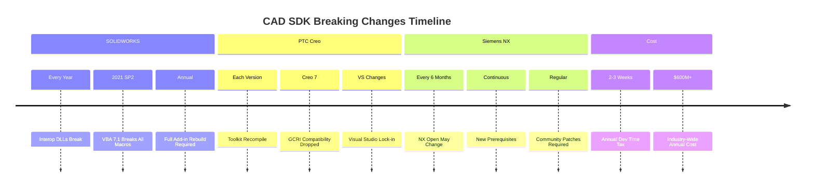

<div className="not-prose mb-6 p-4 bg-green-50 dark:bg-green-900/20 rounded-lg border border-green-200 dark:border-green-800">
  <p className="text-sm text-green-800 dark:text-green-200">
    <strong>Перевірено:</strong> Твердження щодо сумісності версій тестуються за допомогою автоматизованих бенчмарків.
    <a href="https://github.com/dmytro-yemelianov/raps-examples/actions/workflows/run-benchmarks.yml" className="ml-2 underline">Переглянути останні результати</a>
  </p>
</div>

## Щорічний ритуал зламних змін, що коштує мільйони годин розробників

Ласкаво просимо до особливого пекла, зарезервованого для розробників CAD API, де ваш ідеально працюючий код минулого року гарантовано зламається цього року. Не тому, що ви зробили щось неправильно, а тому, що версіонування SDK у світі CAD дотримується філософії "ламаємо все щороку".



### SOLIDWORKS: чемпіон кошмарів interop DLL

SOLIDWORKS займає першість у катастрофах сумісності версій. Ось що чекає на розробників:

**Щорічний ритуал зламних змін**
- Кожна мажорна версія ламає interop DLL
- Надбудови мають бути перебудовані для кожного релізу
- Використовуєте кілька версій SOLIDWORKS? Готуйтесь до пекла управління шляхами

**Реальні повідомлення про помилки, що переслідують розробників:**
```
Error CS1705 Assembly 'AngelSix.SolidDna' uses
'SolidWorks.Interop.swpublished, Version=26.0.1.1'
which has a higher version than the referenced assembly
```

**Апокаліпсис VBA 7.1**
SOLIDWORKS 2021 SP2 представив VBA 7.1, миттєво зламавши кожен існуючий макрос:
- Попередні менеджери встановлення не розпізнають компоненти VBA 7.1
- Макроси, написані до 2021 року, просто перестають працювати
- Жодної зворотної сумісності
- Жодних інструментів міграції

### PTC Creo: рулетка залежностей Visual Studio

Creo Toolkit додає свій особливий аромат пекла версій:
- Необхідна перекомпіляція для **кожної версії Creo**
- Бібліотеки Toolkit мають залежності від версії Visual Studio
- "Завжди сумісні вперед, але ніколи назад"
- Плагін GCRI для зворотної сумісності? Вилучений у Creo 7

Резюме одного розробника: "Якщо ви на Creo 8, ви не можете відкрити файли Creo 9. Крапка."

### Siemens NX: шестимісячний цикл зламних змін

Поки інші ламають щороку, NX інновує з **шестимісячними функціональними релізами**:
- "Функціональність NX Open може змінитися"
- "Можуть знадобитися нові передумови"
- Критичні баги вимагають патчів, що підтримуються спільнотою
- Існують GitHub-репозиторії спеціально для виправлення аварій SOA Teamcenter 12.2

### Приховані витрати

**Податок на час розробників**
- 2-3 тижні щорічно на перебудову під нові версії
- Тестування на кількох версіях
- Підтримка окремих кодових баз
- Оновлення документації для версійних особливостей

**Кошмари корпоративного розгортання**
- Неможливо оновитись, поки всі надбудови не перебудовані
- Різні підрозділи на різних версіях
- Збої інтеграції між системами з невідповідними версіями
- Матриця тестування зростає експоненційно

### Інтерфейс IModelDoc2: 700+ членів для плутанини

`IModelDoc2` у SOLIDWORKS ідеально ілюструє проблему:
- Понад 700 членів, розподілених між об'єктами-розширеннями
- "Жодної реальної логіки у розподілі"
- Документація не згадує про розподіл
- Зміни версій випадково переміщують членів

### Чому це валідує підхід RAPS

Архітектура RAPS передбачає конфлікти версій:
- Крейти робочого простору дозволяють версійно-специфічні реалізації
- Система плагінів забезпечує версійно-специфічні обробники
- Абстракція CLI захищає користувачів від змін API
- Один бінарний файл працює з кількома версіями APS

### Реальність ринку

| Платформа | Частота зламних змін | Вплив на розробників |
|-----------|---------------------|---------------------|
| SOLIDWORKS | Щорічно (100% зламних) | Перебудова всього |
| Creo | З кожною мажорною версією | Повна перекомпіляція |
| NX Open | 6 місяців | Безперервні оновлення |
| Revit/APS | Щорічно (часткові) | Вибіркові оновлення |

### Мільярдна можливість

Розглянемо математику:
- 100,000+ розробників CAD API по всьому світу
- 2-3 тижні щорічно на оновлення версій
- $150/годину -- середня вартість розробника
- = **$600 млн+ щорічних витрат на сумісність версій**

Інструмент, що абстрагує версійні відмінності, міг би захопити значну частину цих марних витрат.

### Конкурентна розвідка

**Найгірші порушники:**
1. SOLIDWORKS -- повні зламні зміни interop щороку
2. NX Open -- найшвидший цикл зламних змін (6 місяців)
3. Creo -- зворотна сумісність відсутня за дизайном

**Найкращі (найменш погані):**
- Onshape -- REST API забезпечує більшу стабільність
- Хмарні платформи -- можуть версіонувати ендпоінти окремо

> **Припущення розрахунку вартості:** 100,000+ розробників CAD API по всьому світу x 2.5 тижні середнього щорічного часу на оновлення x $150/годину середньої вартості розробника = $600 млн+ загальногалузевих щорічних витрат на сумісність версій. Індивідуальні витрати компаній варіюються залежно від складності надбудов та покриття платформ.

### Шлях вперед

Інструменти сумісності версій повинні:
1. Виявляти невідповідності SDK/interop до виконання
2. Надавати матриці сумісності
3. Пропонувати конкретні комбінації версій
4. Абстрагувати зміни API за стабільними інтерфейсами
5. Підтримувати шари зворотної сумісності

### Що далі?

Наша наступна стаття занурюється у катастрофи документації -- де розробники Windchill благають про приклади "Hello World", а документація NX навіть не встановлюється за замовчуванням.

---

*Частина серії "Больові точки крос-платформної розробки". Бо коли у всіх одна й та сама проблема, це не баг -- це ринкова можливість.*
