import PerformanceChart from '@/components/PerformanceChart.astro';


<div className="not-prose mb-6 p-4 bg-green-50 dark:bg-green-900/20 rounded-lg border border-green-200 dark:border-green-800">
  <p className="text-sm text-green-800 dark:text-green-200">
    <strong>Перевірено:</strong> Твердження щодо робочого процесу Design Automation тестуються за допомогою автоматизованих бенчмарків.
    <a href="https://github.com/dmytro-yemelianov/raps-examples/actions/workflows/run-benchmarks.yml" className="ml-2 underline">Переглянути останні результати</a>
  </p>
</div>

## Від 20 хвилин до 0 хвилин: податок на ручну працю

У нашому попередньому дослідженні больових точок розробки AEC ми обговорювали "податок на ручну працю" -- приховану вартість ручних розгортань. Сьогодні ми повністю усуваємо ручний процес.

Розгортання надбудови Revit у Design Automation зазвичай включає:

1. **Компіляція DLL локально** (сподіваємось, у режимі Release)
2. **Архівування їх правильно** (ви пам'ятали про залежності?)
3. **Отримання нового токена автентифікації** (знову минув термін дії?)
4. **Завантаження AppBundle** (будь ласка, спрацюй цього разу...)
5. **Створення нового псевдоніма Activity** (production чи staging?)

Якщо ви робите це вручну, ви **обов'язково** колись завантажите дебаг-збірку в production. Ось як автоматизувати це за допомогою RAPS та GitHub Actions.

## Робочий процес без кліків

Ми створимо конвеєр, що запускається при кожному git push у гілку main, перетворюючи ваш "час на розгортання" з **20 хвилин клікання на 0 хвилин**.

```mermaid
flowchart LR
    subgraph "Developer"
        A[git push] --> B[Go Get Coffee]
    end

    subgraph "GitHub Actions"
        C[Checkout] --> D[Setup .NET]
        D --> E[Build Release]
        E --> F[Install RAPS]
        F --> G[raps auth login]
        G --> H[raps da bundle create]
        H --> I[raps da appbundle update]
        I --> J[raps da activity update]
    end

    subgraph "APS Design Automation"
        K[AppBundle Updated]
        L[Activity Ready]
        M[Production Alias Set]
    end

    subgraph "Notifications"
        N[Slack: Deployed!]
    end

    B -.->|Triggered| C
    J --> K
    K --> L
    L --> M
    M --> N

    style A fill:#4c9aff
    style N fill:#36b37e
```



### 1. Визначення конфігурації RAPS

Спочатку переконайтесь, що ваш репозиторій має `raps.toml`, що визначає структуру вашого AppBundle. Це повідомляє CLI, які DLL пакувати та як структурувати розгортання.

```toml
[appbundle]
name = "my-revit-plugin"
engine = "Autodesk.Revit+2024"
description = "Automated Revit processing plugin"

[appbundle.bundle]
main_dll = "MyPlugin.dll"
dependencies = [
    "MyPlugin.Shared.dll",
    "Newtonsoft.Json.dll"
]

[appbundle.activity]
command_line = "$(engine.path)\\\\revit.exe /i $(args[inputFile].path) /al $(appbundles[{appbundle.name}].path)"
```

### 2. GitHub Action

Створіть `.github/workflows/deploy.yml`:

```yaml
name: Deploy to APS Design Automation

on:
  push:
    branches: [ "main" ]
  pull_request:
    branches: [ "main" ]

jobs:
  build-and-deploy:
    runs-on: windows-latest

    steps:
    - uses: actions/checkout@v4

    - name: Setup .NET
      uses: actions/setup-dotnet@v4
      with:
        dotnet-version: '6.0.x'

    - name: Restore dependencies
      run: dotnet restore

    - name: Build Release
      run: dotnet build --configuration Release --no-restore

    - name: Install RAPS
      run: |
        curl -fsSL https://rapscli.xyz/install.sh | sh
        echo "$HOME/.cargo/bin" >> $GITHUB_PATH

    - name: Bundle & Deploy
      if: github.ref == 'refs/heads/main'
      env:
        APS_CLIENT_ID: ${{ secrets.APS_CLIENT_ID }}
        APS_CLIENT_SECRET: ${{ secrets.APS_CLIENT_SECRET }}
      run: |
        # Authenticate with APS
        raps auth login --client-id $APS_CLIENT_ID --client-secret $APS_CLIENT_SECRET

        # Create the bundle (handles zipping automatically)
        raps da:bundle create --path ./bin/Release/net48

        # Update the AppBundle in the cloud and alias it to 'prod'
        raps da:appbundle update my-revit-plugin --alias prod

        # Update the Activity to use the new bundle version
        raps da:activity update my-revit-plugin --alias prod

    - name: Test Deployment
      if: github.ref == 'refs/heads/main'
      run: |
        # Run a simple test to verify the deployment
        raps da:workitem run my-revit-plugin \
          --input-file https://developer.api.autodesk.com/oss/v2/signedresources/test.rvt \
          --output-format ifc
```

### 3. Просунутий варіант: мульти-середовищне розгортання

Для більш складних робочих процесів розгортайте у різні середовища залежно від гілки:

```yaml
name: Multi-Environment Deploy

on:
  push:
    branches: [ "main", "staging", "develop" ]

jobs:
  deploy:
    runs-on: windows-latest

    steps:
    - uses: actions/checkout@v4

    - name: Determine Environment
      id: env
      run: |
        if [[ "${{ github.ref }}" == "refs/heads/main" ]]; then
          echo "environment=production" >> $GITHUB_OUTPUT
          echo "alias=prod" >> $GITHUB_OUTPUT
        elif [[ "${{ github.ref }}" == "refs/heads/staging" ]]; then
          echo "environment=staging" >> $GITHUB_OUTPUT
          echo "alias=staging" >> $GITHUB_OUTPUT
        else
          echo "environment=development" >> $GITHUB_OUTPUT
          echo "alias=dev" >> $GITHUB_OUTPUT
        fi

    # ... build steps ...

    - name: Deploy to ${{ steps.env.outputs.environment }}
      env:
        APS_CLIENT_ID: ${{ secrets.APS_CLIENT_ID }}
        APS_CLIENT_SECRET: ${{ secrets.APS_CLIENT_SECRET }}
        ENVIRONMENT: ${{ steps.env.outputs.environment }}
        ALIAS: ${{ steps.env.outputs.alias }}
      run: |
        raps auth login --client-id $APS_CLIENT_ID --client-secret $APS_CLIENT_SECRET

        # Deploy with environment-specific alias
        raps da:bundle create --path ./bin/Release/net48
        raps da:appbundle update my-revit-plugin --alias $ALIAS
        raps da:activity update my-revit-plugin --alias $ALIAS

        echo "✅ Deployed to $ENVIRONMENT environment with alias '$ALIAS'"
```

<PerformanceChart
  title="Податок на час розгортання"
  subtitle="Хвилини на ручне розгортання проти автоматизованого конвеєра"
  data={[
    { label: "Ручне розгортання", value: 20, suffix: " хв/реліз", color: "bg-gradient-to-r from-red-500 to-rose-600" },
    { label: "Реліз без кліків", value: 0.1, suffix: " хв/реліз", color: "bg-gradient-to-r from-emerald-400 to-emerald-600" }
  ]}
/>

## Чому це трансформує ваш робочий процес

### До: податок на ручну працю
- **20 хвилин** на кожне розгортання
- **Високий рівень помилок** (дебаг-збірки, забуті файли)
- **Перемикання контексту** між розробкою та завданнями розгортання
- **Непослідовний** процес розгортання серед членів команди
- **Немає журналу аудиту** того, що було розгорнуто і коли

### Після: релізи без кліків
- **0 хвилин** активного часу розгортання
- **Жодних людських помилок** (автоматизована збірка та пакування)
- **Послідовний** процес для всіх середовищ
- **Повний журнал аудиту** у логах GitHub Actions
- **Негайний відкат** через git revert

## Просунуті можливості

### Автоматичне тегування версій

Додайте автоматичне семантичне версіонування до ваших релізів:

```yaml
- name: Generate Version
  id: version
  run: |
    VERSION=$(date +%Y.%m.%d)-$(git rev-parse --short HEAD)
    echo "version=$VERSION" >> $GITHUB_OUTPUT
    echo "Generated version: $VERSION"

- name: Tag AppBundle Version
  run: |
    raps da:appbundle update my-revit-plugin \
      --alias prod \
      --version ${{ steps.version.outputs.version }} \
      --description "Auto-deployed from commit ${{ github.sha }}"
```

### Сповіщення Slack/Teams

Отримуйте сповіщення про завершення розгортань:

```yaml
- name: Notify Success
  if: success()
  uses: 8398a7/action-slack@v3
  with:
    status: success
    text: "✅ Revit plugin deployed to production successfully!"
  env:
    SLACK_WEBHOOK_URL: ${{ secrets.SLACK_WEBHOOK }}

- name: Notify Failure
  if: failure()
  uses: 8398a7/action-slack@v3
  with:
    status: failure
    text: "❌ Revit plugin deployment failed. Check GitHub Actions for details."
  env:
    SLACK_WEBHOOK_URL: ${{ secrets.SLACK_WEBHOOK }}
```

### Інтеграційне тестування

Автоматичне тестування розгорнутого плагіна:

```yaml
- name: Integration Test
  run: |
    # Test with a small sample file
    WORKITEM_ID=$(raps da:workitem run my-revit-plugin \
      --input-file ${{ secrets.TEST_FILE_URL }} \
      --output-format ifc \
      --wait \
      --format json | jq -r '.id')

    # Verify the workitem completed successfully
    STATUS=$(raps da:workitem status $WORKITEM_ID --format json | jq -r '.status')

    if [[ "$STATUS" != "succeeded" ]]; then
      echo "❌ Integration test failed. WorkItem status: $STATUS"
      exit 1
    fi

    echo "✅ Integration test passed. Plugin is working correctly."
```

## Найкращі практики безпеки

### Змінні середовища
Зберігайте конфіденційні дані у GitHub Secrets:

- `APS_CLIENT_ID` -- Client ID вашого застосунку Autodesk
- `APS_CLIENT_SECRET` -- Client Secret вашого застосунку Autodesk
- `SLACK_WEBHOOK` -- Webhook для сповіщень Slack (необов'язково)
- `TEST_FILE_URL` -- URL тестового файлу Revit (необов'язково)

### Принцип мінімальних привілеїв
Створіть окремий застосунок APS для CI/CD з мінімально необхідними правами:

```bash
# Create a CI-specific app with limited permissions
raps auth create-app \
  --name "ci-deployment-app" \
  --scopes "code:all bucket:create bucket:read data:read data:write"
```

## Моніторинг та спостережуваність

Відстежуйте рівень успішності розгортань:

```yaml
- name: Record Deployment Metrics
  if: always()
  run: |
    # Send deployment metrics to your monitoring system
    curl -X POST "${{ secrets.METRICS_ENDPOINT }}" \
      -H "Content-Type: application/json" \
      -d '{
        "deployment": "revit-plugin",
        "status": "${{ job.status }}",
        "duration": "${{ steps.deploy.outputs.duration }}",
        "commit": "${{ github.sha }}",
        "branch": "${{ github.ref_name }}"
      }'
```

## Усунення типових проблем

### Збої збірки
```yaml
- name: Debug Build Issues
  if: failure()
  run: |
    echo "=== Build Logs ==="
    cat build.log

    echo "=== Assembly References ==="
    raps debug assembly-info ./bin/Release/net48/*.dll
```

### Проблеми автентифікації
```yaml
- name: Test Authentication
  run: |
    # Verify auth is working
    raps auth test || {
      echo "❌ Authentication failed"
      echo "Check APS_CLIENT_ID and APS_CLIENT_SECRET secrets"
      exit 1
    }
```

### Проблеми з розміром бандлу
```yaml
- name: Check Bundle Size
  run: |
    BUNDLE_SIZE=$(du -h ./bundle.zip | cut -f1)
    echo "Bundle size: $BUNDLE_SIZE"

    # Warn if bundle is over 100MB
    if [[ $(du -b ./bundle.zip | cut -f1) -gt 104857600 ]]; then
      echo "⚠️ Warning: Bundle size ($BUNDLE_SIZE) is large. Consider optimizing dependencies."
    fi
```

## Підсумок

З цим конвеєром автоматизації:

- Ви **пушите код** -> Ви **йдете за кавою** -> Ваш **плагін розгорнуто**
- **Жодних ручних кроків** у процесі розгортання
- **Послідовні, повторювані** розгортання у всіх середовищах
- **Повний журнал аудиту** та можливість миттєвого відкату
- **Інтеграційне тестування** забезпечує якість перед production

"Податок на ручну працю" дорого обходиться. Автоматизація окупається після перших кількох розгортань.

## Далі

У наступній статті ми розглянемо, чому ми обрали Rust замість Node.js для побудови RAPS, і як це рішення дозволяє обробляти файли моделей понад 5 ГБ, що спричиняють аварію традиційних інструментів JavaScript.

---

*Частина серії "Революція DevOps в AEC". Бо ваш процес розгортання не повинен вимагати ступінь доктора наук з клікання кнопок.*
