import PerformanceChart from '@/components/PerformanceChart.astro';


<div className="not-prose mb-6 p-4 bg-green-50 dark:bg-green-900/20 rounded-lg border border-green-200 dark:border-green-800">
  <p className="text-sm text-green-800 dark:text-green-200">
    <strong>Validated:</strong> Design Automation workflow claims are tested via automated benchmarks.
    <a href="https://github.com/dmytro-yemelianov/raps-examples/actions/workflows/run-benchmarks.yml" className="ml-2 underline">View latest results</a>
  </p>
</div>

## From 20 Minutes to 0 Minutes: The Manual Tax

In our previous exploration of AEC development pain points, we discussed "The Manual Tax" — the hidden cost of manual deployments. Today, we kill the manual process entirely.

Deploying a Revit Add-in to Design Automation usually involves:

1. **Compiling the DLLs locally** (hopefully in Release mode)
2. **Zipping them up correctly** (did you remember the dependencies?)
3. **Getting a new authentication token** (expired again?)
4. **Uploading the AppBundle** (please work this time...)
5. **Creating a new Activity alias** (production or staging?)

If you do this manually, you **will** eventually upload a debug build to production. Here's how to automate it using RAPS and GitHub Actions.

## The Zero-Click Workflow

We'll create a pipeline that runs on every git push to the main branch, transforming your "time to deploy" from **20 minutes of clicking to 0 minutes**.

```mermaid
flowchart LR
    subgraph "Developer"
        A[git push] --> B[Go Get Coffee]
    end
    
    subgraph "GitHub Actions"
        C[Checkout] --> D[Setup .NET]
        D --> E[Build Release]
        E --> F[Install RAPS]
        F --> G[raps auth login]
        G --> H[raps da bundle create]
        H --> I[raps da appbundle update]
        I --> J[raps da activity update]
    end
    
    subgraph "APS Design Automation"
        K[AppBundle Updated]
        L[Activity Ready]
        M[Production Alias Set]
    end
    
    subgraph "Notifications"
        N[Slack: Deployed!]
    end
    
    B -.->|Triggered| C
    J --> K
    K --> L
    L --> M
    M --> N
    
    style A fill:#4c9aff
    style N fill:#36b37e
```



### 1. Define the RAPS Configuration

First, ensure your repository has a `raps.toml` defining your AppBundle structure. This tells the CLI which DLLs to bundle and how to structure your deployment.

```toml
[appbundle]
name = "my-revit-plugin"
engine = "Autodesk.Revit+2024"
description = "Automated Revit processing plugin"

[appbundle.bundle]
main_dll = "MyPlugin.dll"
dependencies = [
    "MyPlugin.Shared.dll",
    "Newtonsoft.Json.dll"
]

[appbundle.activity]
command_line = "$(engine.path)\\\\revit.exe /i $(args[inputFile].path) /al $(appbundles[{appbundle.name}].path)"
```

### 2. The GitHub Action

Create `.github/workflows/deploy.yml`:

```yaml
name: Deploy to APS Design Automation

on:
  push:
    branches: [ "main" ]
  pull_request:
    branches: [ "main" ]

jobs:
  build-and-deploy:
    runs-on: windows-latest
    
    steps:
    - uses: actions/checkout@v4
    
    - name: Setup .NET
      uses: actions/setup-dotnet@v4
      with:
        dotnet-version: '6.0.x'
    
    - name: Restore dependencies
      run: dotnet restore
    
    - name: Build Release
      run: dotnet build --configuration Release --no-restore
    
    - name: Install RAPS
      run: |
        curl -fsSL https://rapscli.xyz/install.sh | sh
        echo "$HOME/.cargo/bin" >> $GITHUB_PATH
    
    - name: Bundle & Deploy
      if: github.ref == 'refs/heads/main'
      env:
        APS_CLIENT_ID: ${{ secrets.APS_CLIENT_ID }}
        APS_CLIENT_SECRET: ${{ secrets.APS_CLIENT_SECRET }}
      run: |
        # Authenticate with APS
        raps auth login --client-id $APS_CLIENT_ID --client-secret $APS_CLIENT_SECRET
        
        # Create the bundle (handles zipping automatically)
        raps da:bundle create --path ./bin/Release/net48
        
        # Update the AppBundle in the cloud and alias it to 'prod'
        raps da:appbundle update my-revit-plugin --alias prod
        
        # Update the Activity to use the new bundle version
        raps da:activity update my-revit-plugin --alias prod
    
    - name: Test Deployment
      if: github.ref == 'refs/heads/main'
      run: |
        # Run a simple test to verify the deployment
        raps da:workitem run my-revit-plugin \
          --input-file https://developer.api.autodesk.com/oss/v2/signedresources/test.rvt \
          --output-format ifc
```

### 3. Advanced: Multi-Environment Deployment

For more sophisticated workflows, deploy to different environments based on the branch:

```yaml
name: Multi-Environment Deploy

on:
  push:
    branches: [ "main", "staging", "develop" ]

jobs:
  deploy:
    runs-on: windows-latest
    
    steps:
    - uses: actions/checkout@v4
    
    - name: Determine Environment
      id: env
      run: |
        if [[ "${{ github.ref }}" == "refs/heads/main" ]]; then
          echo "environment=production" >> $GITHUB_OUTPUT
          echo "alias=prod" >> $GITHUB_OUTPUT
        elif [[ "${{ github.ref }}" == "refs/heads/staging" ]]; then
          echo "environment=staging" >> $GITHUB_OUTPUT
          echo "alias=staging" >> $GITHUB_OUTPUT
        else
          echo "environment=development" >> $GITHUB_OUTPUT
          echo "alias=dev" >> $GITHUB_OUTPUT
        fi
    
    # ... build steps ...
    
    - name: Deploy to ${{ steps.env.outputs.environment }}
      env:
        APS_CLIENT_ID: ${{ secrets.APS_CLIENT_ID }}
        APS_CLIENT_SECRET: ${{ secrets.APS_CLIENT_SECRET }}
        ENVIRONMENT: ${{ steps.env.outputs.environment }}
        ALIAS: ${{ steps.env.outputs.alias }}
      run: |
        raps auth login --client-id $APS_CLIENT_ID --client-secret $APS_CLIENT_SECRET
        
        # Deploy with environment-specific alias
        raps da:bundle create --path ./bin/Release/net48
        raps da:appbundle update my-revit-plugin --alias $ALIAS
        raps da:activity update my-revit-plugin --alias $ALIAS
        
        echo "✅ Deployed to $ENVIRONMENT environment with alias '$ALIAS'"
```

<PerformanceChart 
  title="Deployment Time Tax"
  subtitle="Minutes spent on manual deployment vs. automated pipeline"
  data={[
    { label: "Manual Deployment", value: 20, suffix: " min/release", color: "bg-gradient-to-r from-red-500 to-rose-600" },
    { label: "Zero-Click Release", value: 0.1, suffix: " min/release", color: "bg-gradient-to-r from-emerald-400 to-emerald-600" }
  ]}
/>

## Why This Transforms Your Workflow

### Before: The Manual Tax
- **20 minutes** per deployment
- **High error rate** (debug builds, missing files)
- **Context switching** from development to deployment tasks
- **Inconsistent** deployment process across team members
- **No audit trail** of what was deployed when

### After: Zero-Click Releases
- **0 minutes** active deployment time
- **Zero human errors** (automated building and bundling)
- **Consistent** process across all environments
- **Complete audit trail** in GitHub Actions logs
- **Immediate rollback** capability via git revert

## Advanced Features

### Automatic Version Tagging

Add automatic semantic versioning to your releases:

```yaml
- name: Generate Version
  id: version
  run: |
    VERSION=$(date +%Y.%m.%d)-$(git rev-parse --short HEAD)
    echo "version=$VERSION" >> $GITHUB_OUTPUT
    echo "Generated version: $VERSION"

- name: Tag AppBundle Version
  run: |
    raps da:appbundle update my-revit-plugin \
      --alias prod \
      --version ${{ steps.version.outputs.version }} \
      --description "Auto-deployed from commit ${{ github.sha }}"
```

### Slack/Teams Notifications

Get notified when deployments complete:

```yaml
- name: Notify Success
  if: success()
  uses: 8398a7/action-slack@v3
  with:
    status: success
    text: "✅ Revit plugin deployed to production successfully!"
  env:
    SLACK_WEBHOOK_URL: ${{ secrets.SLACK_WEBHOOK }}

- name: Notify Failure
  if: failure()
  uses: 8398a7/action-slack@v3
  with:
    status: failure
    text: "❌ Revit plugin deployment failed. Check GitHub Actions for details."
  env:
    SLACK_WEBHOOK_URL: ${{ secrets.SLACK_WEBHOOK }}
```

### Integration Testing

Test your deployed plugin automatically:

```yaml
- name: Integration Test
  run: |
    # Test with a small sample file
    WORKITEM_ID=$(raps da:workitem run my-revit-plugin \
      --input-file ${{ secrets.TEST_FILE_URL }} \
      --output-format ifc \
      --wait \
      --format json | jq -r '.id')
    
    # Verify the workitem completed successfully
    STATUS=$(raps da:workitem status $WORKITEM_ID --format json | jq -r '.status')
    
    if [[ "$STATUS" != "succeeded" ]]; then
      echo "❌ Integration test failed. WorkItem status: $STATUS"
      exit 1
    fi
    
    echo "✅ Integration test passed. Plugin is working correctly."
```

## Security Best Practices

### Environment Variables
Store sensitive data in GitHub Secrets:

- `APS_CLIENT_ID` - Your Autodesk app client ID
- `APS_CLIENT_SECRET` - Your Autodesk app client secret  
- `SLACK_WEBHOOK` - Slack notification webhook (optional)
- `TEST_FILE_URL` - URL to your test Revit file (optional)

### Least Privilege Access
Create a dedicated APS app for CI/CD with minimal required scopes:

```bash
# Create a CI-specific app with limited permissions
raps auth create-app \
  --name "ci-deployment-app" \
  --scopes "code:all bucket:create bucket:read data:read data:write"
```

## Monitoring and Observability

Track your deployment success rate:

```yaml
- name: Record Deployment Metrics
  if: always()
  run: |
    # Send deployment metrics to your monitoring system
    curl -X POST "${{ secrets.METRICS_ENDPOINT }}" \
      -H "Content-Type: application/json" \
      -d '{
        "deployment": "revit-plugin",
        "status": "${{ job.status }}",
        "duration": "${{ steps.deploy.outputs.duration }}",
        "commit": "${{ github.sha }}",
        "branch": "${{ github.ref_name }}"
      }'
```

## Troubleshooting Common Issues

### Build Failures
```yaml
- name: Debug Build Issues
  if: failure()
  run: |
    echo "=== Build Logs ==="
    cat build.log
    
    echo "=== Assembly References ==="
    raps debug assembly-info ./bin/Release/net48/*.dll
```

### Authentication Problems
```yaml
- name: Test Authentication
  run: |
    # Verify auth is working
    raps auth test || {
      echo "❌ Authentication failed"
      echo "Check APS_CLIENT_ID and APS_CLIENT_SECRET secrets"
      exit 1
    }
```

### Bundle Size Issues
```yaml
- name: Check Bundle Size
  run: |
    BUNDLE_SIZE=$(du -h ./bundle.zip | cut -f1)
    echo "Bundle size: $BUNDLE_SIZE"
    
    # Warn if bundle is over 100MB
    if [[ $(du -b ./bundle.zip | cut -f1) -gt 104857600 ]]; then
      echo "⚠️ Warning: Bundle size ($BUNDLE_SIZE) is large. Consider optimizing dependencies."
    fi
```

## The Bottom Line

With this automation pipeline:

- You **push code** → You **go get coffee** → Your **plugin is deployed**
- **Zero manual steps** in your deployment process  
- **Consistent, repeatable** deployments across all environments
- **Complete audit trail** and instant rollback capability
- **Integration testing** ensures quality before production

The "Manual Tax" is expensive. Automation pays for itself after the first few deployments.

## Coming Up Next

In our next article, we'll explore why we chose Rust over Node.js for building RAPS, and how this decision enables processing 5GB+ model files that would crash traditional JavaScript tooling.

---

*Part of our "AEC DevOps Revolution" series. Because your deployment process shouldn't require a PhD in clicking buttons.*