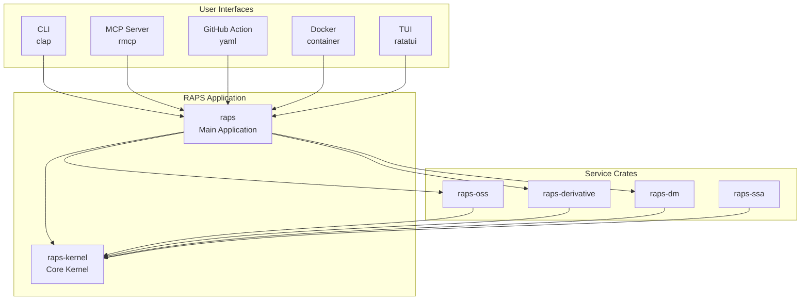

# Architecture

RAPS follows a **microkernel architecture** inspired by Unix OS design principles, enabling security, testability, and independent feature evolution.

## Design Philosophy

The microkernel architecture separates RAPS into:

1. **Minimal Kernel**: Core functionality is small, audited, and battle-tested
2. **Message Passing**: Components communicate through well-defined interfaces
3. **Isolation**: Failures in extensions don't crash the kernel
4. **Extensibility**: Features added via plugins, not kernel modifications
5. **Security**: Attack surface minimized in the trusted kernel

## Architecture Layers



## Kernel (`raps-kernel`)

The kernel is the minimal trusted foundation that all features build upon.

**Contents:**
- Authentication (OAuth2, SSA, token management)
- HTTP client (with retry logic and middleware)
- Configuration management
- Secure credential storage (OS keyring)
- Domain types (URN, BucketKey, ObjectKey)
- Error handling with exit codes
- Logging with secret redaction

**Constraints:**
- **Size**: Less than 3000 lines of code (target: ~2000 LOC)
- **Safety**: `#![deny(unsafe_code)]`, `#![deny(clippy::unwrap_used)]`
- **Test Coverage**: Greater than 90% on critical paths
- **Dependencies**: Minimal external dependencies

**Build Performance:**
- Incremental check: Less than 5s
- Full build: Less than 30s

## Service Crates

Service crates provide APS API functionality:

- **`raps-oss`**: Object Storage Service (buckets, objects, uploads, downloads)
- **`raps-derivative`**: Model Derivative API (translations, manifests, derivatives)
- **`raps-dm`**: Data Management API (hubs, projects, folders, items, versions)
- **`raps-ssa`**: Secure Service Accounts (SSA management, JWT assertion)

**Service Principles:**
- Depend only on `raps-kernel`, not on each other
- Independent failure domains
- Can be tested in isolation
- Can evolve independently

## Features

RAPS provides comprehensive coverage of Autodesk Platform Services APIs:

### Core Services
- **Authentication**: 2-legged OAuth, 3-legged OAuth, Device Code Flow, SSA (Secure Service Accounts)
- **Object Storage (OSS)**: Bucket CRUD, Object CRUD, Parallel Uploads, Signed URLs (S3)
- **Model Derivative**: Translation Jobs, Status & Manifest, Derivative Download
- **Data Management**: Hubs & Projects, Folders & Items, Tip Version & Derivatives

### Extended Features
- **Account Admin API**: Account management and administration
- **ACC Modules**: Issues, RFIs, Assets, Submittals, Checklists
- **Design Automation**: Engines, Activities, Work Items management
- **Reality Capture**: Photogrammetry processing capabilities
- **Webhooks**: Event subscriptions and workflow automation
- **Pipelines**: YAML/JSON workflow automation
- **Plugins**: Extend functionality with custom commands
- **MCP Server**: AI assistant integration via Model Context Protocol
- **TUI**: Terminal user interface for interactive operations

## Build Commands

```bash
# Standard build (includes all features)
cargo build

# Minimal build (kernel + core services only)
cargo build --no-default-features --features core
```

## Version Output

```bash
$ raps --version
raps 3.8.0
```

## Performance Targets

RAPS is optimized for fast development feedback loops:

| Metric | Target | Measurement |
|--------|--------|-------------|
| Kernel check (incremental) | Less than 5s | After single file change |
| Workspace check (incremental) | Less than 30s | After single file change |
| CLI startup (`--help`) | Less than 100ms | Cold start |
| File upload (100MB, parallel) | Less than 30s | Network dependent (100Mbps) |
| MCP tool call | Less than 200ms | AI assistant integration |

**Build Tooling:**
- **Windows**: `lld-link` linker (via LLVM)
- **Linux**: `mold` linker (in CI)
- **All platforms**: `sccache` for compilation caching, `cargo-nextest` for parallel tests

See [Development Setup](/docs/development) for local configuration.

## Benefits

**Security:**
- Minimal attack surface in kernel
- Independent security auditing of services
- Clear security boundaries

**Testability:**
- Kernel can be tested in isolation
- Services can be mocked for integration tests
- High test coverage achievable

**Maintainability:**
- Clear separation of concerns
- Independent evolution of features
- Easier code reviews

**Performance:**
- Fast incremental builds
- Parallel test execution
- Optimized linker usage

**Business Model:**
- Core functionality remains open source
- Enterprise features enable sustainable development
- Clear upgrade path for users
