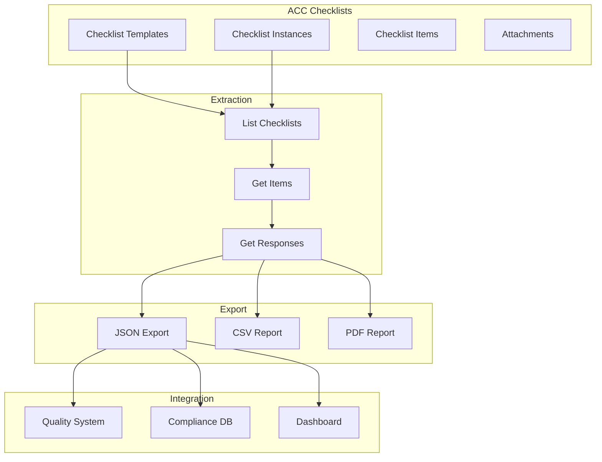
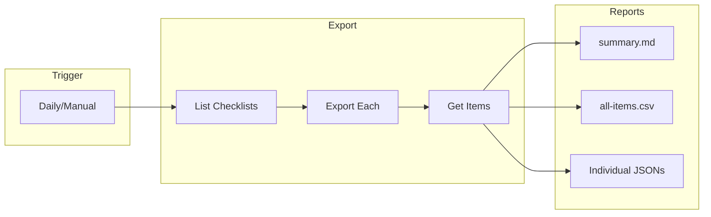
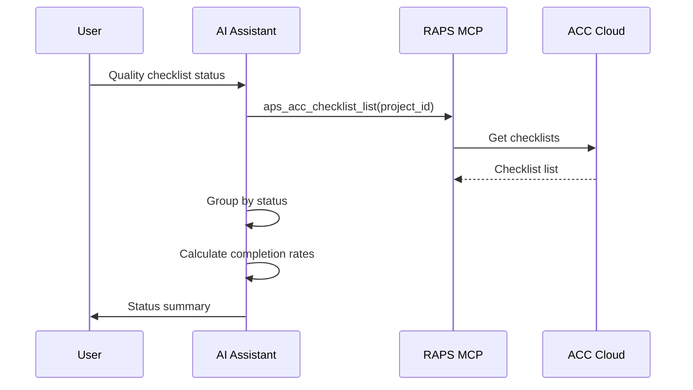

# Checklist Export

Export ACC checklists for reporting, compliance, and integration with other systems.

## Workflow Overview



---

## CLI Approach

### List All Checklists

```bash
PROJECT_ID="b.project-id"

# List all checklists
raps acc checklist list "$PROJECT_ID"

# Export to JSON
raps acc checklist list "$PROJECT_ID" --output json > checklists.json

# Filter by status
cat checklists.json | jq '[.[] | select(.status == "completed")]' > completed.json
```

### Get Checklist Details

```bash
CHECKLIST_ID="checklist-123"

# Get checklist with items
raps acc checklist get "$PROJECT_ID" "$CHECKLIST_ID" --output json > checklist-detail.json

# View structure
jq '.title, .status, (.items | length)' checklist-detail.json
```

### Export Checklist Items

```bash
# Get all items with status
raps acc checklist items "$PROJECT_ID" "$CHECKLIST_ID" --output json > items.json

# Export to CSV
cat items.json | jq -r '
  ["Item", "Status", "Response", "Assignee", "Date"],
  (.[] | [
    .title,
    .status,
    .response // "",
    .assignee // "",
    .completedAt // ""
  ]) | @csv
' > checklist-report.csv
```

### Batch Export All Checklists

```bash
mkdir -p ./checklist-exports

jq -r '.[].id' checklists.json | while read id; do
  NAME=$(jq -r ".[] | select(.id == \"$id\") | .title" checklists.json | tr ' ' '_')

  raps acc checklist get "$PROJECT_ID" "$id" --output json > "./checklist-exports/${NAME}.json"

  # Also create CSV
  raps acc checklist items "$PROJECT_ID" "$id" --output json | jq -r '
    ["Item","Status","Response"],
    (.[] | [.title, .status, .response // ""]) | @csv
  ' > "./checklist-exports/${NAME}.csv"

  echo "Exported: $NAME"
done
```

---

## CI/CD Pipeline

```yaml
# .github/workflows/checklist-export.yml
name: Checklist Export Pipeline

on:
  schedule:
    - cron: '0 6 * * *'  # Daily at 6 AM
  workflow_dispatch:
    inputs:
      project_id:
        description: 'Project ID'
        required: true

jobs:
  export-checklists:
    runs-on: ubuntu-latest
    steps:
      - name: Install RAPS
        run: cargo install raps

      - name: Authenticate
        env:
          APS_CLIENT_ID: ${{ secrets.APS_CLIENT_ID }}
          APS_CLIENT_SECRET: ${{ secrets.APS_CLIENT_SECRET }}
          APS_REFRESH_TOKEN: ${{ secrets.APS_REFRESH_TOKEN }}
        run: raps auth refresh

      - name: Export all checklists
        env:
          APS_CLIENT_ID: ${{ secrets.APS_CLIENT_ID }}
          APS_CLIENT_SECRET: ${{ secrets.APS_CLIENT_SECRET }}
          PROJECT_ID: ${{ inputs.project_id || secrets.ACC_PROJECT_ID }}
        run: |
          mkdir -p ./exports

          # Get all checklists
          raps acc checklist list "$PROJECT_ID" --output json > ./exports/checklists.json

          # Export each checklist
          jq -r '.[].id' ./exports/checklists.json | while read id; do
            raps acc checklist get "$PROJECT_ID" "$id" --output json > "./exports/checklist-${id}.json"
            raps acc checklist items "$PROJECT_ID" "$id" --output json > "./exports/items-${id}.json"
          done

      - name: Generate summary report
        run: |
          echo "# Checklist Export Summary" > ./exports/summary.md
          echo "Generated: $(date)" >> ./exports/summary.md
          echo "" >> ./exports/summary.md

          TOTAL=$(jq 'length' ./exports/checklists.json)
          COMPLETED=$(jq '[.[] | select(.status == "completed")] | length' ./exports/checklists.json)
          IN_PROGRESS=$(jq '[.[] | select(.status == "in_progress")] | length' ./exports/checklists.json)

          echo "## Summary" >> ./exports/summary.md
          echo "- Total Checklists: $TOTAL" >> ./exports/summary.md
          echo "- Completed: $COMPLETED" >> ./exports/summary.md
          echo "- In Progress: $IN_PROGRESS" >> ./exports/summary.md
          echo "" >> ./exports/summary.md

          echo "## Checklists" >> ./exports/summary.md
          jq -r '.[] | "- \(.title): \(.status)"' ./exports/checklists.json >> ./exports/summary.md

      - name: Create combined CSV
        run: |
          echo "Checklist,Item,Status,Response,Assignee" > ./exports/all-items.csv

          for items_file in ./exports/items-*.json; do
            CHECKLIST_ID=$(basename "$items_file" | sed 's/items-\(.*\)\.json/\1/')
            CHECKLIST_NAME=$(jq -r ".[] | select(.id == \"$CHECKLIST_ID\") | .title" ./exports/checklists.json)

            jq -r --arg name "$CHECKLIST_NAME" '.[] | [$name, .title, .status, (.response // ""), (.assignee // "")] | @csv' "$items_file" >> ./exports/all-items.csv
          done

      - name: Upload exports
        uses: actions/upload-artifact@v4
        with:
          name: checklist-exports
          path: ./exports/
```

### Pipeline Flow



---

## MCP Integration

### Get Checklist Status

```
User: "What's the status of our quality checklists?"
```



**AI Response:**
> **Quality Checklist Status:**
>
> | Status | Count | % |
> |--------|-------|---|
> | Completed | 45 | 75% |
> | In Progress | 12 | 20% |
> | Not Started | 3 | 5% |
>
> **Recent Activity:**
> - "Level 3 MEP Inspection" completed today
> - "Structural Framing Check" at 80%
> - "Exterior Waterproofing" starting tomorrow

### Export Specific Checklist

```
User: "Export the fire safety inspection checklist to CSV"
```

**AI Response:**
> Exported "Fire Safety Inspection" checklist:
>
> **Summary:**
> - Total Items: 42
> - Passed: 38
> - Failed: 2
> - Pending: 2
>
> **Failed Items:**
> - Emergency exit signage (Building A, Level 2)
> - Fire extinguisher inspection tag (Building B, Level 1)
>
> CSV file: fire-safety-inspection.csv

---

## Compliance Reporting

### Pass/Fail Summary

```bash
cat items.json | jq '
  {
    total: length,
    passed: [.[] | select(.status == "passed")] | length,
    failed: [.[] | select(.status == "failed")] | length,
    pending: [.[] | select(.status == "pending")] | length,
    na: [.[] | select(.status == "na")] | length
  } |
  . + {passRate: ((.passed / .total) * 100 | floor)}
'
```

### Failed Items Report

```bash
cat items.json | jq '[.[] | select(.status == "failed") | {
  item: .title,
  reason: .response,
  assignee: .assignee,
  date: .updatedAt
}]'
```

### Completion Timeline

```bash
cat items.json | jq '
  [.[] | select(.completedAt != null)] |
  group_by(.completedAt[:10]) |
  map({date: .[0].completedAt[:10], completed: length}) |
  sort_by(.date)'
```

---

## Related

- [Quality Control Workflows](/docs/cookbook-acc-quality)
- [Issues & RFI Management](/docs/cookbook-acc-issues)
- [Cookbook: Construction](/docs/cookbook-construction)
