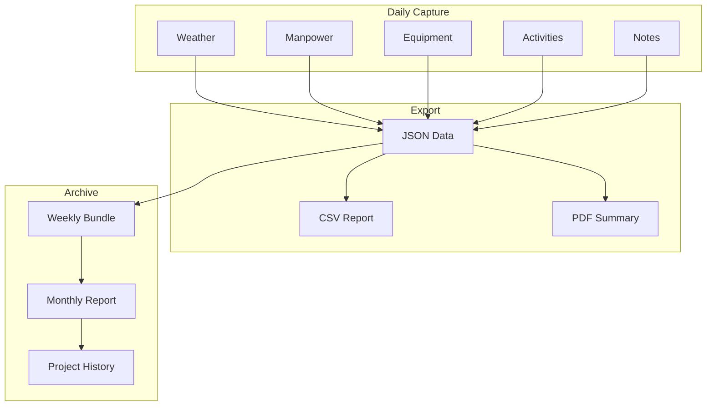
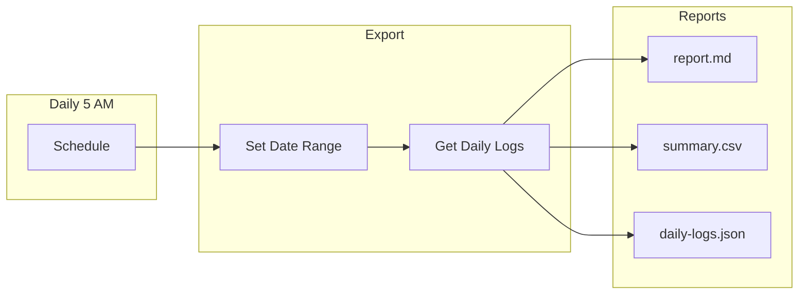
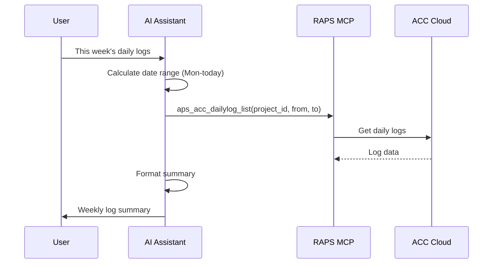

# Daily Log Automation

Export and automate daily construction logs for record keeping.

## Workflow Overview



---

## CLI Approach

### Export Daily Logs

```bash
PROJECT_ID="b.project-id"

# Get logs for date range
START_DATE="2024-02-01"
END_DATE="2024-02-29"

raps acc dailylog list "$PROJECT_ID" \
  --from "$START_DATE" \
  --to "$END_DATE" \
  --output json > daily-logs.json
```

### Format for Reading

```bash
cat daily-logs.json | jq -r '.[] |
  "=== \(.date) ===",
  "Weather: \(.weather.condition) (\(.weather.tempHigh)°/\(.weather.tempLow)°)",
  "Manpower: \(.manpower.total) workers",
  "",
  "Activities:",
  (.activities[] | "  - \(.description)"),
  "",
  "Notes:",
  "  \(.notes)",
  ""
'
```

### Export to CSV

```bash
# Daily summary CSV
cat daily-logs.json | jq -r '
  ["Date", "Weather", "Temp High", "Temp Low", "Workers", "Notes"],
  (.[] | [
    .date,
    .weather.condition,
    .weather.tempHigh,
    .weather.tempLow,
    .manpower.total,
    .notes
  ]) | @csv
' > daily-log-summary.csv

# Activities detail CSV
cat daily-logs.json | jq -r '
  ["Date", "Activity", "Location", "Crew Size"],
  (.[] | .date as $date | .activities[] | [
    $date,
    .description,
    .location,
    .crewSize
  ]) | @csv
' > activities-detail.csv
```

### Weekly Summary

```bash
# Group by week and summarize
cat daily-logs.json | jq '
  group_by(.date[:10] | strptime("%Y-%m-%d") | strftime("%Y-W%V")) |
  map({
    week: .[0].date[:10] | strptime("%Y-%m-%d") | strftime("%Y-W%V"),
    days: length,
    totalWorkers: [.[].manpower.total] | add,
    avgWorkers: ([.[].manpower.total] | add / length | floor),
    activities: [.[].activities[].description] | unique
  })'
```

---

## CI/CD Pipeline

```yaml
# .github/workflows/dailylog-export.yml
name: Daily Log Export

on:
  schedule:
    - cron: '0 5 * * *'  # Daily at 5 AM
  workflow_dispatch:
    inputs:
      date_range:
        description: 'Date range (e.g., "2024-02-01:2024-02-29")'
        required: false

env:
  PROJECT_ID: ${{ secrets.ACC_PROJECT_ID }}

jobs:
  export-logs:
    runs-on: ubuntu-latest
    steps:
      - name: Install RAPS
        run: cargo install raps

      - name: Authenticate
        env:
          APS_CLIENT_ID: ${{ secrets.APS_CLIENT_ID }}
          APS_CLIENT_SECRET: ${{ secrets.APS_CLIENT_SECRET }}
          APS_REFRESH_TOKEN: ${{ secrets.APS_REFRESH_TOKEN }}
        run: raps auth refresh

      - name: Set date range
        run: |
          if [ -n "${{ inputs.date_range }}" ]; then
            START=$(echo "${{ inputs.date_range }}" | cut -d: -f1)
            END=$(echo "${{ inputs.date_range }}" | cut -d: -f2)
          else
            # Default to last 7 days
            END=$(date +%Y-%m-%d)
            START=$(date -d '7 days ago' +%Y-%m-%d)
          fi
          echo "START_DATE=$START" >> $GITHUB_ENV
          echo "END_DATE=$END" >> $GITHUB_ENV

      - name: Export daily logs
        env:
          APS_CLIENT_ID: ${{ secrets.APS_CLIENT_ID }}
          APS_CLIENT_SECRET: ${{ secrets.APS_CLIENT_SECRET }}
        run: |
          mkdir -p ./logs-export

          raps acc dailylog list "$PROJECT_ID" \
            --from "$START_DATE" \
            --to "$END_DATE" \
            --output json > ./logs-export/daily-logs.json

      - name: Generate reports
        run: |
          # Summary report
          echo "# Daily Log Report" > ./logs-export/report.md
          echo "Period: $START_DATE to $END_DATE" >> ./logs-export/report.md
          echo "" >> ./logs-export/report.md

          DAYS=$(jq 'length' ./logs-export/daily-logs.json)
          TOTAL_WORKERS=$(jq '[.[].manpower.total] | add' ./logs-export/daily-logs.json)
          AVG_WORKERS=$(jq '[.[].manpower.total] | add / length | floor' ./logs-export/daily-logs.json)

          echo "## Summary" >> ./logs-export/report.md
          echo "- Days logged: $DAYS" >> ./logs-export/report.md
          echo "- Total worker-days: $TOTAL_WORKERS" >> ./logs-export/report.md
          echo "- Average daily workforce: $AVG_WORKERS" >> ./logs-export/report.md
          echo "" >> ./logs-export/report.md

          # Weather summary
          echo "## Weather" >> ./logs-export/report.md
          jq -r '
            group_by(.weather.condition) |
            map({condition: .[0].weather.condition, days: length}) |
            .[] | "- \(.condition): \(.days) days"
          ' ./logs-export/daily-logs.json >> ./logs-export/report.md

          # CSV export
          jq -r '["Date","Weather","Workers","Notes"], (.[] | [.date, .weather.condition, .manpower.total, .notes]) | @csv' ./logs-export/daily-logs.json > ./logs-export/summary.csv

      - name: Upload exports
        uses: actions/upload-artifact@v4
        with:
          name: dailylog-export
          path: ./logs-export/
```

### Pipeline Flow



---

## MCP Integration

### Get Recent Logs

```
User: "Show me this week's daily logs"
```



**AI Response:**
> **Daily Logs: Feb 12-16, 2024**
>
> | Date | Weather | Workers | Key Activities |
> |------|---------|---------|----------------|
> | Mon 12 | Sunny, 65° | 45 | Foundation pour - Area B |
> | Tue 13 | Cloudy, 58° | 52 | Steel erection - Level 2 |
> | Wed 14 | Rain, 48° | 28 | Interior work only |
> | Thu 15 | Sunny, 62° | 55 | MEP rough-in - Level 1 |
> | Fri 16 | Sunny, 68° | 58 | Exterior framing - North |
>
> **Week Summary:**
> - Total worker-days: 238
> - Average: 48 workers/day
> - Weather delays: 1 day

### Search Logs

```
User: "Find days when we had concrete pours last month"
```

**AI Response:**
> **Concrete Pours in January 2024:**
>
> | Date | Activity | Location | Workers |
> |------|----------|----------|---------|
> | Jan 8 | Foundation pour | Area A | 24 |
> | Jan 15 | Slab pour | Level 1 | 32 |
> | Jan 22 | Column pour | Grid 3-5 | 18 |
> | Jan 29 | Slab pour | Level 2 | 35 |
>
> **Summary:**
> - 4 concrete pour days
> - 109 total workers on pour days
> - All completed successfully

---

## Report Templates

### Monthly Summary

```bash
# Generate monthly summary
MONTH="2024-02"
START="${MONTH}-01"
END="${MONTH}-28"

raps acc dailylog list "$PROJECT_ID" --from "$START" --to "$END" --output json | jq '
  {
    period: "'"$MONTH"'",
    daysLogged: length,
    totalMandays: [.[].manpower.total] | add,
    averageDaily: ([.[].manpower.total] | add / length | floor),
    weatherBreakdown: (group_by(.weather.condition) | map({condition: .[0].weather.condition, days: length})),
    activitiesCount: [.[].activities | length] | add
  }'
```

### Weather Impact Report

```bash
cat daily-logs.json | jq '
  group_by(.weather.condition) |
  map({
    weather: .[0].weather.condition,
    days: length,
    avgWorkers: ([.[].manpower.total] | add / length | floor),
    activities: [.[].activities | length] | add
  }) |
  sort_by(-.days)'
```

### Manpower Trend

```bash
cat daily-logs.json | jq '
  [.[] | {date: .date, workers: .manpower.total}] |
  sort_by(.date)'
```

---

## Related

- [Cross-Project Reporting](/docs/cookbook-acc-reporting)
- [Quality Control Workflows](/docs/cookbook-acc-quality)
- [Cookbook: Construction](/docs/cookbook-construction)
