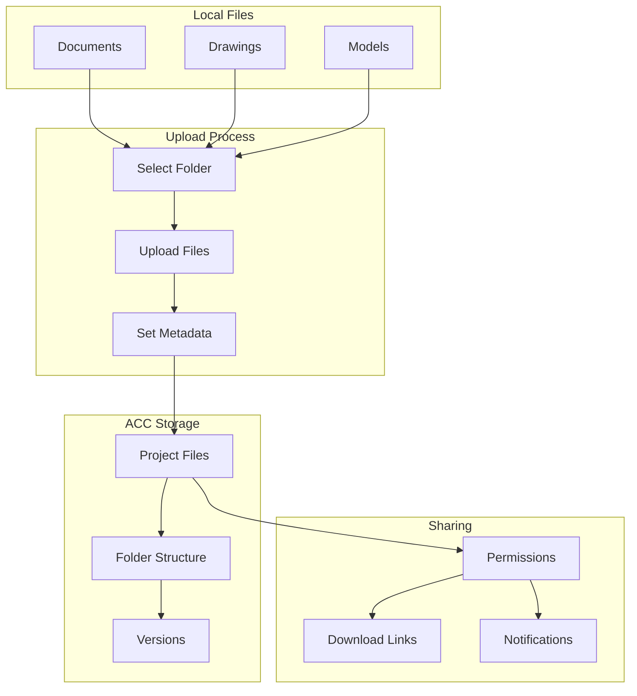
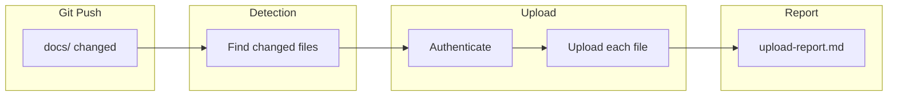
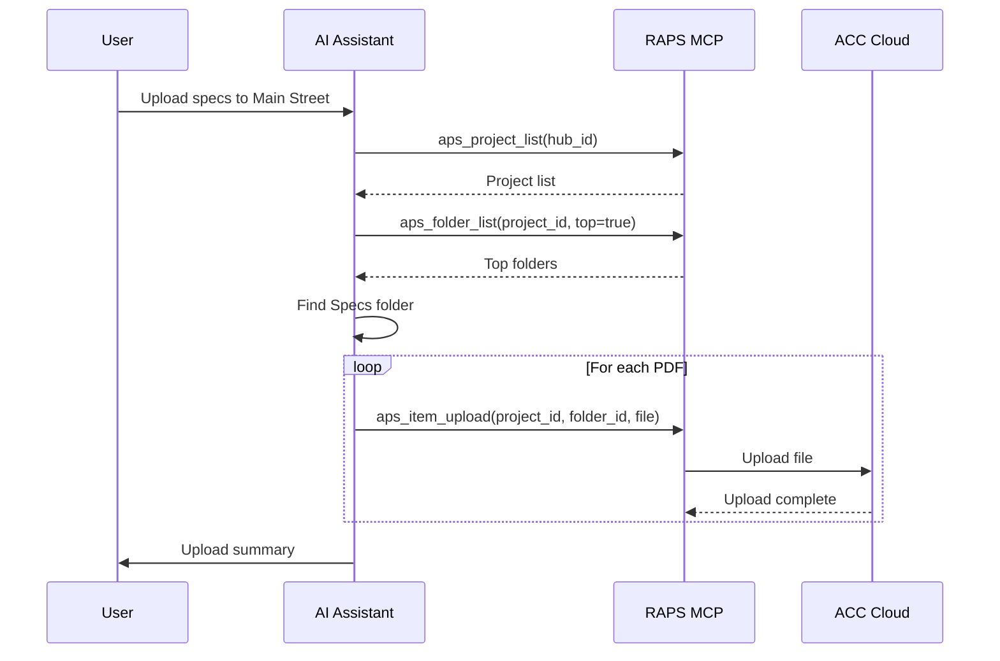

# Document Management

Upload, organize, and share construction documents in ACC/BIM 360.

## Workflow Overview



---

## CLI Approach

### Navigate to Target Folder

```bash
PROJECT_ID="b.project-id"

# List top-level folders
raps folder list "$PROJECT_ID" --top

# Find Project Files folder
FOLDER_ID=$(raps folder list "$PROJECT_ID" --top --output json | \
  jq -r '.[] | select(.name == "Project Files") | .id')

# Create subfolder
raps folder create "$PROJECT_ID" "$FOLDER_ID" --name "Submittals-2024"
```

### Upload Documents

```bash
# Upload single file
raps item upload "$PROJECT_ID" "$FOLDER_ID" ./documents/submittal.pdf

# Upload multiple files
for file in ./documents/*.pdf; do
  raps item upload "$PROJECT_ID" "$FOLDER_ID" "$file"
  echo "Uploaded: $(basename "$file")"
done
```

### Organize with Folder Structure

```bash
# Create folder structure
PARENT_ID="$FOLDER_ID"

for folder in "Specs" "Drawings" "Submittals" "RFIs"; do
  raps folder create "$PROJECT_ID" "$PARENT_ID" --name "$folder"
done

# Upload to specific folders
SPECS_ID=$(raps folder list "$PROJECT_ID" "$PARENT_ID" --output json | \
  jq -r '.[] | select(.name == "Specs") | .id')

for spec in ./specs/*.pdf; do
  raps item upload "$PROJECT_ID" "$SPECS_ID" "$spec"
done
```

### Download Documents

```bash
ITEM_ID="item-123"

# Download latest version
raps item download "$PROJECT_ID" "$ITEM_ID" --output ./downloads/

# Download specific version
VERSION_ID="version-456"
raps item download "$PROJECT_ID" "$ITEM_ID" --version "$VERSION_ID" --output ./downloads/

# Batch download folder contents
raps folder list "$PROJECT_ID" "$FOLDER_ID" --output json | \
  jq -r '.[] | select(.type == "items") | .id' | while read id; do
    raps item download "$PROJECT_ID" "$id" --output ./downloads/
  done
```

---

## CI/CD Pipeline

```yaml
# .github/workflows/document-sync.yml
name: Document Sync Pipeline

on:
  push:
    paths:
      - 'docs/**'
  workflow_dispatch:

env:
  PROJECT_ID: ${{ secrets.ACC_PROJECT_ID }}
  TARGET_FOLDER: ${{ secrets.ACC_DOCS_FOLDER_ID }}

jobs:
  sync-documents:
    runs-on: ubuntu-latest
    steps:
      - uses: actions/checkout@v4
        with:
          fetch-depth: 2

      - name: Install RAPS
        run: cargo install raps

      - name: Authenticate
        env:
          APS_CLIENT_ID: ${{ secrets.APS_CLIENT_ID }}
          APS_CLIENT_SECRET: ${{ secrets.APS_CLIENT_SECRET }}
          APS_REFRESH_TOKEN: ${{ secrets.APS_REFRESH_TOKEN }}
        run: raps auth refresh

      - name: Upload changed documents
        env:
          APS_CLIENT_ID: ${{ secrets.APS_CLIENT_ID }}
          APS_CLIENT_SECRET: ${{ secrets.APS_CLIENT_SECRET }}
        run: |
          CHANGED=$(git diff --name-only HEAD~1 HEAD -- 'docs/**')

          for file in $CHANGED; do
            if [ -f "$file" ]; then
              echo "Uploading: $file"
              raps item upload "$PROJECT_ID" "$TARGET_FOLDER" "$file"
            fi
          done

      - name: Generate upload report
        run: |
          echo "# Document Upload Report" > upload-report.md
          echo "Commit: ${{ github.sha }}" >> upload-report.md
          echo "Date: $(date)" >> upload-report.md
          echo "" >> upload-report.md
          echo "## Uploaded Files" >> upload-report.md

          git diff --name-only HEAD~1 HEAD -- 'docs/**' | while read file; do
            if [ -f "$file" ]; then
              echo "- $file" >> upload-report.md
            fi
          done

      - name: Upload report
        uses: actions/upload-artifact@v4
        with:
          name: upload-report
          path: upload-report.md
```

### Pipeline Flow



---

## MCP Integration

### Upload Documents

```
User: "Upload all the PDF specs to the Main Street project"
```



**AI Response:**
> Uploaded 12 PDF specifications to Main Street project:
>
> **Location:** Project Files / Specs
>
> | File | Size | Status |
> |------|------|--------|
> | 01-General.pdf | 2.4 MB | Uploaded |
> | 02-Site.pdf | 1.8 MB | Uploaded |
> | 03-Concrete.pdf | 3.2 MB | Uploaded |
> | ... | ... | ... |
>
> All files uploaded successfully.

### Download Project Documents

```
User: "Download all drawings from the current project"
```

**AI Response:**
> Downloading drawings from Main Street project...
>
> **Found:** 45 files in Drawings folder
> **Total size:** 234 MB
>
> Progress: [████████████████████] 100%
>
> Downloaded to: ./downloads/Main-Street-Drawings/
> - Architectural/ (18 files)
> - Structural/ (12 files)
> - MEP/ (15 files)

---

## Advanced Operations

### Mirror Folder Structure

```bash
#!/bin/bash
# mirror-to-acc.sh

mirror_folder() {
  local local_path=$1
  local project_id=$2
  local parent_id=$3

  for item in "$local_path"/*; do
    name=$(basename "$item")

    if [ -d "$item" ]; then
      # Create folder and recurse
      NEW_ID=$(raps folder create "$project_id" "$parent_id" --name "$name" --output json | jq -r '.id')
      mirror_folder "$item" "$project_id" "$NEW_ID"
    else
      # Upload file
      raps item upload "$project_id" "$parent_id" "$item"
    fi
  done
}

mirror_folder "./project-docs" "$PROJECT_ID" "$FOLDER_ID"
```

### Version History Export

```bash
ITEM_ID="item-123"

# Get all versions
raps item versions "$PROJECT_ID" "$ITEM_ID" --output json > versions.json

# Export version history
jq -r '["Version", "Date", "User", "Size"], (.[] | [.versionNumber, .createdAt, .createdBy, .size]) | @csv' versions.json > version-history.csv
```

### Search Documents

```bash
# Search by name pattern
raps folder list "$PROJECT_ID" "$FOLDER_ID" --output json | \
  jq -r '.[] | select(.name | test(".*spec.*"; "i")) | .name'

# Search recursively (requires custom script)
search_folder() {
  local project_id=$1
  local folder_id=$2
  local pattern=$3

  raps folder list "$project_id" "$folder_id" --output json | jq -c '.[]' | while read item; do
    type=$(echo "$item" | jq -r '.type')
    name=$(echo "$item" | jq -r '.name')
    id=$(echo "$item" | jq -r '.id')

    if echo "$name" | grep -qi "$pattern"; then
      echo "$name: $id"
    fi

    if [ "$type" = "folders" ]; then
      search_folder "$project_id" "$id" "$pattern"
    fi
  done
}
```

---

## Related

- [Project Navigation](/docs/cookbook-acc-navigation)
- [BIM 360/ACC Sync](/docs/cookbook-aec-acc-sync)
- [Cookbook: Construction](/docs/cookbook-construction)
