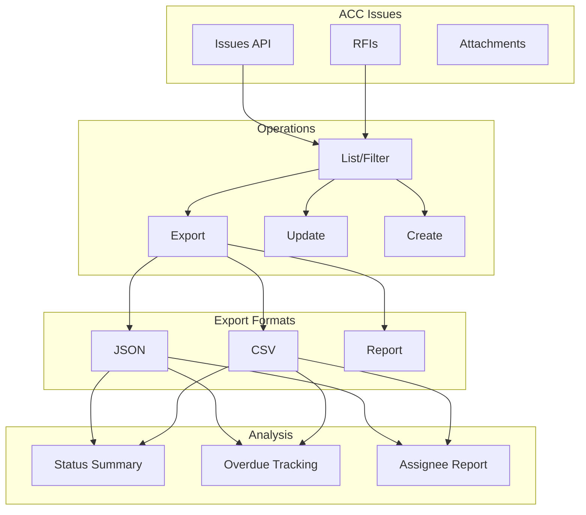
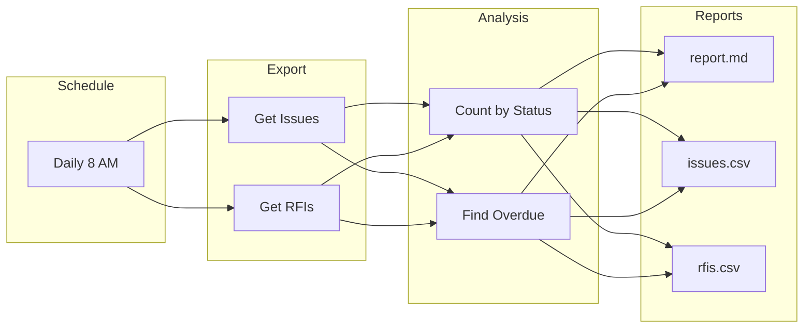
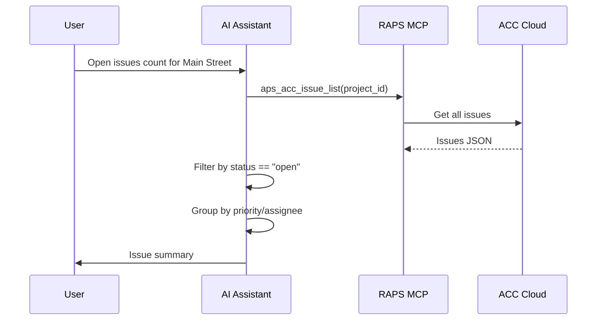

# Issues & RFI Management

Manage issues and RFIs with bulk operations, exports, and automation.

## Workflow Overview



---

## CLI Approach

### List All Issues

```bash
PROJECT_ID="b.project-id"

# List all issues
raps acc issue list "$PROJECT_ID"

# Export to JSON
raps acc issue list "$PROJECT_ID" --output json > issues.json

# Filter open issues
cat issues.json | jq '[.[] | select(.status == "open")]' > open-issues.json
```

### Export Issues to CSV

```bash
cat issues.json | jq -r '
  ["ID", "Title", "Status", "Priority", "Assignee", "Due Date", "Created"],
  (.[] | [
    .id,
    .title,
    .status,
    .priority,
    .assignee,
    .dueDate,
    .createdAt
  ]) | @csv
' > issues-report.csv
```

### Get Issue Details with Attachments

```bash
ISSUE_ID="issue-123"

# Get issue details
raps acc issue get "$PROJECT_ID" "$ISSUE_ID" --output json > issue-detail.json

# List attachments
jq -r '.attachments[] | "\(.id): \(.name)"' issue-detail.json

# Download attachments
jq -r '.attachments[].id' issue-detail.json | while read attach_id; do
  raps acc attachment download "$PROJECT_ID" "$attach_id" --output ./attachments/
done
```

### Find Overdue Issues

```bash
TODAY=$(date +%Y-%m-%d)

cat issues.json | jq --arg today "$TODAY" '
  [.[] | select(.status == "open" and .dueDate != null and .dueDate < $today)]
' > overdue-issues.json

echo "Overdue issues: $(jq 'length' overdue-issues.json)"
```

### RFI Management

```bash
# List all RFIs
raps acc rfi list "$PROJECT_ID" --output json > rfis.json

# Export RFI summary
cat rfis.json | jq -r '
  ["Number", "Subject", "Status", "Ball In Court", "Due Date"],
  (.[] | [.number, .subject, .status, .ballInCourt, .dueDate])
  | @csv
' > rfi-summary.csv

# Find open RFIs
cat rfis.json | jq '[.[] | select(.status == "open")]' > open-rfis.json
```

---

## CI/CD Pipeline

```yaml
# .github/workflows/issue-management.yml
name: Issue Management

on:
  schedule:
    - cron: '0 8 * * 1-5'  # Weekdays at 8 AM
  workflow_dispatch:

env:
  PROJECT_ID: ${{ secrets.ACC_PROJECT_ID }}

jobs:
  issue-report:
    runs-on: ubuntu-latest
    steps:
      - name: Install RAPS
        run: cargo install raps

      - name: Authenticate
        env:
          APS_CLIENT_ID: ${{ secrets.APS_CLIENT_ID }}
          APS_CLIENT_SECRET: ${{ secrets.APS_CLIENT_SECRET }}
          APS_REFRESH_TOKEN: ${{ secrets.APS_REFRESH_TOKEN }}
        run: raps auth refresh

      - name: Export issues
        env:
          APS_CLIENT_ID: ${{ secrets.APS_CLIENT_ID }}
          APS_CLIENT_SECRET: ${{ secrets.APS_CLIENT_SECRET }}
        run: |
          raps acc issue list "$PROJECT_ID" --output json > issues.json
          raps acc rfi list "$PROJECT_ID" --output json > rfis.json

      - name: Generate report
        run: |
          TODAY=$(date +%Y-%m-%d)

          echo "# Issue & RFI Report" > report.md
          echo "Generated: $(date)" >> report.md
          echo "" >> report.md

          # Issues summary
          echo "## Issues Summary" >> report.md
          TOTAL=$(jq 'length' issues.json)
          OPEN=$(jq '[.[] | select(.status == "open")] | length' issues.json)
          OVERDUE=$(jq --arg today "$TODAY" '[.[] | select(.status == "open" and .dueDate < $today)] | length' issues.json)

          echo "- Total: $TOTAL" >> report.md
          echo "- Open: $OPEN" >> report.md
          echo "- Overdue: $OVERDUE" >> report.md
          echo "" >> report.md

          # RFI summary
          echo "## RFI Summary" >> report.md
          RFI_TOTAL=$(jq 'length' rfis.json)
          RFI_OPEN=$(jq '[.[] | select(.status == "open")] | length' rfis.json)

          echo "- Total: $RFI_TOTAL" >> report.md
          echo "- Open: $RFI_OPEN" >> report.md
          echo "" >> report.md

          # Overdue list
          if [ "$OVERDUE" -gt 0 ]; then
            echo "## Overdue Issues" >> report.md
            jq --arg today "$TODAY" -r '
              .[] | select(.status == "open" and .dueDate < $today) |
              "- \(.title) (Due: \(.dueDate), Assignee: \(.assignee))"
            ' issues.json >> report.md
          fi

      - name: Export CSV
        run: |
          jq -r '["ID","Title","Status","Priority","Due Date"], (.[] | [.id,.title,.status,.priority,.dueDate]) | @csv' issues.json > issues.csv
          jq -r '["Number","Subject","Status","Due Date"], (.[] | [.number,.subject,.status,.dueDate]) | @csv' rfis.json > rfis.csv

      - name: Upload reports
        uses: actions/upload-artifact@v4
        with:
          name: issue-reports
          path: |
            report.md
            issues.csv
            rfis.csv
```

### Pipeline Flow



---

## MCP Integration

### Get Issue Summary

```
User: "How many open issues do we have on the Main Street project?"
```



**AI Response:**
> **Main Street Project - Open Issues:**
>
> | Priority | Count |
> |----------|-------|
> | Critical | 2 |
> | High | 8 |
> | Medium | 15 |
> | Low | 5 |
>
> **Total Open:** 30 issues
> **Overdue:** 4 issues
>
> Top assignees:
> - John Smith: 12 issues
> - Jane Doe: 10 issues
> - Bob Wilson: 8 issues

### Find Specific Issues

```
User: "Show me all critical issues that are overdue"
```

**AI Response:**
> **Overdue Critical Issues:**
>
> | ID | Title | Due Date | Assignee |
> |----|-------|----------|----------|
> | ISS-42 | Structural beam clash | Feb 10 | John Smith |
> | ISS-87 | Missing fire rating | Feb 12 | Jane Doe |
>
> Both issues are past due. Would you like me to send a reminder?

### RFI Status

```
User: "What's the status of our RFIs?"
```

**AI Response:**
> **RFI Status Summary:**
>
> - **Open:** 8 RFIs
> - **Answered:** 23 RFIs
> - **Closed:** 45 RFIs
>
> **Pending Response (Ball in Court):**
> | RFI | Subject | Waiting On | Days |
> |-----|---------|------------|------|
> | RFI-034 | Foundation depth | Structural Eng | 5 |
> | RFI-041 | HVAC routing | MEP Consultant | 3 |

---

## Advanced Queries

### Issues by Assignee

```bash
cat issues.json | jq '
  group_by(.assignee) |
  map({assignee: .[0].assignee, count: length, open: [.[] | select(.status == "open")] | length}) |
  sort_by(-.open)'
```

### Issues Timeline

```bash
# Issues created per week
cat issues.json | jq '
  group_by(.createdAt[:10]) |
  map({date: .[0].createdAt[:10], count: length})'
```

### Priority Distribution

```bash
cat issues.json | jq '
  group_by(.priority) |
  map({priority: .[0].priority, count: length, open: [.[] | select(.status == "open")] | length})'
```

---

## Related

- [Checklist Export](/docs/cookbook-acc-checklists)
- [Submittal Tracking](/docs/cookbook-acc-submittals)
- [Cookbook: Construction](/docs/cookbook-construction)
