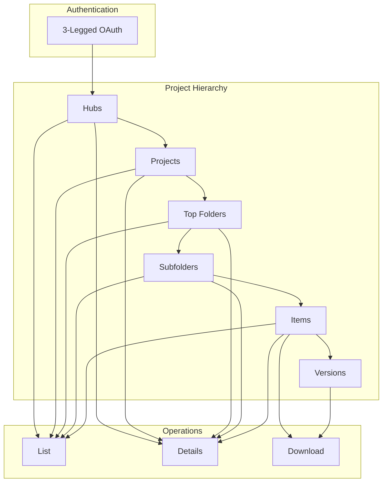
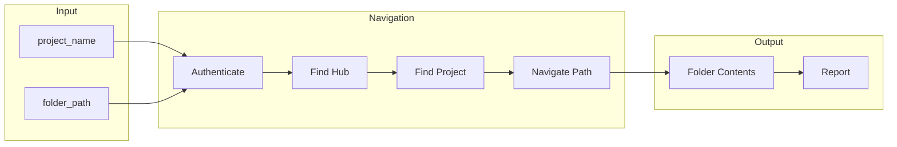
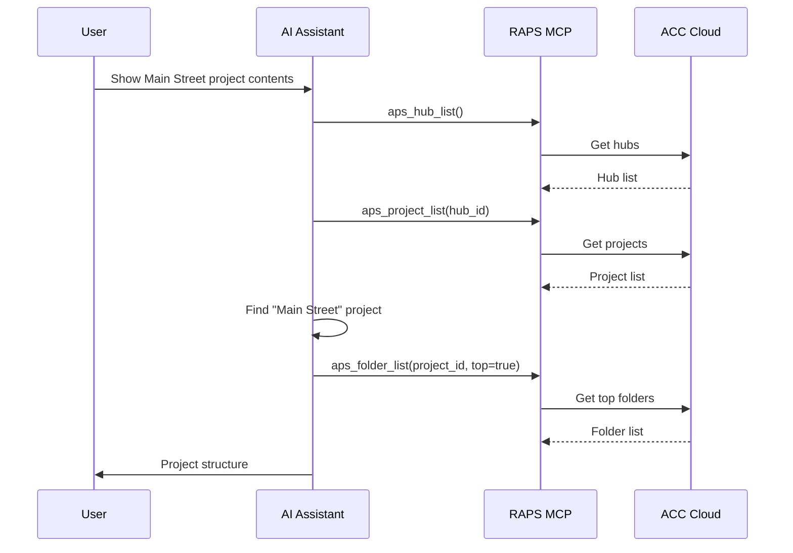

# Project Navigation

Navigate through ACC/BIM 360 project hierarchy to find and access resources.

## Workflow Overview



---

## CLI Approach

### Step 1: Authenticate

```bash
# Login with browser-based OAuth
raps auth login

# Check authentication status
raps auth status
```

### Step 2: List Hubs

```bash
# List all available hubs (accounts)
raps hub list

# Output:
# ID                                    | Name            | Type
# b.12345678-1234-1234-1234-123456789abc | Acme Corp      | BIM 360
# b.87654321-4321-4321-4321-cba987654321 | Beta Inc       | ACC
```

### Step 3: List Projects

```bash
HUB_ID="b.12345678-1234-1234-1234-123456789abc"

# List projects in hub
raps project list "$HUB_ID"

# Get project details
PROJECT_ID="b.project-id"
raps project info "$PROJECT_ID"
```

### Step 4: Browse Folders

```bash
PROJECT_ID="b.project-id"

# List top-level folders (Plans, Project Files, etc.)
raps folder list "$PROJECT_ID" --top

# Output:
# ID                                      | Name           | Type
# urn:adsk.wipprod:fs.folder:abc123       | Plans          | folder
# urn:adsk.wipprod:fs.folder:def456       | Project Files  | folder
# urn:adsk.wipprod:fs.folder:ghi789       | Photos         | folder

# Browse specific folder
FOLDER_ID="urn:adsk.wipprod:fs.folder:abc123"
raps folder list "$PROJECT_ID" "$FOLDER_ID"
```

### Step 5: Find and Access Items

```bash
# List items in folder
raps folder list "$PROJECT_ID" "$FOLDER_ID" --output json > items.json

# Get item details
ITEM_ID=$(jq -r '.[0].id' items.json)
raps item info "$PROJECT_ID" "$ITEM_ID"

# List item versions
raps item versions "$PROJECT_ID" "$ITEM_ID"
```

---

## CI/CD Pipeline

```yaml
# .github/workflows/acc-navigation.yml
name: ACC Project Navigator

on:
  workflow_dispatch:
    inputs:
      project_name:
        description: 'Project name to search for'
        required: true
      folder_path:
        description: 'Folder path (e.g., "Project Files/Models")'
        required: false

jobs:
  navigate:
    runs-on: ubuntu-latest
    steps:
      - name: Install RAPS
        run: cargo install raps

      - name: Authenticate
        env:
          APS_CLIENT_ID: ${{ secrets.APS_CLIENT_ID }}
          APS_CLIENT_SECRET: ${{ secrets.APS_CLIENT_SECRET }}
          APS_REFRESH_TOKEN: ${{ secrets.APS_REFRESH_TOKEN }}
        run: |
          raps auth refresh

      - name: Find project
        env:
          APS_CLIENT_ID: ${{ secrets.APS_CLIENT_ID }}
          APS_CLIENT_SECRET: ${{ secrets.APS_CLIENT_SECRET }}
        run: |
          # Find hub
          HUB_ID=$(raps hub list --output json | jq -r '.[0].id')

          # Find project by name
          PROJECT_ID=$(raps project list "$HUB_ID" --output json | \
            jq -r '.[] | select(.name | contains("${{ inputs.project_name }}")) | .id' | head -1)

          echo "HUB_ID=$HUB_ID" >> $GITHUB_ENV
          echo "PROJECT_ID=$PROJECT_ID" >> $GITHUB_ENV

      - name: Navigate to folder
        env:
          APS_CLIENT_ID: ${{ secrets.APS_CLIENT_ID }}
          APS_CLIENT_SECRET: ${{ secrets.APS_CLIENT_SECRET }}
        run: |
          # List top folders
          raps folder list "$PROJECT_ID" --top --output json > folders.json

          # Navigate path if specified
          if [ -n "${{ inputs.folder_path }}" ]; then
            IFS='/' read -ra PARTS <<< "${{ inputs.folder_path }}"
            CURRENT_FOLDER=""

            for part in "${PARTS[@]}"; do
              if [ -z "$CURRENT_FOLDER" ]; then
                CURRENT_FOLDER=$(cat folders.json | jq -r ".[] | select(.name == \"$part\") | .id")
              else
                raps folder list "$PROJECT_ID" "$CURRENT_FOLDER" --output json > folders.json
                CURRENT_FOLDER=$(cat folders.json | jq -r ".[] | select(.name == \"$part\") | .id")
              fi
            done

            raps folder list "$PROJECT_ID" "$CURRENT_FOLDER" --output json > contents.json
          fi

      - name: Generate report
        run: |
          echo "# Project Navigation Report" > report.md
          echo "Project: ${{ inputs.project_name }}" >> report.md
          echo "" >> report.md

          if [ -f contents.json ]; then
            echo "## Folder Contents" >> report.md
            jq -r '.[] | "- \(.name) (\(.type))"' contents.json >> report.md
          else
            echo "## Top Folders" >> report.md
            jq -r '.[] | "- \(.name)"' folders.json >> report.md
          fi

      - name: Upload report
        uses: actions/upload-artifact@v4
        with:
          name: navigation-report
          path: report.md
```

### Pipeline Flow



---

## MCP Integration

### Browse Project

```
User: "Show me what's in the Main Street project"
```



**AI Response:**
> **Main Street Project Structure:**
>
> - **Plans** (12 items)
> - **Project Files** (45 items)
>   - Models/ (8 files)
>   - Drawings/ (23 files)
>   - Specs/ (14 files)
> - **Photos** (156 items)
> - **Issues** (34 open)
>
> Would you like me to explore any of these folders?

### Find Specific File

```
User: "Find the latest architectural model in Main Street project"
```

**AI Response:**
> Found architectural model in Main Street project:
>
> **File:** MainStreet-Architectural.rvt
> **Location:** Project Files/Models/
> **Version:** 42
> **Last Modified:** Feb 14, 2024 by John Smith
> **Size:** 156 MB
>
> Would you like me to download it or get more details?

---

## Navigation Helpers

### Recursive Folder Listing

```bash
#!/bin/bash
# list-recursive.sh

list_folder() {
  local project_id=$1
  local folder_id=$2
  local prefix=$3

  raps folder list "$project_id" "$folder_id" --output json | \
    jq -r '.[] | "\(.type)|\(.id)|\(.name)"' | while IFS='|' read type id name; do
      echo "${prefix}${name}"
      if [ "$type" = "folders" ]; then
        list_folder "$project_id" "$id" "${prefix}  "
      fi
    done
}

# Usage
PROJECT_ID="b.project-id"
list_folder "$PROJECT_ID" "" ""
```

### Search by Name

```bash
# Search for files matching pattern
PATTERN="*.rvt"

raps folder list "$PROJECT_ID" "$FOLDER_ID" --output json | \
  jq -r --arg pattern "$PATTERN" '.[] | select(.name | test($pattern)) | .name'
```

### Get Full Path

```bash
# Build full path for an item
get_path() {
  local project_id=$1
  local item_id=$2

  # This would require traversing parent folders
  # Implementation depends on item metadata
  raps item info "$project_id" "$item_id" --output json | jq -r '.path // .name'
}
```

---

## Related

- [Document Management](/docs/cookbook-acc-documents)
- [Issues & RFI Management](/docs/cookbook-acc-issues)
- [Cookbook: Construction](/docs/cookbook-construction)
