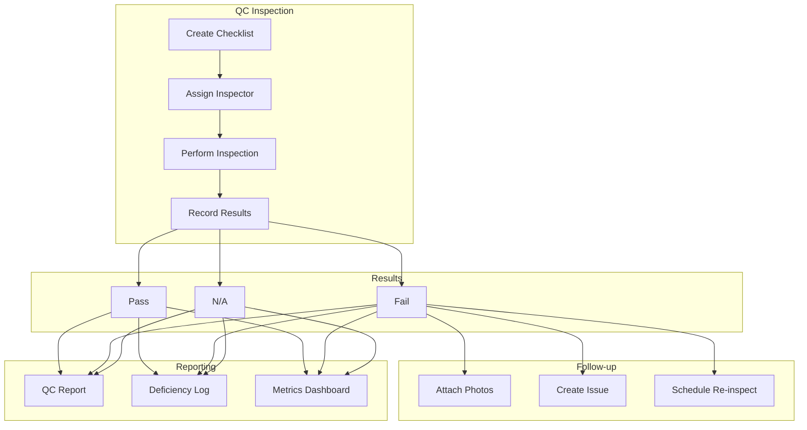
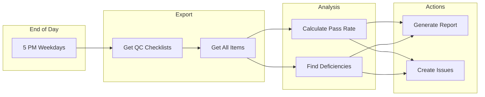
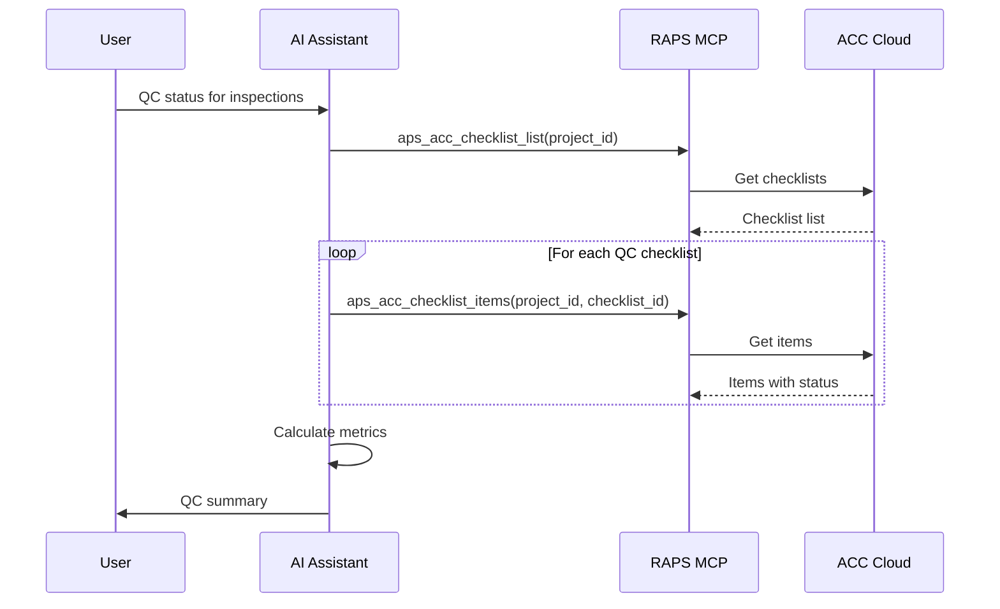

# Quality Control Workflows

Automate quality control inspection tracking and reporting.

## Workflow Overview



---

## CLI Approach

### Create Inspection Record

```bash
PROJECT_ID="b.project-id"
CHECKLIST_ID="checklist-123"

# Get checklist items
raps acc checklist items "$PROJECT_ID" "$CHECKLIST_ID" --output json > items.json

# View items to inspect
jq -r '.[] | "\(.id): \(.title)"' items.json
```

### Update Inspection Status

```bash
ITEM_ID="item-456"

# Mark item as passed
raps acc checklist update-item "$PROJECT_ID" "$CHECKLIST_ID" "$ITEM_ID" --status "passed"

# Mark item as failed with note
raps acc checklist update-item "$PROJECT_ID" "$CHECKLIST_ID" "$ITEM_ID" \
  --status "failed" \
  --note "Missing fire caulking at penetration"

# Attach photo evidence
raps acc checklist attach "$PROJECT_ID" "$CHECKLIST_ID" "$ITEM_ID" ./photos/deficiency.jpg
```

### Generate QC Report

```bash
# Get all items with status
raps acc checklist items "$PROJECT_ID" "$CHECKLIST_ID" --output json > inspection.json

# Generate summary
cat inspection.json | jq '
  {
    total: length,
    passed: [.[] | select(.status == "passed")] | length,
    failed: [.[] | select(.status == "failed")] | length,
    pending: [.[] | select(.status == "pending")] | length,
    na: [.[] | select(.status == "na")] | length
  } |
  . + {
    passRate: (if .total > 0 then ((.passed / (.total - .na)) * 100 | floor) else 0 end)
  }'
```

### Create Issues for Failed Items

```bash
# Find failed items and create issues
jq -r '.[] | select(.status == "failed") | "\(.id)|\(.title)|\(.response)"' inspection.json | \
  while IFS='|' read id title response; do
    raps acc issue create "$PROJECT_ID" \
      --title "QC Deficiency: $title" \
      --description "$response" \
      --priority "high" \
      --type "quality"

    echo "Created issue for: $title"
  done
```

---

## CI/CD Pipeline

```yaml
# .github/workflows/qc-automation.yml
name: QC Automation Pipeline

on:
  schedule:
    - cron: '0 18 * * 1-5'  # End of day, weekdays
  workflow_dispatch:
    inputs:
      checklist_id:
        description: 'Specific checklist ID (optional)'
        required: false

env:
  PROJECT_ID: ${{ secrets.ACC_PROJECT_ID }}

jobs:
  qc-report:
    runs-on: ubuntu-latest
    steps:
      - name: Install RAPS
        run: cargo install raps

      - name: Authenticate
        env:
          APS_CLIENT_ID: ${{ secrets.APS_CLIENT_ID }}
          APS_CLIENT_SECRET: ${{ secrets.APS_CLIENT_SECRET }}
          APS_REFRESH_TOKEN: ${{ secrets.APS_REFRESH_TOKEN }}
        run: raps auth refresh

      - name: Export QC data
        env:
          APS_CLIENT_ID: ${{ secrets.APS_CLIENT_ID }}
          APS_CLIENT_SECRET: ${{ secrets.APS_CLIENT_SECRET }}
        run: |
          mkdir -p ./qc-data

          # Get all QC checklists
          raps acc checklist list "$PROJECT_ID" --output json | \
            jq '[.[] | select(.type | test("quality|inspection"; "i"))]' > ./qc-data/checklists.json

          # Export each checklist's items
          jq -r '.[].id' ./qc-data/checklists.json | while read id; do
            raps acc checklist items "$PROJECT_ID" "$id" --output json > "./qc-data/items-${id}.json"
          done

      - name: Generate QC report
        run: |
          echo "# Daily QC Report" > ./qc-data/report.md
          echo "Generated: $(date)" >> ./qc-data/report.md
          echo "" >> ./qc-data/report.md

          # Aggregate all items
          cat ./qc-data/items-*.json | jq -s 'flatten' > ./qc-data/all-items.json

          # Summary
          TOTAL=$(jq 'length' ./qc-data/all-items.json)
          PASSED=$(jq '[.[] | select(.status == "passed")] | length' ./qc-data/all-items.json)
          FAILED=$(jq '[.[] | select(.status == "failed")] | length' ./qc-data/all-items.json)
          PENDING=$(jq '[.[] | select(.status == "pending")] | length' ./qc-data/all-items.json)

          echo "## Summary" >> ./qc-data/report.md
          echo "| Metric | Value |" >> ./qc-data/report.md
          echo "|--------|-------|" >> ./qc-data/report.md
          echo "| Total Items | $TOTAL |" >> ./qc-data/report.md
          echo "| Passed | $PASSED |" >> ./qc-data/report.md
          echo "| Failed | $FAILED |" >> ./qc-data/report.md
          echo "| Pending | $PENDING |" >> ./qc-data/report.md

          INSPECTED=$((TOTAL - PENDING))
          if [ $INSPECTED -gt 0 ]; then
            RATE=$((PASSED * 100 / INSPECTED))
            echo "| **Pass Rate** | **${RATE}%** |" >> ./qc-data/report.md
          fi

          # Failed items detail
          if [ "$FAILED" -gt 0 ]; then
            echo "" >> ./qc-data/report.md
            echo "## Deficiencies" >> ./qc-data/report.md
            jq -r '.[] | select(.status == "failed") | "- \(.title): \(.response // "No details")"' ./qc-data/all-items.json >> ./qc-data/report.md
          fi

      - name: Create issues for new failures
        env:
          APS_CLIENT_ID: ${{ secrets.APS_CLIENT_ID }}
          APS_CLIENT_SECRET: ${{ secrets.APS_CLIENT_SECRET }}
        run: |
          # Find failed items without linked issues
          jq -r '.[] | select(.status == "failed" and .linkedIssue == null) | "\(.title)|\(.response // "")"' ./qc-data/all-items.json | \
            while IFS='|' read title response; do
              echo "Would create issue for: $title"
              # Uncomment to actually create:
              # raps acc issue create "$PROJECT_ID" --title "QC: $title" --description "$response"
            done

      - name: Upload report
        uses: actions/upload-artifact@v4
        with:
          name: qc-report
          path: ./qc-data/
```

### Pipeline Flow



---

## MCP Integration

### Get QC Status

```
User: "What's our quality status for the current inspections?"
```



**AI Response:**
> **Quality Control Status:**
>
> | Inspection Area | Pass Rate | Items |
> |-----------------|-----------|-------|
> | Level 3 MEP | 95% | 42/44 |
> | Level 2 Structural | 100% | 28/28 |
> | Level 1 Finishes | 82% | 37/45 |
> | Exterior Envelope | 88% | 22/25 |
>
> **Overall Pass Rate:** 91%
>
> **Active Deficiencies:** 12
> - 5 pending re-inspection
> - 4 under repair
> - 3 newly identified

### Log Inspection Result

```
User: "Mark the fire damper inspection as failed - damper not installed at level 2 shaft"
```

**AI Response:**
> Logged inspection failure:
>
> **Item:** Fire Damper Installation
> **Status:** Failed
> **Location:** Level 2, Shaft A
> **Note:** Damper not installed at level 2 shaft
>
> **Actions taken:**
> - Updated checklist item status
> - Created Issue #ISS-234 for tracking
> - Assigned to MEP contractor for resolution
>
> Would you like to attach a photo?

---

## Metrics and Dashboards

### Pass Rate by Area

```bash
cat all-items.json | jq '
  group_by(.area) |
  map({
    area: .[0].area,
    total: length,
    passed: [.[] | select(.status == "passed")] | length,
    passRate: ([.[] | select(.status == "passed")] | length) * 100 / length | floor
  }) |
  sort_by(-.passRate)'
```

### Deficiency Trend

```bash
cat all-items.json | jq '
  [.[] | select(.status == "failed")] |
  group_by(.failedAt[:10]) |
  map({date: .[0].failedAt[:10], count: length})'
```

### Inspector Performance

```bash
cat all-items.json | jq '
  group_by(.inspector) |
  map({
    inspector: .[0].inspector,
    inspected: length,
    passed: [.[] | select(.status == "passed")] | length
  })'
```

---

## Related

- [Checklist Export](/docs/cookbook-acc-checklists)
- [Issues & RFI Management](/docs/cookbook-acc-issues)
- [Cookbook: Construction](/docs/cookbook-construction)
