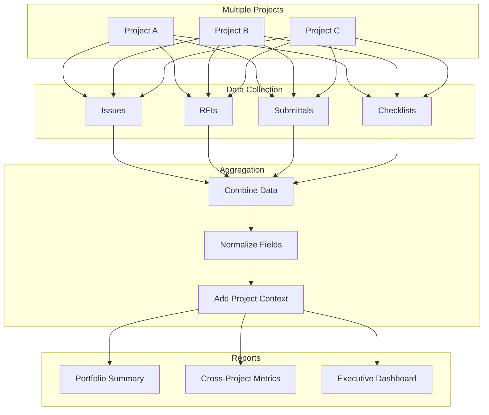
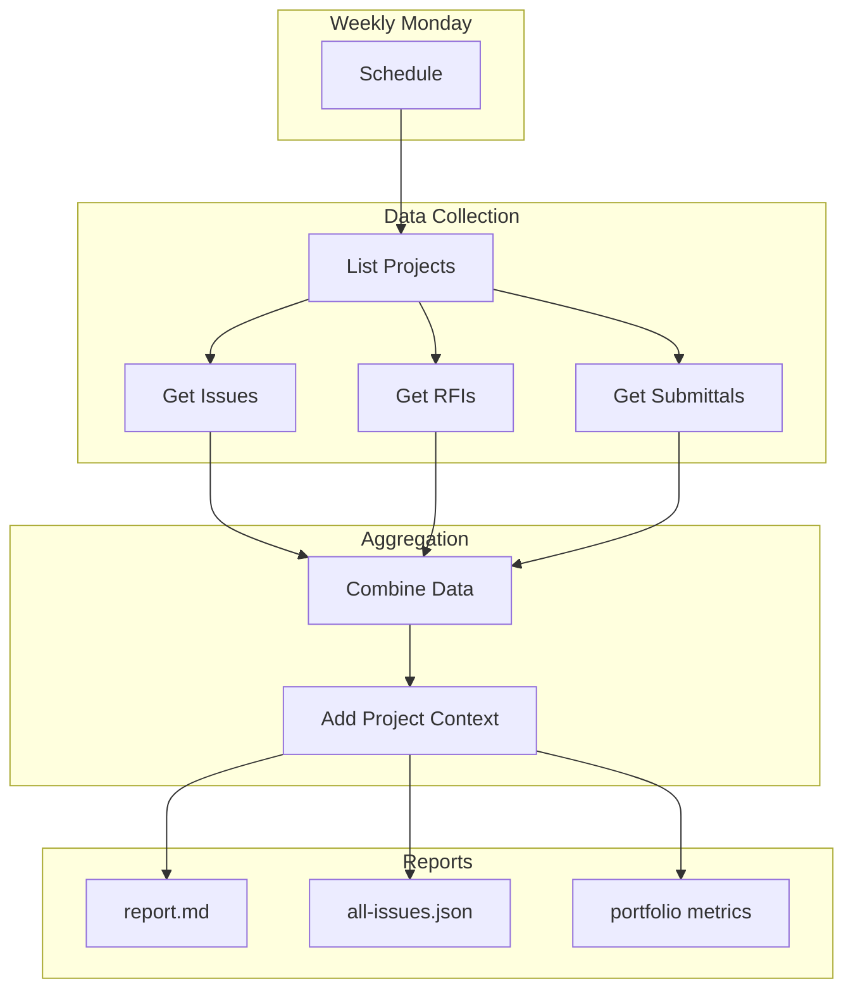
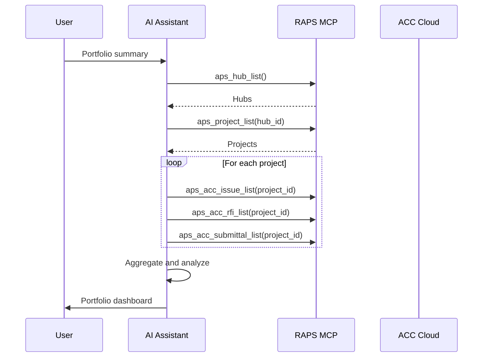

# Cross-Project Reporting

Aggregate and analyze data across multiple ACC projects for portfolio insights.

## Workflow Overview



---

## CLI Approach

### Get All Projects

```bash
HUB_ID="b.hub-id"

# List all projects
raps project list "$HUB_ID" --output json > projects.json

# Filter active construction projects
cat projects.json | jq '[.[] | select(.status == "active")]' > active-projects.json
```

### Aggregate Issues Across Projects

```bash
# Collect issues from all projects
echo '[]' > all-issues.json

jq -r '.[].id' active-projects.json | while read proj_id; do
  PROJ_NAME=$(jq -r ".[] | select(.id == \"$proj_id\") | .name" active-projects.json)

  raps acc issue list "$proj_id" --output json 2>/dev/null | \
    jq --arg proj "$proj_id" --arg name "$PROJ_NAME" \
    '[.[] | . + {projectId: $proj, projectName: $name}]' >> temp-issues.json
done

# Combine all
cat temp-issues.json | jq -s 'flatten' > all-issues.json
rm temp-issues.json
```

### Portfolio Summary

```bash
# Generate portfolio-wide summary
cat all-issues.json | jq '
  {
    totalIssues: length,
    openIssues: [.[] | select(.status == "open")] | length,
    byProject: (group_by(.projectName) | map({
      project: .[0].projectName,
      total: length,
      open: [.[] | select(.status == "open")] | length
    })),
    byPriority: (group_by(.priority) | map({
      priority: .[0].priority,
      count: length
    }))
  }'
```

### Cross-Project Comparison

```bash
# Compare metrics across projects
echo "# Portfolio Comparison" > portfolio-report.md
echo "" >> portfolio-report.md

jq -r '.[].id' active-projects.json | while read proj_id; do
  PROJ_NAME=$(jq -r ".[] | select(.id == \"$proj_id\") | .name" active-projects.json)

  # Get metrics
  ISSUES=$(jq --arg p "$proj_id" '[.[] | select(.projectId == $p)] | length' all-issues.json)
  OPEN=$(jq --arg p "$proj_id" '[.[] | select(.projectId == $p and .status == "open")] | length' all-issues.json)

  echo "## $PROJ_NAME" >> portfolio-report.md
  echo "- Total Issues: $ISSUES" >> portfolio-report.md
  echo "- Open Issues: $OPEN" >> portfolio-report.md
  echo "" >> portfolio-report.md
done
```

---

## CI/CD Pipeline

```yaml
# .github/workflows/portfolio-report.yml
name: Portfolio Reporting

on:
  schedule:
    - cron: '0 6 * * 1'  # Weekly on Monday
  workflow_dispatch:

env:
  HUB_ID: ${{ secrets.ACC_HUB_ID }}

jobs:
  portfolio-report:
    runs-on: ubuntu-latest
    steps:
      - name: Install RAPS
        run: cargo install raps

      - name: Authenticate
        env:
          APS_CLIENT_ID: ${{ secrets.APS_CLIENT_ID }}
          APS_CLIENT_SECRET: ${{ secrets.APS_CLIENT_SECRET }}
          APS_REFRESH_TOKEN: ${{ secrets.APS_REFRESH_TOKEN }}
        run: raps auth refresh

      - name: Get all projects
        env:
          APS_CLIENT_ID: ${{ secrets.APS_CLIENT_ID }}
          APS_CLIENT_SECRET: ${{ secrets.APS_CLIENT_SECRET }}
        run: |
          mkdir -p ./portfolio

          raps project list "$HUB_ID" --output json > ./portfolio/projects.json
          jq '[.[] | select(.status == "active")]' ./portfolio/projects.json > ./portfolio/active.json

      - name: Collect cross-project data
        env:
          APS_CLIENT_ID: ${{ secrets.APS_CLIENT_ID }}
          APS_CLIENT_SECRET: ${{ secrets.APS_CLIENT_SECRET }}
        run: |
          echo '[]' > ./portfolio/all-issues.json
          echo '[]' > ./portfolio/all-rfis.json
          echo '[]' > ./portfolio/all-submittals.json

          jq -r '.[].id' ./portfolio/active.json | while read proj_id; do
            NAME=$(jq -r ".[] | select(.id == \"$proj_id\") | .name" ./portfolio/active.json)

            # Issues
            raps acc issue list "$proj_id" --output json 2>/dev/null | \
              jq --arg p "$proj_id" --arg n "$NAME" '[.[] | . + {projectId: $p, projectName: $n}]' >> ./portfolio/temp-issues.json || true

            # RFIs
            raps acc rfi list "$proj_id" --output json 2>/dev/null | \
              jq --arg p "$proj_id" --arg n "$NAME" '[.[] | . + {projectId: $p, projectName: $n}]' >> ./portfolio/temp-rfis.json || true

            # Submittals
            raps acc submittal list "$proj_id" --output json 2>/dev/null | \
              jq --arg p "$proj_id" --arg n "$NAME" '[.[] | . + {projectId: $p, projectName: $n}]' >> ./portfolio/temp-submittals.json || true
          done

          # Combine files
          cat ./portfolio/temp-issues.json 2>/dev/null | jq -s 'flatten' > ./portfolio/all-issues.json || echo '[]' > ./portfolio/all-issues.json
          cat ./portfolio/temp-rfis.json 2>/dev/null | jq -s 'flatten' > ./portfolio/all-rfis.json || echo '[]' > ./portfolio/all-rfis.json
          cat ./portfolio/temp-submittals.json 2>/dev/null | jq -s 'flatten' > ./portfolio/all-submittals.json || echo '[]' > ./portfolio/all-submittals.json

      - name: Generate portfolio report
        run: |
          echo "# Portfolio Report" > ./portfolio/report.md
          echo "Generated: $(date)" >> ./portfolio/report.md
          echo "" >> ./portfolio/report.md

          PROJECTS=$(jq 'length' ./portfolio/active.json)
          echo "## Overview" >> ./portfolio/report.md
          echo "Active Projects: $PROJECTS" >> ./portfolio/report.md
          echo "" >> ./portfolio/report.md

          # Issues summary
          echo "## Issues Summary" >> ./portfolio/report.md
          TOTAL_ISSUES=$(jq 'length' ./portfolio/all-issues.json)
          OPEN_ISSUES=$(jq '[.[] | select(.status == "open")] | length' ./portfolio/all-issues.json)
          echo "- Total: $TOTAL_ISSUES" >> ./portfolio/report.md
          echo "- Open: $OPEN_ISSUES" >> ./portfolio/report.md
          echo "" >> ./portfolio/report.md

          # By project table
          echo "## By Project" >> ./portfolio/report.md
          echo "| Project | Issues | Open | RFIs | Submittals |" >> ./portfolio/report.md
          echo "|---------|--------|------|------|------------|" >> ./portfolio/report.md

          jq -r '.[].name' ./portfolio/active.json | while read name; do
            ISSUES=$(jq --arg n "$name" '[.[] | select(.projectName == $n)] | length' ./portfolio/all-issues.json)
            OPEN=$(jq --arg n "$name" '[.[] | select(.projectName == $n and .status == "open")] | length' ./portfolio/all-issues.json)
            RFIS=$(jq --arg n "$name" '[.[] | select(.projectName == $n)] | length' ./portfolio/all-rfis.json)
            SUBS=$(jq --arg n "$name" '[.[] | select(.projectName == $n)] | length' ./portfolio/all-submittals.json)
            echo "| $name | $ISSUES | $OPEN | $RFIS | $SUBS |" >> ./portfolio/report.md
          done

      - name: Upload report
        uses: actions/upload-artifact@v4
        with:
          name: portfolio-report
          path: ./portfolio/
```

### Pipeline Flow



---

## MCP Integration

### Get Portfolio Overview

```
User: "Give me a summary across all our active construction projects"
```



**AI Response:**
> **Portfolio Summary - 5 Active Projects**
>
> | Project | Issues | RFIs | Submittals | Status |
> |---------|--------|------|------------|--------|
> | Main Street Tower | 45 (12 open) | 23 | 89 | On Track |
> | Riverside Complex | 32 (8 open) | 18 | 67 | Minor Delays |
> | Tech Campus Ph2 | 28 (5 open) | 12 | 45 | On Track |
> | Harbor View | 56 (18 open) | 31 | 102 | At Risk |
> | Metro Station | 19 (3 open) | 8 | 34 | On Track |
>
> **Portfolio Totals:**
> - Total Open Issues: 46
> - Total Open RFIs: 28
> - Pending Submittals: 45
>
> **Attention:** Harbor View has high open issue count.

### Compare Projects

```
User: "Compare issue resolution rates across projects"
```

**AI Response:**
> **Issue Resolution Rate Comparison:**
>
> | Project | Created | Resolved | Rate | Avg Days |
> |---------|---------|----------|------|----------|
> | Tech Campus Ph2 | 45 | 40 | 89% | 5.2 |
> | Metro Station | 28 | 24 | 86% | 6.1 |
> | Main Street Tower | 78 | 65 | 83% | 7.4 |
> | Riverside Complex | 52 | 42 | 81% | 8.2 |
> | Harbor View | 89 | 58 | 65% | 12.3 |
>
> **Insight:** Harbor View has significantly lower resolution rate and longer time to resolve. Consider increasing issue management resources.

---

## Dashboard Queries

### Critical Items Across Portfolio

```bash
cat all-issues.json | jq '
  [.[] | select(.priority == "critical" and .status == "open")] |
  group_by(.projectName) |
  map({project: .[0].projectName, criticalOpen: length, issues: [.[] | .title]})'
```

### Overdue Items Summary

```bash
TODAY=$(date +%Y-%m-%d)

echo "Overdue items by project:"
for type in issues rfis submittals; do
  echo "=== $type ==="
  cat "./portfolio/all-${type}.json" | jq --arg today "$TODAY" '
    [.[] | select(.dueDate != null and .dueDate < $today and .status == "open")] |
    group_by(.projectName) |
    map({project: .[0].projectName, overdue: length})'
done
```

### Weekly Trend

```bash
# Issues created per week across portfolio
cat all-issues.json | jq '
  group_by(.createdAt[:10] | strptime("%Y-%m-%d") | strftime("%Y-W%V")) |
  map({week: .[0].createdAt[:10] | strptime("%Y-%m-%d") | strftime("%Y-W%V"), created: length}) |
  sort_by(.week)'
```

---

## Related

- [Daily Log Automation](/docs/cookbook-acc-dailylog)
- [Issues & RFI Management](/docs/cookbook-acc-issues)
- [Cookbook: Construction](/docs/cookbook-construction)
