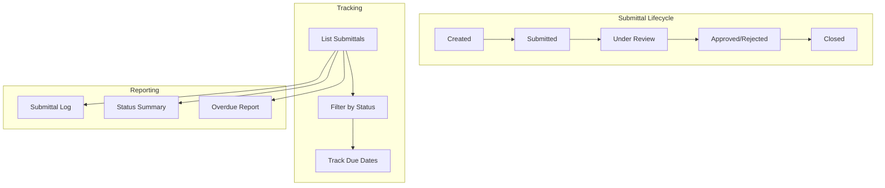
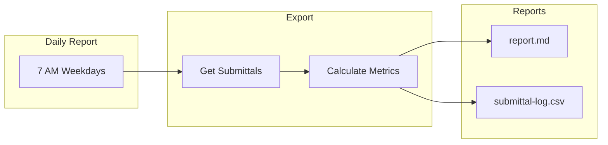
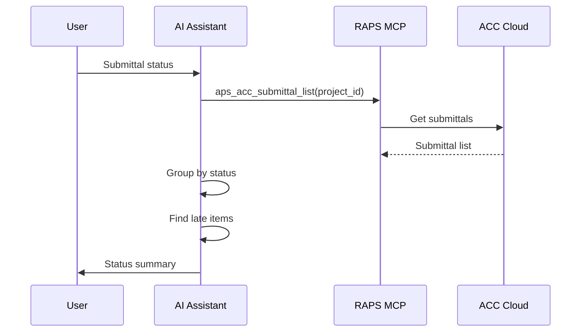

# Submittal Tracking

Track submittals, manage approvals, and generate status reports.

## Workflow Overview



---

## CLI Approach

### List All Submittals

```bash
PROJECT_ID="b.project-id"

# List all submittals
raps acc submittal list "$PROJECT_ID"

# Export to JSON
raps acc submittal list "$PROJECT_ID" --output json > submittals.json
```

### Filter by Status

```bash
# Get open submittals
cat submittals.json | jq '[.[] | select(.status == "open")]' > open-submittals.json

# Get pending review
cat submittals.json | jq '[.[] | select(.status == "under_review")]' > pending-review.json

# Get approved
cat submittals.json | jq '[.[] | select(.status == "approved")]' > approved.json
```

### Export Submittal Log

```bash
cat submittals.json | jq -r '
  ["Number", "Title", "Spec Section", "Status", "Submitted", "Required", "Approved"],
  (.[] | [
    .number,
    .title,
    .specSection,
    .status,
    .submittedDate,
    .requiredDate,
    .approvedDate // ""
  ]) | @csv
' > submittal-log.csv
```

### Find Late Submittals

```bash
TODAY=$(date +%Y-%m-%d)

cat submittals.json | jq --arg today "$TODAY" '
  [.[] | select(.status != "approved" and .requiredDate != null and .requiredDate < $today)]
' > late-submittals.json

echo "Late submittals: $(jq 'length' late-submittals.json)"

# Detail report
jq -r '.[] | "- \(.number): \(.title) (Due: \(.requiredDate))"' late-submittals.json
```

### Status Summary

```bash
cat submittals.json | jq '
  group_by(.status) |
  map({status: .[0].status, count: length}) |
  sort_by(-.count)'
```

---

## CI/CD Pipeline

```yaml
# .github/workflows/submittal-tracking.yml
name: Submittal Tracking Report

on:
  schedule:
    - cron: '0 7 * * 1-5'  # Weekdays at 7 AM
  workflow_dispatch:

env:
  PROJECT_ID: ${{ secrets.ACC_PROJECT_ID }}

jobs:
  submittal-report:
    runs-on: ubuntu-latest
    steps:
      - name: Install RAPS
        run: cargo install raps

      - name: Authenticate
        env:
          APS_CLIENT_ID: ${{ secrets.APS_CLIENT_ID }}
          APS_CLIENT_SECRET: ${{ secrets.APS_CLIENT_SECRET }}
          APS_REFRESH_TOKEN: ${{ secrets.APS_REFRESH_TOKEN }}
        run: raps auth refresh

      - name: Export submittals
        env:
          APS_CLIENT_ID: ${{ secrets.APS_CLIENT_ID }}
          APS_CLIENT_SECRET: ${{ secrets.APS_CLIENT_SECRET }}
        run: |
          raps acc submittal list "$PROJECT_ID" --output json > submittals.json

      - name: Generate report
        run: |
          TODAY=$(date +%Y-%m-%d)

          echo "# Submittal Status Report" > report.md
          echo "Generated: $(date)" >> report.md
          echo "" >> report.md

          # Summary
          TOTAL=$(jq 'length' submittals.json)
          OPEN=$(jq '[.[] | select(.status == "open")] | length' submittals.json)
          REVIEW=$(jq '[.[] | select(.status == "under_review")] | length' submittals.json)
          APPROVED=$(jq '[.[] | select(.status == "approved")] | length' submittals.json)
          LATE=$(jq --arg today "$TODAY" '[.[] | select(.status != "approved" and .requiredDate < $today)] | length' submittals.json)

          echo "## Summary" >> report.md
          echo "| Status | Count |" >> report.md
          echo "|--------|-------|" >> report.md
          echo "| Total | $TOTAL |" >> report.md
          echo "| Open | $OPEN |" >> report.md
          echo "| Under Review | $REVIEW |" >> report.md
          echo "| Approved | $APPROVED |" >> report.md
          echo "| **Late** | **$LATE** |" >> report.md
          echo "" >> report.md

          # Late submittals
          if [ "$LATE" -gt 0 ]; then
            echo "## Late Submittals" >> report.md
            echo "| Number | Title | Required | Days Late |" >> report.md
            echo "|--------|-------|----------|-----------|" >> report.md

            jq --arg today "$TODAY" -r '
              .[] |
              select(.status != "approved" and .requiredDate != null and .requiredDate < $today) |
              "| \(.number) | \(.title) | \(.requiredDate) | - |"
            ' submittals.json >> report.md
          fi

      - name: Export CSV
        run: |
          jq -r '
            ["Number","Title","Spec","Status","Required","Submitted"],
            (.[] | [.number, .title, .specSection, .status, .requiredDate, .submittedDate])
            | @csv
          ' submittals.json > submittal-log.csv

      - name: Upload reports
        uses: actions/upload-artifact@v4
        with:
          name: submittal-reports
          path: |
            report.md
            submittal-log.csv
```

### Pipeline Flow



---

## MCP Integration

### Get Submittal Status

```
User: "What's the status of our submittals?"
```



**AI Response:**
> **Submittal Status Summary:**
>
> | Status | Count | % |
> |--------|-------|---|
> | Approved | 45 | 60% |
> | Under Review | 12 | 16% |
> | Open | 15 | 20% |
> | Rejected | 3 | 4% |
>
> **Attention Required:**
> - 4 submittals are past due
> - 3 rejected submittals need resubmission
>
> **Upcoming (Next 7 Days):**
> - SUB-089: Structural Steel Shop Drawings (Due: Feb 18)
> - SUB-092: HVAC Equipment (Due: Feb 20)

### Find Late Submittals

```
User: "Show me all late submittals"
```

**AI Response:**
> **Late Submittals (4):**
>
> | Number | Title | Spec | Required | Days Late |
> |--------|-------|------|----------|-----------|
> | SUB-045 | Door Hardware | 08 71 00 | Feb 10 | 5 |
> | SUB-052 | Roofing Materials | 07 50 00 | Feb 12 | 3 |
> | SUB-061 | Light Fixtures | 26 51 00 | Feb 13 | 2 |
> | SUB-063 | Plumbing Fixtures | 22 40 00 | Feb 14 | 1 |
>
> Would you like me to send reminders to the responsible parties?

---

## Advanced Reports

### By Spec Section

```bash
cat submittals.json | jq '
  group_by(.specSection) |
  map({
    section: .[0].specSection,
    total: length,
    approved: [.[] | select(.status == "approved")] | length,
    pending: [.[] | select(.status != "approved")] | length
  }) |
  sort_by(.section)'
```

### Lead Time Analysis

```bash
cat submittals.json | jq '
  [.[] | select(.submittedDate != null and .approvedDate != null) |
   {
     number: .number,
     submitted: .submittedDate,
     approved: .approvedDate
   }]'
# Note: Calculate days between dates with additional processing
```

### Approval Rate by Month

```bash
cat submittals.json | jq '
  [.[] | select(.approvedDate != null)] |
  group_by(.approvedDate[:7]) |
  map({month: .[0].approvedDate[:7], approved: length})'
```

---

## Related

- [Issues & RFI Management](/docs/cookbook-acc-issues)
- [Checklist Export](/docs/cookbook-acc-checklists)
- [Cookbook: Construction](/docs/cookbook-construction)
