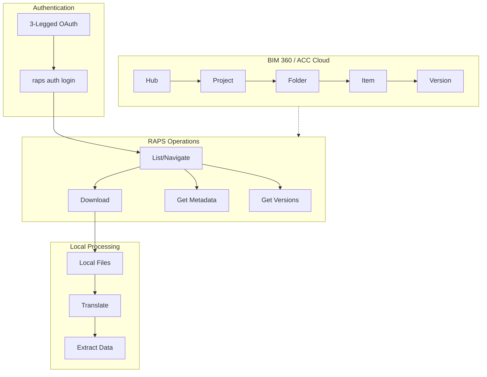
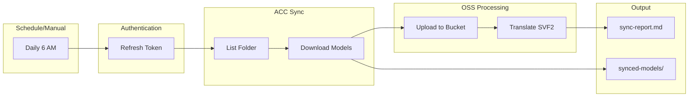
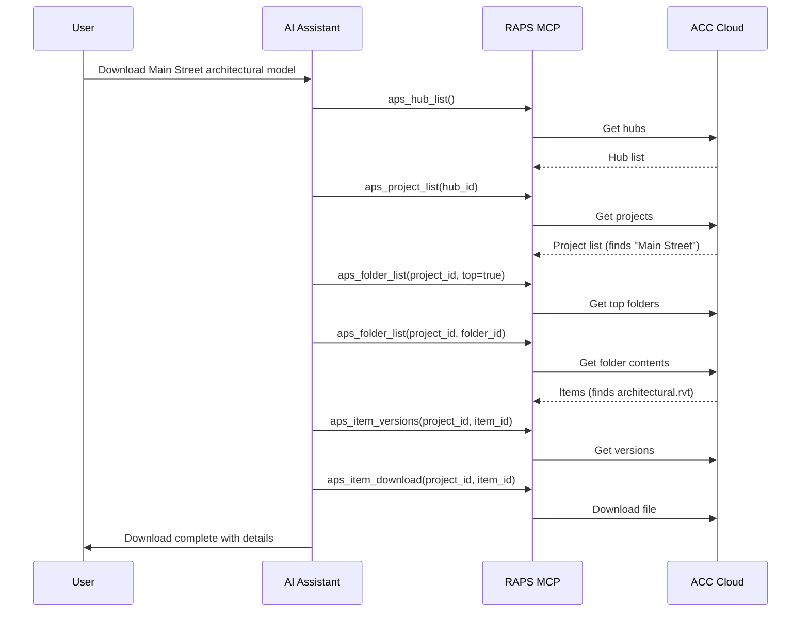

# BIM 360/ACC Sync

Download models from BIM 360/ACC and process locally.

## Workflow Overview



---

## CLI Approach

### Step 1: Authenticate

```bash
# Login with 3-legged OAuth (opens browser)
raps auth login

# Or use existing refresh token
raps auth refresh
```

### Step 2: Navigate Project Hierarchy

```bash
# List all hubs (accounts)
raps hub list

# Save hub ID
HUB_ID="b.your-hub-id"

# List projects in hub
raps project list "$HUB_ID"

# Save project ID
PROJECT_ID="b.your-project-id"

# List top-level folders
raps folder list "$PROJECT_ID" --top

# List contents of specific folder
FOLDER_ID="urn:adsk.wipprod:fs.folder:abc123"
raps folder list "$PROJECT_ID" "$FOLDER_ID"
```

### Step 3: Download Files

```bash
# List items in folder
raps folder list "$PROJECT_ID" "$FOLDER_ID" --output json > items.json

# Download specific item
ITEM_ID=$(jq -r '.[0].id' items.json)
raps item download "$PROJECT_ID" "$ITEM_ID" --output ./downloads/

# Download all items in folder
jq -r '.[].id' items.json | while read item_id; do
  raps item download "$PROJECT_ID" "$item_id" --output ./downloads/
done
```

### Step 4: Get Version History

```bash
# List all versions of an item
raps item versions "$PROJECT_ID" "$ITEM_ID" --output json > versions.json

# Download specific version
VERSION_ID=$(jq -r '.[0].id' versions.json)
raps item download "$PROJECT_ID" "$ITEM_ID" --version "$VERSION_ID" --output ./downloads/
```

---

## CI/CD Pipeline

```yaml
# .github/workflows/acc-sync.yml
name: ACC Model Sync

on:
  schedule:
    - cron: '0 6 * * *'  # Daily at 6 AM
  workflow_dispatch:

env:
  HUB_ID: ${{ secrets.ACC_HUB_ID }}
  PROJECT_ID: ${{ secrets.ACC_PROJECT_ID }}
  FOLDER_ID: ${{ secrets.ACC_MODELS_FOLDER_ID }}

jobs:
  sync-models:
    runs-on: ubuntu-latest
    steps:
      - uses: actions/checkout@v4

      - name: Install RAPS
        run: cargo install raps

      - name: Authenticate with ACC
        env:
          APS_CLIENT_ID: ${{ secrets.APS_CLIENT_ID }}
          APS_CLIENT_SECRET: ${{ secrets.APS_CLIENT_SECRET }}
          APS_REFRESH_TOKEN: ${{ secrets.APS_REFRESH_TOKEN }}
        run: |
          raps auth refresh

      - name: Sync models from ACC
        env:
          APS_CLIENT_ID: ${{ secrets.APS_CLIENT_ID }}
          APS_CLIENT_SECRET: ${{ secrets.APS_CLIENT_SECRET }}
        run: |
          mkdir -p ./synced-models

          # List and download all Revit models
          raps folder list "$PROJECT_ID" "$FOLDER_ID" --output json | \
            jq -r '.[] | select(.name | endswith(".rvt")) | .id' | \
            while read item_id; do
              raps item download "$PROJECT_ID" "$item_id" --output ./synced-models/
            done

      - name: Upload to OSS for processing
        env:
          APS_CLIENT_ID: ${{ secrets.APS_CLIENT_ID }}
          APS_CLIENT_SECRET: ${{ secrets.APS_CLIENT_SECRET }}
        run: |
          BUCKET="acc-synced-$(date +%Y%m%d)"
          raps bucket create --key "$BUCKET" --policy transient --region US 2>/dev/null || true

          for model in ./synced-models/*.rvt; do
            [ -f "$model" ] || continue

            key=$(basename "$model")
            raps object upload "$BUCKET" "$model"

            URN=$(raps object urn "$BUCKET" "$key" --output plain)
            raps translate start "$URN" --format svf2
          done

      - name: Generate sync report
        run: |
          echo "# ACC Sync Report" > sync-report.md
          echo "Date: $(date)" >> sync-report.md
          echo "" >> sync-report.md
          echo "## Synced Files" >> sync-report.md
          ls -la ./synced-models/ >> sync-report.md

      - name: Upload artifacts
        uses: actions/upload-artifact@v4
        with:
          name: sync-report
          path: |
            sync-report.md
            ./synced-models/
```

### Pipeline Flow



---

## MCP Integration

### Navigate and Download

```
User: "Download the latest architectural model from the Main Street project in ACC"
```



**AI Response:**
> Downloaded 'MainStreet-Architectural-v42.rvt' (156 MB)
> - **Last modified:** Feb 14, 2024 by John Smith
> - **Version:** 42
> - **Saved to:** ./downloads/MainStreet-Architectural-v42.rvt

### List Recent Changes

```
User: "Show me what models changed in the Main Street project this week"
```

**AI Response:**
> Files modified in Main Street project (Feb 12-16, 2024):
>
> | File | Modified | By | Version |
> |------|----------|-----|---------|
> | Architectural.rvt | Feb 14 | John Smith | v42 |
> | MEP.rvt | Feb 13 | Jane Doe | v28 |
> | Structural.rvt | Feb 12 | Bob Wilson | v31 |
>
> Would you like me to download any of these?

### Sync and Process

```
User: "Sync all the Revit models from the Design folder and translate them"
```

**AI Response:**
> Syncing 5 models from Design folder...
>
> | File | Size | Status |
> |------|------|--------|
> | Building-A.rvt | 124 MB | Downloaded, translating... |
> | Building-B.rvt | 98 MB | Downloaded, translating... |
> | Site.rvt | 45 MB | Downloaded, translated |
> | Landscape.rvt | 23 MB | Downloaded, translated |
> | Parking.rvt | 67 MB | Downloaded, translating... |
>
> All files synced. 3 translations in progress, 2 complete.

---

## Common Patterns

### Incremental Sync

```bash
# Track last sync time
LAST_SYNC=$(cat .last-sync 2>/dev/null || echo "1970-01-01")

# Get items modified since last sync
raps folder list "$PROJECT_ID" "$FOLDER_ID" --output json | \
  jq --arg since "$LAST_SYNC" '[.[] | select(.lastModified > $since)]' | \
  jq -r '.[].id' | while read item_id; do
    raps item download "$PROJECT_ID" "$item_id" --output ./synced/
  done

# Update last sync time
date -Iseconds > .last-sync
```

### Mirror Folder Structure

```bash
# Recursively sync folder structure
sync_folder() {
  local project_id=$1
  local folder_id=$2
  local local_path=$3

  mkdir -p "$local_path"

  raps folder list "$project_id" "$folder_id" --output json | while read -r item; do
    type=$(echo "$item" | jq -r '.type')
    name=$(echo "$item" | jq -r '.name')
    id=$(echo "$item" | jq -r '.id')

    if [ "$type" = "folders" ]; then
      sync_folder "$project_id" "$id" "$local_path/$name"
    else
      raps item download "$project_id" "$id" --output "$local_path/"
    fi
  done
}

sync_folder "$PROJECT_ID" "$FOLDER_ID" "./local-mirror"
```

---

## Related

- [Model Coordination Pipeline](/docs/cookbook-aec-coordination)
- [Model Version Tracking](/docs/cookbook-aec-versioning)
- [Cookbook: AEC & BIM](/docs/cookbook-aec)
