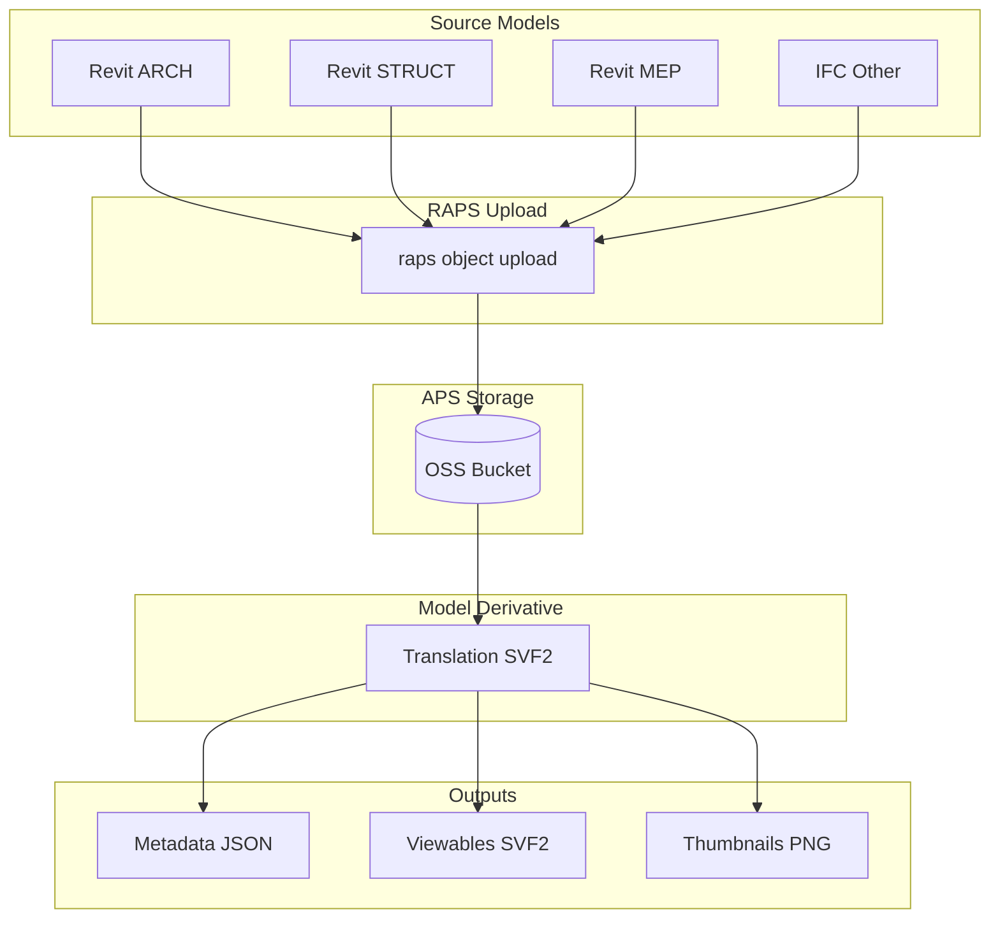
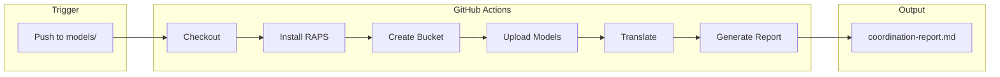
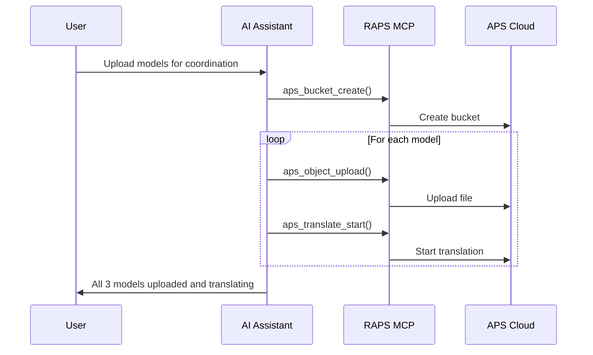

# Model Coordination Pipeline

Upload multiple discipline models and prepare them for coordination review.

## Workflow Overview



---

## CLI Approach

### Step 1: Create Project Bucket

```bash
raps bucket create --key coord-project-2024 --policy persistent --region US
```

### Step 2: Upload Discipline Models

```bash
raps object upload coord-project-2024 ./models/architectural.rvt
raps object upload coord-project-2024 ./models/structural.rvt
raps object upload coord-project-2024 ./models/mep.rvt
```

### Step 3: Translate All Models

```bash
for model in architectural structural mep; do
  URN=$(raps object urn coord-project-2024 "${model}.rvt" --output plain)
  echo "Translating ${model}..."
  raps translate start "$URN" --format svf2 --wait
done
```

### Step 4: Verify Translation Status

```bash
raps object list coord-project-2024 --output json | jq -r '.[].key' | while read key; do
  URN=$(raps object urn coord-project-2024 "$key" --output plain)
  STATUS=$(raps translate manifest "$URN" | jq -r '.status')
  echo "$key: $STATUS"
done
```

---

## CI/CD Pipeline

```yaml
# .github/workflows/model-coordination.yml
name: Model Coordination Pipeline

on:
  push:
    paths:
      - 'models/**/*.rvt'
      - 'models/**/*.ifc'

env:
  BUCKET_NAME: coord-${{ github.repository_id }}

jobs:
  upload-and-translate:
    runs-on: ubuntu-latest
    steps:
      - uses: actions/checkout@v4

      - name: Install RAPS
        run: cargo install raps

      - name: Ensure bucket exists
        env:
          APS_CLIENT_ID: ${{ secrets.APS_CLIENT_ID }}
          APS_CLIENT_SECRET: ${{ secrets.APS_CLIENT_SECRET }}
        run: |
          raps bucket create --key "$BUCKET_NAME" --policy persistent --region US 2>/dev/null || true

      - name: Upload changed models
        env:
          APS_CLIENT_ID: ${{ secrets.APS_CLIENT_ID }}
          APS_CLIENT_SECRET: ${{ secrets.APS_CLIENT_SECRET }}
        run: |
          for file in $(git diff --name-only HEAD~1 HEAD -- 'models/**/*.rvt' 'models/**/*.ifc'); do
            if [ -f "$file" ]; then
              echo "Uploading: $file"
              raps object upload "$BUCKET_NAME" "$file"
            fi
          done

      - name: Translate models
        env:
          APS_CLIENT_ID: ${{ secrets.APS_CLIENT_ID }}
          APS_CLIENT_SECRET: ${{ secrets.APS_CLIENT_SECRET }}
        run: |
          for file in $(git diff --name-only HEAD~1 HEAD -- 'models/**/*.rvt' 'models/**/*.ifc'); do
            if [ -f "$file" ]; then
              key=$(basename "$file")
              URN=$(raps object urn "$BUCKET_NAME" "$key" --output plain)
              raps translate start "$URN" --format svf2 --wait
              echo "Translated: $key"
            fi
          done

      - name: Generate coordination report
        env:
          APS_CLIENT_ID: ${{ secrets.APS_CLIENT_ID }}
          APS_CLIENT_SECRET: ${{ secrets.APS_CLIENT_SECRET }}
        run: |
          echo "# Coordination Report" > coordination-report.md
          echo "Generated: $(date)" >> coordination-report.md
          echo "" >> coordination-report.md
          raps object list "$BUCKET_NAME" --output json | jq -r '.[] | "- \(.key)"' >> coordination-report.md

      - name: Upload report artifact
        uses: actions/upload-artifact@v4
        with:
          name: coordination-report
          path: coordination-report.md
```

### Pipeline Flow



---

## MCP Integration

Use natural language with AI assistants to coordinate models.

### Upload and Translate

```
User: "Upload all the Revit models from the models folder and translate them for coordination review"
```



### Check Translation Status

```
User: "Check if all the models in the coordination bucket have been translated successfully"
```

**AI Response:**
> All 3 models have been successfully translated:
> - arch.rvt: Complete
> - struct.rvt: Complete
> - mep.rvt: Complete

---

## Related

- [Model Version Tracking](/docs/cookbook-aec-versioning)
- [Metadata Extraction](/docs/cookbook-aec-metadata)
- [Cookbook: AEC & BIM](/docs/cookbook-aec)
