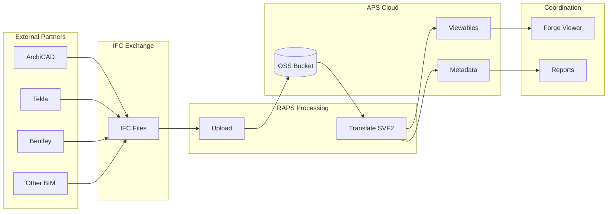
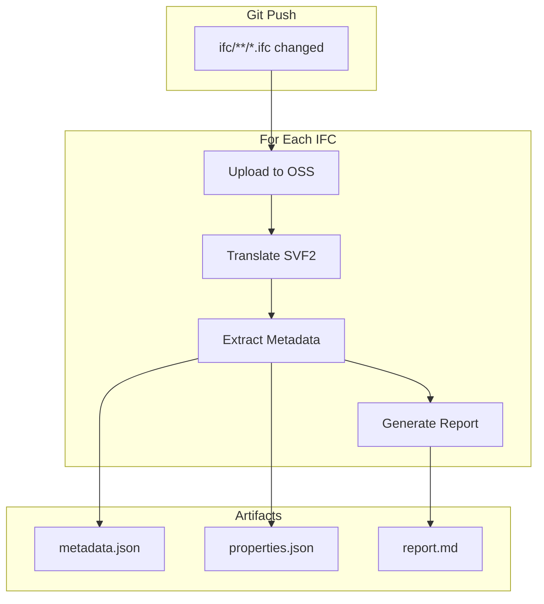
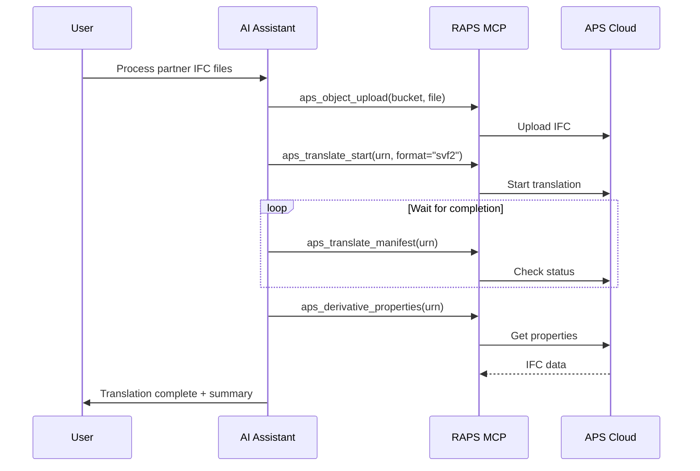

# IFC Open BIM Workflow

Process IFC files for open BIM collaboration with external partners.

## Workflow Overview



---

## CLI Approach

### Step 1: Upload IFC File

```bash
raps object upload my-bucket model.ifc
```

### Step 2: Translate to SVF2

```bash
URN=$(raps object urn my-bucket model.ifc --output plain)
raps translate start "$URN" --format svf2 --wait
```

### Step 3: Verify Translation

```bash
raps translate manifest "$URN"
```

### Step 4: Extract IFC Data

```bash
# Get metadata
raps derivative metadata "$URN" --output json > ifc-metadata.json

# Get IFC property sets
raps derivative properties "$URN" --output json > ifc-properties.json

# Get model hierarchy
raps derivative tree "$URN" --output json > ifc-tree.json
```

### Step 5: Analyze IFC Content

```bash
# Count elements by IFC type
cat ifc-properties.json | jq '
  group_by(.properties.IfcType) |
  map({type: .[0].properties.IfcType, count: length}) |
  sort_by(-.count)'

# List all property sets
cat ifc-properties.json | jq '[.[].properties | keys] | flatten | unique'
```

---

## CI/CD Pipeline

```yaml
# .github/workflows/ifc-processing.yml
name: IFC Processing Pipeline

on:
  push:
    paths:
      - 'ifc/**/*.ifc'

env:
  BUCKET: ifc-exchange-${{ github.repository_id }}

jobs:
  process-ifc:
    runs-on: ubuntu-latest
    steps:
      - uses: actions/checkout@v4

      - name: Install RAPS
        run: cargo install raps

      - name: Setup bucket
        env:
          APS_CLIENT_ID: ${{ secrets.APS_CLIENT_ID }}
          APS_CLIENT_SECRET: ${{ secrets.APS_CLIENT_SECRET }}
        run: |
          raps bucket create --key "$BUCKET" --policy persistent --region US 2>/dev/null || true

      - name: Process IFC files
        env:
          APS_CLIENT_ID: ${{ secrets.APS_CLIENT_ID }}
          APS_CLIENT_SECRET: ${{ secrets.APS_CLIENT_SECRET }}
        run: |
          mkdir -p ./ifc-reports

          for ifc in ifc/**/*.ifc; do
            [ -f "$ifc" ] || continue

            filename=$(basename "$ifc")
            name="${filename%.ifc}"

            echo "Processing: $ifc"

            # Upload
            raps object upload "$BUCKET" "$ifc"

            # Translate
            URN=$(raps object urn "$BUCKET" "$filename" --output plain)
            raps translate start "$URN" --format svf2 --wait

            # Extract metadata
            raps derivative metadata "$URN" --output json > "./ifc-reports/${name}-metadata.json"
            raps derivative properties "$URN" --output json > "./ifc-reports/${name}-properties.json"

            # Generate report
            echo "# IFC Report: $filename" > "./ifc-reports/${name}-report.md"
            echo "Processed: $(date)" >> "./ifc-reports/${name}-report.md"
            echo "" >> "./ifc-reports/${name}-report.md"
            echo "## Element Count by Type" >> "./ifc-reports/${name}-report.md"
            cat "./ifc-reports/${name}-properties.json" | jq -r '
              group_by(.properties.IfcType) |
              map({type: .[0].properties.IfcType, count: length}) |
              sort_by(-.count) |
              .[] | "- \(.type): \(.count)"
            ' >> "./ifc-reports/${name}-report.md"
          done

      - name: Upload reports
        uses: actions/upload-artifact@v4
        with:
          name: ifc-reports
          path: ./ifc-reports/
```

### Pipeline Flow



---

## MCP Integration

### Process IFC from Partner

```
User: "We received IFC files from the structural engineer. Upload them and check if they translated correctly."
```



**AI Response:**
> The structural IFC file has been uploaded and translated successfully.
>
> **Model Summary:**
> - File: structural-model.ifc
> - Status: Complete
> - Elements: 2,847 total
>
> **By IFC Type:**
> - IfcColumn: 156
> - IfcBeam: 89
> - IfcSlab: 12
> - IfcFooting: 24
> - IfcWall: 45
> - IfcConnection: 2,521

### Compare IFC Versions

```
User: "Compare the structural IFC we received today with last week's version"
```

**AI Response:**
> IFC Version Comparison:
>
> | Element Type | Last Week | Today | Change |
> |--------------|-----------|-------|--------|
> | IfcColumn | 148 | 156 | +8 |
> | IfcBeam | 85 | 89 | +4 |
> | IfcSlab | 12 | 12 | 0 |
> | IfcFooting | 24 | 24 | 0 |
> | **Total** | **2,789** | **2,847** | **+58** |
>
> New elements appear to be in Grid Lines E-F, Levels 3-4.

---

## IFC Validation

### Check Required Properties

```bash
# Verify all elements have required properties
cat ifc-properties.json | jq '
  [.[] | select(
    .properties.GlobalId == null or
    .properties.Name == null
  )] | length'
```

### Export Property Set Summary

```bash
# List all Pset definitions
cat ifc-properties.json | jq '
  [.[].properties | to_entries | .[] | select(.key | startswith("Pset_"))] |
  group_by(.key) |
  map({pset: .[0].key, count: length})'
```

### Validate IFC Schema

```bash
# Check IFC types distribution
cat ifc-properties.json | jq '
  group_by(.properties.IfcType) |
  map({
    type: .[0].properties.IfcType,
    count: length,
    hasGlobalId: ([.[] | select(.properties.GlobalId != null)] | length),
    hasName: ([.[] | select(.properties.Name != null)] | length)
  }) |
  sort_by(-.count)'
```

---

## Related

- [Model Coordination Pipeline](/docs/cookbook-aec-coordination)
- [Metadata Extraction](/docs/cookbook-aec-metadata)
- [Cookbook: AEC & BIM](/docs/cookbook-aec)
