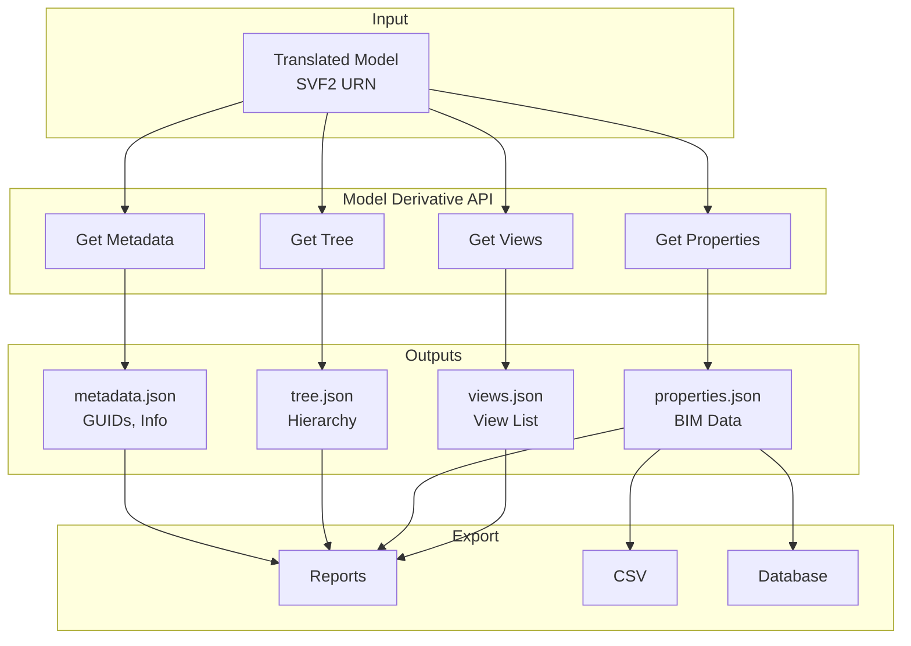
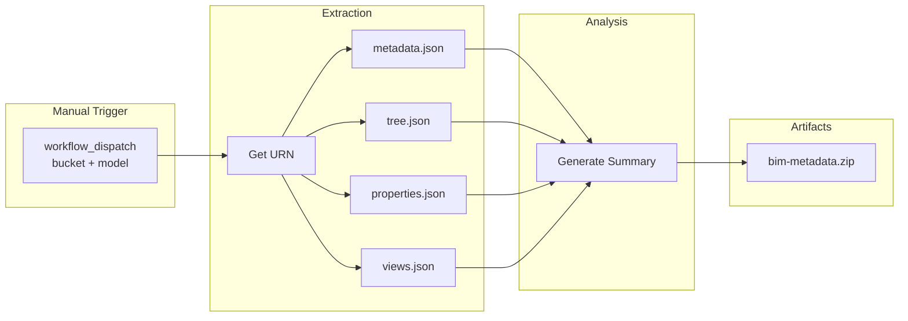
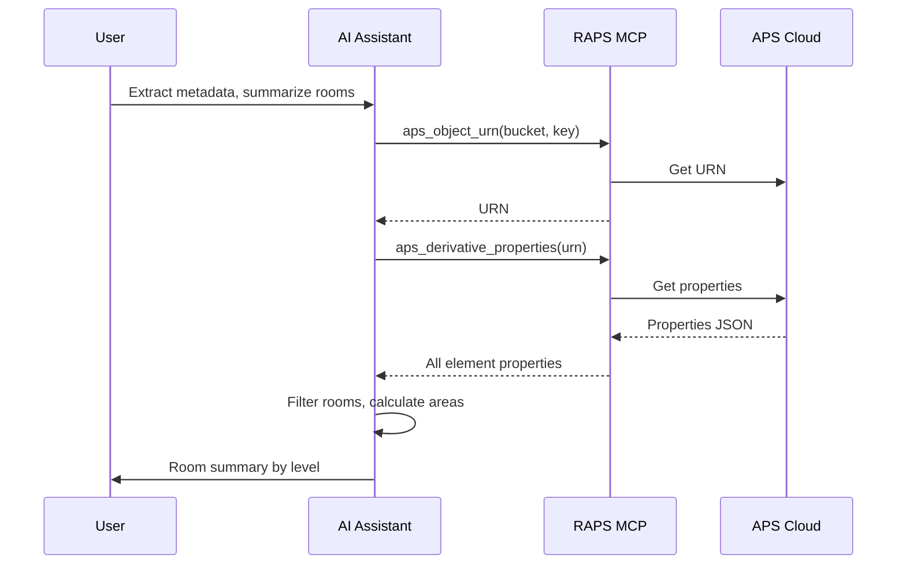

# Metadata Extraction

Pull metadata from translated Revit models for analysis or reporting.

## Workflow Overview



---

## CLI Approach

### Step 1: Get Model URN

```bash
URN=$(raps object urn my-bucket building.rvt --output plain)
```

### Step 2: Check Translation Status

```bash
raps translate manifest "$URN"
```

### Step 3: Extract All Metadata

```bash
# Model metadata (GUID, views, etc.)
raps derivative metadata "$URN" --output json > metadata.json

# Model hierarchy
raps derivative tree "$URN" --output json > model-tree.json

# All properties (BIM data)
raps derivative properties "$URN" --output json > properties.json

# Available views
raps derivative views "$URN" --output json > views.json
```

### Step 4: Analyze Data

```bash
# Count elements by category
cat properties.json | jq 'group_by(.category) | .[] | {category: .[0].category, count: length}'

# Export specific properties to CSV
cat properties.json | jq -r '
  ["ObjectId", "Name", "Category"],
  (.[] | [.objectid, .name, .category])
  | @csv' > elements.csv
```

---

## CI/CD Pipeline

```yaml
# .github/workflows/metadata-extraction.yml
name: BIM Metadata Extraction

on:
  workflow_dispatch:
    inputs:
      bucket:
        description: 'Bucket name'
        required: true
      model:
        description: 'Model filename'
        required: true

jobs:
  extract-metadata:
    runs-on: ubuntu-latest
    steps:
      - name: Install RAPS
        run: cargo install raps

      - name: Extract all metadata
        env:
          APS_CLIENT_ID: ${{ secrets.APS_CLIENT_ID }}
          APS_CLIENT_SECRET: ${{ secrets.APS_CLIENT_SECRET }}
        run: |
          URN=$(raps object urn "${{ inputs.bucket }}" "${{ inputs.model }}" --output plain)

          mkdir -p ./metadata-export

          raps derivative metadata "$URN" --output json > ./metadata-export/metadata.json
          raps derivative tree "$URN" --output json > ./metadata-export/tree.json
          raps derivative properties "$URN" --output json > ./metadata-export/properties.json
          raps derivative views "$URN" --output json > ./metadata-export/views.json

      - name: Generate summary
        run: |
          echo "# Metadata Summary" > ./metadata-export/summary.md
          echo "Model: ${{ inputs.model }}" >> ./metadata-export/summary.md
          echo "Elements: $(jq 'length' ./metadata-export/properties.json)" >> ./metadata-export/summary.md
          echo "Views: $(jq 'length' ./metadata-export/views.json)" >> ./metadata-export/summary.md

      - name: Upload artifacts
        uses: actions/upload-artifact@v4
        with:
          name: bim-metadata-${{ github.run_id }}
          path: ./metadata-export/
```

### Pipeline Flow



---

## MCP Integration

### Extract and Summarize

```
User: "Extract all metadata from building.rvt and summarize the room count"
```



**AI Response:**
> I found 47 rooms in the model:
> - Level 1: 15 rooms (3,450 sq ft total)
> - Level 2: 18 rooms (4,200 sq ft total)
> - Level 3: 14 rooms (3,100 sq ft total)

### Compare Models

```
User: "Compare the element counts between v1 and v2 of the building model"
```

**AI Response:**
> Model Comparison:
> | Category | v1 | v2 | Change |
> |----------|-----|-----|--------|
> | Walls | 245 | 258 | +13 |
> | Doors | 89 | 92 | +3 |
> | Windows | 156 | 156 | 0 |
> | Rooms | 47 | 52 | +5 |

---

## Common Queries

### Count by Category

```bash
cat properties.json | jq '
  group_by(.category) |
  map({category: .[0].category, count: length}) |
  sort_by(-.count)'
```

### Find Specific Elements

```bash
# Find all doors
cat properties.json | jq '[.[] | select(.category == "Doors")]'

# Find elements by name pattern
cat properties.json | jq '[.[] | select(.name | test("Wall.*Exterior"))]'
```

### Export to Database Format

```bash
# Generate SQL inserts
cat properties.json | jq -r '.[] |
  "INSERT INTO elements (id, name, category) VALUES (\(.objectid), '\''\(.name)'\'', '\''\(.category)'\'');"'
```

---

## Related

- [Room & Space Export](/docs/cookbook-aec-rooms)
- [Model Coordination Pipeline](/docs/cookbook-aec-coordination)
- [Cookbook: AEC & BIM](/docs/cookbook-aec)
