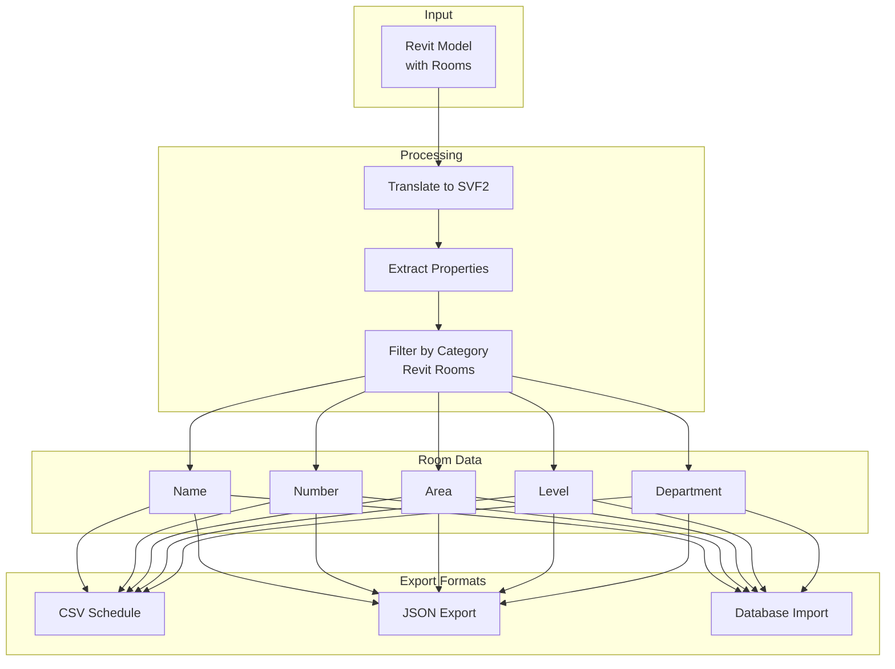
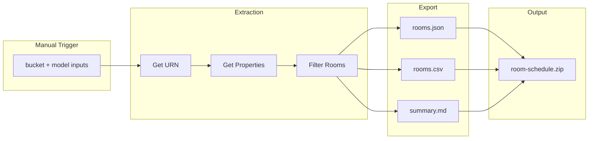
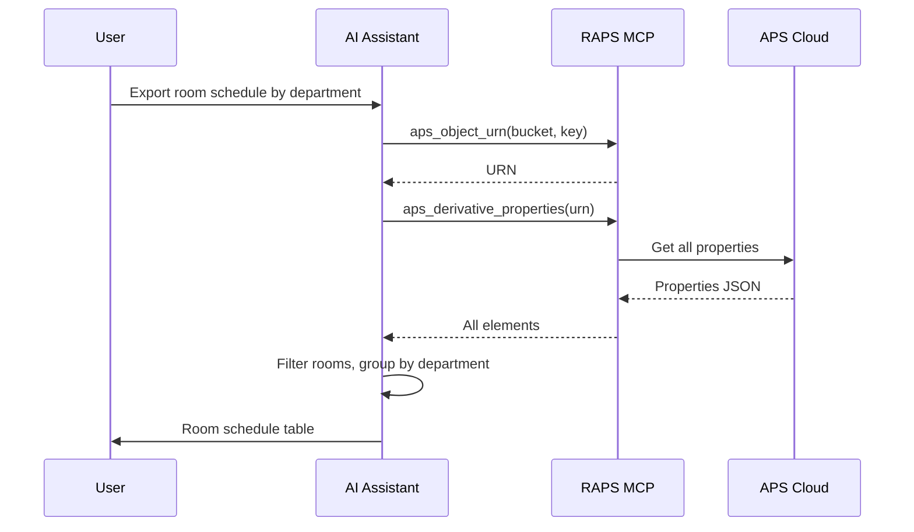

# Room & Space Export

Extract room schedules and spatial data from Revit models.

## Workflow Overview



---

## CLI Approach

### Step 1: Translate Model

```bash
URN=$(raps object urn my-bucket building.rvt --output plain)
raps translate start "$URN" --format svf2 --wait
```

### Step 2: Extract All Properties

```bash
raps derivative properties "$URN" --output json > all-properties.json
```

### Step 3: Filter Rooms

```bash
cat all-properties.json | jq '[.[] | select(.category == "Revit Rooms")]' > rooms.json
```

### Step 4: Export to CSV

```bash
cat rooms.json | jq -r '
  ["Name", "Number", "Area", "Level", "Department"],
  (.[] | [
    .properties["Name"] // "",
    .properties["Number"] // "",
    .properties["Area"] // "",
    .properties["Level"] // "",
    .properties["Department"] // ""
  ]) | @csv
' > rooms.csv
```

### Step 5: Generate Summary

```bash
echo "Room Summary"
echo "============"
echo "Total rooms: $(jq 'length' rooms.json)"
echo "Total area: $(jq '[.[].properties.Area | select(. != null) | tonumber] | add' rooms.json) sq ft"
echo ""
echo "By Level:"
jq -r 'group_by(.properties.Level) | .[] | "  \(.[0].properties.Level): \(length) rooms"' rooms.json
echo ""
echo "By Department:"
jq -r 'group_by(.properties.Department) | .[] | "  \(.[0].properties.Department // "Unassigned"): \(length) rooms"' rooms.json
```

---

## CI/CD Pipeline

```yaml
# .github/workflows/room-export.yml
name: Room Schedule Export

on:
  workflow_dispatch:
    inputs:
      bucket:
        description: 'Bucket name'
        required: true
      model:
        description: 'Model filename'
        required: true

jobs:
  export-rooms:
    runs-on: ubuntu-latest
    steps:
      - name: Install RAPS
        run: cargo install raps

      - name: Extract room data
        env:
          APS_CLIENT_ID: ${{ secrets.APS_CLIENT_ID }}
          APS_CLIENT_SECRET: ${{ secrets.APS_CLIENT_SECRET }}
        run: |
          URN=$(raps object urn "${{ inputs.bucket }}" "${{ inputs.model }}" --output plain)

          # Get all properties
          raps derivative properties "$URN" --output json > properties.json

          # Filter rooms
          jq '[.[] | select(.category == "Revit Rooms")]' properties.json > rooms.json

          # Create CSV
          jq -r '
            ["Name","Number","Area","Level","Department"],
            (.[] | [
              .properties["Name"],
              .properties["Number"],
              .properties["Area"],
              .properties["Level"],
              .properties["Department"]
            ]) | @csv
          ' rooms.json > rooms.csv

      - name: Generate summary report
        run: |
          echo "# Room Schedule Export" > summary.md
          echo "Model: ${{ inputs.model }}" >> summary.md
          echo "Date: $(date)" >> summary.md
          echo "" >> summary.md
          echo "## Statistics" >> summary.md
          echo "- Total Rooms: $(jq 'length' rooms.json)" >> summary.md
          echo "" >> summary.md
          echo "## By Level" >> summary.md
          jq -r 'group_by(.properties.Level) | .[] | "- \(.[0].properties.Level): \(length) rooms"' rooms.json >> summary.md
          echo "" >> summary.md
          echo "## By Department" >> summary.md
          jq -r 'group_by(.properties.Department) | .[] | "- \(.[0].properties.Department // "Unassigned"): \(length) rooms"' rooms.json >> summary.md

      - name: Upload exports
        uses: actions/upload-artifact@v4
        with:
          name: room-schedule
          path: |
            rooms.json
            rooms.csv
            summary.md
```

### Pipeline Flow



---

## MCP Integration

### Export Room Schedule

```
User: "Get me a room schedule from the office building model with areas by department"
```



**AI Response:**
> Room Schedule for Office Building:
>
> | Department | Rooms | Total Area (sq ft) |
> |------------|-------|-------------------|
> | Executive | 8 | 4,200 |
> | Engineering | 24 | 12,800 |
> | Sales | 16 | 8,400 |
> | HR | 6 | 2,100 |
> | Common | 12 | 6,500 |
>
> **Total:** 66 rooms, 34,000 sq ft

### Find Specific Rooms

```
User: "Find all conference rooms larger than 500 sq ft"
```

**AI Response:**
> Found 8 conference rooms over 500 sq ft:
>
> | Name | Number | Area | Level |
> |------|--------|------|-------|
> | Board Room | 301 | 1,200 | 3 |
> | Conference A | 201 | 800 | 2 |
> | Conference B | 202 | 750 | 2 |
> | Training Room | 105 | 650 | 1 |
> | ... | ... | ... | ... |

---

## Advanced Queries

### Rooms by Level with Areas

```bash
cat rooms.json | jq '
  group_by(.properties.Level) |
  map({
    level: .[0].properties.Level,
    count: length,
    totalArea: ([.[].properties.Area | select(. != null) | tonumber] | add),
    rooms: [.[] | {name: .properties.Name, number: .properties.Number, area: .properties.Area}]
  })'
```

### Find Unassigned Rooms

```bash
cat rooms.json | jq '[.[] | select(.properties.Department == null or .properties.Department == "")]'
```

### Area Statistics

```bash
cat rooms.json | jq '
  {
    total: ([.[].properties.Area | select(. != null) | tonumber] | add),
    average: ([.[].properties.Area | select(. != null) | tonumber] | add / length),
    min: ([.[].properties.Area | select(. != null) | tonumber] | min),
    max: ([.[].properties.Area | select(. != null) | tonumber] | max)
  }'
```

### Export for Space Management System

```bash
cat rooms.json | jq '[.[] | {
  id: .objectid,
  name: .properties.Name,
  number: .properties.Number,
  level: .properties.Level,
  department: .properties.Department,
  area_sqft: (.properties.Area | tonumber),
  area_sqm: ((.properties.Area | tonumber) * 0.0929)
}]' > space-management-import.json
```

---

## Related

- [Metadata Extraction](/docs/cookbook-aec-metadata)
- [Model Coordination Pipeline](/docs/cookbook-aec-coordination)
- [Cookbook: AEC & BIM](/docs/cookbook-aec)
