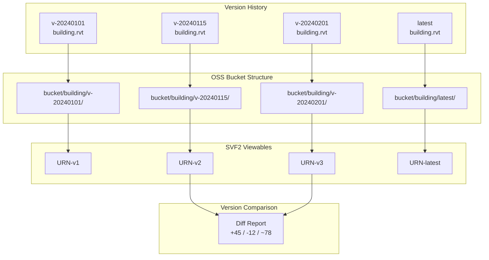
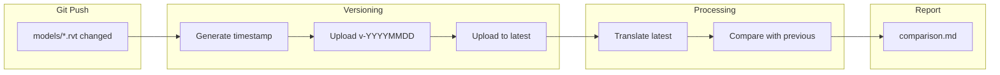
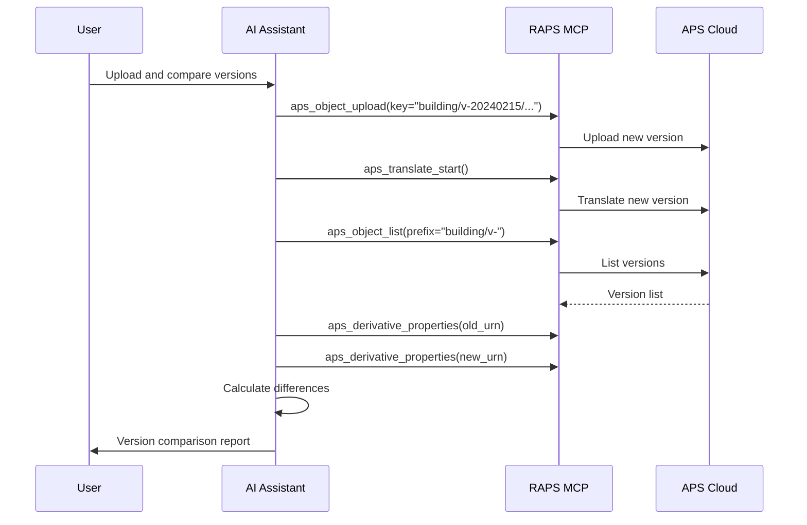

# Model Version Tracking

Track model versions with organized storage and comparison.

## Workflow Overview



---

## CLI Approach

### Step 1: Upload Versioned Model

```bash
# Create versioned object key with timestamp
VERSION=$(date +%Y%m%d-%H%M%S)
raps object upload my-bucket building.rvt --key "building/v-${VERSION}/building.rvt"

# Also upload to "latest" for easy access
raps object upload my-bucket building.rvt --key "building/latest/building.rvt"
```

### Step 2: List All Versions

```bash
raps object list my-bucket --prefix "building/v-" --output json | \
  jq -r '.[] | .key' | sort -r
```

**Output:**
```
building/v-20240201-110530/building.rvt
building/v-20240115-143022/building.rvt
building/v-20240101-090000/building.rvt
```

### Step 3: Compare Versions

```bash
# Get URNs for both versions
OLD_URN=$(raps object urn my-bucket "building/v-20240101-090000/building.rvt" --output plain)
NEW_URN=$(raps object urn my-bucket "building/v-20240115-143022/building.rvt" --output plain)

# Extract element counts
OLD_COUNT=$(raps derivative properties "$OLD_URN" --output json | jq 'length')
NEW_COUNT=$(raps derivative properties "$NEW_URN" --output json | jq 'length')

echo "Version comparison:"
echo "  Old version: $OLD_COUNT elements"
echo "  New version: $NEW_COUNT elements"
echo "  Difference: $((NEW_COUNT - OLD_COUNT)) elements"
```

### Step 4: Detailed Comparison by Category

```bash
# Compare categories between versions
echo "Category Comparison:"
echo "===================="

for category in "Walls" "Doors" "Windows" "Rooms"; do
  OLD=$(raps derivative properties "$OLD_URN" --output json | jq "[.[] | select(.category == \"$category\")] | length")
  NEW=$(raps derivative properties "$NEW_URN" --output json | jq "[.[] | select(.category == \"$category\")] | length")
  DIFF=$((NEW - OLD))

  if [ $DIFF -gt 0 ]; then
    echo "$category: $OLD -> $NEW (+$DIFF)"
  elif [ $DIFF -lt 0 ]; then
    echo "$category: $OLD -> $NEW ($DIFF)"
  else
    echo "$category: $OLD (no change)"
  fi
done
```

---

## CI/CD Pipeline

```yaml
# .github/workflows/version-tracking.yml
name: Model Version Tracking

on:
  push:
    paths:
      - 'models/**/*.rvt'

jobs:
  version-and-upload:
    runs-on: ubuntu-latest
    steps:
      - uses: actions/checkout@v4
        with:
          fetch-depth: 2

      - name: Install RAPS
        run: cargo install raps

      - name: Version and upload models
        env:
          APS_CLIENT_ID: ${{ secrets.APS_CLIENT_ID }}
          APS_CLIENT_SECRET: ${{ secrets.APS_CLIENT_SECRET }}
        run: |
          VERSION=$(date +%Y%m%d-%H%M%S)
          BUCKET="versioned-models"

          for file in $(git diff --name-only HEAD~1 HEAD -- 'models/**/*.rvt'); do
            [ -f "$file" ] || continue

            basename=$(basename "$file" .rvt)

            # Upload versioned copy
            raps object upload "$BUCKET" "$file" --key "${basename}/v-${VERSION}/${basename}.rvt"

            # Upload as latest
            raps object upload "$BUCKET" "$file" --key "${basename}/latest/${basename}.rvt"

            # Translate latest
            URN=$(raps object urn "$BUCKET" "${basename}/latest/${basename}.rvt" --output plain)
            raps translate start "$URN" --format svf2 --wait

            echo "Uploaded ${basename} as version ${VERSION}"
          done

      - name: Generate version comparison
        env:
          APS_CLIENT_ID: ${{ secrets.APS_CLIENT_ID }}
          APS_CLIENT_SECRET: ${{ secrets.APS_CLIENT_SECRET }}
        run: |
          # Get last two versions and compare
          echo "# Version Comparison Report" > comparison.md
          echo "Generated: $(date)" >> comparison.md
          # Add comparison logic here

      - name: Upload artifacts
        uses: actions/upload-artifact@v4
        with:
          name: version-log
          path: comparison.md
```

### Pipeline Flow



---

## MCP Integration

### Upload New Version

```
User: "Upload the new version of the building model and compare it with last week's version"
```



**AI Response:**
> New version uploaded and translated. Comparison with v-20240208:
> - **Added:** 23 new walls, 8 doors, 12 windows
> - **Removed:** 5 walls, 2 doors
> - **Modified:** 45 elements with property changes
> - **Total elements:** 1,892 (up from 1,854)

### List Version History

```
User: "Show me all versions of the office building model"
```

**AI Response:**
> Version history for office-building.rvt:
>
> | Version | Date | Elements | Size |
> |---------|------|----------|------|
> | v-20240215 | Feb 15, 2024 | 1,892 | 156 MB |
> | v-20240208 | Feb 8, 2024 | 1,854 | 152 MB |
> | v-20240201 | Feb 1, 2024 | 1,823 | 148 MB |
> | v-20240125 | Jan 25, 2024 | 1,756 | 142 MB |

---

## Best Practices

### Naming Convention

```
bucket/
└── {model-name}/
    ├── v-YYYYMMDD-HHMMSS/
    │   └── {model-name}.rvt
    ├── v-YYYYMMDD-HHMMSS/
    │   └── {model-name}.rvt
    └── latest/
        └── {model-name}.rvt
```

### Retention Policy

```bash
# Keep only last 10 versions
VERSIONS=$(raps object list my-bucket --prefix "building/v-" --output json | jq -r '.[].key' | sort -r)
COUNT=0

echo "$VERSIONS" | while read key; do
  COUNT=$((COUNT + 1))
  if [ $COUNT -gt 10 ]; then
    echo "Deleting old version: $key"
    raps object delete my-bucket "$key"
  fi
done
```

---

## Related

- [Model Coordination Pipeline](/docs/cookbook-aec-coordination)
- [BIM 360/ACC Sync](/docs/cookbook-aec-acc-sync)
- [Cookbook: AEC & BIM](/docs/cookbook-aec)
