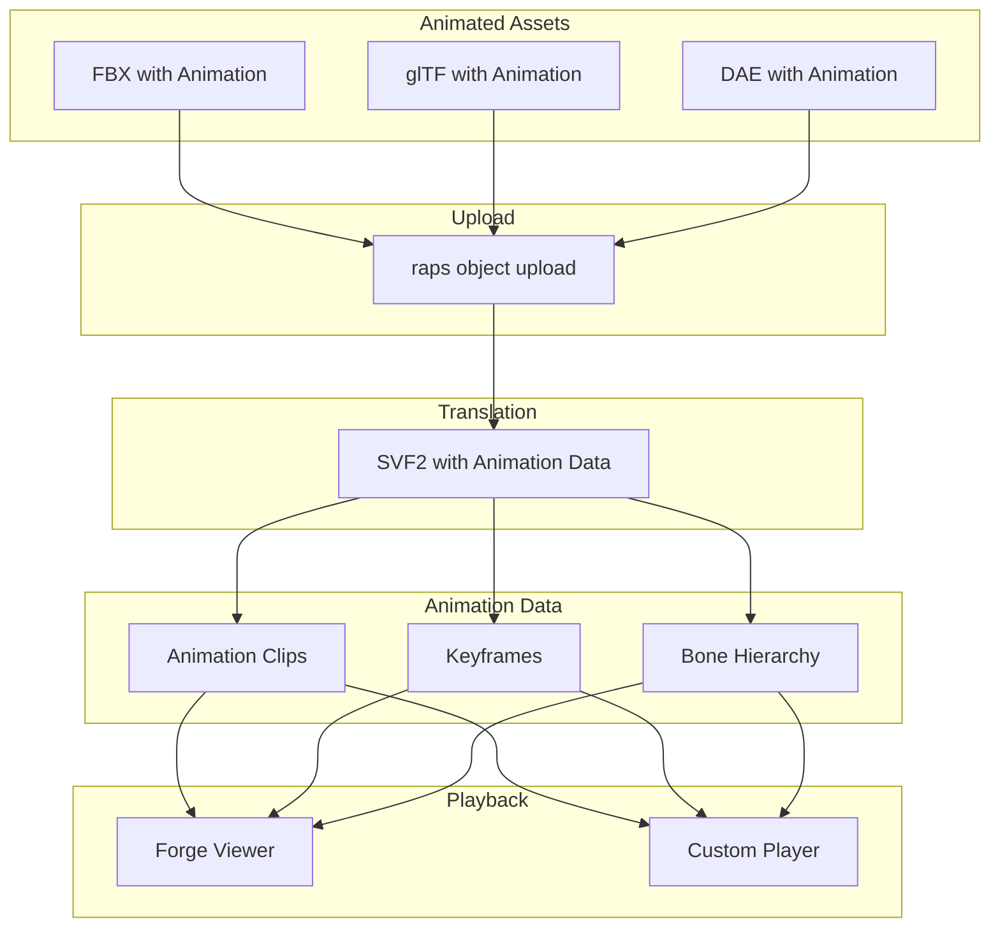
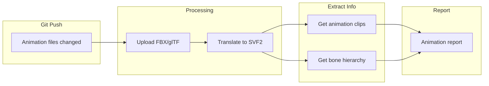
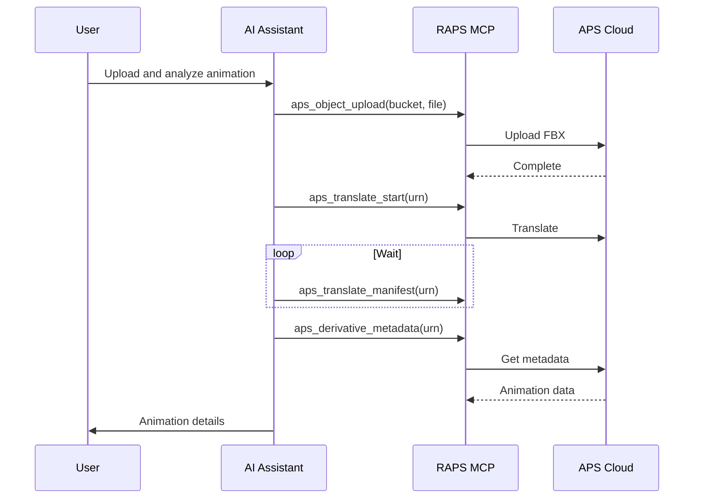

# Animation Workflows

Process 3D files with embedded animation data.

## Workflow Overview



---

## CLI Approach

### Upload Animated Model

```bash
# Upload FBX with animations
raps object upload media-assets character-animated.fbx

# Translate preserving animation
URN=$(raps object urn media-assets character-animated.fbx --output plain)
raps translate start "$URN" --format svf2 --wait
```

### Check Animation Data

```bash
# Get metadata including animations
raps derivative metadata "$URN" --output json > animation-metadata.json

# List animation clips
jq '.animations' animation-metadata.json

# Get animation details
jq '.animations[] | {name: .name, duration: .duration, frameCount: .frameCount}' animation-metadata.json
```

### Extract Animation Info

```bash
# Get bone/skeleton hierarchy
raps derivative tree "$URN" --output json | jq '
  .. | objects | select(.type == "bone" or .name | test("bone|skeleton"; "i"))
' > skeleton.json

# Count bones
echo "Bones: $(jq 'length' skeleton.json)"
```

---

## CI/CD Pipeline

```yaml
# .github/workflows/animation-processing.yml
name: Animation Processing

on:
  push:
    paths:
      - 'animations/**/*.fbx'
      - 'animations/**/*.gltf'

env:
  BUCKET: animated-assets

jobs:
  process-animations:
    runs-on: ubuntu-latest
    steps:
      - uses: actions/checkout@v4

      - name: Install RAPS
        run: cargo install raps

      - name: Setup bucket
        env:
          APS_CLIENT_ID: ${{ secrets.APS_CLIENT_ID }}
          APS_CLIENT_SECRET: ${{ secrets.APS_CLIENT_SECRET }}
        run: |
          raps bucket create --key "$BUCKET" --policy persistent --region US 2>/dev/null || true

      - name: Upload and translate
        env:
          APS_CLIENT_ID: ${{ secrets.APS_CLIENT_ID }}
          APS_CLIENT_SECRET: ${{ secrets.APS_CLIENT_SECRET }}
        run: |
          for file in $(git diff --name-only HEAD~1 HEAD -- 'animations/**'); do
            [ -f "$file" ] || continue

            echo "Processing: $file"
            raps object upload "$BUCKET" "$file"

            key=$(basename "$file")
            URN=$(raps object urn "$BUCKET" "$key" --output plain)
            raps translate start "$URN" --format svf2 --wait
          done

      - name: Extract animation info
        env:
          APS_CLIENT_ID: ${{ secrets.APS_CLIENT_ID }}
          APS_CLIENT_SECRET: ${{ secrets.APS_CLIENT_SECRET }}
        run: |
          mkdir -p ./animation-data

          raps object list "$BUCKET" --output json | jq -r '.[].key' | while read key; do
            URN=$(raps object urn "$BUCKET" "$key" --output plain)
            STATUS=$(raps translate manifest "$URN" 2>/dev/null | jq -r '.status // "pending"')

            if [ "$STATUS" = "success" ]; then
              NAME=$(echo "$key" | sed 's/\.[^.]*$//')
              raps derivative metadata "$URN" --output json > "./animation-data/${NAME}-meta.json"
            fi
          done

      - name: Generate report
        run: |
          echo "# Animation Assets Report" > ./animation-data/report.md
          echo "" >> ./animation-data/report.md

          for meta in ./animation-data/*-meta.json; do
            NAME=$(basename "$meta" -meta.json)
            echo "## $NAME" >> ./animation-data/report.md

            CLIPS=$(jq '.animations | length // 0' "$meta")
            echo "- Animation clips: $CLIPS" >> ./animation-data/report.md

            if [ "$CLIPS" -gt 0 ]; then
              echo "- Clips:" >> ./animation-data/report.md
              jq -r '.animations[] | "  - \(.name): \(.duration)s"' "$meta" >> ./animation-data/report.md
            fi
            echo "" >> ./animation-data/report.md
          done

      - name: Upload report
        uses: actions/upload-artifact@v4
        with:
          name: animation-report
          path: ./animation-data/
```

### Pipeline Flow



---

## MCP Integration

### Process Animated Asset

```
User: "Upload the character animation and tell me about the clips"
```



**AI Response:**
> Uploaded and analyzed character_hero.fbx:
>
> **Animation Clips (5):**
>
> | Clip Name | Duration | Frames | Loop |
> |-----------|----------|--------|------|
> | Idle | 2.0s | 60 | Yes |
> | Walk | 1.0s | 30 | Yes |
> | Run | 0.8s | 24 | Yes |
> | Jump | 1.2s | 36 | No |
> | Attack | 0.6s | 18 | No |
>
> **Skeleton:**
> - Bones: 65
> - Root: Hips
> - IK chains: 4 (2 arms, 2 legs)
>
> Ready for viewing in Forge Viewer.

### Find Animation Assets

```
User: "List all assets with walk animations"
```

**AI Response:**
> Found 8 assets with "Walk" animations:
>
> | Asset | Walk Duration | Other Clips |
> |-------|--------------|-------------|
> | character_hero.fbx | 1.0s | 5 clips |
> | character_enemy.fbx | 0.9s | 4 clips |
> | npc_villager.fbx | 1.1s | 3 clips |
> | pet_dog.fbx | 0.6s | 6 clips |
> | ... | ... | ... |

---

## Animation-Specific Considerations

### FBX Animation Settings

```bash
# FBX files can contain multiple takes
# Check for animation stacks
raps derivative metadata "$URN" --output json | jq '.animations'
```

### glTF Animations

```bash
# glTF stores animations differently
# Check for animation samplers
raps derivative metadata "$URN" --output json | jq '.animations[] | {name, channels: .channels | length}'
```

### Bone Limit Check

```bash
# Verify bone count for mobile/web
BONES=$(raps derivative tree "$URN" --output json | jq '[.. | objects | select(.type == "bone")] | length')
echo "Bone count: $BONES"

if [ "$BONES" -gt 128 ]; then
  echo "Warning: Bone count exceeds mobile limit"
fi
```

### Animation Performance

```bash
# Check animation data size
raps translate manifest "$URN" --output json | jq '
  .derivatives[] |
  select(.outputType == "svf2") |
  .children[] |
  select(.type == "resource" and (.urn | contains("animation")))
'
```

---

## Related

- [3D Asset Translation](/docs/cookbook-media-translation)
- [OBJ with Materials](/docs/cookbook-media-materials)
- [Cookbook: Media & Entertainment](/docs/cookbook-media)
