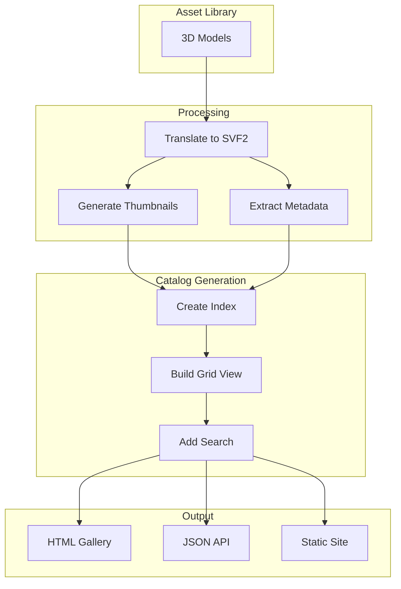
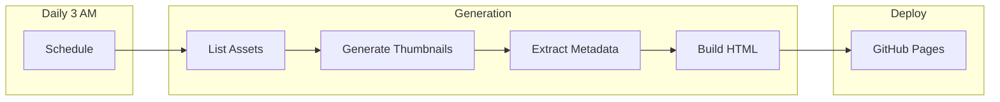
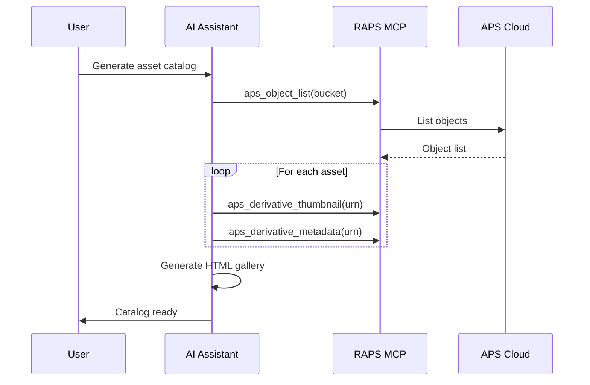

# Asset Catalog Generation

Create visual catalogs of 3D assets with auto-generated thumbnails and metadata.

## Workflow Overview



---

## CLI Approach

### Step 1: Generate Thumbnails

```bash
mkdir -p ./catalog/thumbnails

raps object list media-assets --output json | jq -r '.[].key' | while read key; do
  URN=$(raps object urn media-assets "$key" --output plain)

  # Check if translated
  STATUS=$(raps translate manifest "$URN" 2>/dev/null | jq -r '.status // "none"')

  if [ "$STATUS" = "success" ]; then
    SAFE_NAME=$(echo "$key" | tr '/' '_' | sed 's/\.[^.]*$//')
    raps derivative thumbnail "$URN" --output "./catalog/thumbnails/${SAFE_NAME}.png"
    echo "Generated: ${SAFE_NAME}.png"
  fi
done
```

### Step 2: Extract Metadata

```bash
echo "[]" > ./catalog/assets.json

raps object list media-assets --output json | jq -r '.[].key' | while read key; do
  URN=$(raps object urn media-assets "$key" --output plain)
  STATUS=$(raps translate manifest "$URN" 2>/dev/null | jq -r '.status // "none"')

  if [ "$STATUS" = "success" ]; then
    SAFE_NAME=$(echo "$key" | tr '/' '_' | sed 's/\.[^.]*$//')

    # Get metadata
    META=$(raps derivative metadata "$URN" --output json 2>/dev/null || echo '{}')

    # Add to catalog
    jq --arg key "$key" \
       --arg name "$SAFE_NAME" \
       --argjson meta "$META" \
       '. += [{
         key: $key,
         name: $name,
         thumbnail: ($name + ".png"),
         metadata: $meta
       }]' ./catalog/assets.json > ./catalog/assets.tmp.json

    mv ./catalog/assets.tmp.json ./catalog/assets.json
  fi
done
```

### Step 3: Generate HTML Catalog

```bash
cat > ./catalog/index.html << 'EOF'
<!DOCTYPE html>
<html>
<head>
  <title>3D Asset Catalog</title>
  <style>
    * { box-sizing: border-box; }
    body { font-family: system-ui, sans-serif; margin: 0; padding: 20px; background: #1a1a2e; color: #eee; }
    h1 { text-align: center; }
    .search { width: 100%; padding: 12px; font-size: 16px; margin-bottom: 20px; border-radius: 8px; border: none; }
    .grid { display: grid; grid-template-columns: repeat(auto-fill, minmax(220px, 1fr)); gap: 20px; }
    .asset { background: #16213e; border-radius: 12px; overflow: hidden; transition: transform 0.2s; }
    .asset:hover { transform: scale(1.02); }
    .asset img { width: 100%; height: 180px; object-fit: contain; background: #0f3460; }
    .asset-info { padding: 12px; }
    .asset-name { font-weight: 600; margin-bottom: 4px; }
    .asset-meta { font-size: 12px; color: #888; }
    .tags { display: flex; gap: 4px; flex-wrap: wrap; margin-top: 8px; }
    .tag { background: #0f3460; padding: 2px 8px; border-radius: 4px; font-size: 11px; }
  </style>
</head>
<body>
  <h1>3D Asset Catalog</h1>
  <input type="text" class="search" placeholder="Search assets..." onkeyup="filter(this.value)">
  <div class="grid" id="grid"></div>

  <script>
    let assets = [];

    fetch('assets.json')
      .then(r => r.json())
      .then(data => { assets = data; render(assets); });

    function render(data) {
      document.getElementById('grid').innerHTML = data.map(a => `
        <div class="asset" data-name="${a.name.toLowerCase()}">
          
          <div class="asset-info">
            <div class="asset-name">${a.name}</div>
            <div class="asset-meta">${a.key}</div>
            <div class="tags">
              ${(a.metadata.format || []).map(f => `<span class="tag">${f}</span>`).join('')}
            </div>
          </div>
        </div>
      `).join('');
    }

    function filter(query) {
      const q = query.toLowerCase();
      const filtered = assets.filter(a => a.name.toLowerCase().includes(q) || a.key.toLowerCase().includes(q));
      render(filtered);
    }
  </script>
</body>
</html>
EOF
```

---

## CI/CD Pipeline

```yaml
# .github/workflows/asset-catalog.yml
name: Asset Catalog Generation

on:
  schedule:
    - cron: '0 3 * * *'  # Daily at 3 AM
  workflow_dispatch:

env:
  BUCKET: media-assets

jobs:
  generate-catalog:
    runs-on: ubuntu-latest
    steps:
      - uses: actions/checkout@v4

      - name: Install RAPS
        run: cargo install raps

      - name: Generate thumbnails
        env:
          APS_CLIENT_ID: ${{ secrets.APS_CLIENT_ID }}
          APS_CLIENT_SECRET: ${{ secrets.APS_CLIENT_SECRET }}
        run: |
          mkdir -p ./catalog/thumbnails

          raps object list "$BUCKET" --output json | jq -r '.[].key' | while read key; do
            URN=$(raps object urn "$BUCKET" "$key" --output plain)
            STATUS=$(raps translate manifest "$URN" 2>/dev/null | jq -r '.status // "none"')

            if [ "$STATUS" = "success" ]; then
              SAFE=$(echo "$key" | tr '/' '_' | sed 's/\.[^.]*$//')
              raps derivative thumbnail "$URN" --output "./catalog/thumbnails/${SAFE}.png" 2>/dev/null || true
            fi
          done

      - name: Generate catalog data
        env:
          APS_CLIENT_ID: ${{ secrets.APS_CLIENT_ID }}
          APS_CLIENT_SECRET: ${{ secrets.APS_CLIENT_SECRET }}
        run: |
          echo "[]" > ./catalog/assets.json

          raps object list "$BUCKET" --output json | jq -r '.[].key' | while read key; do
            URN=$(raps object urn "$BUCKET" "$key" --output plain)
            STATUS=$(raps translate manifest "$URN" 2>/dev/null | jq -r '.status // "none"')

            if [ "$STATUS" = "success" ]; then
              SAFE=$(echo "$key" | tr '/' '_' | sed 's/\.[^.]*$//')
              META=$(raps derivative metadata "$URN" --output json 2>/dev/null | jq -c '.' || echo '{}')

              jq --arg k "$key" --arg n "$SAFE" --argjson m "$META" \
                '. += [{key:$k, name:$n, thumbnail:($n+".png"), metadata:$m}]' \
                ./catalog/assets.json > tmp.json && mv tmp.json ./catalog/assets.json
            fi
          done

      - name: Create HTML
        run: |
          # Generate index.html (see CLI section)
          echo "HTML catalog generated"

      - name: Deploy to Pages
        uses: peaceiris/actions-gh-pages@v3
        with:
          github_token: ${{ secrets.GITHUB_TOKEN }}
          publish_dir: ./catalog
```

### Pipeline Flow



---

## MCP Integration

### Generate Catalog

```
User: "Create a visual catalog of all our 3D assets"
```



**AI Response:**
> Generated asset catalog with 78 items:
>
> **Categories:**
> - Characters: 12
> - Environments: 8
> - Props: 45
> - Vehicles: 13
>
> **Formats:**
> - FBX: 52
> - OBJ: 18
> - glTF: 8
>
> [View Catalog](./catalog/index.html)

### Search Catalog

```
User: "Find all vehicle assets"
```

**AI Response:**
> Found 13 vehicle assets:
>
> | Name | Format | Polygons |
> |------|--------|----------|
> | sports_car_01 | FBX | 45,000 |
> | truck_pickup | FBX | 32,000 |
> | motorcycle | OBJ | 18,000 |
> | bicycle | glTF | 8,500 |
> | ... | ... | ... |
>
> Would you like to see thumbnails?

---

## Advanced Features

### Category Organization

```bash
# Organize by file path/type
cat ./catalog/assets.json | jq '
  group_by(.key | split("/")[0]) |
  map({
    category: .[0].key | split("/")[0],
    count: length,
    assets: .
  })'
```

### Search Index

```bash
# Create search-friendly index
cat ./catalog/assets.json | jq '[.[] | {
  name: .name,
  key: .key,
  searchText: "\(.name) \(.key) \(.metadata | tostring)"
}]' > ./catalog/search-index.json
```

### Lazy Loading

```javascript
// In catalog HTML - load thumbnails on scroll
const observer = new IntersectionObserver((entries) => {
  entries.forEach(entry => {
    if (entry.isIntersecting) {
      const img = entry.target;
      img.src = img.dataset.src;
      observer.unobserve(img);
    }
  });
});

document.querySelectorAll('img[data-src]').forEach(img => observer.observe(img));
```

---

## Related

- [3D Asset Translation](/docs/cookbook-media-translation)
- [Version Control for Assets](/docs/cookbook-media-versioning)
- [Cookbook: Media & Entertainment](/docs/cookbook-media)
