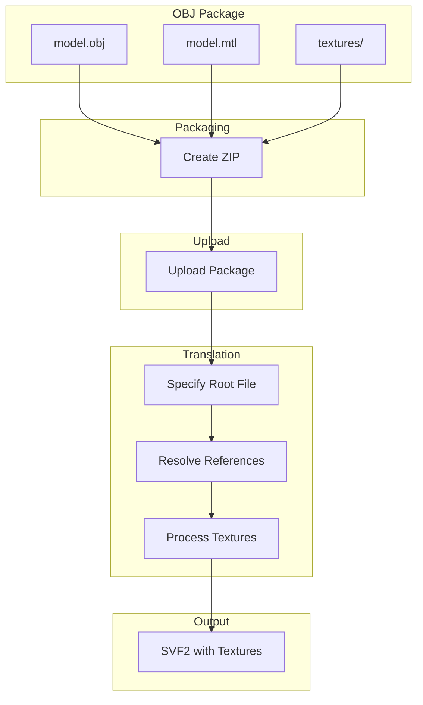
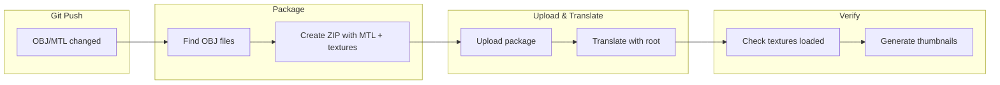
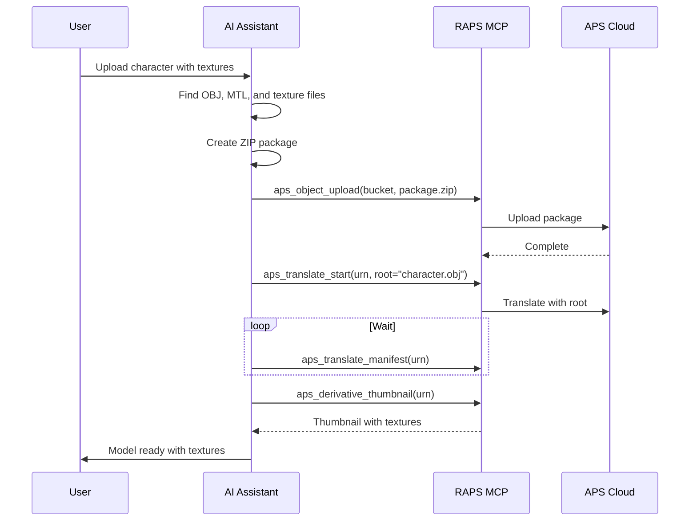

# OBJ with Materials

Process OBJ files with MTL materials and texture files correctly.

## Workflow Overview



---

## CLI Approach

### Option 1: ZIP Package

The most reliable method for OBJ with external files.

```bash
# Package OBJ with materials and textures
cd ./model-folder
zip -r model-package.zip model.obj model.mtl textures/

# Upload package
raps object upload media-assets model-package.zip

# Translate with root file specification
URN=$(raps object urn media-assets model-package.zip --output plain)
raps translate start "$URN" --format svf2 --root "model.obj" --wait
```

### Option 2: Upload Files Individually

For simpler setups without subdirectories.

```bash
# Upload OBJ file
raps object upload media-assets model.obj

# Upload MTL file (same folder reference)
raps object upload media-assets model.mtl

# Upload textures
for tex in ./textures/*.{jpg,png}; do
  raps object upload media-assets "$tex"
done

# Translate OBJ
URN=$(raps object urn media-assets model.obj --output plain)
raps translate start "$URN" --format svf2 --wait
```

### Verify Texture Loading

```bash
# Check manifest for texture resources
raps translate manifest "$URN" --output json | jq '.derivatives[].children[] | select(.type == "resource")'

# Get thumbnail to verify materials
raps derivative thumbnail "$URN" --output ./preview-with-materials.png
```

---

## CI/CD Pipeline

```yaml
# .github/workflows/obj-materials.yml
name: OBJ with Materials Processing

on:
  push:
    paths:
      - 'models/**/*.obj'
      - 'models/**/*.mtl'

env:
  BUCKET: textured-models

jobs:
  process-obj:
    runs-on: ubuntu-latest
    steps:
      - uses: actions/checkout@v4

      - name: Install RAPS
        run: cargo install raps

      - name: Setup bucket
        env:
          APS_CLIENT_ID: ${{ secrets.APS_CLIENT_ID }}
          APS_CLIENT_SECRET: ${{ secrets.APS_CLIENT_SECRET }}
        run: |
          raps bucket create --key "$BUCKET" --policy persistent --region US 2>/dev/null || true

      - name: Package and upload OBJ models
        env:
          APS_CLIENT_ID: ${{ secrets.APS_CLIENT_ID }}
          APS_CLIENT_SECRET: ${{ secrets.APS_CLIENT_SECRET }}
        run: |
          # Find directories containing OBJ files
          find models -name "*.obj" | while read obj; do
            DIR=$(dirname "$obj")
            NAME=$(basename "$obj" .obj)

            echo "Processing: $NAME"

            # Create package with all related files
            cd "$DIR"
            zip -r "${NAME}-package.zip" "${NAME}.obj" "${NAME}.mtl" textures/ 2>/dev/null || \
            zip -r "${NAME}-package.zip" "${NAME}.obj" "${NAME}.mtl" 2>/dev/null || \
            zip -r "${NAME}-package.zip" "${NAME}.obj"
            cd -

            # Upload
            raps object upload "$BUCKET" "${DIR}/${NAME}-package.zip"

            # Translate
            URN=$(raps object urn "$BUCKET" "${NAME}-package.zip" --output plain)
            raps translate start "$URN" --format svf2 --root "${NAME}.obj" --wait

            echo "Completed: $NAME"
          done

      - name: Verify translations
        env:
          APS_CLIENT_ID: ${{ secrets.APS_CLIENT_ID }}
          APS_CLIENT_SECRET: ${{ secrets.APS_CLIENT_SECRET }}
        run: |
          mkdir -p ./thumbnails

          raps object list "$BUCKET" --output json | jq -r '.[].key' | while read key; do
            URN=$(raps object urn "$BUCKET" "$key" --output plain)
            STATUS=$(raps translate manifest "$URN" 2>/dev/null | jq -r '.status // "pending"')

            if [ "$STATUS" = "success" ]; then
              NAME=$(echo "$key" | sed 's/-package.zip//')
              raps derivative thumbnail "$URN" --output "./thumbnails/${NAME}.png" 2>/dev/null || true
            fi
          done

      - name: Upload thumbnails
        uses: actions/upload-artifact@v4
        with:
          name: model-thumbnails
          path: ./thumbnails/
```

### Pipeline Flow



---

## MCP Integration

### Process Textured Model

```
User: "Upload the character model with all its textures"
```



**AI Response:**
> Uploaded character model with textures:
>
> **Package Contents:**
> - character.obj (2.4 MB)
> - character.mtl (1.2 KB)
> - textures/
>   - diffuse.jpg (4.1 MB)
>   - normal.png (2.8 MB)
>   - roughness.jpg (1.5 MB)
>
> **Translation:** Complete
> **Textures loaded:** 3/3
>
> Preview saved to `thumbnail.png` — download locally to confirm materials and textures applied correctly.

### Troubleshoot Missing Textures

```
User: "The model textures aren't showing up"
```

**AI Response:**
> Checking texture loading for character.obj...
>
> **Issue Found:** Texture paths in MTL don't match uploaded files
>
> **MTL References:**
> - map_Kd textures/Diffuse.jpg ❌ (case mismatch)
> - map_Bump normal.png ❌ (wrong path)
>
> **Uploaded Files:**
> - textures/diffuse.jpg
> - textures/normal.png
>
> **Fix:** Update MTL file to match actual paths:
> ```
> map_Kd textures/diffuse.jpg
> map_Bump textures/normal.png
> ```
>
> Would you like me to create a corrected package?

---

## Common Issues

### Path Case Sensitivity

```bash
# Linux/macOS are case-sensitive
# MTL says: textures/Diffuse.jpg
# Actual:   textures/diffuse.jpg

# Fix: Rename files or update MTL
sed -i 's/Diffuse\.jpg/diffuse.jpg/g' model.mtl
```

### Relative Path Issues

```bash
# MTL with absolute paths won't work
# map_Kd C:/Users/me/project/textures/diffuse.jpg

# Fix: Convert to relative paths
sed -i 's|C:/Users/me/project/||g' model.mtl
```

### Missing Textures

```bash
# Check what textures MTL references
grep -E "^map_" model.mtl

# Verify files exist
for tex in $(grep -oE "map_\w+\s+\S+" model.mtl | awk '{print $2}'); do
  [ -f "$tex" ] && echo "✓ $tex" || echo "✗ $tex MISSING"
done
```

### Folder Structure

```
Correct structure:
model-package.zip
├── model.obj
├── model.mtl
└── textures/
    ├── diffuse.jpg
    ├── normal.png
    └── specular.jpg

MTL content:
newmtl material_0
map_Kd textures/diffuse.jpg
map_Bump textures/normal.png
map_Ks textures/specular.jpg
```

---

## Related

- [3D Asset Translation](/docs/cookbook-media-translation)
- [Asset Catalog Generation](/docs/cookbook-media-catalog)
- [Cookbook: Media & Entertainment](/docs/cookbook-media)
