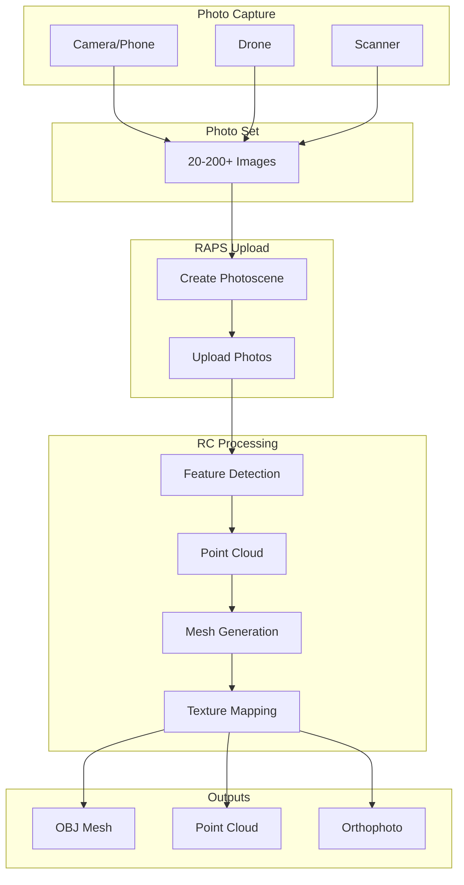
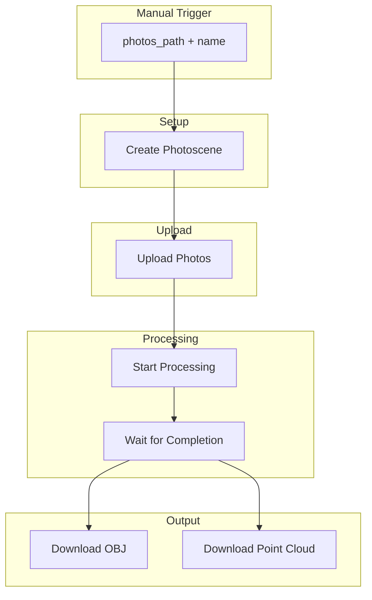
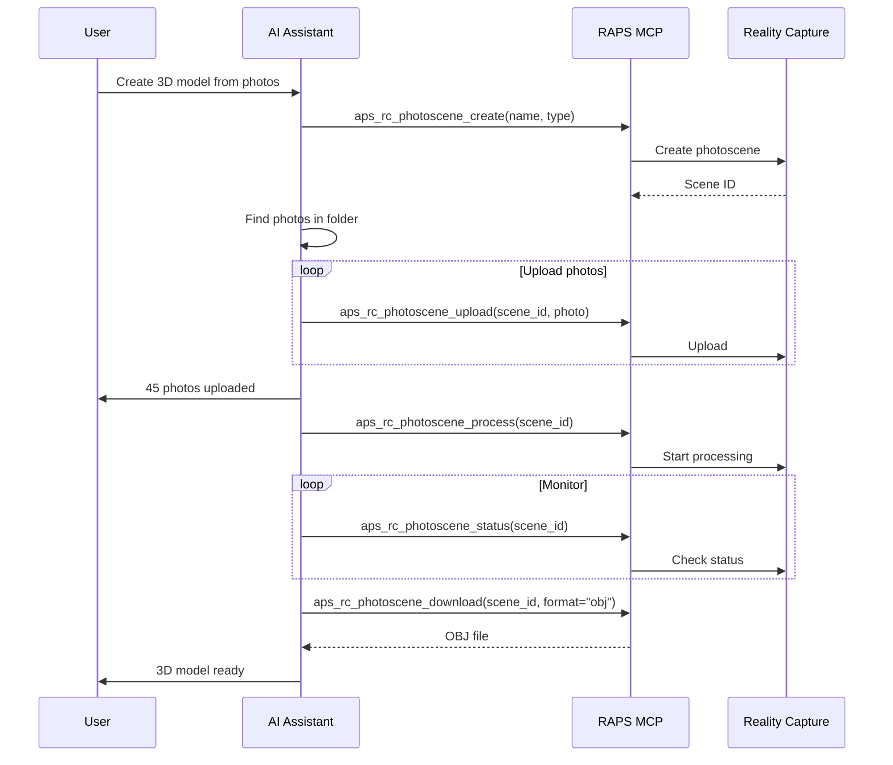

# Photogrammetry Pipeline

Create 3D models from photographs using the Reality Capture API.

## Workflow Overview



---

## CLI Approach

### Step 1: Create Photoscene

```bash
# Create a new photoscene for an object
SCENE=$(raps rc photoscene create --name "Product Scan" --type "object" --output json)
SCENE_ID=$(echo "$SCENE" | jq -r '.id')
echo "Created photoscene: $SCENE_ID"
```

### Step 2: Upload Photos

```bash
# Upload all photos (minimum 20-30 recommended)
for photo in ./product-photos/*.jpg; do
  raps rc photoscene upload "$SCENE_ID" "$photo"
  echo "Uploaded: $photo"
done

# Or batch upload
raps rc photoscene upload "$SCENE_ID" ./product-photos/*.jpg --batch
```

### Step 3: Start Processing

```bash
# Start the reconstruction
raps rc photoscene process "$SCENE_ID"
```

### Step 4: Monitor Progress

```bash
# Check status
raps rc photoscene status "$SCENE_ID"

# Wait for completion
raps rc photoscene status "$SCENE_ID" --wait

# Or poll manually
while true; do
  STATUS=$(raps rc photoscene status "$SCENE_ID" --output json | jq -r '.status')
  PROGRESS=$(raps rc photoscene status "$SCENE_ID" --output json | jq -r '.progress // 0')

  echo "Status: $STATUS - Progress: $PROGRESS%"

  [ "$STATUS" = "done" ] && break
  [ "$STATUS" = "failed" ] && { echo "Processing failed"; exit 1; }

  sleep 30
done
```

### Step 5: Download Results

```bash
# Download OBJ mesh
raps rc photoscene download "$SCENE_ID" --format obj --output ./output/

# Download point cloud
raps rc photoscene download "$SCENE_ID" --format rcm --output ./output/

# List available outputs
raps rc photoscene download "$SCENE_ID" --list
```

---

## CI/CD Pipeline

```yaml
# .github/workflows/photogrammetry.yml
name: Photogrammetry Processing

on:
  workflow_dispatch:
    inputs:
      photos_path:
        description: 'Path to photos folder'
        required: true
      scene_name:
        description: 'Name for the photoscene'
        required: true
      scene_type:
        description: 'Type (object or aerial)'
        default: 'object'

jobs:
  process-photogrammetry:
    runs-on: ubuntu-latest
    timeout-minutes: 120
    steps:
      - uses: actions/checkout@v4

      - name: Install RAPS
        run: cargo install raps

      - name: Create photoscene
        env:
          APS_CLIENT_ID: ${{ secrets.APS_CLIENT_ID }}
          APS_CLIENT_SECRET: ${{ secrets.APS_CLIENT_SECRET }}
        run: |
          SCENE=$(raps rc photoscene create \
            --name "${{ inputs.scene_name }}" \
            --type "${{ inputs.scene_type }}" \
            --output json)
          SCENE_ID=$(echo "$SCENE" | jq -r '.id')
          echo "SCENE_ID=$SCENE_ID" >> $GITHUB_ENV

      - name: Upload photos
        env:
          APS_CLIENT_ID: ${{ secrets.APS_CLIENT_ID }}
          APS_CLIENT_SECRET: ${{ secrets.APS_CLIENT_SECRET }}
        run: |
          PHOTO_COUNT=0
          for photo in ${{ inputs.photos_path }}/*.{jpg,jpeg,png}; do
            [ -f "$photo" ] || continue
            raps rc photoscene upload "$SCENE_ID" "$photo"
            PHOTO_COUNT=$((PHOTO_COUNT + 1))
            echo "Uploaded: $PHOTO_COUNT - $(basename "$photo")"
          done
          echo "Total photos: $PHOTO_COUNT"

      - name: Process photoscene
        env:
          APS_CLIENT_ID: ${{ secrets.APS_CLIENT_ID }}
          APS_CLIENT_SECRET: ${{ secrets.APS_CLIENT_SECRET }}
        run: |
          raps rc photoscene process "$SCENE_ID"

      - name: Wait for completion
        env:
          APS_CLIENT_ID: ${{ secrets.APS_CLIENT_ID }}
          APS_CLIENT_SECRET: ${{ secrets.APS_CLIENT_SECRET }}
        run: |
          MAX_WAIT=7200  # 2 hours
          ELAPSED=0

          while [ $ELAPSED -lt $MAX_WAIT ]; do
            STATUS=$(raps rc photoscene status "$SCENE_ID" --output json | jq -r '.status')
            PROGRESS=$(raps rc photoscene status "$SCENE_ID" --output json | jq -r '.progress // 0')

            echo "Status: $STATUS - Progress: $PROGRESS%"

            [ "$STATUS" = "done" ] && break
            [ "$STATUS" = "failed" ] && exit 1

            sleep 60
            ELAPSED=$((ELAPSED + 60))
          done

      - name: Download results
        env:
          APS_CLIENT_ID: ${{ secrets.APS_CLIENT_ID }}
          APS_CLIENT_SECRET: ${{ secrets.APS_CLIENT_SECRET }}
        run: |
          mkdir -p ./photogrammetry-output
          raps rc photoscene download "$SCENE_ID" --format obj --output ./photogrammetry-output/
          raps rc photoscene download "$SCENE_ID" --format rcm --output ./photogrammetry-output/

      - name: Upload results
        uses: actions/upload-artifact@v4
        with:
          name: photogrammetry-${{ inputs.scene_name }}
          path: ./photogrammetry-output/
```

### Pipeline Flow



---

## MCP Integration

### Create Scan

```
User: "Create a 3D model from the photos in the product-shoot folder"
```



**AI Response:**
> Created 3D model from product photos:
>
> **Photoscene:** Product Scan
> **Photos processed:** 45
> **Processing time:** 12 minutes
>
> **Output Files:**
> - product_scan.obj (12.4 MB)
> - product_scan.mtl
> - product_scan_texture.jpg (8.2 MB)
>
> **Quality Metrics:**
> - Reconstruction quality: High
> - Coverage: 98%
> - Polygons: 245,000
>
> Download ready at: ./output/product_scan.obj

### Check Status

```
User: "What's the status of my photogrammetry job?"
```

**AI Response:**
> **Photoscene: Site Survey 2024-02-15**
>
> - Status: Processing
> - Progress: 67%
> - Stage: Mesh Generation
> - Estimated time remaining: ~8 minutes
>
> Photos: 124 / 124 processed
> Point cloud: 2.3 million points

---

## Best Practices

### Photo Capture Guidelines

```
For Objects:
- 30-100 photos from all angles
- 60-80% overlap between shots
- Consistent lighting
- Plain background

For Sites/Aerial:
- 100-500 photos
- 70%+ overlap
- Nadir (straight down) shots
- Include oblique angles
```

### Quality Settings

```bash
# High quality (slower, more detail)
raps rc photoscene process "$SCENE_ID" --quality high

# Standard quality (balanced)
raps rc photoscene process "$SCENE_ID" --quality medium

# Draft (quick preview)
raps rc photoscene process "$SCENE_ID" --quality draft
```

### Error Handling

```bash
# Check for failed photos
raps rc photoscene status "$SCENE_ID" --output json | jq '.failedPhotos'

# Retry with adjusted settings
raps rc photoscene cancel "$SCENE_ID"
raps rc photoscene process "$SCENE_ID" --quality medium
```

---

## Related

- [Site Capture Workflow](/docs/cookbook-media-sitecapture)
- [3D Asset Translation](/docs/cookbook-media-translation)
- [Cookbook: Media & Entertainment](/docs/cookbook-media)
