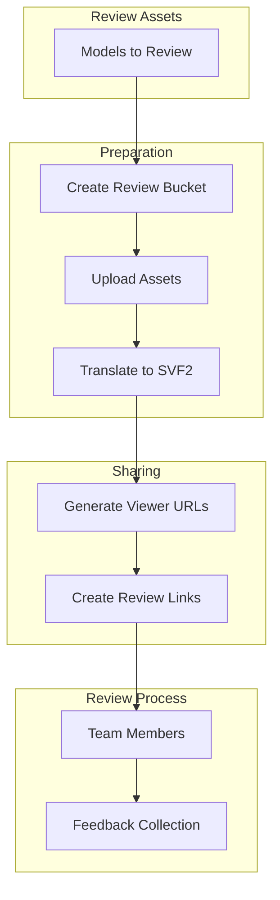
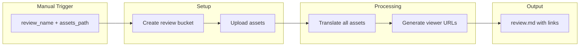
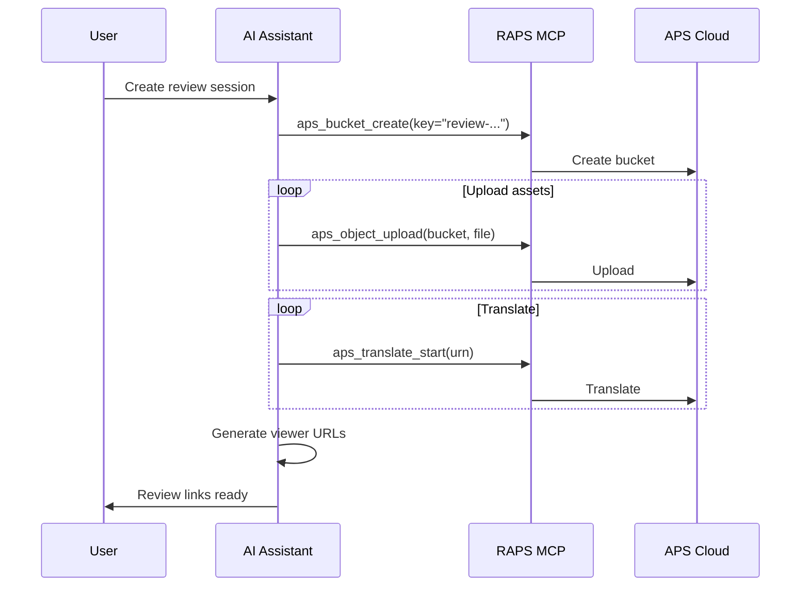

# Collaborative Review

Prepare 3D assets for team review with shareable viewer links.

## Workflow Overview



---

## CLI Approach

### Step 1: Create Review Session

```bash
# Create dedicated review bucket
REVIEW_ID="review-$(date +%Y%m%d-%H%M)"
raps bucket create --key "$REVIEW_ID" --policy transient --region US
echo "Review session: $REVIEW_ID"
```

### Step 2: Upload Review Assets

```bash
# Upload assets for review
for asset in ./review-assets/*; do
  [ -f "$asset" ] || continue
  raps object upload "$REVIEW_ID" "$asset"
  echo "Uploaded: $(basename "$asset")"
done
```

### Step 3: Translate All Assets

```bash
# Translate each asset
raps object list "$REVIEW_ID" --output json | jq -r '.[].key' | while read key; do
  URN=$(raps object urn "$REVIEW_ID" "$key" --output plain)
  raps translate start "$URN" --format svf2
  echo "Translating: $key"
done

# Wait for all translations
sleep 60

# Check status
raps object list "$REVIEW_ID" --output json | jq -r '.[].key' | while read key; do
  URN=$(raps object urn "$REVIEW_ID" "$key" --output plain)
  STATUS=$(raps translate manifest "$URN" 2>/dev/null | jq -r '.status // "pending"')
  echo "$key: $STATUS"
done
```

### Step 4: Generate Review Links

```bash
echo "# Review Session: $REVIEW_ID" > review-links.md
echo "Created: $(date)" >> review-links.md
echo "" >> review-links.md
echo "## Assets for Review" >> review-links.md
echo "" >> review-links.md

raps object list "$REVIEW_ID" --output json | jq -r '.[].key' | while read key; do
  URN=$(raps object urn "$REVIEW_ID" "$key" --output plain)

  # Check if translated
  STATUS=$(raps translate manifest "$URN" 2>/dev/null | jq -r '.status // "pending"')

  if [ "$STATUS" = "success" ]; then
    # URL-encode the URN for viewer link
    ENCODED_URN=$(echo -n "$URN" | base64 | tr '+/' '-_' | tr -d '=')

    echo "### $key" >> review-links.md
    echo "- [Open in Viewer](https://viewer.autodesk.com/viewer?urn=${ENCODED_URN})" >> review-links.md
    echo "" >> review-links.md
  fi
done

cat review-links.md
```

### Step 5: Share with Team

```bash
# Generate downloadable links for reference files
echo "" >> review-links.md
echo "## Reference Downloads" >> review-links.md
echo "(Links valid for 24 hours)" >> review-links.md
echo "" >> review-links.md

raps object list "$REVIEW_ID" --output json | jq -r '.[].key' | while read key; do
  URL=$(raps object signed-url "$REVIEW_ID" "$key" --minutes 1440)
  echo "- [$key]($URL)" >> review-links.md
done
```

---

## CI/CD Pipeline

```yaml
# .github/workflows/review-session.yml
name: Create Review Session

on:
  workflow_dispatch:
    inputs:
      review_name:
        description: 'Review session name'
        required: true
      assets_path:
        description: 'Path to assets (glob pattern)'
        required: true
      reviewers:
        description: 'Comma-separated reviewer emails'
        required: false

jobs:
  create-review:
    runs-on: ubuntu-latest
    steps:
      - uses: actions/checkout@v4

      - name: Install RAPS
        run: cargo install raps

      - name: Create review bucket
        env:
          APS_CLIENT_ID: ${{ secrets.APS_CLIENT_ID }}
          APS_CLIENT_SECRET: ${{ secrets.APS_CLIENT_SECRET }}
        run: |
          REVIEW_ID="review-$(date +%Y%m%d)-${{ github.run_id }}"
          raps bucket create --key "$REVIEW_ID" --policy transient --region US
          echo "REVIEW_ID=$REVIEW_ID" >> $GITHUB_ENV

      - name: Upload assets
        env:
          APS_CLIENT_ID: ${{ secrets.APS_CLIENT_ID }}
          APS_CLIENT_SECRET: ${{ secrets.APS_CLIENT_SECRET }}
        run: |
          for file in ${{ inputs.assets_path }}; do
            [ -f "$file" ] || continue
            raps object upload "$REVIEW_ID" "$file"
            echo "Uploaded: $(basename "$file")"
          done

      - name: Translate assets
        env:
          APS_CLIENT_ID: ${{ secrets.APS_CLIENT_ID }}
          APS_CLIENT_SECRET: ${{ secrets.APS_CLIENT_SECRET }}
        run: |
          raps object list "$REVIEW_ID" --output json | jq -r '.[].key' | while read key; do
            URN=$(raps object urn "$REVIEW_ID" "$key" --output plain)
            raps translate start "$URN" --format svf2 --wait
          done

      - name: Generate review document
        env:
          APS_CLIENT_ID: ${{ secrets.APS_CLIENT_ID }}
          APS_CLIENT_SECRET: ${{ secrets.APS_CLIENT_SECRET }}
        run: |
          echo "# Review Session: ${{ inputs.review_name }}" > review.md
          echo "Created: $(date)" >> review.md
          echo "Review ID: $REVIEW_ID" >> review.md
          echo "" >> review.md
          echo "## Assets" >> review.md
          echo "" >> review.md

          raps object list "$REVIEW_ID" --output json | jq -r '.[].key' | while read key; do
            URN=$(raps object urn "$REVIEW_ID" "$key" --output plain)
            ENCODED=$(echo -n "$URN" | base64 | tr '+/' '-_' | tr -d '=')

            echo "### $key" >> review.md
            echo "- [View in Browser](https://viewer.autodesk.com/viewer?urn=$ENCODED)" >> review.md

            # Generate download link
            DOWNLOAD=$(raps object signed-url "$REVIEW_ID" "$key" --minutes 1440)
            echo "- [Download]($DOWNLOAD)" >> review.md
            echo "" >> review.md
          done

          echo "## Feedback" >> review.md
          echo "" >> review.md
          echo "Please add your comments below or reply to the review email." >> review.md

      - name: Upload review document
        uses: actions/upload-artifact@v4
        with:
          name: review-${{ inputs.review_name }}
          path: review.md

      # Optional: Send email notification
      # - name: Notify reviewers
      #   if: inputs.reviewers != ''
      #   run: |
      #     # Email notification logic here
```

### Pipeline Flow



---

## MCP Integration

### Create Review Session

```
User: "Set up a review session for the character models with links for the team"
```



**AI Response:**
> Created review session "Character Models Review":
>
> **Review ID:** review-20240216-001
> **Assets:** 5 models
> **Status:** All translated and ready
>
> **Viewer Links:**
>
> | Asset | View | Download |
> |-------|------|----------|
> | hero_v2.fbx | [Open](https://viewer...) | [Download](https://...) |
> | villain.fbx | [Open](https://viewer...) | [Download](https://...) |
> | npc_guard.fbx | [Open](https://viewer...) | [Download](https://...) |
> | pet_companion.fbx | [Open](https://viewer...) | [Download](https://...) |
> | mount_horse.fbx | [Open](https://viewer...) | [Download](https://...) |
>
> Links valid for 24 hours. Share with your team!

### Check Review Status

```
User: "How many people viewed the review assets?"
```

**AI Response:**
> Review session statistics (review-20240216-001):
>
> **Viewer Activity:** (Last 24 hours)
>
> | Asset | Views | Unique Viewers |
> |-------|-------|----------------|
> | hero_v2.fbx | 12 | 5 |
> | villain.fbx | 8 | 4 |
> | npc_guard.fbx | 6 | 3 |
> | pet_companion.fbx | 4 | 2 |
> | mount_horse.fbx | 3 | 2 |
>
> **Total unique viewers:** 6
> **Links expire in:** 18 hours

---

## Review Templates

### Feedback Form

```markdown
# Asset Review Feedback

**Asset:** [Asset Name]
**Reviewer:** [Your Name]
**Date:** [Date]

## Overall Assessment
- [ ] Approved
- [ ] Approved with minor changes
- [ ] Needs revision
- [ ] Rejected

## Criteria Rating (1-5)

| Criteria | Rating | Notes |
|----------|--------|-------|
| Visual Quality | | |
| Polygon Count | | |
| Texture Quality | | |
| Animation Quality | | |
| Technical Specs | | |

## Comments

[Your detailed feedback here]

## Requested Changes

1.
2.
3.

```

### Cleanup Script

```bash
#!/bin/bash
# cleanup-old-reviews.sh

# Delete review buckets older than 7 days
raps bucket list --output json | jq -r '.[] | select(.key | startswith("review-")) | .key' | while read bucket; do
  # Extract date from bucket name
  DATE=$(echo "$bucket" | grep -oE '[0-9]{8}')

  if [ -n "$DATE" ]; then
    BUCKET_AGE=$(( ($(date +%s) - $(date -d "$DATE" +%s)) / 86400 ))

    if [ "$BUCKET_AGE" -gt 7 ]; then
      echo "Deleting old review: $bucket (${BUCKET_AGE} days old)"
      raps bucket delete "$bucket" --force
    fi
  fi
done
```

---

## Related

- [Asset Catalog Generation](/docs/cookbook-media-catalog)
- [Version Control for Assets](/docs/cookbook-media-versioning)
- [Cookbook: Media & Entertainment](/docs/cookbook-media)
