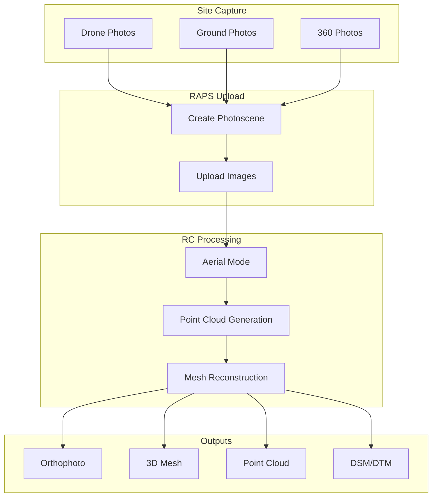
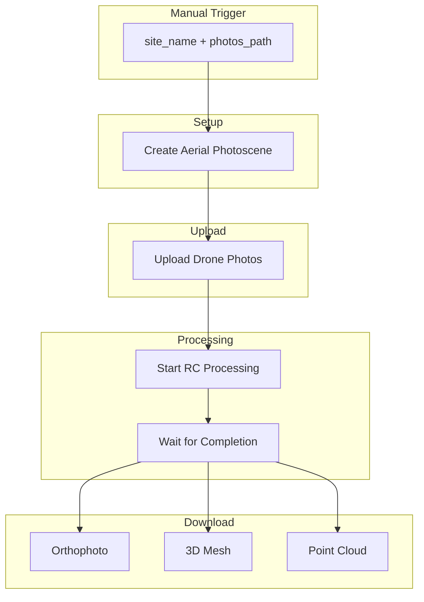
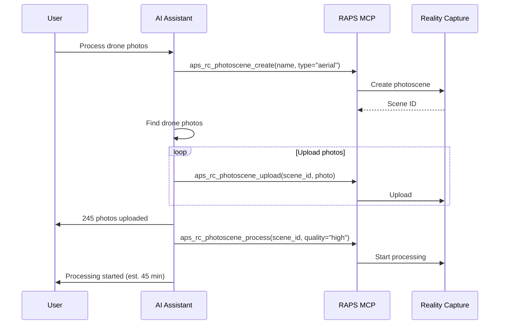

# Site Capture Workflow

Process drone photos and site photography into 3D environments.

## Workflow Overview



---

## CLI Approach

### Step 1: Create Aerial Photoscene

```bash
# Create site capture photoscene
SCENE=$(raps rc photoscene create \
  --name "Site Survey $(date +%Y-%m-%d)" \
  --type "aerial" \
  --output json)
SCENE_ID=$(echo "$SCENE" | jq -r '.id')
echo "Created photoscene: $SCENE_ID"
```

### Step 2: Upload Drone Photos

```bash
# Batch upload drone photos
find ./drone-photos -name "*.jpg" | while read photo; do
  raps rc photoscene upload "$SCENE_ID" "$photo"
  echo "Uploaded: $(basename "$photo")"
done

# Or with parallel upload
find ./drone-photos -name "*.jpg" -print0 | \
  xargs -0 -P 4 -I {} raps rc photoscene upload "$SCENE_ID" {}
```

### Step 3: Process with Aerial Settings

```bash
# Start processing with high quality
raps rc photoscene process "$SCENE_ID" --quality high

# For large sites, use draft first
# raps rc photoscene process "$SCENE_ID" --quality draft
```

### Step 4: Monitor Progress

```bash
while true; do
  RESPONSE=$(raps rc photoscene status "$SCENE_ID" --output json)
  STATUS=$(echo "$RESPONSE" | jq -r '.status')
  PROGRESS=$(echo "$RESPONSE" | jq -r '.progress // 0')

  echo "Status: $STATUS - Progress: $PROGRESS%"

  [ "$STATUS" = "done" ] && break
  [ "$STATUS" = "failed" ] && { echo "Processing failed"; exit 1; }

  sleep 60
done
```

### Step 5: Download All Outputs

```bash
mkdir -p ./site-output

# Download orthophoto
raps rc photoscene download "$SCENE_ID" --format ortho --output ./site-output/

# Download 3D mesh
raps rc photoscene download "$SCENE_ID" --format obj --output ./site-output/

# Download point cloud
raps rc photoscene download "$SCENE_ID" --format rcm --output ./site-output/

# List all available formats
raps rc photoscene download "$SCENE_ID" --list
```

---

## CI/CD Pipeline

```yaml
# .github/workflows/site-capture.yml
name: Site Capture Processing

on:
  workflow_dispatch:
    inputs:
      site_name:
        description: 'Site name for the survey'
        required: true
      photos_path:
        description: 'Path to drone photos'
        required: true
      quality:
        description: 'Processing quality'
        default: 'high'
        type: choice
        options:
          - draft
          - medium
          - high

jobs:
  process-site:
    runs-on: ubuntu-latest
    timeout-minutes: 180
    steps:
      - uses: actions/checkout@v4

      - name: Install RAPS
        run: cargo install raps

      - name: Create photoscene
        env:
          APS_CLIENT_ID: ${{ secrets.APS_CLIENT_ID }}
          APS_CLIENT_SECRET: ${{ secrets.APS_CLIENT_SECRET }}
        run: |
          SCENE=$(raps rc photoscene create \
            --name "${{ inputs.site_name }}" \
            --type "aerial" \
            --output json)
          SCENE_ID=$(echo "$SCENE" | jq -r '.id')
          echo "SCENE_ID=$SCENE_ID" >> $GITHUB_ENV

      - name: Upload photos
        env:
          APS_CLIENT_ID: ${{ secrets.APS_CLIENT_ID }}
          APS_CLIENT_SECRET: ${{ secrets.APS_CLIENT_SECRET }}
        run: |
          COUNT=0
          for photo in ${{ inputs.photos_path }}/*.{jpg,jpeg,JPG,JPEG}; do
            [ -f "$photo" ] || continue
            raps rc photoscene upload "$SCENE_ID" "$photo"
            COUNT=$((COUNT + 1))
            echo "Uploaded: $COUNT"
          done
          echo "Total photos: $COUNT"

      - name: Process photoscene
        env:
          APS_CLIENT_ID: ${{ secrets.APS_CLIENT_ID }}
          APS_CLIENT_SECRET: ${{ secrets.APS_CLIENT_SECRET }}
        run: |
          raps rc photoscene process "$SCENE_ID" --quality ${{ inputs.quality }}

      - name: Wait for completion
        env:
          APS_CLIENT_ID: ${{ secrets.APS_CLIENT_ID }}
          APS_CLIENT_SECRET: ${{ secrets.APS_CLIENT_SECRET }}
        run: |
          MAX_WAIT=10800  # 3 hours
          ELAPSED=0

          while [ $ELAPSED -lt $MAX_WAIT ]; do
            STATUS=$(raps rc photoscene status "$SCENE_ID" --output json | jq -r '.status')
            PROGRESS=$(raps rc photoscene status "$SCENE_ID" --output json | jq -r '.progress // 0')

            echo "Status: $STATUS ($PROGRESS%)"

            [ "$STATUS" = "done" ] && break
            [ "$STATUS" = "failed" ] && exit 1

            sleep 120
            ELAPSED=$((ELAPSED + 120))
          done

      - name: Download results
        env:
          APS_CLIENT_ID: ${{ secrets.APS_CLIENT_ID }}
          APS_CLIENT_SECRET: ${{ secrets.APS_CLIENT_SECRET }}
        run: |
          mkdir -p ./site-capture-output

          # Download all formats
          raps rc photoscene download "$SCENE_ID" --format ortho --output ./site-capture-output/
          raps rc photoscene download "$SCENE_ID" --format obj --output ./site-capture-output/
          raps rc photoscene download "$SCENE_ID" --format rcm --output ./site-capture-output/

      - name: Upload results
        uses: actions/upload-artifact@v4
        with:
          name: site-capture-${{ inputs.site_name }}
          path: ./site-capture-output/
```

### Pipeline Flow



---

## MCP Integration

### Process Site Survey

```
User: "Process the drone photos from today's site survey"
```



**AI Response:**
> Processing site survey from drone photos:
>
> **Photoscene:** Site Survey 2024-02-15
> **Photos:** 245 uploaded
> **Coverage area:** ~2.5 acres
> **Quality:** High
>
> **Status:** Processing
> **Progress:** 23%
> **Estimated time:** 35 minutes remaining
>
> I'll notify you when it's complete.

### Check Results

```
User: "Is the site capture done? What outputs do we have?"
```

**AI Response:**
> Site Survey 2024-02-15 processing complete!
>
> **Generated Outputs:**
>
> | Output | Format | Size | Resolution |
> |--------|--------|------|------------|
> | Orthophoto | GeoTIFF | 156 MB | 2.5 cm/px |
> | 3D Mesh | OBJ | 89 MB | 1.2M polygons |
> | Point Cloud | RCM | 234 MB | 4.5M points |
>
> **Quality Metrics:**
> - Photo alignment: 243/245 (99%)
> - Coverage: 100%
> - Reconstruction quality: Excellent
>
> Ready to download. Where would you like to save the files?

---

## Best Practices

### Drone Flight Planning

```
For best results:
- 70-80% front overlap
- 60-70% side overlap
- Consistent altitude (100-400 ft typical)
- Include oblique shots around edges
- Fly on overcast days (consistent lighting)
```

### Photo Requirements

```bash
# Minimum recommended:
# - 50+ photos for small sites
# - 100-300 for medium sites
# - 300+ for large sites

# Check photo count before processing
PHOTO_COUNT=$(find ./drone-photos -name "*.jpg" | wc -l)
echo "Photo count: $PHOTO_COUNT"

if [ "$PHOTO_COUNT" -lt 50 ]; then
  echo "Warning: Low photo count may affect quality"
fi
```

### Quality vs Speed Trade-off

```bash
# Draft: Quick preview (10-15 min)
raps rc photoscene process "$SCENE_ID" --quality draft

# Medium: Balanced (30-45 min)
raps rc photoscene process "$SCENE_ID" --quality medium

# High: Best quality (60+ min)
raps rc photoscene process "$SCENE_ID" --quality high
```

---

## Related

- [Photogrammetry Pipeline](/docs/cookbook-media-photogrammetry)
- [3D Asset Translation](/docs/cookbook-media-translation)
- [Cookbook: Media & Entertainment](/docs/cookbook-media)
