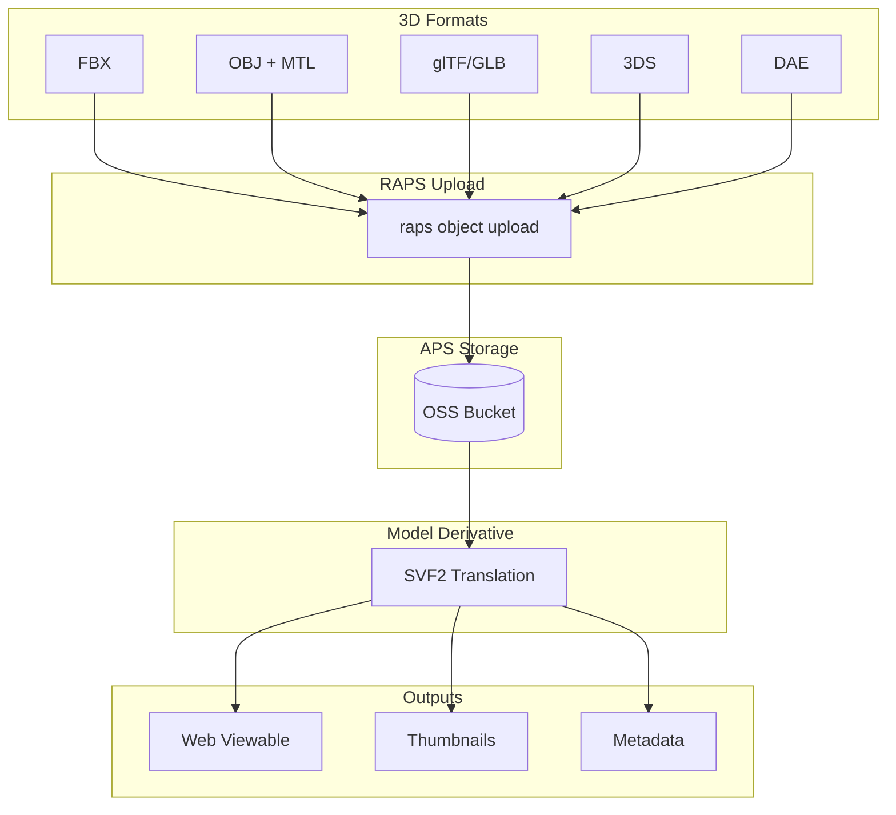
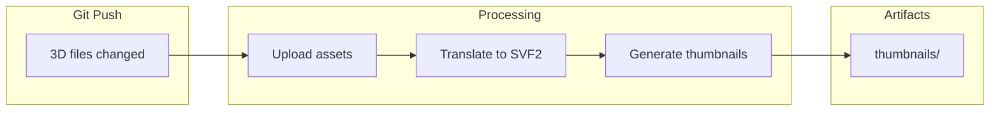
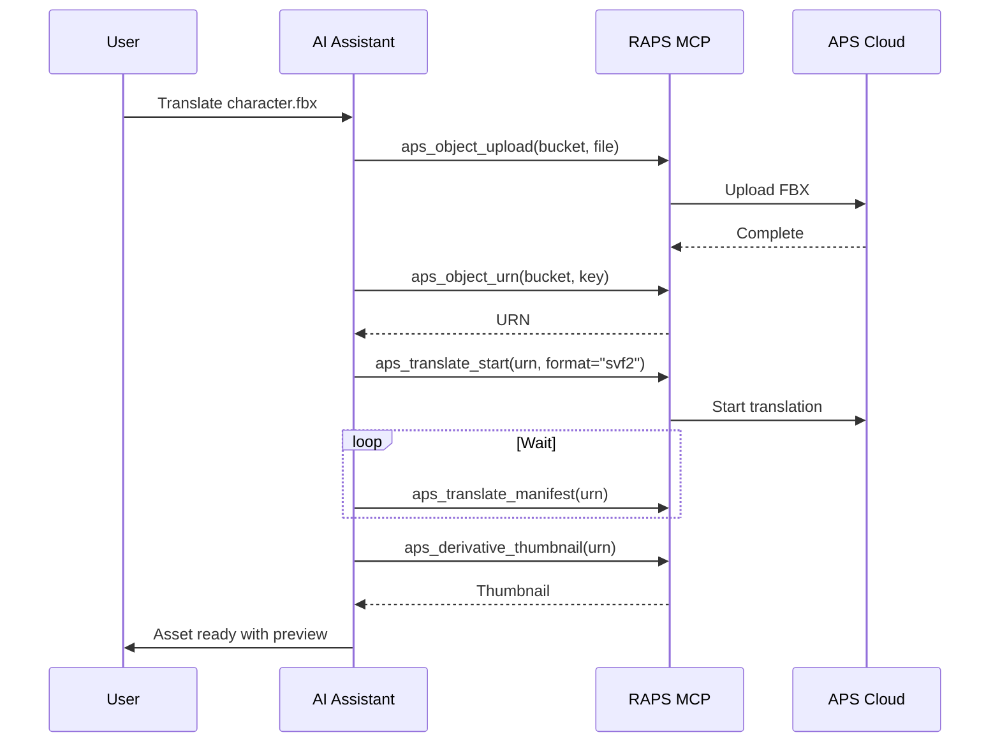

# 3D Asset Translation

Process common 3D formats (FBX, OBJ, glTF) for web-based viewing.

## Workflow Overview



---

## CLI Approach

### Step 1: Create Assets Bucket

```bash
raps bucket create --key media-assets --policy persistent --region US
```

### Step 2: Upload 3D Files

```bash
# FBX file
raps object upload media-assets character.fbx

# OBJ file
raps object upload media-assets environment.obj

# glTF file
raps object upload media-assets props.gltf

# GLB (binary glTF)
raps object upload media-assets vehicle.glb
```

### Step 3: Translate to SVF2

```bash
# Get URN and translate
URN=$(raps object urn media-assets character.fbx --output plain)
raps translate start "$URN" --format svf2 --wait

# Check translation result
raps translate manifest "$URN"
```

### Step 4: Verify Output

```bash
# Get available views
raps derivative views "$URN" --output json

# Get thumbnail
raps derivative thumbnail "$URN" --output ./preview.png

# Get metadata
raps derivative metadata "$URN" --output json
```

### Supported Formats

| Format | Extension | Notes |
|--------|-----------|-------|
| FBX | .fbx | Autodesk format, animations |
| OBJ | .obj | With .mtl materials |
| glTF | .gltf | JSON + separate assets |
| GLB | .glb | Binary glTF |
| 3DS | .3ds | Legacy 3D Studio |
| DAE | .dae | Collada format |

---

## CI/CD Pipeline

```yaml
# .github/workflows/asset-translation.yml
name: 3D Asset Translation

on:
  push:
    paths:
      - 'assets/**/*.fbx'
      - 'assets/**/*.obj'
      - 'assets/**/*.gltf'
      - 'assets/**/*.glb'

env:
  BUCKET: media-assets-${{ github.repository_id }}

jobs:
  translate-assets:
    runs-on: ubuntu-latest
    steps:
      - uses: actions/checkout@v4

      - name: Install RAPS
        run: cargo install raps

      - name: Setup bucket
        env:
          APS_CLIENT_ID: ${{ secrets.APS_CLIENT_ID }}
          APS_CLIENT_SECRET: ${{ secrets.APS_CLIENT_SECRET }}
        run: |
          raps bucket create --key "$BUCKET" --policy persistent --region US 2>/dev/null || true

      - name: Upload and translate
        env:
          APS_CLIENT_ID: ${{ secrets.APS_CLIENT_ID }}
          APS_CLIENT_SECRET: ${{ secrets.APS_CLIENT_SECRET }}
        run: |
          for file in $(git diff --name-only HEAD~1 HEAD -- 'assets/**'); do
            [ -f "$file" ] || continue

            ext="${file##*.}"
            case "$ext" in
              fbx|obj|gltf|glb|3ds|dae)
                echo "Processing: $file"
                raps object upload "$BUCKET" "$file"

                key=$(basename "$file")
                URN=$(raps object urn "$BUCKET" "$key" --output plain)
                raps translate start "$URN" --format svf2 --wait

                echo "Translated: $key"
                ;;
            esac
          done

      - name: Generate thumbnails
        env:
          APS_CLIENT_ID: ${{ secrets.APS_CLIENT_ID }}
          APS_CLIENT_SECRET: ${{ secrets.APS_CLIENT_SECRET }}
        run: |
          mkdir -p ./thumbnails

          raps object list "$BUCKET" --output json | jq -r '.[].key' | while read key; do
            URN=$(raps object urn "$BUCKET" "$key" --output plain)
            STATUS=$(raps translate manifest "$URN" 2>/dev/null | jq -r '.status // "pending"')

            if [ "$STATUS" = "success" ]; then
              name=$(echo "$key" | sed 's/\.[^.]*$//')
              raps derivative thumbnail "$URN" --output "./thumbnails/${name}.png" 2>/dev/null || true
            fi
          done

      - name: Upload thumbnails
        uses: actions/upload-artifact@v4
        with:
          name: asset-thumbnails
          path: ./thumbnails/
```

### Pipeline Flow



---

## MCP Integration

### Translate Single Asset

```
User: "Upload and translate the new character model for web viewing"
```



**AI Response:**
> character.fbx has been uploaded and translated:
>
> **Asset Details:**
> - File size: 12.4 MB
> - Polygons: 45,000
> - Materials: 8
> - Bones: 65
> - Animation clips: 3
>
> **Translation:** Complete (45 seconds)
>
> [View in Browser](https://viewer.autodesk.com/...)
>
> 

### Batch Translate

```
User: "Process all the props in the environment folder"
```

**AI Response:**
> Processing 12 files from environment folder:
>
> | File | Format | Status | Polygons |
> |------|--------|--------|----------|
> | tree_01.fbx | FBX | Complete | 8,200 |
> | rock_large.obj | OBJ | Complete | 2,100 |
> | fence.gltf | glTF | Complete | 1,450 |
> | lamp_post.fbx | FBX | Processing | - |
> | ... | ... | ... | ... |
>
> **Progress:** 9/12 complete

---

## Format-Specific Tips

### FBX with Animations

```bash
# FBX animations are preserved
URN=$(raps object urn media-assets animated-character.fbx --output plain)
raps translate start "$URN" --format svf2 --wait

# Check animation data in metadata
raps derivative metadata "$URN" --output json | jq '.animations'
```

### OBJ with External Materials

```bash
# Package OBJ with MTL and textures
zip -r model-package.zip model.obj model.mtl textures/

raps object upload media-assets model-package.zip

# Specify root file
URN=$(raps object urn media-assets model-package.zip --output plain)
raps translate start "$URN" --format svf2 --root "model.obj" --wait
```

### glTF Variants

```bash
# glTF (JSON + binary + textures)
# Upload all files together or as a zip

# GLB is self-contained
raps object upload media-assets model.glb
URN=$(raps object urn media-assets model.glb --output plain)
raps translate start "$URN" --format svf2 --wait
```

---

## Related

- [OBJ with Materials](/docs/cookbook-media-materials)
- [Animation Workflows](/docs/cookbook-media-animation)
- [Cookbook: Media & Entertainment](/docs/cookbook-media)
