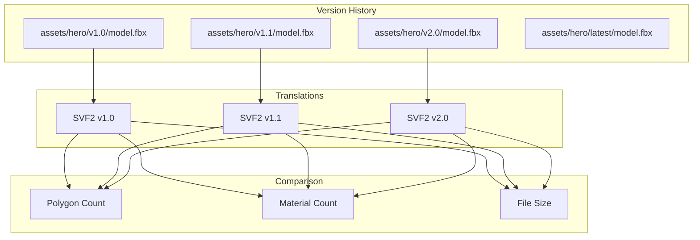
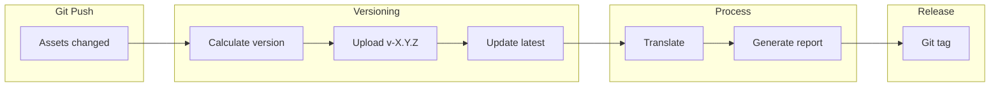
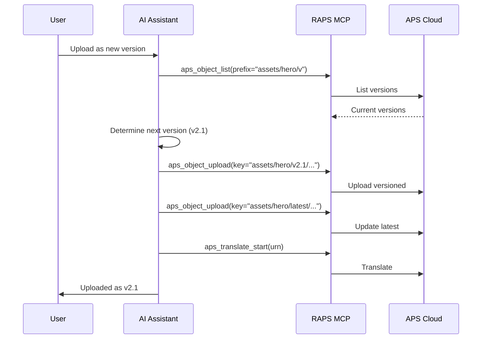

# Version Control for Assets

Track 3D asset versions with organized storage and comparison.

## Workflow Overview



---

## CLI Approach

### Step 1: Upload with Version

```bash
ASSET_NAME="hero-character"
VERSION="v2.0"

# Upload versioned asset
raps object upload media-assets model.fbx --key "assets/${ASSET_NAME}/${VERSION}/model.fbx"

# Also update latest reference
raps object upload media-assets model.fbx --key "assets/${ASSET_NAME}/latest/model.fbx"
```

### Step 2: List All Versions

```bash
ASSET_NAME="hero-character"

# List all versions
raps object list media-assets --prefix "assets/${ASSET_NAME}/" --output json | \
  jq -r '.[] | .key' | sort -V

# Output:
# assets/hero-character/latest/model.fbx
# assets/hero-character/v1.0/model.fbx
# assets/hero-character/v1.1/model.fbx
# assets/hero-character/v2.0/model.fbx
```

### Step 3: Translate All Versions

```bash
# Translate each version
raps object list media-assets --prefix "assets/${ASSET_NAME}/v" --output json | \
  jq -r '.[].key' | while read key; do
    URN=$(raps object urn media-assets "$key" --output plain)
    raps translate start "$URN" --format svf2
    echo "Started translation: $key"
  done

# Wait for all
sleep 60

# Check status
raps object list media-assets --prefix "assets/${ASSET_NAME}/v" --output json | \
  jq -r '.[].key' | while read key; do
    URN=$(raps object urn media-assets "$key" --output plain)
    STATUS=$(raps translate manifest "$URN" 2>/dev/null | jq -r '.status // "pending"')
    echo "$key: $STATUS"
  done
```

### Step 4: Compare Versions

```bash
V1_URN=$(raps object urn media-assets "assets/${ASSET_NAME}/v1.0/model.fbx" --output plain)
V2_URN=$(raps object urn media-assets "assets/${ASSET_NAME}/v2.0/model.fbx" --output plain)

# Get metadata for comparison
raps derivative metadata "$V1_URN" --output json > v1-meta.json
raps derivative metadata "$V2_URN" --output json > v2-meta.json

# Compare
echo "Version Comparison: $ASSET_NAME"
echo "================================"
echo "v1.0 polygons: $(jq '.polygons // "N/A"' v1-meta.json)"
echo "v2.0 polygons: $(jq '.polygons // "N/A"' v2-meta.json)"
```

---

## CI/CD Pipeline

```yaml
# .github/workflows/asset-versioning.yml
name: Asset Version Management

on:
  push:
    paths:
      - 'assets/**'
  workflow_dispatch:
    inputs:
      version_bump:
        description: 'Version type (patch, minor, major)'
        default: 'patch'

env:
  BUCKET: media-assets

jobs:
  version-assets:
    runs-on: ubuntu-latest
    steps:
      - uses: actions/checkout@v4
        with:
          fetch-depth: 0

      - name: Install RAPS
        run: cargo install raps

      - name: Determine version
        run: |
          # Get latest version tag or start at v1.0.0
          LATEST=$(git tag --sort=-v:refname | grep -E '^v[0-9]+\.[0-9]+\.[0-9]+$' | head -1 || echo "v0.0.0")

          IFS='.' read -r MAJOR MINOR PATCH <<< "${LATEST#v}"

          case "${{ inputs.version_bump }}" in
            major) MAJOR=$((MAJOR + 1)); MINOR=0; PATCH=0 ;;
            minor) MINOR=$((MINOR + 1)); PATCH=0 ;;
            patch) PATCH=$((PATCH + 1)) ;;
          esac

          VERSION="v${MAJOR}.${MINOR}.${PATCH}"
          echo "VERSION=$VERSION" >> $GITHUB_ENV

      - name: Upload versioned assets
        env:
          APS_CLIENT_ID: ${{ secrets.APS_CLIENT_ID }}
          APS_CLIENT_SECRET: ${{ secrets.APS_CLIENT_SECRET }}
        run: |
          for file in $(git diff --name-only HEAD~1 HEAD -- 'assets/**'); do
            [ -f "$file" ] || continue

            # Extract asset name from path (assets/NAME/file.ext)
            ASSET_NAME=$(echo "$file" | cut -d'/' -f2)
            FILENAME=$(basename "$file")

            # Upload versioned
            raps object upload "$BUCKET" "$file" --key "assets/${ASSET_NAME}/${VERSION}/${FILENAME}"

            # Upload as latest
            raps object upload "$BUCKET" "$file" --key "assets/${ASSET_NAME}/latest/${FILENAME}"

            echo "Uploaded: ${ASSET_NAME} as ${VERSION}"
          done

      - name: Translate new versions
        env:
          APS_CLIENT_ID: ${{ secrets.APS_CLIENT_ID }}
          APS_CLIENT_SECRET: ${{ secrets.APS_CLIENT_SECRET }}
        run: |
          for file in $(git diff --name-only HEAD~1 HEAD -- 'assets/**/*.fbx' 'assets/**/*.obj'); do
            [ -f "$file" ] || continue

            ASSET_NAME=$(echo "$file" | cut -d'/' -f2)
            FILENAME=$(basename "$file")

            URN=$(raps object urn "$BUCKET" "assets/${ASSET_NAME}/${VERSION}/${FILENAME}" --output plain)
            raps translate start "$URN" --format svf2 --wait
          done

      - name: Generate version report
        env:
          APS_CLIENT_ID: ${{ secrets.APS_CLIENT_ID }}
          APS_CLIENT_SECRET: ${{ secrets.APS_CLIENT_SECRET }}
        run: |
          echo "# Asset Version Report" > version-report.md
          echo "Version: $VERSION" >> version-report.md
          echo "Date: $(date)" >> version-report.md
          echo "" >> version-report.md

          echo "## Updated Assets" >> version-report.md
          git diff --name-only HEAD~1 HEAD -- 'assets/**' | while read file; do
            echo "- $file" >> version-report.md
          done

      - name: Tag release
        run: |
          git tag "$VERSION"
          git push origin "$VERSION"

      - name: Upload report
        uses: actions/upload-artifact@v4
        with:
          name: version-report-${{ env.VERSION }}
          path: version-report.md
```

### Pipeline Flow



---

## MCP Integration

### Upload New Version

```
User: "Upload the updated hero model as a new version"
```



**AI Response:**
> Uploaded hero-character.fbx as version v2.1:
>
> **Version History:**
> | Version | Date | Polygons | Size |
> |---------|------|----------|------|
> | v2.1 | Feb 16, 2024 | 48,000 | 14.2 MB |
> | v2.0 | Feb 10, 2024 | 45,000 | 12.8 MB |
> | v1.1 | Feb 1, 2024 | 42,000 | 11.5 MB |
> | v1.0 | Jan 20, 2024 | 38,000 | 10.2 MB |
>
> **Changes from v2.0:**
> - Polygon count: +3,000 (+6.7%)
> - File size: +1.4 MB (+10.9%)

### Compare Versions

```
User: "Compare v1.0 and v2.0 of the hero character"
```

**AI Response:**
> **Hero Character Version Comparison:**
>
> | Metric | v1.0 | v2.0 | Change |
> |--------|------|------|--------|
> | Polygons | 38,000 | 45,000 | +18.4% |
> | Materials | 5 | 7 | +2 |
> | Bones | 60 | 65 | +5 |
> | Animations | 4 | 6 | +2 |
> | File Size | 10.2 MB | 12.8 MB | +25.5% |
>
> **Major Changes:**
> - Added facial rig (5 new bones)
> - New "Run" and "Jump" animations
> - Higher detail on hands and face

---

## Best Practices

### Naming Convention

```
bucket/assets/
└── {asset-name}/
    ├── v1.0/
    │   └── model.fbx
    ├── v1.1/
    │   └── model.fbx
    ├── v2.0/
    │   └── model.fbx
    └── latest/
        └── model.fbx
```

### Semantic Versioning

```
v{MAJOR}.{MINOR}.{PATCH}

MAJOR: Breaking changes, complete redesign
MINOR: New features, significant updates
PATCH: Bug fixes, minor tweaks
```

### Retention Policy

```bash
# Keep only last 5 versions
ASSET="hero-character"
VERSIONS=$(raps object list media-assets --prefix "assets/${ASSET}/v" --output json | \
  jq -r '.[].key' | grep -E '/v[0-9]+\.[0-9]+\.[0-9]+/' | sort -rV)

COUNT=0
echo "$VERSIONS" | while read key; do
  COUNT=$((COUNT + 1))
  if [ $COUNT -gt 5 ]; then
    echo "Deleting old version: $key"
    raps object delete media-assets "$key"
  fi
done
```

---

## Related

- [Asset Catalog Generation](/docs/cookbook-media-catalog)
- [3D Asset Translation](/docs/cookbook-media-translation)
- [Cookbook: Media & Entertainment](/docs/cookbook-media)
