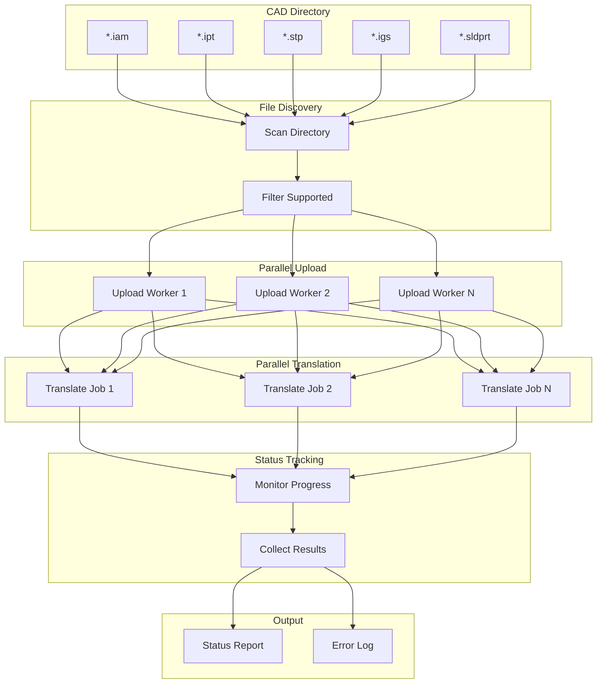
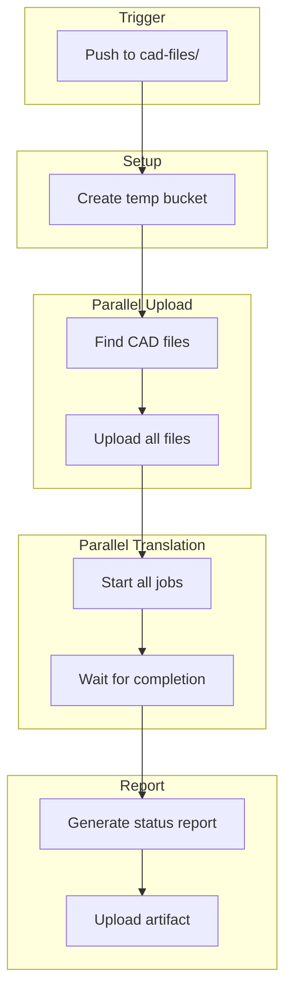
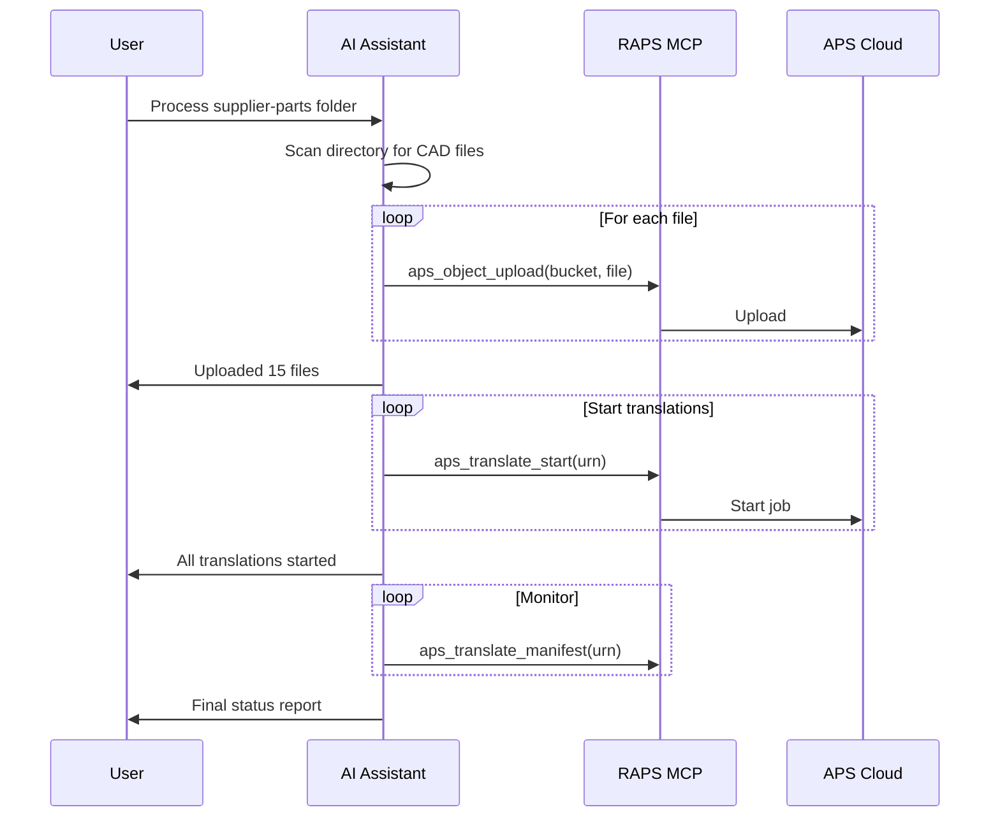

# Multi-Format Batch Processing

Process multiple CAD formats in bulk with parallel translation.

## Workflow Overview



---

## CLI Approach

### Step 1: Discover and Upload Files

```bash
# Upload all supported CAD files
for ext in iam ipt stp step igs iges sldprt sldasm; do
  for file in ./cad-files/*.$ext; do
    [ -f "$file" ] && raps object upload cad-library "$file"
  done
done
```

### Step 2: Parallel Translation

```bash
# Start all translations in parallel
raps object list cad-library --output json | jq -r '.[].key' | while read key; do
  URN=$(raps object urn cad-library "$key" --output plain)
  echo "Starting: $key"
  raps translate start "$URN" --format svf2 &
done

# Wait for all background jobs
wait
echo "All translations started"
```

### Step 3: Monitor Status

```bash
# Check status of all translations
echo "Translation Status:"
echo "==================="

raps object list cad-library --output json | jq -r '.[].key' | while read key; do
  URN=$(raps object urn cad-library "$key" --output plain)
  STATUS=$(raps translate manifest "$URN" 2>/dev/null | jq -r '.status // "pending"')
  PROGRESS=$(raps translate manifest "$URN" 2>/dev/null | jq -r '.progress // "0"')

  case $STATUS in
    success)  echo "✓ $key" ;;
    failed)   echo "✗ $key (FAILED)" ;;
    *)        echo "⋯ $key ($STATUS $PROGRESS%)" ;;
  esac
done
```

### Step 4: Generate Report

```bash
# Create batch processing report
echo "# Batch Translation Report" > batch-report.md
echo "Date: $(date)" >> batch-report.md
echo "" >> batch-report.md

SUCCESS=0
FAILED=0
PENDING=0

raps object list cad-library --output json | jq -r '.[].key' | while read key; do
  URN=$(raps object urn cad-library "$key" --output plain)
  STATUS=$(raps translate manifest "$URN" 2>/dev/null | jq -r '.status // "pending"')

  echo "| $key | $STATUS |" >> batch-report.md
done

echo "" >> batch-report.md
echo "Summary: $SUCCESS success, $FAILED failed, $PENDING pending" >> batch-report.md
```

---

## CI/CD Pipeline

```yaml
# .github/workflows/batch-processing.yml
name: Batch CAD Processing

on:
  push:
    paths:
      - 'cad-files/**'
  workflow_dispatch:

env:
  BUCKET: batch-cad-${{ github.run_id }}

jobs:
  process-batch:
    runs-on: ubuntu-latest
    steps:
      - uses: actions/checkout@v4

      - name: Install RAPS
        run: cargo install raps

      - name: Create bucket
        env:
          APS_CLIENT_ID: ${{ secrets.APS_CLIENT_ID }}
          APS_CLIENT_SECRET: ${{ secrets.APS_CLIENT_SECRET }}
        run: |
          raps bucket create --key "$BUCKET" --policy transient --region US

      - name: Upload all CAD files
        env:
          APS_CLIENT_ID: ${{ secrets.APS_CLIENT_ID }}
          APS_CLIENT_SECRET: ${{ secrets.APS_CLIENT_SECRET }}
        run: |
          find cad-files -type f \( -name "*.iam" -o -name "*.ipt" -o -name "*.stp" -o -name "*.igs" \) | while read file; do
            echo "Uploading: $file"
            raps object upload "$BUCKET" "$file" --parallel
          done

      - name: Start all translations
        env:
          APS_CLIENT_ID: ${{ secrets.APS_CLIENT_ID }}
          APS_CLIENT_SECRET: ${{ secrets.APS_CLIENT_SECRET }}
        run: |
          raps object list "$BUCKET" --output json | jq -r '.[].key' | while read key; do
            URN=$(raps object urn "$BUCKET" "$key" --output plain)
            raps translate start "$URN" --format svf2 &
          done
          wait

      - name: Wait for translations
        env:
          APS_CLIENT_ID: ${{ secrets.APS_CLIENT_ID }}
          APS_CLIENT_SECRET: ${{ secrets.APS_CLIENT_SECRET }}
        run: |
          MAX_WAIT=1800  # 30 minutes
          ELAPSED=0

          while [ $ELAPSED -lt $MAX_WAIT ]; do
            PENDING=$(raps object list "$BUCKET" --output json | jq -r '.[].key' | while read key; do
              URN=$(raps object urn "$BUCKET" "$key" --output plain)
              STATUS=$(raps translate manifest "$URN" 2>/dev/null | jq -r '.status // "pending"')
              [ "$STATUS" != "success" ] && [ "$STATUS" != "failed" ] && echo "pending"
            done | wc -l)

            [ "$PENDING" -eq 0 ] && break

            echo "Waiting... $PENDING translations in progress"
            sleep 30
            ELAPSED=$((ELAPSED + 30))
          done

      - name: Generate report
        env:
          APS_CLIENT_ID: ${{ secrets.APS_CLIENT_ID }}
          APS_CLIENT_SECRET: ${{ secrets.APS_CLIENT_SECRET }}
        run: |
          echo "# Batch Processing Report" > report.md
          echo "" >> report.md
          echo "| File | Status |" >> report.md
          echo "|------|--------|" >> report.md

          SUCCESS=0
          FAILED=0

          raps object list "$BUCKET" --output json | jq -r '.[].key' | while read key; do
            URN=$(raps object urn "$BUCKET" "$key" --output plain)
            STATUS=$(raps translate manifest "$URN" 2>/dev/null | jq -r '.status // "unknown"')
            echo "| $key | $STATUS |" >> report.md
          done

      - name: Upload report
        uses: actions/upload-artifact@v4
        with:
          name: batch-report
          path: report.md
```

### Pipeline Flow



---

## MCP Integration

### Batch Process Directory

```
User: "Process all CAD files in the supplier-parts folder"
```



**AI Response:**
> Processing supplier-parts folder...
>
> **Upload Phase:**
> Uploaded 15 files (total 245 MB)
>
> **Translation Phase:**
> | File | Status | Time |
> |------|--------|------|
> | bracket-a.stp | Complete | 45s |
> | bracket-b.stp | Complete | 42s |
> | housing.iam | Complete | 2m 15s |
> | shaft.ipt | Complete | 28s |
> | ... | ... | ... |
>
> **Summary:** 15/15 successful, 0 failed

### Check Batch Status

```
User: "How many files are still processing in the batch?"
```

**AI Response:**
> Batch Status:
> - **Complete:** 12 files
> - **In Progress:** 3 files (housing.iam at 75%, gearbox.iam at 45%, frame.sldasm at 30%)
> - **Failed:** 0 files
>
> Estimated time remaining: ~3 minutes

---

## Optimization Tips

### Parallel Upload with Concurrency Limit

```bash
# Control concurrency to avoid rate limits
MAX_CONCURRENT=5

find ./cad-files -type f \( -name "*.stp" -o -name "*.iam" \) | \
  xargs -P $MAX_CONCURRENT -I {} sh -c '
    raps object upload cad-library "{}"
    echo "Uploaded: {}"
  '
```

### Prioritize by File Size

```bash
# Process smaller files first for quick wins
find ./cad-files -type f -name "*.stp" -printf "%s %p\n" | \
  sort -n | cut -d' ' -f2 | while read file; do
    raps object upload cad-library "$file"
  done
```

### Skip Already Translated

```bash
# Check if already translated before starting
for key in $(raps object list cad-library --output json | jq -r '.[].key'); do
  URN=$(raps object urn cad-library "$key" --output plain)
  STATUS=$(raps translate manifest "$URN" 2>/dev/null | jq -r '.status // ""')

  if [ "$STATUS" != "success" ]; then
    echo "Translating: $key"
    raps translate start "$URN" --format svf2
  else
    echo "Skipping (already done): $key"
  fi
done
```

---

## Related

- [CAD Translation Pipeline](/docs/cookbook-mfg-translation)
- [Thumbnail Catalog Generation](/docs/cookbook-mfg-catalog)
- [Cookbook: Manufacturing](/docs/cookbook-manufacturing)
