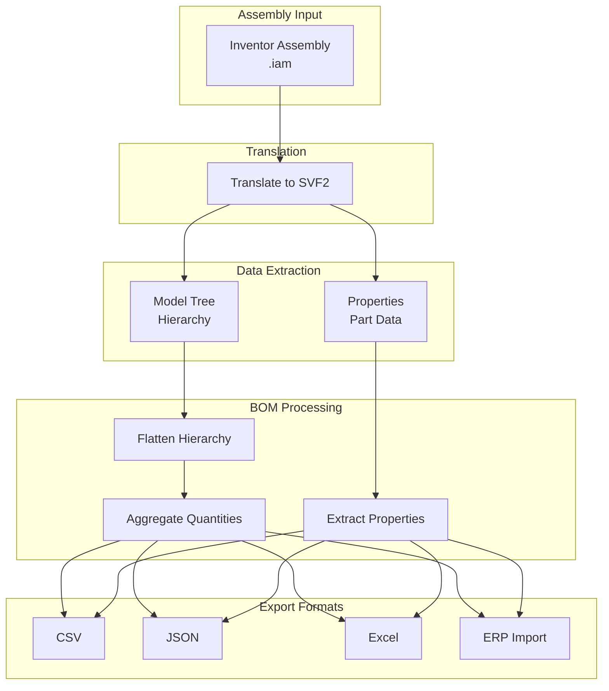
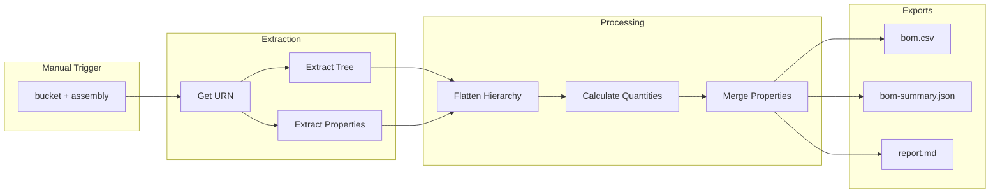
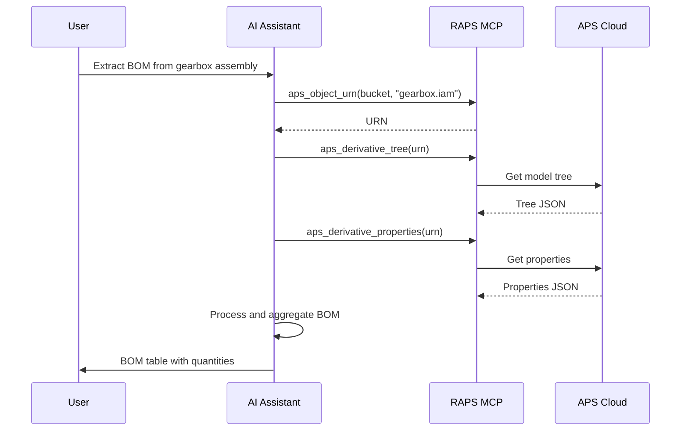

# Bill of Materials Extraction

Extract Bill of Materials (BOM) data from Inventor and other CAD assemblies.

## Workflow Overview



---

## CLI Approach

### Step 1: Translate Assembly

```bash
URN=$(raps object urn cad-library assembly.iam --output plain)
raps translate start "$URN" --format svf2 --wait
```

### Step 2: Extract Model Tree (Hierarchy)

```bash
raps derivative tree "$URN" --output json > bom-tree.json
```

### Step 3: Extract Part Properties

```bash
raps derivative properties "$URN" --output json > part-properties.json
```

### Step 4: Generate Flat BOM

```bash
# Flatten hierarchy to component list
cat bom-tree.json | jq '
  [.. | objects | select(.name != null and .objectid != null) |
   {name: .name, objectid: .objectid}]
' > bom-flat.json

# Count occurrences (quantities)
cat bom-flat.json | jq '
  group_by(.name) |
  map({part: .[0].name, quantity: length}) |
  sort_by(.part)'
```

### Step 5: Export to CSV

```bash
# Full BOM with properties
cat part-properties.json | jq -r '
  ["Part Number", "Description", "Material", "Mass"],
  (.[] | [
    .properties["Part Number"] // .name,
    .properties["Description"] // "",
    .properties["Material"] // "",
    .properties["Mass"] // ""
  ]) | @csv
' > bom.csv
```

---

## CI/CD Pipeline

```yaml
# .github/workflows/bom-extraction.yml
name: BOM Extraction Pipeline

on:
  workflow_dispatch:
    inputs:
      bucket:
        description: 'Bucket name'
        required: true
      assembly:
        description: 'Assembly filename'
        required: true

jobs:
  extract-bom:
    runs-on: ubuntu-latest
    steps:
      - name: Install RAPS
        run: cargo install raps

      - name: Extract BOM data
        env:
          APS_CLIENT_ID: ${{ secrets.APS_CLIENT_ID }}
          APS_CLIENT_SECRET: ${{ secrets.APS_CLIENT_SECRET }}
        run: |
          URN=$(raps object urn "${{ inputs.bucket }}" "${{ inputs.assembly }}" --output plain)

          mkdir -p ./bom-export

          # Extract tree and properties
          raps derivative tree "$URN" --output json > ./bom-export/tree.json
          raps derivative properties "$URN" --output json > ./bom-export/properties.json

      - name: Process BOM
        run: |
          # Create flat BOM with quantities
          cat ./bom-export/tree.json | jq '
            [.. | objects | select(.name != null)] |
            group_by(.name) |
            map({
              part: .[0].name,
              quantity: length,
              objectids: [.[].objectid]
            }) |
            sort_by(.part)
          ' > ./bom-export/bom-summary.json

          # Create CSV export
          echo "Part Number,Description,Material,Quantity" > ./bom-export/bom.csv

          cat ./bom-export/bom-summary.json | jq -r '.[] | .part' | while read part; do
            qty=$(cat ./bom-export/bom-summary.json | jq -r ".[] | select(.part == \"$part\") | .quantity")
            desc=$(cat ./bom-export/properties.json | jq -r ".[] | select(.name == \"$part\") | .properties.Description // \"\"" | head -1)
            mat=$(cat ./bom-export/properties.json | jq -r ".[] | select(.name == \"$part\") | .properties.Material // \"\"" | head -1)
            echo "\"$part\",\"$desc\",\"$mat\",$qty" >> ./bom-export/bom.csv
          done

      - name: Generate report
        run: |
          echo "# BOM Report" > ./bom-export/report.md
          echo "Assembly: ${{ inputs.assembly }}" >> ./bom-export/report.md
          echo "Date: $(date)" >> ./bom-export/report.md
          echo "" >> ./bom-export/report.md
          echo "## Summary" >> ./bom-export/report.md
          echo "- Unique parts: $(cat ./bom-export/bom-summary.json | jq 'length')" >> ./bom-export/report.md
          echo "- Total components: $(cat ./bom-export/bom-summary.json | jq '[.[].quantity] | add')" >> ./bom-export/report.md

      - name: Upload BOM artifacts
        uses: actions/upload-artifact@v4
        with:
          name: bom-export
          path: ./bom-export/
```

### Pipeline Flow



---

## MCP Integration

### Extract BOM

```
User: "Extract the bill of materials from the gearbox assembly"
```



**AI Response:**
> Bill of Materials for Gearbox Assembly:
>
> | Part Number | Description | Material | Qty |
> |-------------|-------------|----------|-----|
> | GBX-001 | Housing | Aluminum 6061 | 1 |
> | GBX-002 | Input Shaft | Steel 4140 | 1 |
> | GBX-003 | Output Shaft | Steel 4140 | 1 |
> | GBX-010 | Gear 32T | Steel 8620 | 2 |
> | GBX-011 | Gear 48T | Steel 8620 | 1 |
> | GBX-020 | Bearing 6205 | - | 4 |
> | GBX-030 | Seal | Nitrile | 2 |
>
> **Total:** 7 unique parts, 12 components

### Compare BOMs

```
User: "Compare the BOM of v1 and v2 of the assembly"
```

**AI Response:**
> BOM Comparison: Gearbox v1 vs v2
>
> **Added in v2:**
> - GBX-035 Gasket (qty: 1)
> - GBX-040 Breather Plug (qty: 1)
>
> **Removed from v1:**
> - GBX-025 O-Ring (was qty: 2)
>
> **Quantity Changes:**
> - GBX-020 Bearing: 4 → 6 (+2)
>
> **Summary:** v2 has 9 unique parts (was 8)

---

## Advanced BOM Processing

### Indented BOM (Multi-Level)

```bash
# Generate indented BOM showing hierarchy
cat bom-tree.json | jq '
  def indent(level):
    if level > 0 then ("  " * level) + "└─ " else "" end;

  def walk(node; level):
    (indent(level) + node.name),
    (node.children[]? | walk(.; level + 1));

  walk(.; 0)
' -r
```

### BOM with Cost Rollup

```bash
# Assuming properties include cost
cat part-properties.json | jq '
  group_by(.name) |
  map({
    part: .[0].name,
    quantity: length,
    unit_cost: (.[0].properties["Unit Cost"] // 0 | tonumber),
    extended_cost: (length * (.[0].properties["Unit Cost"] // 0 | tonumber))
  }) |
  . + [{
    part: "TOTAL",
    quantity: ([.[].quantity] | add),
    unit_cost: null,
    extended_cost: ([.[].extended_cost] | add)
  }]'
```

### Export for ERP System

```bash
# Format for ERP import (SAP-style)
cat bom-summary.json | jq -r '
  .[] | [
    "BOM",                    # Record type
    "GEARBOX-ASM",           # Parent
    .part,                    # Component
    .quantity,                # Quantity
    "EA",                     # UOM
    "1"                       # BOM level
  ] | @csv
' > erp-import.csv
```

---

## Related

- [CAD Translation Pipeline](/docs/cookbook-mfg-translation)
- [Design Iteration Tracking](/docs/cookbook-mfg-iterations)
- [Cookbook: Manufacturing](/docs/cookbook-manufacturing)
