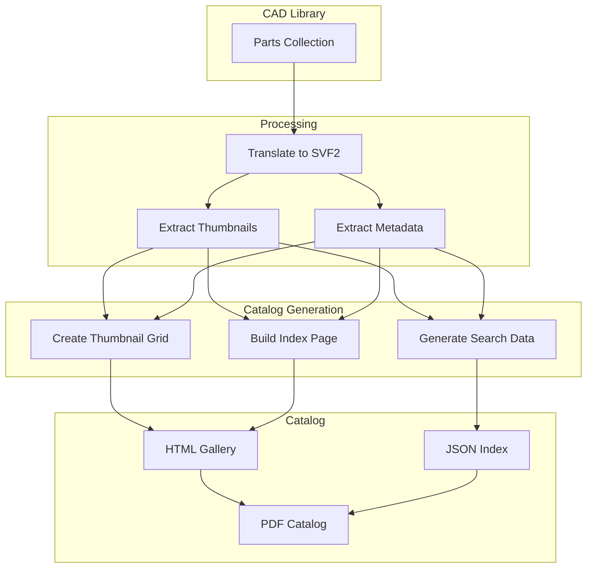
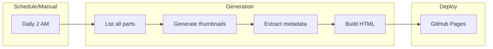
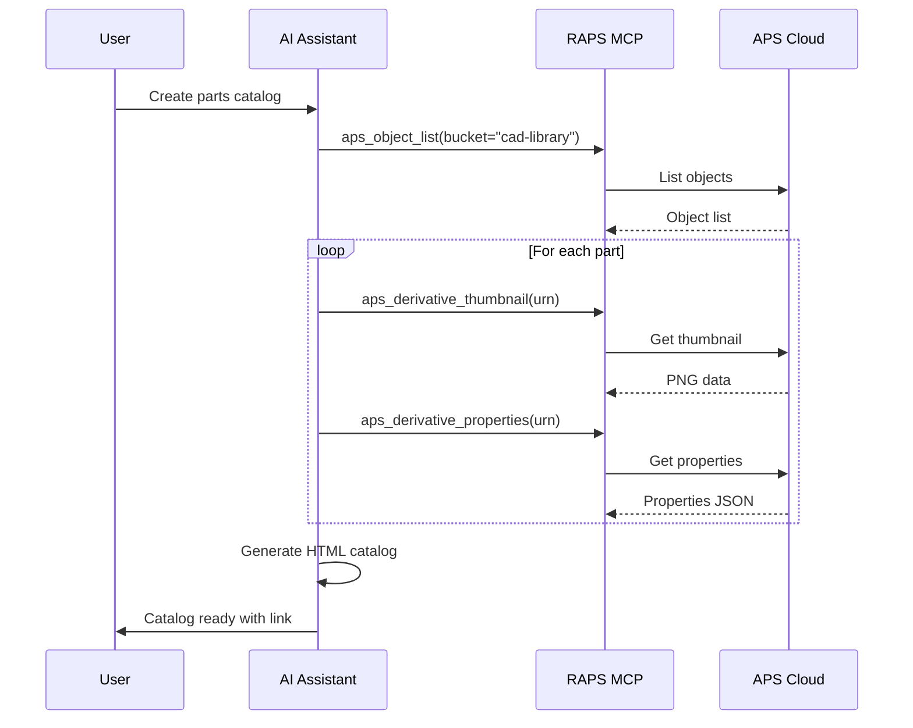

# Thumbnail Catalog Generation

Create visual catalogs of CAD parts with auto-generated thumbnails.

## Workflow Overview



---

## CLI Approach

### Step 1: Generate Thumbnails for All Parts

```bash
mkdir -p ./catalog/thumbnails

raps object list cad-library --output json | jq -r '.[].key' | while read key; do
  URN=$(raps object urn cad-library "$key" --output plain)

  # Check if translation exists and is complete
  STATUS=$(raps translate manifest "$URN" 2>/dev/null | jq -r '.status // "none"')

  if [ "$STATUS" = "success" ]; then
    # Generate safe filename
    SAFE_NAME=$(echo "$key" | tr '/' '_' | sed 's/\.[^.]*$//')

    # Download thumbnail
    raps derivative thumbnail "$URN" --output "./catalog/thumbnails/${SAFE_NAME}.png"
    echo "Generated: ${SAFE_NAME}.png"
  else
    echo "Skipping (not translated): $key"
  fi
done
```

### Step 2: Extract Part Metadata

```bash
echo "[]" > ./catalog/parts.json

raps object list cad-library --output json | jq -r '.[].key' | while read key; do
  URN=$(raps object urn cad-library "$key" --output plain)

  STATUS=$(raps translate manifest "$URN" 2>/dev/null | jq -r '.status // "none"')

  if [ "$STATUS" = "success" ]; then
    SAFE_NAME=$(echo "$key" | tr '/' '_' | sed 's/\.[^.]*$//')

    # Get properties
    PROPS=$(raps derivative properties "$URN" --output json 2>/dev/null | jq '.[0].properties // {}')

    # Add to catalog
    jq --arg key "$key" \
       --arg name "$SAFE_NAME" \
       --argjson props "$PROPS" \
       '. += [{key: $key, name: $name, thumbnail: ($name + ".png"), properties: $props}]' \
       ./catalog/parts.json > ./catalog/parts.tmp.json

    mv ./catalog/parts.tmp.json ./catalog/parts.json
  fi
done
```

### Step 3: Generate HTML Catalog

```bash
cat > ./catalog/index.html << 'EOF'
<!DOCTYPE html>
<html>
<head>
  <title>Parts Catalog</title>
  <style>
    body { font-family: Arial, sans-serif; margin: 20px; }
    .grid { display: grid; grid-template-columns: repeat(auto-fill, minmax(200px, 1fr)); gap: 20px; }
    .part { border: 1px solid #ddd; padding: 10px; text-align: center; border-radius: 8px; }
    .part img { max-width: 100%; height: 150px; object-fit: contain; }
    .part h3 { font-size: 14px; margin: 10px 0 5px; }
    .part p { font-size: 12px; color: #666; margin: 0; }
    .search { margin-bottom: 20px; padding: 10px; width: 100%; font-size: 16px; }
  </style>
</head>
<body>
  <h1>Parts Catalog</h1>
  <input type="text" class="search" placeholder="Search parts..." onkeyup="filterParts(this.value)">
  <div class="grid" id="catalog"></div>

  <script>
    let parts = [];

    fetch('parts.json')
      .then(r => r.json())
      .then(data => {
        parts = data;
        renderParts(parts);
      });

    function renderParts(data) {
      const grid = document.getElementById('catalog');
      grid.innerHTML = data.map(p => `
        <div class="part">
          
          <h3>${p.name}</h3>
          <p>${p.properties['Part Number'] || ''}</p>
          <p>${p.properties['Material'] || ''}</p>
        </div>
      `).join('');
    }

    function filterParts(query) {
      const filtered = parts.filter(p =>
        p.name.toLowerCase().includes(query.toLowerCase()) ||
        JSON.stringify(p.properties).toLowerCase().includes(query.toLowerCase())
      );
      renderParts(filtered);
    }
  </script>
</body>
</html>
EOF

echo "Catalog generated at ./catalog/index.html"
```

---

## CI/CD Pipeline

```yaml
# .github/workflows/catalog-generation.yml
name: Parts Catalog Generation

on:
  schedule:
    - cron: '0 2 * * *'  # Daily at 2 AM
  workflow_dispatch:

jobs:
  generate-catalog:
    runs-on: ubuntu-latest
    steps:
      - uses: actions/checkout@v4

      - name: Install RAPS
        run: cargo install raps

      - name: Generate thumbnails
        env:
          APS_CLIENT_ID: ${{ secrets.APS_CLIENT_ID }}
          APS_CLIENT_SECRET: ${{ secrets.APS_CLIENT_SECRET }}
        run: |
          mkdir -p ./catalog/thumbnails

          raps object list cad-library --output json | jq -r '.[].key' | while read key; do
            URN=$(raps object urn cad-library "$key" --output plain)
            STATUS=$(raps translate manifest "$URN" 2>/dev/null | jq -r '.status // "none"')

            if [ "$STATUS" = "success" ]; then
              SAFE_NAME=$(echo "$key" | tr '/' '_' | sed 's/\.[^.]*$//')
              raps derivative thumbnail "$URN" --output "./catalog/thumbnails/${SAFE_NAME}.png" 2>/dev/null || true
            fi
          done

      - name: Generate metadata
        env:
          APS_CLIENT_ID: ${{ secrets.APS_CLIENT_ID }}
          APS_CLIENT_SECRET: ${{ secrets.APS_CLIENT_SECRET }}
        run: |
          echo "[]" > ./catalog/parts.json

          raps object list cad-library --output json | jq -r '.[].key' | while read key; do
            URN=$(raps object urn cad-library "$key" --output plain)
            STATUS=$(raps translate manifest "$URN" 2>/dev/null | jq -r '.status // "none"')

            if [ "$STATUS" = "success" ]; then
              SAFE_NAME=$(echo "$key" | tr '/' '_' | sed 's/\.[^.]*$//')
              PROPS=$(raps derivative properties "$URN" --output json 2>/dev/null | jq '.[0].properties // {}' || echo '{}')

              jq --arg key "$key" --arg name "$SAFE_NAME" --argjson props "$PROPS" \
                '. += [{key: $key, name: $name, thumbnail: ($name + ".png"), properties: $props}]' \
                ./catalog/parts.json > ./catalog/parts.tmp.json
              mv ./catalog/parts.tmp.json ./catalog/parts.json
            fi
          done

      - name: Generate HTML
        run: |
          # Generate index.html (see CLI section for template)
          cat > ./catalog/index.html << 'HTMLEOF'
          <!-- HTML template here -->
          HTMLEOF

      - name: Deploy to GitHub Pages
        uses: peaceiris/actions-gh-pages@v3
        with:
          github_token: ${{ secrets.GITHUB_TOKEN }}
          publish_dir: ./catalog
```

### Pipeline Flow



---

## MCP Integration

### Generate Catalog

```
User: "Create a visual catalog of all parts in the CAD library"
```



**AI Response:**
> Generated parts catalog with 45 items:
>
> **Catalog Statistics:**
> - Total parts: 45
> - With thumbnails: 43
> - With metadata: 45
>
> **Categories:**
> - Brackets: 12
> - Housings: 8
> - Shafts: 10
> - Gears: 15
>
> [View Catalog](./catalog/index.html)

### Search Catalog

```
User: "Find all aluminum parts in the catalog"
```

**AI Response:**
> Found 18 aluminum parts:
>
> | Part | Material | Weight |
> |------|----------|--------|
> | bracket-a | Aluminum 6061 | 0.45 kg |
> | housing-main | Aluminum 7075 | 2.3 kg |
> | cover-plate | Aluminum 6061 | 0.12 kg |
> | ... | ... | ... |

---

## Advanced Features

### Category Organization

```bash
# Organize by part type
cat ./catalog/parts.json | jq '
  group_by(.properties["Part Type"] // "Uncategorized") |
  map({
    category: .[0].properties["Part Type"] // "Uncategorized",
    count: length,
    parts: .
  })'
```

### Generate PDF Catalog

```bash
# Using wkhtmltopdf
wkhtmltopdf \
  --enable-local-file-access \
  --print-media-type \
  ./catalog/index.html \
  ./catalog/parts-catalog.pdf
```

### Incremental Updates

```bash
# Only update changed parts
LAST_RUN=$(cat .catalog-last-run 2>/dev/null || echo "1970-01-01")

raps object list cad-library --output json | \
  jq --arg since "$LAST_RUN" '.[] | select(.lastModified > $since)' | \
  jq -r '.key' | while read key; do
    echo "Updating: $key"
    # Generate thumbnail and metadata for this part
  done

date -Iseconds > .catalog-last-run
```

---

## Related

- [Multi-Format Batch Processing](/docs/cookbook-mfg-batch)
- [Design Iteration Tracking](/docs/cookbook-mfg-iterations)
- [Cookbook: Manufacturing](/docs/cookbook-manufacturing)
