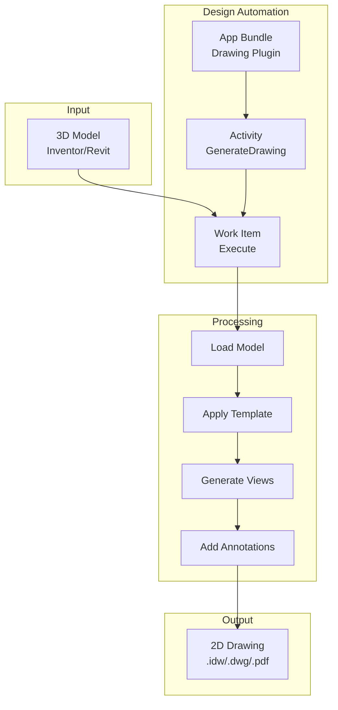
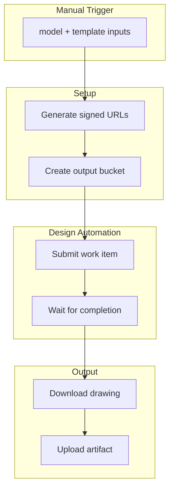
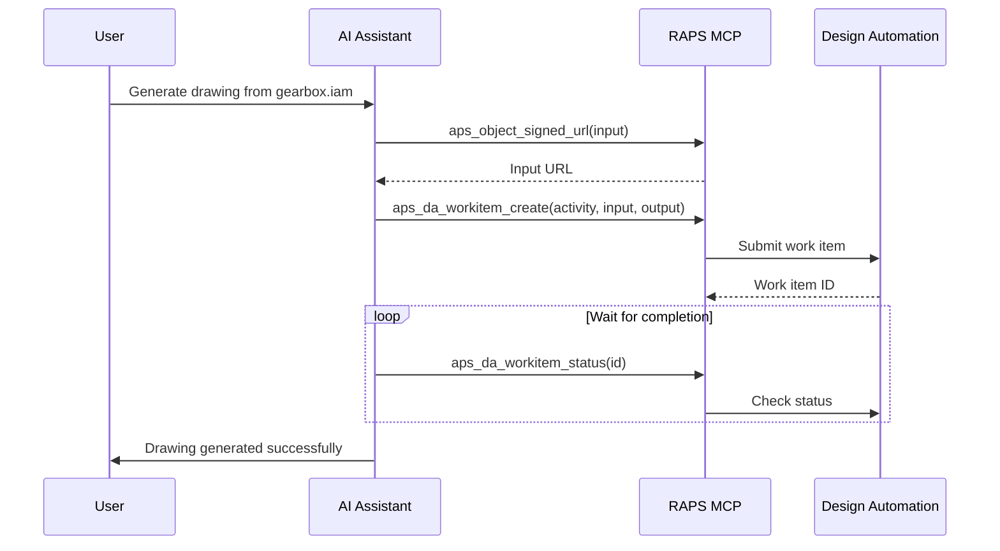

# Drawing Generation with Design Automation

Generate 2D drawings from 3D models using the Design Automation API.

## Workflow Overview



---

## CLI Approach

### Step 1: List Available Engines

```bash
# List Inventor engines
raps da engine list | grep -i inventor

# Output example:
# Autodesk.Inventor+2024
# Autodesk.Inventor+2023
```

### Step 2: Create App Bundle

```bash
# Package your drawing generation plugin
cd ./drawing-plugin
zip -r ../DrawingGenerator.zip ./*

# Upload app bundle
raps da appbundle create \
  --id "DrawingGenerator" \
  --engine "Autodesk.Inventor+2024" \
  --file ../DrawingGenerator.zip

# Create alias
raps da appbundle alias create DrawingGenerator prod 1
```

### Step 3: Create Activity

```bash
# Create activity definition
raps da activity create \
  --id "GenerateDrawing" \
  --engine "Autodesk.Inventor+2024" \
  --appbundle "your-nickname.DrawingGenerator+prod" \
  --command '$(engine.path)/InventorCoreConsole.exe /i $(args[inputFile].path) /al $(appbundles[DrawingGenerator].path) /s $(settings[script].path)'

# Create alias
raps da activity alias create GenerateDrawing prod 1
```

### Step 4: Submit Work Item

```bash
# Generate signed URL for input
INPUT_URL=$(raps object signed-url cad-library assembly.iam --minutes 60)

# Create output location
OUTPUT_BUCKET="drawing-output"
raps bucket create --key "$OUTPUT_BUCKET" --policy transient --region US

# Submit work item
WORK_ITEM=$(raps da workitem create \
  --activity "your-nickname.GenerateDrawing+prod" \
  --input-name "inputFile" \
  --input-url "$INPUT_URL" \
  --output-name "outputDrawing" \
  --output-url "$(raps object signed-url $OUTPUT_BUCKET output.idw --minutes 60 --write)" \
  --output json)

WORK_ID=$(echo "$WORK_ITEM" | jq -r '.id')
echo "Work Item ID: $WORK_ID"
```

### Step 5: Monitor Progress

```bash
# Wait for completion
raps da workitem status "$WORK_ID" --wait

# Check final status
raps da workitem status "$WORK_ID" --output json | jq '.status'
```

---

## CI/CD Pipeline

```yaml
# .github/workflows/drawing-generation.yml
name: Drawing Generation Pipeline

on:
  workflow_dispatch:
    inputs:
      model:
        description: 'Model file path in bucket'
        required: true
      template:
        description: 'Drawing template name'
        default: 'standard'

env:
  ACTIVITY: ${{ secrets.DA_NICKNAME }}.GenerateDrawing+prod

jobs:
  generate-drawing:
    runs-on: ubuntu-latest
    steps:
      - name: Install RAPS
        run: cargo install raps

      - name: Generate drawing
        env:
          APS_CLIENT_ID: ${{ secrets.APS_CLIENT_ID }}
          APS_CLIENT_SECRET: ${{ secrets.APS_CLIENT_SECRET }}
        run: |
          # Get signed URLs
          INPUT_URL=$(raps object signed-url cad-library "${{ inputs.model }}" --minutes 120)
          OUTPUT_BUCKET="drawings-$(date +%Y%m%d)"
          raps bucket create --key "$OUTPUT_BUCKET" --policy transient --region US 2>/dev/null || true

          OUTPUT_NAME=$(basename "${{ inputs.model }}" | sed 's/\.[^.]*$/.idw/')
          OUTPUT_URL=$(raps object signed-url "$OUTPUT_BUCKET" "$OUTPUT_NAME" --minutes 120 --write)

          # Submit work item
          WORK_ID=$(raps da workitem create \
            --activity "$ACTIVITY" \
            --input-name "inputFile" \
            --input-url "$INPUT_URL" \
            --output-name "outputDrawing" \
            --output-url "$OUTPUT_URL" \
            --output json | jq -r '.id')

          echo "WORK_ID=$WORK_ID" >> $GITHUB_ENV
          echo "OUTPUT_BUCKET=$OUTPUT_BUCKET" >> $GITHUB_ENV
          echo "OUTPUT_NAME=$OUTPUT_NAME" >> $GITHUB_ENV

      - name: Wait for completion
        env:
          APS_CLIENT_ID: ${{ secrets.APS_CLIENT_ID }}
          APS_CLIENT_SECRET: ${{ secrets.APS_CLIENT_SECRET }}
        run: |
          raps da workitem status "$WORK_ID" --wait

          STATUS=$(raps da workitem status "$WORK_ID" --output json | jq -r '.status')

          if [ "$STATUS" != "success" ]; then
            echo "Work item failed with status: $STATUS"
            raps da workitem report "$WORK_ID"
            exit 1
          fi

      - name: Download result
        env:
          APS_CLIENT_ID: ${{ secrets.APS_CLIENT_ID }}
          APS_CLIENT_SECRET: ${{ secrets.APS_CLIENT_SECRET }}
        run: |
          mkdir -p ./drawings
          raps object download "$OUTPUT_BUCKET" "$OUTPUT_NAME" --output ./drawings/

      - name: Upload artifact
        uses: actions/upload-artifact@v4
        with:
          name: generated-drawing
          path: ./drawings/
```

### Pipeline Flow



---

## MCP Integration

### Generate Single Drawing

```
User: "Generate a 2D drawing from the gearbox assembly"
```



**AI Response:**
> Generated 2D drawing from gearbox.iam:
> - **Output file:** gearbox.idw (2.4 MB)
> - **Views generated:** 4 (Front, Top, Right, Isometric)
> - **Processing time:** 45 seconds
> - **Download:** [gearbox.idw](https://...)

### Batch Drawing Generation

```
User: "Generate drawings for all assemblies in the release folder"
```

**AI Response:**
> Generating drawings for 8 assemblies...
>
> | Assembly | Status | Time | Output |
> |----------|--------|------|--------|
> | gearbox.iam | Complete | 45s | gearbox.idw |
> | housing.iam | Complete | 38s | housing.idw |
> | shaft.iam | Complete | 22s | shaft.idw |
> | bracket.iam | Processing | - | - |
> | ... | ... | ... | ... |
>
> Progress: 3/8 complete, 1 in progress

---

## Advanced Configuration

### Custom Template Settings

```json
{
  "template": "ANSI-B",
  "views": [
    {"type": "front", "scale": "1:2"},
    {"type": "top", "scale": "1:2"},
    {"type": "right", "scale": "1:2"},
    {"type": "isometric", "scale": "1:4"}
  ],
  "annotations": {
    "dimensions": true,
    "centerlines": true,
    "titleBlock": {
      "partNumber": "${PART_NUMBER}",
      "revision": "${REVISION}",
      "date": "${DATE}"
    }
  }
}
```

### PDF Output

```bash
# Generate PDF instead of IDW
raps da workitem create \
  --activity "your-nickname.GenerateDrawingPDF+prod" \
  --input-name "inputFile" \
  --input-url "$INPUT_URL" \
  --output-name "outputPDF" \
  --output-url "$OUTPUT_URL" \
  --param "outputFormat=pdf"
```

### Multiple Output Formats

```bash
# Generate both IDW and PDF
raps da workitem create \
  --activity "your-nickname.GenerateDrawing+prod" \
  --input-name "inputFile" \
  --input-url "$INPUT_URL" \
  --output-name "outputIdw" \
  --output-url "$IDW_URL" \
  --output-name "outputPdf" \
  --output-url "$PDF_URL"
```

---

## Troubleshooting

### Check Work Item Report

```bash
# Get detailed report
raps da workitem report "$WORK_ID"

# View console output
raps da workitem report "$WORK_ID" --output json | jq -r '.reportUrl'
```

### Common Issues

| Issue | Cause | Solution |
|-------|-------|----------|
| Missing references | Parts not included | Upload all referenced files |
| Template not found | Wrong path | Check template path in activity |
| Timeout | Complex model | Increase activity timeout |
| Auth failure | Expired URLs | Use longer expiry for signed URLs |

---

## Related

- [CAD Translation Pipeline](/docs/cookbook-mfg-translation)
- [Design Automation Reference](/docs/design-automation)
- [Cookbook: Manufacturing](/docs/cookbook-manufacturing)
