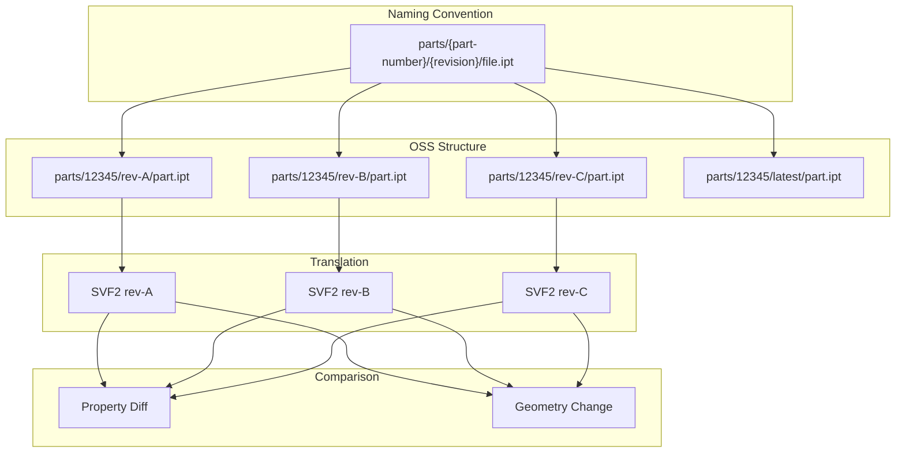
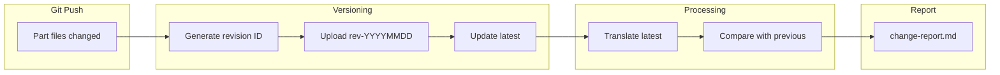
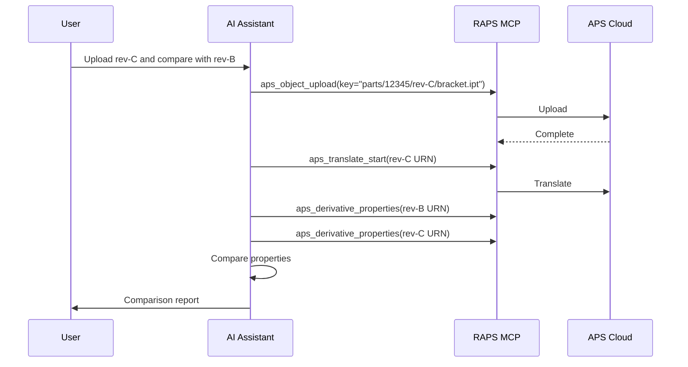

# Design Iteration Tracking

Organize CAD files by revision and track design changes over time.

## Workflow Overview



---

## CLI Approach

### Step 1: Upload with Revision Metadata

```bash
PART_NUMBER="12345"
REVISION="rev-B"

# Upload with structured key
raps object upload cad-library part.ipt --key "parts/${PART_NUMBER}/${REVISION}/part.ipt"

# Also update "latest" reference
raps object upload cad-library part.ipt --key "parts/${PART_NUMBER}/latest/part.ipt"
```

### Step 2: List All Revisions

```bash
PART_NUMBER="12345"

raps object list cad-library --prefix "parts/${PART_NUMBER}/" --output json | \
  jq -r '.[] | .key' | sort

# Output:
# parts/12345/latest/part.ipt
# parts/12345/rev-A/part.ipt
# parts/12345/rev-B/part.ipt
# parts/12345/rev-C/part.ipt
```

### Step 3: Compare Revisions

```bash
# Get URNs for two revisions
REV_A_URN=$(raps object urn cad-library "parts/12345/rev-A/part.ipt" --output plain)
REV_B_URN=$(raps object urn cad-library "parts/12345/rev-B/part.ipt" --output plain)

# Extract properties for comparison
raps derivative properties "$REV_A_URN" --output json > rev-a-props.json
raps derivative properties "$REV_B_URN" --output json > rev-b-props.json

# Compare key properties
echo "Revision Comparison:"
echo "===================="

for prop in "Mass" "Volume" "Material"; do
  VAL_A=$(jq -r ".[0].properties[\"$prop\"] // \"N/A\"" rev-a-props.json)
  VAL_B=$(jq -r ".[0].properties[\"$prop\"] // \"N/A\"" rev-b-props.json)

  if [ "$VAL_A" != "$VAL_B" ]; then
    echo "$prop: $VAL_A → $VAL_B (CHANGED)"
  else
    echo "$prop: $VAL_A (unchanged)"
  fi
done
```

### Step 4: Generate Revision History Report

```bash
PART_NUMBER="12345"

echo "# Revision History: Part $PART_NUMBER" > revision-history.md
echo "" >> revision-history.md

raps object list cad-library --prefix "parts/${PART_NUMBER}/rev-" --output json | \
  jq -r '.[] | .key' | sort | while read key; do
    REV=$(echo "$key" | grep -oP 'rev-\w+')
    DATE=$(raps object list cad-library --prefix "$key" --output json | jq -r '.[0].lastModified')

    URN=$(raps object urn cad-library "$key" --output plain)
    MASS=$(raps derivative properties "$URN" --output json 2>/dev/null | jq -r '.[0].properties.Mass // "N/A"')

    echo "## $REV" >> revision-history.md
    echo "- Date: $DATE" >> revision-history.md
    echo "- Mass: $MASS" >> revision-history.md
    echo "" >> revision-history.md
  done
```

---

## CI/CD Pipeline

```yaml
# .github/workflows/design-iterations.yml
name: Design Iteration Tracking

on:
  push:
    paths:
      - 'parts/**/*.ipt'
      - 'parts/**/*.iam'

jobs:
  track-iterations:
    runs-on: ubuntu-latest
    steps:
      - uses: actions/checkout@v4
        with:
          fetch-depth: 0  # Full history for comparison

      - name: Install RAPS
        run: cargo install raps

      - name: Upload new revisions
        env:
          APS_CLIENT_ID: ${{ secrets.APS_CLIENT_ID }}
          APS_CLIENT_SECRET: ${{ secrets.APS_CLIENT_SECRET }}
        run: |
          BUCKET="design-iterations"
          REVISION="rev-$(date +%Y%m%d)"

          for file in $(git diff --name-only HEAD~1 HEAD -- 'parts/**'); do
            [ -f "$file" ] || continue

            # Extract part number from path (parts/XXXXX/file.ipt)
            PART_NUM=$(echo "$file" | cut -d'/' -f2)
            FILENAME=$(basename "$file")

            # Upload versioned
            raps object upload "$BUCKET" "$file" --key "parts/${PART_NUM}/${REVISION}/${FILENAME}"

            # Upload as latest
            raps object upload "$BUCKET" "$file" --key "parts/${PART_NUM}/latest/${FILENAME}"

            echo "Uploaded: $PART_NUM $REVISION"
          done

      - name: Translate latest revisions
        env:
          APS_CLIENT_ID: ${{ secrets.APS_CLIENT_ID }}
          APS_CLIENT_SECRET: ${{ secrets.APS_CLIENT_SECRET }}
        run: |
          for file in $(git diff --name-only HEAD~1 HEAD -- 'parts/**'); do
            [ -f "$file" ] || continue

            PART_NUM=$(echo "$file" | cut -d'/' -f2)
            FILENAME=$(basename "$file")

            URN=$(raps object urn design-iterations "parts/${PART_NUM}/latest/${FILENAME}" --output plain)
            raps translate start "$URN" --format svf2 --wait
          done

      - name: Generate comparison report
        env:
          APS_CLIENT_ID: ${{ secrets.APS_CLIENT_ID }}
          APS_CLIENT_SECRET: ${{ secrets.APS_CLIENT_SECRET }}
        run: |
          echo "# Design Change Report" > change-report.md
          echo "Commit: ${{ github.sha }}" >> change-report.md
          echo "" >> change-report.md

          # Add comparison logic here

      - name: Upload report
        uses: actions/upload-artifact@v4
        with:
          name: design-change-report
          path: change-report.md
```

### Pipeline Flow



---

## MCP Integration

### Track New Revision

```
User: "Upload the updated bracket design as rev-C and compare it with rev-B"
```



**AI Response:**
> Uploaded bracket.ipt as rev-C and compared with rev-B:
>
> **Property Changes:**
> | Property | Rev-B | Rev-C | Change |
> |----------|-------|-------|--------|
> | Mass | 1.25 kg | 1.18 kg | -5.6% |
> | Volume | 456 cm³ | 432 cm³ | -5.3% |
> | Material | Al 6061 | Al 6061 | - |
>
> **Summary:** Weight reduction of 70g achieved through geometry optimization.

### List Revision History

```
User: "Show me all revisions of part 12345"
```

**AI Response:**
> Revision History for Part 12345:
>
> | Revision | Date | Mass | Status |
> |----------|------|------|--------|
> | rev-C | Feb 15, 2024 | 1.18 kg | Current |
> | rev-B | Feb 01, 2024 | 1.25 kg | Superseded |
> | rev-A | Jan 15, 2024 | 1.32 kg | Superseded |
>
> **Notes:**
> - rev-B → rev-C: Weight optimization
> - rev-A → rev-B: Material change

---

## Best Practices

### Naming Convention

```
bucket/
└── parts/
    └── {part-number}/
        ├── rev-A/
        │   └── {part-name}.ipt
        ├── rev-B/
        │   └── {part-name}.ipt
        ├── rev-C/
        │   └── {part-name}.ipt
        └── latest/
            └── {part-name}.ipt
```

### Revision Comparison Script

```bash
#!/bin/bash
# compare-revisions.sh

BUCKET=$1
PART=$2
REV_OLD=$3
REV_NEW=$4

OLD_URN=$(raps object urn "$BUCKET" "parts/$PART/$REV_OLD/*.ipt" --output plain)
NEW_URN=$(raps object urn "$BUCKET" "parts/$PART/$REV_NEW/*.ipt" --output plain)

echo "Comparing $PART: $REV_OLD vs $REV_NEW"
echo "======================================="

# Get properties
raps derivative properties "$OLD_URN" --output json > /tmp/old.json
raps derivative properties "$NEW_URN" --output json > /tmp/new.json

# Compare
diff <(jq -S '.[0].properties' /tmp/old.json) <(jq -S '.[0].properties' /tmp/new.json)
```

---

## Related

- [CAD Translation Pipeline](/docs/cookbook-mfg-translation)
- [Bill of Materials Extraction](/docs/cookbook-mfg-bom)
- [Cookbook: Manufacturing](/docs/cookbook-manufacturing)
