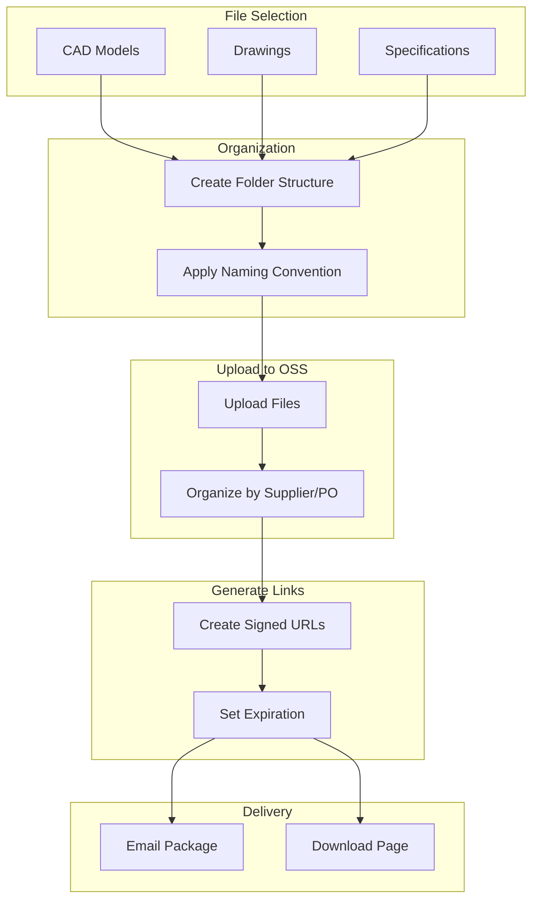
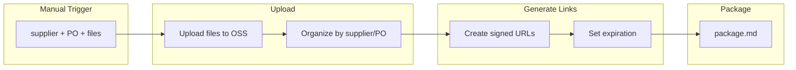
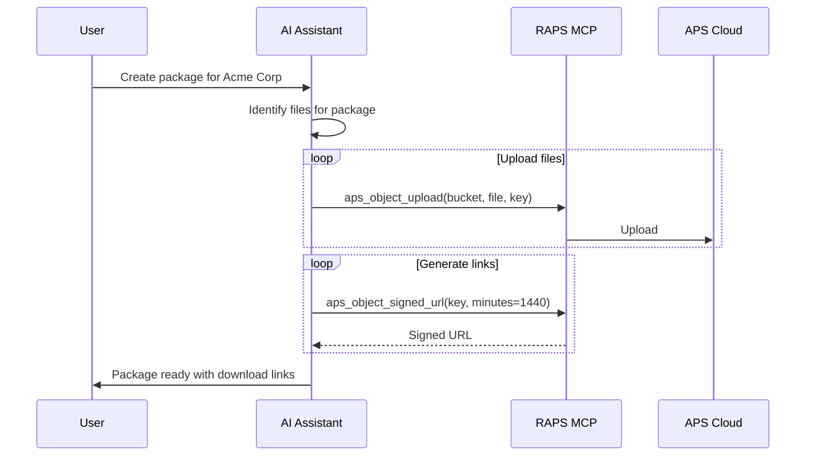

# Supplier Package Creation

Create shareable CAD packages with temporary download links for suppliers.

## Workflow Overview



---

## CLI Approach

### Step 1: Organize Files by Supplier

```bash
SUPPLIER="acme-corp"
ORDER="PO-2024-001"

# Upload CAD files
raps object upload supplier-packages part.stp --key "suppliers/${SUPPLIER}/${ORDER}/part.stp"
raps object upload supplier-packages drawing.pdf --key "suppliers/${SUPPLIER}/${ORDER}/drawing.pdf"
raps object upload supplier-packages spec.pdf --key "suppliers/${SUPPLIER}/${ORDER}/specification.pdf"
```

### Step 2: Generate Signed Download URLs

```bash
# Generate temporary download links (valid for 24 hours)
echo "Download Package for ${SUPPLIER} - ${ORDER}"
echo "============================================"
echo "Links valid for 24 hours"
echo ""

for file in part.stp drawing.pdf specification.pdf; do
  URL=$(raps object signed-url supplier-packages "suppliers/${SUPPLIER}/${ORDER}/${file}" --minutes 1440)
  echo "${file}:"
  echo "  ${URL}"
  echo ""
done
```

### Step 3: Create Package Manifest

```bash
# Generate package manifest
echo "# Supplier Package Manifest" > package-manifest.md
echo "" >> package-manifest.md
echo "**Supplier:** ${SUPPLIER}" >> package-manifest.md
echo "**PO Number:** ${ORDER}" >> package-manifest.md
echo "**Generated:** $(date)" >> package-manifest.md
echo "**Expires:** $(date -d '+24 hours')" >> package-manifest.md
echo "" >> package-manifest.md
echo "## Files" >> package-manifest.md
echo "" >> package-manifest.md

raps object list supplier-packages --prefix "suppliers/${SUPPLIER}/${ORDER}/" --output json | \
  jq -r '.[] | "- \(.key | split("/") | .[-1]) (\(.size) bytes)"' >> package-manifest.md
```

### Step 4: Batch Package Creation

```bash
#!/bin/bash
# create-supplier-package.sh

SUPPLIER=$1
ORDER=$2
FILES_DIR=$3

BUCKET="supplier-packages"
PREFIX="suppliers/${SUPPLIER}/${ORDER}"

# Upload all files
for file in "${FILES_DIR}"/*; do
  [ -f "$file" ] || continue
  filename=$(basename "$file")
  raps object upload "$BUCKET" "$file" --key "${PREFIX}/${filename}"
done

# Generate links
echo "Package ready for ${SUPPLIER}"
echo "============================="

raps object list "$BUCKET" --prefix "$PREFIX/" --output json | \
  jq -r '.[].key' | while read key; do
    filename=$(basename "$key")
    url=$(raps object signed-url "$BUCKET" "$key" --minutes 1440)
    echo "${filename}: ${url}"
  done
```

---

## CI/CD Pipeline

```yaml
# .github/workflows/supplier-package.yml
name: Supplier Package Creation

on:
  workflow_dispatch:
    inputs:
      supplier:
        description: 'Supplier name'
        required: true
      po_number:
        description: 'PO number'
        required: true
      files_path:
        description: 'Path to files (glob pattern)'
        required: true
      expiry_hours:
        description: 'Link expiry in hours'
        default: '24'

jobs:
  create-package:
    runs-on: ubuntu-latest
    steps:
      - uses: actions/checkout@v4

      - name: Install RAPS
        run: cargo install raps

      - name: Upload package files
        env:
          APS_CLIENT_ID: ${{ secrets.APS_CLIENT_ID }}
          APS_CLIENT_SECRET: ${{ secrets.APS_CLIENT_SECRET }}
        run: |
          BUCKET="supplier-packages"
          PREFIX="suppliers/${{ inputs.supplier }}/${{ inputs.po_number }}"

          for file in ${{ inputs.files_path }}; do
            [ -f "$file" ] || continue
            filename=$(basename "$file")
            raps object upload "$BUCKET" "$file" --key "${PREFIX}/${filename}"
            echo "Uploaded: ${filename}"
          done

      - name: Generate download links
        env:
          APS_CLIENT_ID: ${{ secrets.APS_CLIENT_ID }}
          APS_CLIENT_SECRET: ${{ secrets.APS_CLIENT_SECRET }}
        run: |
          BUCKET="supplier-packages"
          PREFIX="suppliers/${{ inputs.supplier }}/${{ inputs.po_number }}"
          EXPIRY_MINS=$(( ${{ inputs.expiry_hours }} * 60 ))

          echo "# Supplier Package" > package.md
          echo "" >> package.md
          echo "**Supplier:** ${{ inputs.supplier }}" >> package.md
          echo "**PO:** ${{ inputs.po_number }}" >> package.md
          echo "**Created:** $(date)" >> package.md
          echo "**Expires:** $(date -d '+${{ inputs.expiry_hours }} hours')" >> package.md
          echo "" >> package.md
          echo "## Download Links" >> package.md
          echo "" >> package.md

          raps object list "$BUCKET" --prefix "$PREFIX/" --output json | \
            jq -r '.[].key' | while read key; do
              filename=$(basename "$key")
              url=$(raps object signed-url "$BUCKET" "$key" --minutes $EXPIRY_MINS)
              echo "- [${filename}](${url})" >> package.md
            done

      - name: Upload package manifest
        uses: actions/upload-artifact@v4
        with:
          name: supplier-package-${{ inputs.supplier }}-${{ inputs.po_number }}
          path: package.md
```

### Pipeline Flow



---

## MCP Integration

### Create Package

```
User: "Create a supplier package for Acme Corp with the bracket files for PO-2024-100"
```



**AI Response:**
> Created supplier package for Acme Corp - PO-2024-100:
>
> **Files uploaded:** 4
> **Link expiry:** 24 hours (Feb 16, 2024 at 3:00 PM)
>
> **Download Links:**
> - [bracket-assembly.stp](https://signed-url...)
> - [bracket-drawing.pdf](https://signed-url...)
> - [specification.pdf](https://signed-url...)
> - [quality-requirements.pdf](https://signed-url...)
>
> You can share these links directly with the supplier.

### Check Package Status

```
User: "List all active supplier packages"
```

**AI Response:**
> Active Supplier Packages:
>
> | Supplier | PO | Files | Created | Expires |
> |----------|-----|-------|---------|---------|
> | Acme Corp | PO-2024-100 | 4 | Feb 15 | Feb 16 |
> | Beta Mfg | PO-2024-098 | 3 | Feb 14 | Feb 15 |
> | Gamma Inc | PO-2024-095 | 6 | Feb 12 | **Expired** |

---

## Advanced Features

### Email Integration

```bash
#!/bin/bash
# send-package-email.sh

SUPPLIER=$1
EMAIL=$2
ORDER=$3

# Generate package links
LINKS=$(raps object list supplier-packages --prefix "suppliers/${SUPPLIER}/${ORDER}/" --output json | \
  jq -r '.[].key' | while read key; do
    filename=$(basename "$key")
    url=$(raps object signed-url supplier-packages "$key" --minutes 1440)
    echo "- ${filename}: ${url}"
  done)

# Send email (using mailx or similar)
cat <<EOF | mail -s "Download Package for ${ORDER}" "$EMAIL"
Dear Supplier,

Your requested files for ${ORDER} are ready for download.

Files:
${LINKS}

These links will expire in 24 hours.

Best regards,
Manufacturing Team
EOF
```

### Package Tracking

```bash
# Log package creation
echo "$(date),${SUPPLIER},${ORDER},created" >> package-log.csv

# Track downloads (requires webhook setup)
raps webhook create \
  --event "download.complete" \
  --callback "https://myapp.com/track-download" \
  --scope "data:read"
```

### Cleanup Expired Packages

```bash
# Delete packages older than 7 days
CUTOFF=$(date -d '-7 days' +%Y%m%d)

raps object list supplier-packages --prefix "suppliers/" --output json | \
  jq -r '.[] | select(.lastModified < "'"$CUTOFF"'") | .key' | \
  while read key; do
    echo "Deleting expired: $key"
    raps object delete supplier-packages "$key"
  done
```

---

## Related

- [Design Iteration Tracking](/docs/cookbook-mfg-iterations)
- [CAD Translation Pipeline](/docs/cookbook-mfg-translation)
- [Cookbook: Manufacturing](/docs/cookbook-manufacturing)
