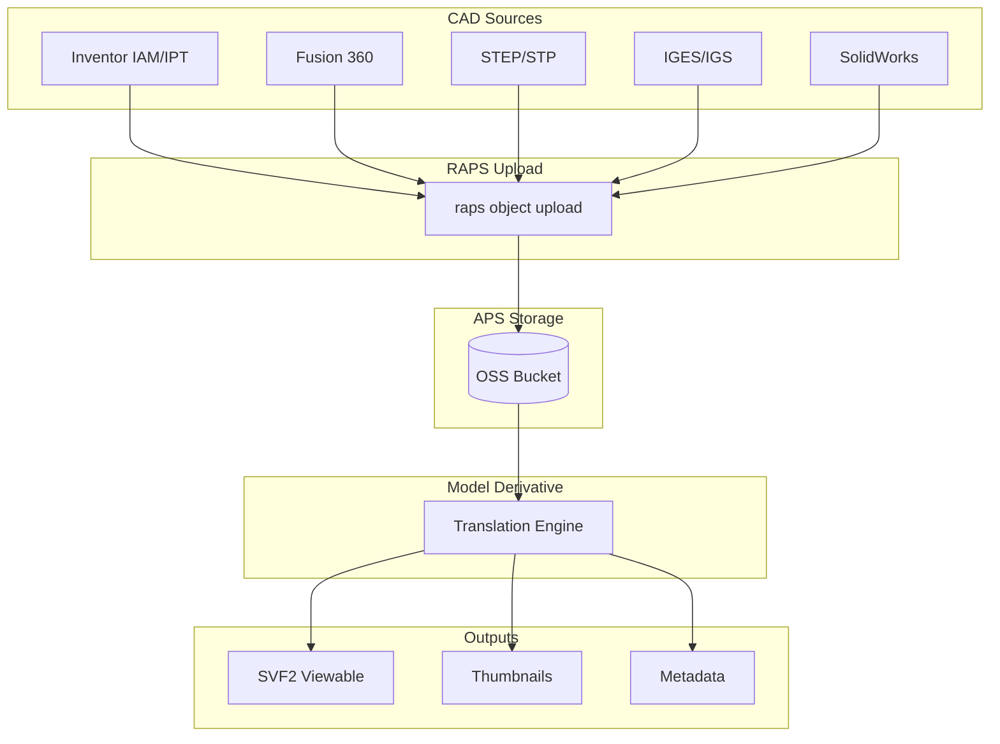
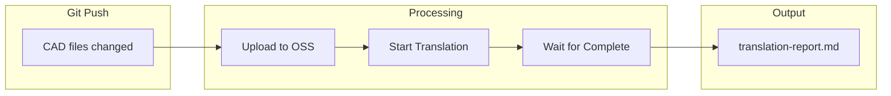
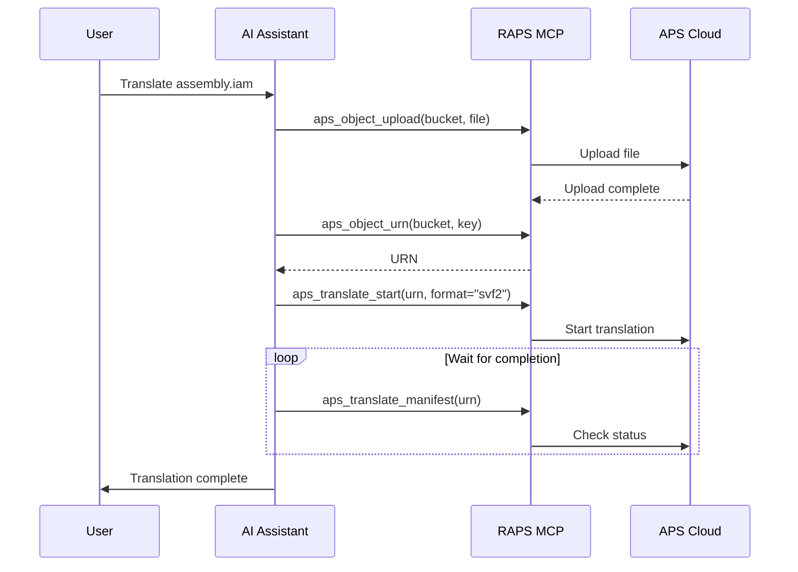

# CAD Translation Pipeline

Process various CAD formats (Inventor, Fusion, STEP, IGES) for web viewing.

## Workflow Overview



---

## CLI Approach

### Step 1: Create CAD Bucket

```bash
raps bucket create --key cad-library --policy persistent --region US
```

### Step 2: Upload CAD Files

```bash
# Inventor assembly
raps object upload cad-library assembly.iam

# Inventor part
raps object upload cad-library part.ipt

# STEP file
raps object upload cad-library model.stp

# IGES file
raps object upload cad-library legacy.igs
```

### Step 3: Translate to SVF2

```bash
# Get URN and translate
URN=$(raps object urn cad-library assembly.iam --output plain)
raps translate start "$URN" --format svf2 --wait
```

### Step 4: Verify Translation

```bash
# Check manifest
raps translate manifest "$URN"

# Get available views
raps derivative views "$URN" --output json
```

### Supported Formats

| Format | Extension | Notes |
|--------|-----------|-------|
| Inventor Assembly | .iam | Full assembly hierarchy |
| Inventor Part | .ipt | Single part files |
| STEP | .stp, .step | AP203/AP214 |
| IGES | .igs, .iges | Legacy format |
| SolidWorks | .sldprt, .sldasm | Parts and assemblies |
| Fusion 360 | .f3d | Direct from Fusion |

---

## CI/CD Pipeline

```yaml
# .github/workflows/cad-translation.yml
name: CAD Translation Pipeline

on:
  push:
    paths:
      - 'cad/**/*.iam'
      - 'cad/**/*.ipt'
      - 'cad/**/*.stp'
      - 'cad/**/*.igs'

env:
  BUCKET: cad-library-${{ github.repository_id }}

jobs:
  translate-cad:
    runs-on: ubuntu-latest
    steps:
      - uses: actions/checkout@v4

      - name: Install RAPS
        run: cargo install raps

      - name: Setup bucket
        env:
          APS_CLIENT_ID: ${{ secrets.APS_CLIENT_ID }}
          APS_CLIENT_SECRET: ${{ secrets.APS_CLIENT_SECRET }}
        run: |
          raps bucket create --key "$BUCKET" --policy persistent --region US 2>/dev/null || true

      - name: Upload and translate
        env:
          APS_CLIENT_ID: ${{ secrets.APS_CLIENT_ID }}
          APS_CLIENT_SECRET: ${{ secrets.APS_CLIENT_SECRET }}
        run: |
          for file in $(git diff --name-only HEAD~1 HEAD -- 'cad/**'); do
            [ -f "$file" ] || continue

            echo "Processing: $file"
            raps object upload "$BUCKET" "$file"

            key=$(basename "$file")
            URN=$(raps object urn "$BUCKET" "$key" --output plain)
            raps translate start "$URN" --format svf2 --wait

            echo "Translated: $key"
          done

      - name: Generate translation report
        env:
          APS_CLIENT_ID: ${{ secrets.APS_CLIENT_ID }}
          APS_CLIENT_SECRET: ${{ secrets.APS_CLIENT_SECRET }}
        run: |
          echo "# CAD Translation Report" > report.md
          echo "Date: $(date)" >> report.md
          echo "" >> report.md

          raps object list "$BUCKET" --output json | jq -r '.[].key' | while read key; do
            URN=$(raps object urn "$BUCKET" "$key" --output plain)
            STATUS=$(raps translate manifest "$URN" 2>/dev/null | jq -r '.status // "pending"')
            echo "- $key: $STATUS" >> report.md
          done

      - name: Upload report
        uses: actions/upload-artifact@v4
        with:
          name: translation-report
          path: report.md
```

### Pipeline Flow



---

## MCP Integration

### Translate Single File

```
User: "Upload and translate the new assembly.iam file for web viewing"
```



**AI Response:**
> assembly.iam has been uploaded and translated successfully.
> - **File size:** 45 MB
> - **Components:** 234 parts
> - **Translation time:** 2m 34s
> - **Viewer URL:** https://viewer.autodesk.com/...

### Translate Multiple Formats

```
User: "I have STEP and IGES files from a supplier. Translate them all for review."
```

**AI Response:**
> Translating 5 files from supplier folder:
>
> | File | Format | Status | Time |
> |------|--------|--------|------|
> | bracket.stp | STEP | Complete | 45s |
> | housing.stp | STEP | Complete | 1m 12s |
> | shaft.igs | IGES | Complete | 32s |
> | gear.igs | IGES | Complete | 28s |
> | mount.stp | STEP | Complete | 55s |
>
> All files ready for viewing.

---

## Format-Specific Options

### STEP Translation

```bash
# Standard STEP translation
raps translate start "$URN" --format svf2 --wait

# With specific output views
raps translate start "$URN" --format svf2 --views "3d"
```

### Inventor Assembly with References

```bash
# Upload assembly with all referenced parts
raps object upload cad-library assembly.iam
raps object upload cad-library part1.ipt
raps object upload cad-library part2.ipt

# Translate assembly (references resolved automatically)
URN=$(raps object urn cad-library assembly.iam --output plain)
raps translate start "$URN" --format svf2 --wait
```

### ZIP Package with Root File

```bash
# Create zip with assembly and parts
zip -r model-package.zip assembly.iam *.ipt

# Upload package
raps object upload cad-library model-package.zip

# Translate with root file specified
URN=$(raps object urn cad-library model-package.zip --output plain)
raps translate start "$URN" --format svf2 --root "assembly.iam" --wait
```

---

## Related

- [Multi-Format Batch Processing](/docs/cookbook-mfg-batch)
- [Bill of Materials Extraction](/docs/cookbook-mfg-bom)
- [Cookbook: Manufacturing](/docs/cookbook-manufacturing)
